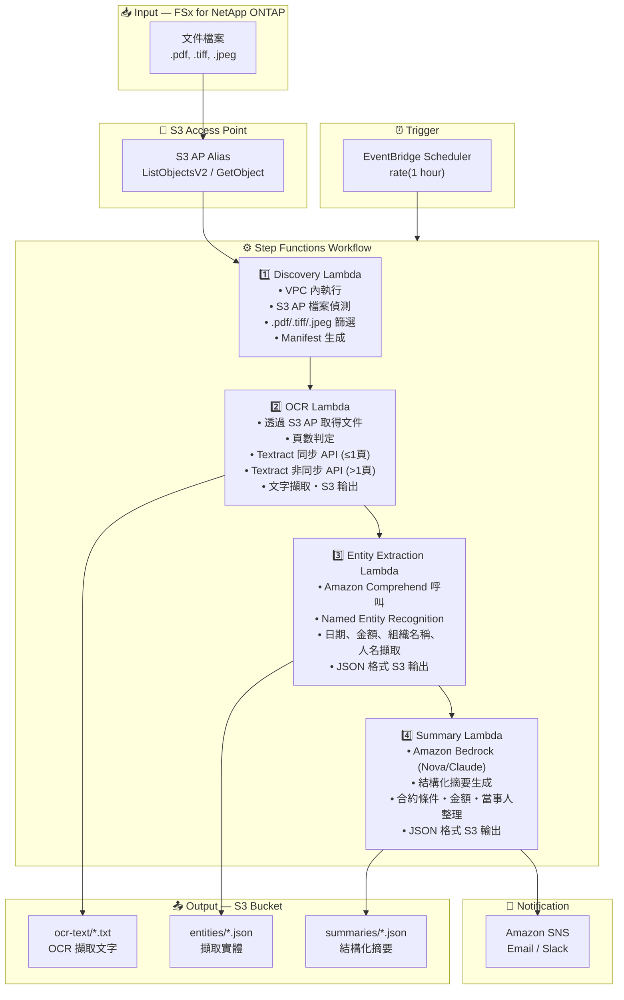

# UC2: 金融・保險 — 合約書・請求書的自動處理 (IDP)

🌐 **Language / 언어 / 语言 / 語言 / Langue / Sprache / Idioma**: [日本語](architecture.md) | [English](architecture.en.md) | [한국어](architecture.ko.md) | [简体中文](architecture.zh-CN.md) | 繁體中文 | [Français](architecture.fr.md) | [Deutsch](architecture.de.md) | [Español](architecture.es.md)

> 注意：此翻譯由 Amazon Bedrock Claude 產生。歡迎對翻譯品質提出改進建議。

## End-to-End Architecture (Input → Output)

---

## Architecture Diagram

---

## Data Flow Detail

### Input
| Item | Description |
|------|-------------|
| **Source** | FSx for NetApp ONTAP volume |
| **File Types** | .pdf, .tiff, .tif, .jpeg, .jpg (掃描文件・電子文件) |
| **Access Method** | S3 Access Point (ListObjectsV2 + GetObject) |
| **Read Strategy** | 取得完整檔案(OCR 處理所需) |

### Processing
| Step | Service | Function |
|------|---------|----------|
| Discovery | Lambda (VPC) | 透過 S3 AP 偵測文件檔案，生成 Manifest |
| OCR | Lambda + Textract | 根據頁數使用同步/非同步 API 進行文字擷取 |
| Entity Extraction | Lambda + Comprehend | Named Entity Recognition(日期、金額、組織名稱、人名) |
| Summary | Lambda + Bedrock | 結構化摘要生成(合約條件、金額、當事人) |

### Output
| Artifact | Format | Description |
|----------|--------|-------------|
| OCR Text | `ocr-text/YYYY/MM/DD/{stem}.txt` | Textract 擷取文字 |
| Entities | `entities/YYYY/MM/DD/{stem}.json` | Comprehend 擷取實體 |
| Summary | `summaries/YYYY/MM/DD/{stem}_summary.json` | Bedrock 結構化摘要 |
| SNS Notification | Email | 處理完成通知(處理件數・錯誤件數) |

---

## Key Design Decisions

1. **S3 AP over NFS** — Lambda 無需掛載 NFS，透過 S3 API 取得文件
2. **Textract 同步/非同步自動選擇** — 1頁以下使用同步 API(低延遲)，多頁使用非同步 API(大容量對應)
3. **Comprehend + Bedrock 雙層架構** — Comprehend 進行結構化實體擷取，Bedrock 生成自然語言摘要
4. **JSON 格式結構化輸出** — 便於與下游系統(RPA、核心系統)整合
5. **日期分區** — 依處理日期分割目錄，便於重新處理・歷史管理
6. **輪詢機制** — S3 AP 不支援事件通知，因此採用定期排程執行

---

## AWS Services Used

| Service | Role |
|---------|------|
| FSx for NetApp ONTAP | 企業檔案儲存(合約書・發票保管) |
| S3 Access Points | ONTAP volume 的無伺服器存取 |
| EventBridge Scheduler | 定期觸發器 |
| Step Functions | 工作流程編排 |
| Lambda | 運算(Discovery, OCR, Entity Extraction, Summary) |
| Amazon Textract | OCR 文字擷取(同步/非同步 API) |
| Amazon Comprehend | Named Entity Recognition (NER) |
| Amazon Bedrock | AI 摘要生成 (Nova / Claude) |
| SNS | 處理完成通知 |
| Secrets Manager | ONTAP REST API 認證資訊管理 |
| CloudWatch + X-Ray | 可觀測性 |
