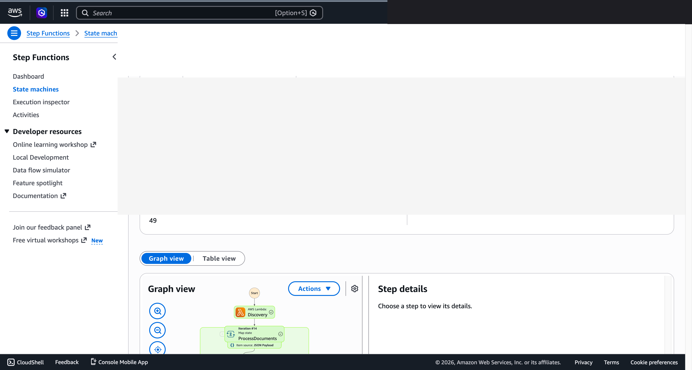
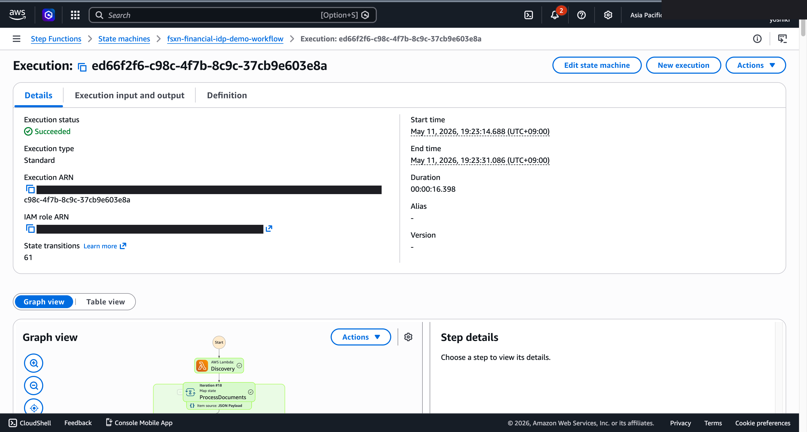

# 合同和发票自动处理 — Demo Guide

🌐 **Language / 언어 / 语言 / 語言 / Langue / Sprache / Idioma**: [日本語](demo-guide.md) | [English](demo-guide.en.md) | [한국어](demo-guide.ko.md) | 简体中文 | [繁體中文](demo-guide.zh-TW.md) | [Français](demo-guide.fr.md) | [Deutsch](demo-guide.de.md) | [Español](demo-guide.es.md)

> 注意：此翻译由 Amazon Bedrock Claude 生成。欢迎对翻译质量提出改进建议。

## Executive Summary

本演示展示了合同和发票的自动处理流水线。通过结合 OCR 文本提取和实体提取，从非结构化文档自动生成结构化数据。

**演示核心信息**：将纸质合同和发票自动数字化，即时提取并结构化金额、日期、交易方等重要信息。

**预计时间**：3～5 分钟

---

## Target Audience & Persona

| 项目 | 详细信息 |
|------|------|
| **职位** | 财务部门经理 / 合同管理负责人 |
| **日常业务** | 发票处理、合同管理、付款审批 |
| **课题** | 大量纸质文档的手动录入耗时 |
| **期待成果** | 文档处理自动化和减少录入错误 |

### Persona: 山田（财务部门负责人）

- 每月处理 200+ 张发票
- 手动录入导致的错误和延迟是主要问题
- "希望发票到达后自动提取金额和付款期限"

---

## Demo Scenario: 发票批量处理

### 工作流程全貌

```
文档扫描       OCR 处理        实体           结构化数据
(PDF/图像)   →   文本提取  →   提取·分类   →    输出 (JSON)
                                   (AI 分析)
```

---

## Storyboard（5 个部分 / 3～5 分钟）

### Section 1: Problem Statement（0:00–0:45）

**解说要点**:
> 每月收到 200 多张发票。手动录入金额、日期、交易方既耗时又容易出错。

**Key Visual**: 大量 PDF 发票文件列表

### Section 2: Document Upload（0:45–1:30）

**解说要点**:
> 只需将扫描文档放置到文件服务器，自动处理流水线即可启动。

**Key Visual**: 文件上传 → 工作流自动启动

### Section 3: OCR & Extraction（1:30–2:30）

**解说要点**:
> 通过 OCR 提取文本，AI 判定文档类型。自动分类发票、合同、收据，并从各文档中提取重要字段。

**Key Visual**: OCR 处理进度、文档分类结果

### Section 4: Structured Output（2:30–3:45）

**解说要点**:
> 将提取结果输出为结构化数据。金额、付款期限、交易方名称、发票编号等以 JSON 格式可用。

**Key Visual**: 提取结果表格（发票编号、金额、期限、交易方）

### Section 5: Validation & Report（3:45–5:00）

**解说要点**:
> AI 评估提取结果的可信度，标记低可信度项目。通过处理摘要报告掌握整体处理状况。

**Key Visual**: 带可信度评分的结果、处理摘要报告

---

## Screen Capture Plan

| # | 画面 | 部分 |
|---|------|-----------|
| 1 | 发票 PDF 文件列表 | Section 1 |
| 2 | 工作流自动启动 | Section 2 |
| 3 | OCR 处理·文档分类结果 | Section 3 |
| 4 | 结构化数据输出（JSON/表格） | Section 4 |
| 5 | 处理摘要报告 | Section 5 |

---

## Narration Outline

| 部分 | 时间 | 关键信息 |
|-----------|------|--------------|
| Problem | 0:00–0:45 | "每月手动处理 200 张发票已达极限" |
| Upload | 0:45–1:30 | "仅需放置文件即可开始自动处理" |
| OCR | 1:30–2:30 | "OCR + AI 实现文档分类和字段提取" |
| Output | 2:30–3:45 | "作为结构化数据即时可用" |
| Report | 3:45–5:00 | "通过可信度评估明确需要人工确认的部分" |

---

## Sample Data Requirements

| # | 数据 | 用途 |
|---|--------|------|
| 1 | 发票 PDF（10 份） | 主要处理对象 |
| 2 | 合同 PDF（3 份） | 文档分类演示 |
| 3 | 收据图像（3 份） | 图像 OCR 演示 |
| 4 | 低质量扫描（2 份） | 可信度评估演示 |

---

## Timeline

### 1 周内可完成

| 任务 | 所需时间 |
|--------|---------|
| 准备样本文档 | 3 小时 |
| 确认流水线执行 | 2 小时 |
| 获取屏幕截图 | 2 小时 |
| 创建解说稿 | 2 小时 |
| 视频编辑 | 4 小时 |

### Future Enhancements

- 与会计系统自动集成
- 集成审批工作流
- 多语言文档支持（英语·中文）

---

## Technical Notes

| 组件 | 作用 |
|--------------|------|
| Step Functions | 工作流编排 |
| Lambda (OCR Processor) | 通过 Textract 提取文档文本 |
| Lambda (Entity Extractor) | 通过 Bedrock 提取实体 |
| Lambda (Classifier) | 文档类型分类 |
| Amazon Athena | 提取数据的汇总分析 |

### 回退方案

| 场景 | 对应 |
|---------|------|
| OCR 精度下降 | 使用预处理文本 |
| Bedrock 延迟 | 显示预生成结果 |

---

*本文档是技术演示视频的制作指南。*

---

## 关于输出目标：FSxN S3 Access Point (Pattern A)

UC2 financial-idp 归类为 **Pattern A: Native S3AP Output**
（参见 `docs/output-destination-patterns.md`）。

**设计**：发票 OCR 结果、结构化元数据、BedRock 摘要全部通过 FSxN S3 Access Point
写回到与原始发票 PDF **相同的 FSx ONTAP 卷**。不创建标准 S3 存储桶
（"no data movement" 模式）。

**CloudFormation 参数**:
- `S3AccessPointAlias`: 用于读取输入数据的 S3 AP Alias
- `S3AccessPointOutputAlias`: 用于写入输出的 S3 AP Alias（可与输入相同）

**部署示例**:
```bash
aws cloudformation deploy \
  --template-file financial-idp/template-deploy.yaml \
  --stack-name fsxn-financial-idp-demo \
  --parameter-overrides \
    S3AccessPointAlias=eda-demo-s3ap-XYZ-ext-s3alias \
    S3AccessPointOutputAlias=eda-demo-s3ap-XYZ-ext-s3alias \
    ... (其他必需参数)
```

**SMB/NFS 用户视角**:
```
/vol/invoices/
  ├── 2026/05/invoice_001.pdf          # 原始发票
  └── summaries/2026/05/                # AI 生成摘要（同一卷内）
      └── invoice_001.json
```

关于 AWS 规范限制，请参考
[项目 README 的 "AWS 仕様上の制約と回避策" 部分](../../README.md#aws-仕様上の制約と回避策)
以及 [`docs/output-destination-patterns.md`](../../docs/output-destination-patterns.md)。

---

## 已验证的 UI/UX 截图

与 Phase 7 UC15/16/17 和 UC6/11/14 演示相同方针，以**最终用户在日常业务中实际
看到的 UI/UX 画面**为对象。面向技术人员的视图（Step Functions 图、CloudFormation
堆栈事件等）汇总在 `docs/verification-results-*.md` 中。

### 本用例的验证状态

- ⚠️ **E2E 验证**: 仅部分功能（生产环境建议追加验证）
- 📸 **UI/UX 拍摄**: ✅ SFN Graph 完成（Phase 8 Theme D, commit 081cc66）

### 2026-05-10 重新部署验证时拍摄（以 UI/UX 为中心）

#### UC2 Step Functions Graph view（SUCCEEDED）



Step Functions Graph view 通过颜色可视化各 Lambda / Parallel / Map 状态的执行状况，
是最终用户最重要的画面。

### 现有截图（来自 Phase 1-6 的相关部分）



### 重新验证时的 UI/UX 目标画面（推荐拍摄列表）

- S3 输出存储桶（textract-results/、comprehend-entities/、reports/）
- Textract OCR 结果 JSON（从合同·发票中提取的字段）
- Comprehend 实体检测结果（组织名、日期、金额）
- Bedrock 生成的摘要报告

### 拍摄指南

1. **事前准备**:
   - 通过 `bash scripts/verify_phase7_prerequisites.sh` 确认前提（共享 VPC/S3 AP 存在）
   - 通过 `UC=financial-idp bash scripts/package_generic_uc.sh` 打包 Lambda
   - 通过 `bash scripts/deploy_generic_ucs.sh UC2` 部署

2. **放置样本数据**:
   - 通过 S3 AP Alias 将样本文件上传到 `invoices/` 前缀
   - 启动 Step Functions `fsxn-financial-idp-demo-workflow`（输入 `{}`）

3. **拍摄**（关闭 CloudShell·终端，浏览器右上角用户名涂黑）:
   - S3 输出存储桶 `fsxn-financial-idp-demo-output-<account>` 的概览
   - AI/ML 输出 JSON 的预览（参考 `build/preview_*.html` 格式）
   - SNS 邮件通知（如适用）

4. **掩码处理**:
   - 通过 `python3 scripts/mask_uc_demos.py financial-idp-demo` 自动掩码
   - 根据 `docs/screenshots/MASK_GUIDE.md` 追加掩码（如需要）

5. **清理**:
   - 通过 `bash scripts/cleanup_generic_ucs.sh UC2` 删除
   - VPC Lambda ENI 释放需 15-30 分钟（AWS 规范）
