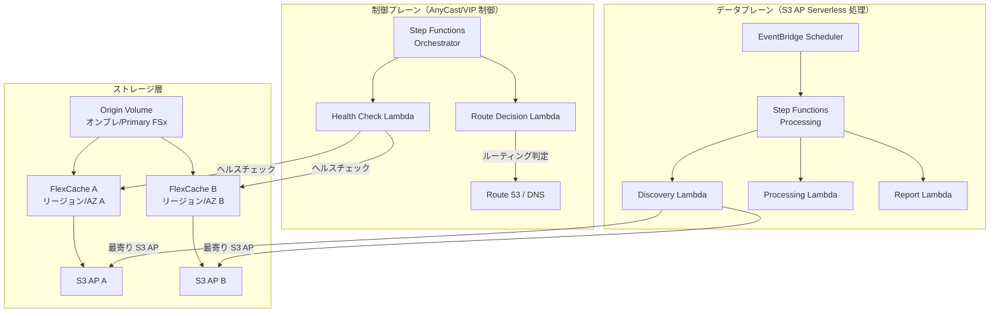

# FlexCache AnyCast / DR パターン

🌐 **Language / 言語**: [日本語](README.md) | [English](README.en.md) | [한국어](README.ko.md) | [简体中文](README.zh-CN.md) | [繁體中文](README.zh-TW.md) | [Français](README.fr.md) | [Deutsch](README.de.md) | [Español](README.es.md)

## 概要

本パターンは、ONTAP FlexCache の AnyCast 構成および DR（Disaster Recovery）構成を、FSx for ONTAP × S3 Access Points × AWS Serverless サービスと組み合わせて実現するための設計ガイド、シミュレーションデモ、運用設計ドキュメントを提供する。

## 解決する課題

| 課題 | FlexCache AnyCast / DR による解決 |
|------|----------------------------------|
| 地理分散チームの読み取り性能 | 最寄りの FlexCache からホットデータを提供 |
| EDA/Media/HPC のクラウドバースト | オンプレ Origin + クラウド FlexCache で WAN 転送削減 |
| DR 時の読み取り継続性 | キャッシュ経由で Origin 障害時も読み取り可能 |
| WAN 転送量削減 | ホットデータのみキャッシュ、差分転送 |
| クライアント側マウント設定の複雑化回避 | AnyCast IP で単一マウントポイント |

## アーキテクチャ概要



## 既存ユースケースとの関連

| 既存 UC | 関連ポイント |
|---------|------------|
| [media-vfx/](../media-vfx/) | render input assets の FlexCache 高速化 |
| [manufacturing-analytics/](../manufacturing-analytics/) | 工場間データ共有の FlexCache |
| [healthcare-dicom/](../healthcare-dicom/) | 研究拠点間 DICOM キャッシュ |
| [legal-compliance/](../legal-compliance/) | 支店間監査データの FlexCache |
| [financial-idp/](../financial-idp/) | 支店間文書キャッシュ |
| [semiconductor-eda/](../semiconductor-eda/) | EDA Tools/Libraries のクラウドバースト |

## FSx for ONTAP S3 Access Points との接続点

```
┌─────────────────────────────────────────────────────────┐
│ NFS/SMB アクセス: FlexCache 経由（クライアント直接）      │
│ S3 API アクセス: S3 Access Points 経由（サーバーレス処理）│
└─────────────────────────────────────────────────────────┘
```

- **NFS/SMB**: クライアントは FlexCache volume を直接マウント（AnyCast IP または DNS 経由）
- **S3 API**: Lambda/Step Functions は S3 Access Point 経由でキャッシュ済みデータを処理
- **組み合わせ**: キャッシュ済み/近傍データをサーバーレス AI/分析に渡す設計

## サポート/制約

### ONTAP バージョン差分

| 機能 | 最小バージョン | 備考 |
|------|--------------|------|
| FlexCache 基本 (NFS) | 9.8 | |
| FlexCache SMB | 9.10.1 | |
| Prepopulate | 9.13.1 | |
| Disconnected mode | 9.12.1 | Origin 到達不可時の読み取り継続 |
| Global file lock | 9.14.1 | |
| Writeback | 9.15.1 | |

### FSx for ONTAP での機能公開範囲

- FlexCache の作成・管理: ✅ ONTAP REST API / CLI 経由で可能
- S3 Access Points: ✅ FSx コンソール / API で作成可能
- **FlexCache volume への S3 AP attach**: ⚠️ 未確認（PoC で要検証）
- Virtual IP / BGP: ❌ FSx for ONTAP では利用不可（マネージドネットワーク）

### Virtual IP / BGP の実装可能範囲

| 環境 | VIP/BGP | 代替手段 |
|------|---------|---------|
| FSx for ONTAP | ❌ | Route 53, Global Accelerator, App routing |
| オンプレ ONTAP | ✅ | ネイティブ AnyCast |
| Lab/Simulator | ✅ | テスト用 AnyCast |

## ディレクトリ構成

```
flexcache-anycast-dr/
├── README.md                          # 本ファイル
├── template.yaml                      # CloudFormation テンプレート
├── src/
│   ├── discovery/handler.py           # キャッシュ検出 Lambda
│   ├── health_check/handler.py        # ヘルスチェック Lambda
│   ├── route_decision/handler.py      # ルート判定 Lambda
│   └── report/handler.py             # レポート生成 Lambda
├── events/
│   ├── sample-failover-event.json     # フェイルオーバーイベント例
│   └── sample-cache-health-event.json # キャッシュヘルスイベント例
├── tests/
│   ├── test_health_check.py
│   ├── test_route_decision.py
│   └── test_discovery.py
└── docs/
    ├── architecture.md                # アーキテクチャ詳細
    ├── design-patterns.md             # 構成パターン集
    ├── poc-checklist.md               # PoC チェックリスト
    ├── demo-guide.md                  # デモガイド
    ├── operations-runbook.md          # 運用ランブック
    ├── limitations-and-support-matrix.md
    ├── disaster-recovery-patterns.md  # DR パターン
    ├── network-design-bgp-vip.md      # ネットワーク設計
    └── flexcache-anycast-faq.md       # FAQ
```

## クイックスタート（シミュレーションデモ）

実環境で BGP/VIP が使えない場合でも、Step Functions と Lambda で「ルート選択」「キャッシュヘルス」「近傍キャッシュ選択」をシミュレーションできる。

### 前提条件

- AWS アカウント
- Python 3.12
- AWS CLI v2
- SAM CLI（オプション）

### デプロイ

```bash
# パラメータファイルを編集
cp params/staging.json params/flexcache-anycast-demo.json
# 必要なパラメータを設定

# デプロイ
aws cloudformation deploy \
  --template-file flexcache-anycast-dr/template.yaml \
  --stack-name flexcache-anycast-demo \
  --capabilities CAPABILITY_IAM \
  --parameter-overrides \
    SimulationMode=true \
    CacheEndpoints="cache-a.example.com,cache-b.example.com" \
    HealthCheckIntervalMinutes=5
```

### デモ実行

```bash
# ヘルスチェック実行
aws stepfunctions start-execution \
  --state-machine-arn <STATE_MACHINE_ARN> \
  --input '{"action": "health_check"}'

# フェイルオーバーシミュレーション
aws stepfunctions start-execution \
  --state-machine-arn <STATE_MACHINE_ARN> \
  --input file://events/sample-failover-event.json
```

## ドキュメント

| ドキュメント | 内容 |
|-------------|------|
| [アーキテクチャ](docs/architecture.md) | Mermaid 図による詳細設計 |
| [設計パターン](docs/design-patterns.md) | 7 つの構成パターン |
| [PoC チェックリスト](docs/poc-checklist.md) | 実案件で使えるチェックリスト |
| [デモガイド](docs/demo-guide.md) | 5 つのデモシナリオ |
| [運用ランブック](docs/operations-runbook.md) | 運用手順書 |
| [制約・サポートマトリックス](docs/limitations-and-support-matrix.md) | プラットフォーム別機能可否 |
| [DR パターン](docs/disaster-recovery-patterns.md) | DR 設計パターン |
| [ネットワーク設計](docs/network-design-bgp-vip.md) | BGP/VIP/DNS 設計 |
| [FAQ](docs/flexcache-anycast-faq.md) | よくある質問 |

## Anycast Terminology

In this sample, "Anycast" refers to application-level routing decisions based on cache health and availability. It is not intended to replace network-layer anycast design.

## DR Scope

This pattern focuses on read-path resilience and cache-aware routing. It does not replace a full DR strategy such as backup, replication, RPO/RTO design, and operational recovery planning.

## Suggested Validation Metrics

- Route decision latency
- Cache health detection time
- Origin unavailable detection time
- Time to switch active read path
- Read-path recovery behavior
- False positive / false negative health check behavior
- DynamoDB routing table update latency
- Audit event completeness for route changes

## Success Metrics

### Outcome
Provide faster and more resilient read access for distributed teams without requiring a full independent copy of the dataset.

### Metrics
| メトリクス | 目標値（例） |
|-----------|------------|
| Route decision latency | < 500 ms |
| Cache health detection time | < 30 seconds |
| Read-path recovery time | < 60 seconds |
| Successful reads from healthy cache path | > 99% |
| Audit event completeness | 100% |
| Human Review 対象率 | Route changes require approval in regulated environments |

### Measurement Method
DynamoDB routing table updates, CloudWatch Logs, ONTAP REST API health check results, Step Functions execution history, generated audit records.

## 関連リンク

- [サポートマトリックス](../docs/support-matrix-fsx-ontap-flexcache-s3ap.md)
- [業界・ワークロード マッピング](../docs/industry-workload-mapping.md)
- [Dynamic FlexCache Render Workflow](../dynamic-flexcache-render-workflow/README.md)
- [NetApp FlexCache ドキュメント](https://docs.netapp.com/us-en/ontap/flexcache/index.html)
- [FSx for ONTAP ドキュメント](https://docs.aws.amazon.com/fsx/latest/ONTAPGuide/)


---

## コスト見積もり（月額概算）

> **注記**: 以下は ap-northeast-1 リージョンの概算であり、実際のコストは使用量により異なります。最新の料金は [AWS Pricing Calculator](https://calculator.aws/) で確認してください。

### サーバーレスコンポーネント（従量課金）

| サービス | 単価 | 想定使用量 | 月額概算 |
|---------|------|-----------|---------|
| Lambda | $0.0000166667/GB-sec | 2 関数 × 24 checks/日 | ~$1-5 |
| S3 API (GetObject/ListObjects) | $0.0047/10K requests | ~10K requests/日 | ~$1.5 |
| Step Functions | $0.025/1K state transitions | ~1K transitions/日 | ~$0.75 |
| Bedrock (Nova Lite) | $0.00006/1K input tokens | N/A | ~$3-10 |
| Athena | $5/TB scanned | N/A | ~$0.5-2 |
| SNS | $0.50/100K notifications | ~100 notifications/日 | ~$0.15 |
| CloudWatch Logs | $0.76/GB ingested | ~1 GB/月 | ~$0.76 |
| Route 53 Health Check | $0.50/check/月 |


### 固定コスト（FSx for ONTAP — 既存環境前提）

| コンポーネント | 月額 |
|--------------|------|
| FSx for ONTAP (128 MBps, 1 TB) | ~$230 (既存環境を共有) |
| S3 Access Point | 追加料金なし（S3 API 料金のみ） |

### 合計概算

| 構成 | 月額概算 |
|------|---------|
| 最小構成（日次 1 回実行） | ~$5-15 |
| 標準構成（時次実行） | ~$15-50 |
| 大規模構成（高頻度 + アラーム） | ~$50-150 |

> **Governance Caveat**: コスト見積もりは概算であり、保証値ではありません。実際の請求額は使用パターン、データ量、リージョンにより異なります。

---

## ローカルテスト

### Prerequisites チェック

```bash
# 前提条件の確認
aws --version          # AWS CLI v2
sam --version          # SAM CLI
python3 --version      # Python 3.9+
docker --version       # Docker (sam local 用)
aws sts get-caller-identity  # AWS 認証情報
```

### sam local invoke

```bash
# ビルド
sam build

# Discovery Lambda のローカル実行
sam local invoke DiscoveryFunction --event events/discovery-event.json

# 環境変数オーバーライド付き
sam local invoke DiscoveryFunction \
  --event events/discovery-event.json \
  --env-vars env.json
```

### ユニットテスト

```bash
python3 -m pytest tests/ -v
```

詳細は [ローカルテスト クイックスタート](../docs/local-testing-quick-start.md) を参照してください。

---

## 出力サンプル (Output Sample)

FlexCache ヘルスチェック + ルーティング決定の出力例:

```json
{
  "health_check": {
    "primary": {
      "region": "ap-northeast-1",
      "status": "healthy",
      "latency_ms": 12,
      "cache_hit_rate_pct": 87.5
    },
    "secondary": {
      "region": "ap-southeast-1",
      "status": "healthy",
      "latency_ms": 45,
      "cache_hit_rate_pct": 72.3
    }
  },
  "routing_decision": {
    "active_region": "ap-northeast-1",
    "failover_triggered": false,
    "decision_reason": "primary_healthy",
    "timestamp": "2026-05-23T09:00:00Z"
  }
}
```

> **注記**: 上記はサンプル出力であり、実際の値は環境・入力データにより異なります。ベンチマーク数値は sizing reference であり、service limit ではありません。

---

## Performance Considerations

- FSx for ONTAP のスループットキャパシティは NFS/SMB/S3AP で共有されます
- S3 Access Point 経由のレイテンシは数十ミリ秒のオーバーヘッドが発生します
- 大量ファイル処理時は Step Functions Map state の MaxConcurrency で並列度を制御してください
- Lambda メモリサイズの増加はネットワーク帯域幅の向上にも寄与します

> **注記**: 本パターンのパフォーマンス数値は sizing reference であり、service limit ではありません。実環境での性能は FSx for ONTAP スループットキャパシティ、ネットワーク構成、同時実行ワークロードにより異なります。

---

## Governance Note

> 本パターンは技術アーキテクチャガイダンスを提供します。法的・コンプライアンス・規制上の助言ではありません。組織は適格な専門家に相談してください。
