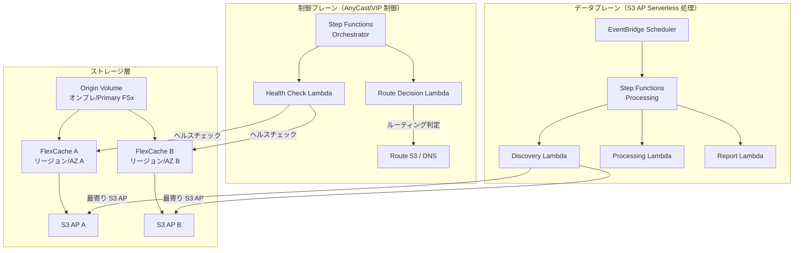

# FlexCache AnyCast / DR パターン

🌐 **Language / 言語**: [日本語](README.md) | [English](README.en.md)

## 概要

本パターンは、ONTAP FlexCache の AnyCast 構成および DR（Disaster Recovery）構成を、FSx for ONTAP × S3 Access Points × AWS Serverless サービスと組み合わせて実現するための設計ガイド、シミュレーションデモ、運用設計ドキュメントを提供する。

## 解決する課題

| 課題 | FlexCache AnyCast / DR による解決 |
|------|----------------------------------|
| 地理分散チームの読み取り性能 | 最寄りの FlexCache からホットデータを提供 |
| EDA/Media/HPC のクラウドバースト | オンプレ Origin + クラウド FlexCache で WAN 転送削減 |
| DR 時の読み取り継続性 | キャッシュ経由で Origin 障害時も読み取り可能 |
| WAN 転送量削減 | ホットデータのみキャッシュ、差分転送 |
| クライアント側マウント設定の複雑化回避 | AnyCast IP で単一マウントポイント |

## アーキテクチャ概要



## 既存ユースケースとの関連

| 既存 UC | 関連ポイント |
|---------|------------|
| [media-vfx/](../media-vfx/) | render input assets の FlexCache 高速化 |
| [manufacturing-analytics/](../manufacturing-analytics/) | 工場間データ共有の FlexCache |
| [healthcare-dicom/](../healthcare-dicom/) | 研究拠点間 DICOM キャッシュ |
| [legal-compliance/](../legal-compliance/) | 支店間監査データの FlexCache |
| [financial-idp/](../financial-idp/) | 支店間文書キャッシュ |
| [semiconductor-eda/](../semiconductor-eda/) | EDA Tools/Libraries のクラウドバースト |

## FSx for ONTAP S3 Access Points との接続点

```
┌─────────────────────────────────────────────────────────┐
│ NFS/SMB アクセス: FlexCache 経由（クライアント直接）      │
│ S3 API アクセス: S3 Access Points 経由（サーバーレス処理）│
└─────────────────────────────────────────────────────────┘
```

- **NFS/SMB**: クライアントは FlexCache volume を直接マウント（AnyCast IP または DNS 経由）
- **S3 API**: Lambda/Step Functions は S3 Access Point 経由でキャッシュ済みデータを処理
- **組み合わせ**: キャッシュ済み/近傍データをサーバーレス AI/分析に渡す設計

## サポート/制約

### ONTAP バージョン差分

| 機能 | 最小バージョン | 備考 |
|------|--------------|------|
| FlexCache 基本 (NFS) | 9.8 | |
| FlexCache SMB | 9.10.1 | |
| Prepopulate | 9.13.1 | |
| Disconnected mode | 9.12.1 | Origin 到達不可時の読み取り継続 |
| Global file lock | 9.14.1 | |
| Writeback | 9.15.1 | |

### FSx for ONTAP での機能公開範囲

- FlexCache の作成・管理: ✅ ONTAP REST API / CLI 経由で可能
- S3 Access Points: ✅ FSx コンソール / API で作成可能
- **FlexCache volume への S3 AP attach**: ⚠️ 未確認（PoC で要検証）
- Virtual IP / BGP: ❌ FSx for ONTAP では利用不可（マネージドネットワーク）

### Virtual IP / BGP の実装可能範囲

| 環境 | VIP/BGP | 代替手段 |
|------|---------|---------|
| FSx for ONTAP | ❌ | Route 53, Global Accelerator, App routing |
| オンプレ ONTAP | ✅ | ネイティブ AnyCast |
| Lab/Simulator | ✅ | テスト用 AnyCast |

## ディレクトリ構成

```
flexcache-anycast-dr/
├── README.md                          # 本ファイル
├── template.yaml                      # CloudFormation テンプレート
├── src/
│   ├── discovery/handler.py           # キャッシュ検出 Lambda
│   ├── health_check/handler.py        # ヘルスチェック Lambda
│   ├── route_decision/handler.py      # ルート判定 Lambda
│   └── report/handler.py             # レポート生成 Lambda
├── events/
│   ├── sample-failover-event.json     # フェイルオーバーイベント例
│   └── sample-cache-health-event.json # キャッシュヘルスイベント例
├── tests/
│   ├── test_health_check.py
│   ├── test_route_decision.py
│   └── test_discovery.py
└── docs/
    ├── architecture.md                # アーキテクチャ詳細
    ├── design-patterns.md             # 構成パターン集
    ├── poc-checklist.md               # PoC チェックリスト
    ├── demo-guide.md                  # デモガイド
    ├── operations-runbook.md          # 運用ランブック
    ├── limitations-and-support-matrix.md
    ├── disaster-recovery-patterns.md  # DR パターン
    ├── network-design-bgp-vip.md      # ネットワーク設計
    └── flexcache-anycast-faq.md       # FAQ
```

## クイックスタート（シミュレーションデモ）

実環境で BGP/VIP が使えない場合でも、Step Functions と Lambda で「ルート選択」「キャッシュヘルス」「近傍キャッシュ選択」をシミュレーションできる。

### 前提条件

- AWS アカウント
- Python 3.12
- AWS CLI v2
- SAM CLI（オプション）

### デプロイ

```bash
# パラメータファイルを編集
cp params/staging.json params/flexcache-anycast-demo.json
# 必要なパラメータを設定

# デプロイ
aws cloudformation deploy \
  --template-file flexcache-anycast-dr/template.yaml \
  --stack-name flexcache-anycast-demo \
  --capabilities CAPABILITY_IAM \
  --parameter-overrides \
    SimulationMode=true \
    CacheEndpoints="cache-a.example.com,cache-b.example.com" \
    HealthCheckIntervalMinutes=5
```

### デモ実行

```bash
# ヘルスチェック実行
aws stepfunctions start-execution \
  --state-machine-arn <STATE_MACHINE_ARN> \
  --input '{"action": "health_check"}'

# フェイルオーバーシミュレーション
aws stepfunctions start-execution \
  --state-machine-arn <STATE_MACHINE_ARN> \
  --input file://events/sample-failover-event.json
```

## ドキュメント

| ドキュメント | 内容 |
|-------------|------|
| [アーキテクチャ](docs/architecture.md) | Mermaid 図による詳細設計 |
| [設計パターン](docs/design-patterns.md) | 7 つの構成パターン |
| [PoC チェックリスト](docs/poc-checklist.md) | 実案件で使えるチェックリスト |
| [デモガイド](docs/demo-guide.md) | 5 つのデモシナリオ |
| [運用ランブック](docs/operations-runbook.md) | 運用手順書 |
| [制約・サポートマトリックス](docs/limitations-and-support-matrix.md) | プラットフォーム別機能可否 |
| [DR パターン](docs/disaster-recovery-patterns.md) | DR 設計パターン |
| [ネットワーク設計](docs/network-design-bgp-vip.md) | BGP/VIP/DNS 設計 |
| [FAQ](docs/flexcache-anycast-faq.md) | よくある質問 |

## 関連リンク

- [サポートマトリックス](../docs/support-matrix-fsx-ontap-flexcache-s3ap.md)
- [業界・ワークロード マッピング](../docs/industry-workload-mapping.md)
- [Dynamic FlexCache Render Workflow](../dynamic-flexcache-render-workflow/README.md)
- [NetApp FlexCache ドキュメント](https://docs.netapp.com/us-en/ontap/flexcache/index.html)
- [FSx for ONTAP ドキュメント](https://docs.aws.amazon.com/fsx/latest/ONTAPGuide/)
