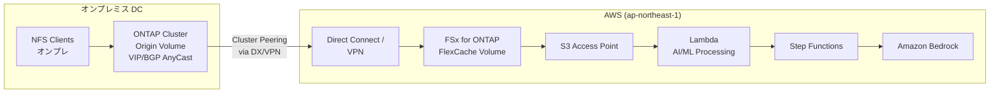
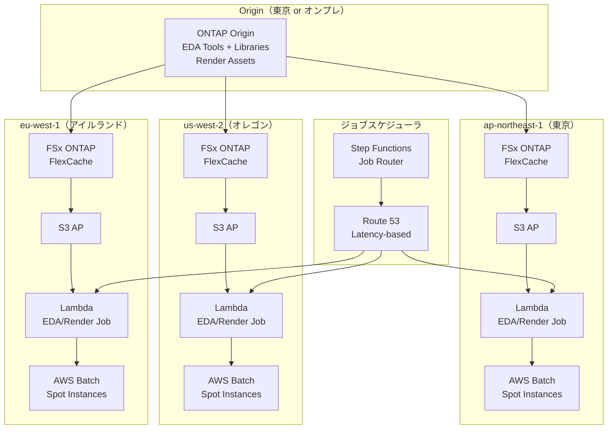
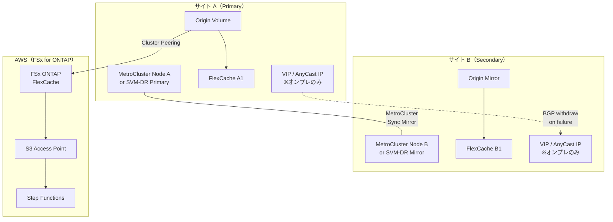
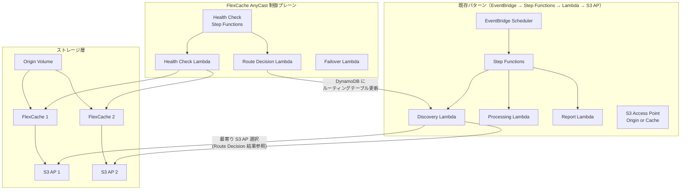

# FlexCache AnyCast / DR — アーキテクチャ詳細

## 1. シングルリージョン / 同一クラスタ内 FlexCache AnyCast

```mermaid
graph TB
    subgraph "FSx for ONTAP Cluster"
        ORIGIN[Origin Volume<br/>/vol/project_data]
        CACHE1[FlexCache 1<br/>/vol/cache_az1]
        CACHE2[FlexCache 2<br/>/vol/cache_az2]
    end
    subgraph "ルーティング層"
        R53[Route 53<br/>Weighted Routing]
    end
    subgraph "クライアント層"
        NFS1[NFS Client AZ-a]
        NFS2[NFS Client AZ-c]
    end
    subgraph "サーバーレス処理層"
        S3AP1[S3 AP (Cache 1)]
        S3AP2[S3 AP (Cache 2)]
        LAMBDA[Lambda<br/>Processing]
    end
    ORIGIN --> CACHE1
    ORIGIN --> CACHE2
    R53 --> CACHE1
    R53 --> CACHE2
    NFS1 --> R53
    NFS2 --> R53
    CACHE1 --> S3AP1 --> LAMBDA
    CACHE2 --> S3AP2 --> LAMBDA
```

**特徴**:
- 同一 FSx ファイルシステム内で Origin + FlexCache を構成
- Route 53 Weighted Routing で AZ 間の負荷分散
- 各 FlexCache に S3 AP を attach（要検証）してサーバーレス処理

## 2. マルチ AZ / マルチ POD 読み取りキャッシュ

```mermaid
graph TB
    subgraph "Primary AZ (ap-northeast-1a)"
        ORIGIN[FSx ONTAP<br/>Origin Volume<br/>Multi-AZ HA]
    end
    subgraph "AZ-a Compute"
        EC2_A[EC2 / EKS Pod<br/>AZ-a]
        LAMBDA_A[Lambda AZ-a]
    end
    subgraph "AZ-c Compute"
        CACHE_C[FSx ONTAP<br/>FlexCache<br/>AZ-c 最適化]
        EC2_C[EC2 / EKS Pod<br/>AZ-c]
        LAMBDA_C[Lambda AZ-c]
        S3AP_C[S3 AP]
    end
    ORIGIN -->|Cross-AZ<br/>データフェッチ| CACHE_C
    EC2_A -->|同一 AZ<br/>低レイテンシ| ORIGIN
    EC2_C -->|同一 AZ<br/>低レイテンシ| CACHE_C
    CACHE_C --> S3AP_C --> LAMBDA_C
    LAMBDA_A -->|S3 AP (Origin)| ORIGIN
```

**特徴**:
- FSx ONTAP Multi-AZ HA で Origin を保護
- 別 AZ のコンピュートは FlexCache 経由でアクセス
- Cross-AZ データ転送を最小化

## 3. オンプレ ONTAP Origin + AWS FSx for ONTAP Cache



**特徴**:
- オンプレ ONTAP が Origin（VIP/BGP AnyCast 利用可能）
- AWS 側は FSx for ONTAP FlexCache でホットデータをキャッシュ
- S3 AP 経由でサーバーレス AI/ML 処理
- Direct Connect / VPN でクラスタピアリング

## 4. マルチリージョン EDA/Media クラウドバースト



**特徴**:
- 複数リージョンに FlexCache を配置
- ジョブスケジューラが最適リージョンにルーティング
- Spot Instance の可用性に応じてリージョン選択
- EDA Tools/Libraries は各リージョンの FlexCache にキャッシュ

## 5. MetroCluster/SVM-DR + FlexCache AnyCast 概念パターン



**特徴**:
- MetroCluster / SVM-DR でサイト間冗長化
- AnyCast VIP で自動フェイルオーバー（オンプレのみ）
- FSx for ONTAP は AWS 側の FlexCache として機能
- **FSx for ONTAP では MetroCluster 不可**（マネージド Multi-AZ HA で代替）

## 6. 既存 Serverless パターンとの統合



**統合ポイント**:
- 既存の EventBridge → Step Functions → Lambda パイプラインはそのまま
- Discovery Lambda が「どの S3 AP を使うか」を Route Decision の結果から判定
- Health Check は別の Step Functions で定期実行
- DynamoDB にルーティングテーブルを保持し、Discovery Lambda が参照

## 設計原則

1. **制御プレーンとデータプレーンの分離**: AnyCast/VIP 制御は独立した Step Functions で管理
2. **既存パターンの非破壊**: 既存 UC の Discovery/Processing/Report パイプラインは変更しない
3. **シミュレーション可能**: 実環境 BGP/VIP がなくても Lambda でルート判定をシミュレーション
4. **段階的導入**: まず Static FlexCache + S3 AP → 次に Dynamic → 最後に AnyCast/DR
