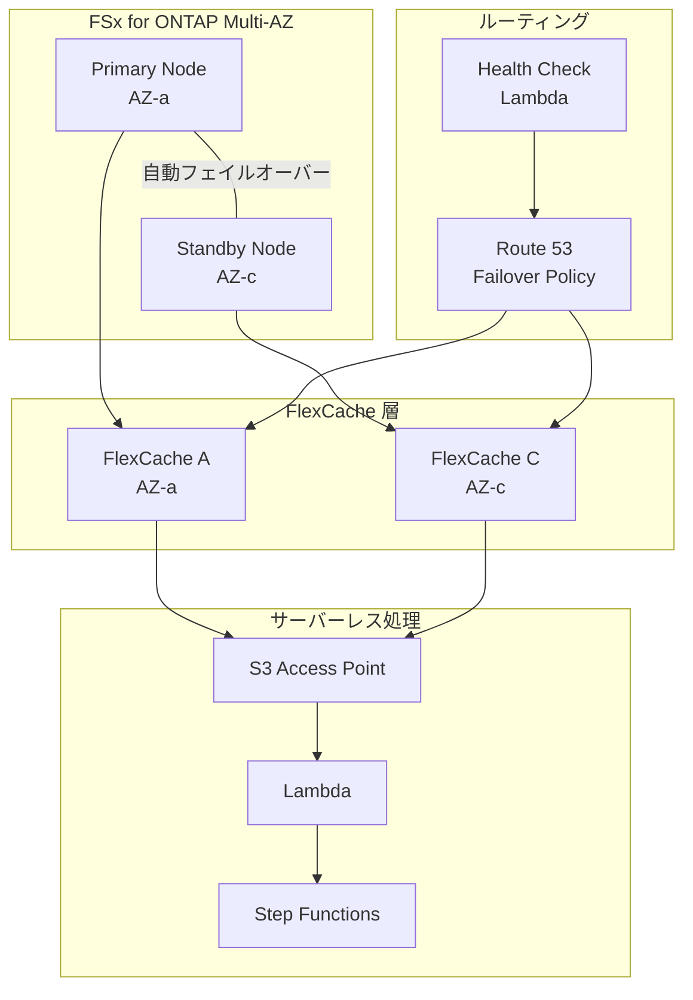
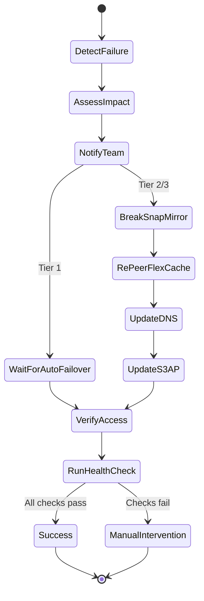

# FlexCache AnyCast / DR — Disaster Recovery パターン

## DR Tier 定義

| Tier | RTO | RPO | 構成 | コスト |
|------|-----|-----|------|--------|
| Tier 1 | <15分 | <5分 | Multi-AZ HA + FlexCache + Route 53 Failover | 高 |
| Tier 2 | <1時間 | <15分 | SnapMirror + FlexCache re-peer + DNS 切替 | 中 |
| Tier 3 | <4時間 | <1時間 | SnapMirror + 手動 FlexCache 再構成 | 低 |

## Tier 1: Multi-AZ HA + FlexCache + Route 53 Failover



**フェイルオーバーフロー**:
1. FSx for ONTAP Multi-AZ が自動フェイルオーバー（<60秒）
2. Route 53 ヘルスチェックが Primary の障害を検出
3. DNS レコードが Standby 側の FlexCache に切替
4. Lambda/Step Functions は S3 AP 経由で継続アクセス

## Tier 2: SnapMirror + FlexCache Re-peer

```mermaid
graph LR
    subgraph "Primary Region"
        ORIGIN_P[Origin Volume<br/>Primary]
        CACHE_P[FlexCache<br/>Primary]
    end
    subgraph "DR Region"
        MIRROR[SnapMirror<br/>Destination]
        CACHE_DR[FlexCache<br/>DR (re-peer)]
    end
    ORIGIN_P -->|SnapMirror<br/>非同期| MIRROR
    ORIGIN_P --> CACHE_P
    MIRROR -.->|障害時<br/>re-peer| CACHE_DR
```

**フェイルオーバーフロー**:
1. Primary Region の障害を検出
2. SnapMirror destination を break（読み書き可能に）
3. FlexCache を新しい Origin（SnapMirror destination）に re-peer
4. DNS/Route 53 を DR Region に切替
5. S3 AP を DR Region の volume に再設定

## Tier 3: SnapMirror + 手動再構成

**フェイルオーバーフロー**:
1. Primary Region の障害を検出
2. SnapMirror destination を break
3. 新しい FlexCache を手動作成
4. S3 AP を手動で attach
5. Lambda/Step Functions の環境変数を更新
6. テスト実行で動作確認

## フェイルオーバー自動化（Step Functions）



## フェイルバック手順

1. **Primary 復旧確認**
   - Origin volume のオンライン確認
   - SnapMirror resync（reverse direction）
   - データ整合性確認

2. **FlexCache 再構成**
   - DR 側 FlexCache の削除（または維持）
   - Primary 側 FlexCache の再作成
   - Prepopulate 実行

3. **ルーティング切戻し**
   - Route 53 レコードを Primary に戻す
   - S3 AP を Primary volume に再設定
   - Lambda 環境変数の更新

4. **検証**
   - ヘルスチェック実行
   - テストジョブ実行
   - 性能確認

## DR テスト計画

### 月次テスト項目

- [ ] Route 53 ヘルスチェックの動作確認
- [ ] フェイルオーバー Step Functions の実行テスト
- [ ] SnapMirror lag time の確認
- [ ] FlexCache disconnected mode の動作確認
- [ ] S3 AP アクセスの継続性確認
- [ ] 通知（SNS）の到達確認
- [ ] フェイルバック手順の実行テスト

### 四半期テスト項目

- [ ] 完全フェイルオーバーテスト（Primary 停止シミュレーション）
- [ ] RTO/RPO の実測
- [ ] 全 UC パイプラインの DR 時動作確認
- [ ] コスト影響の評価
