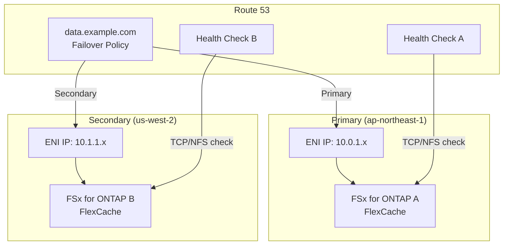
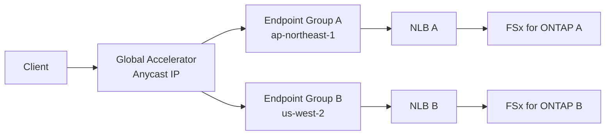
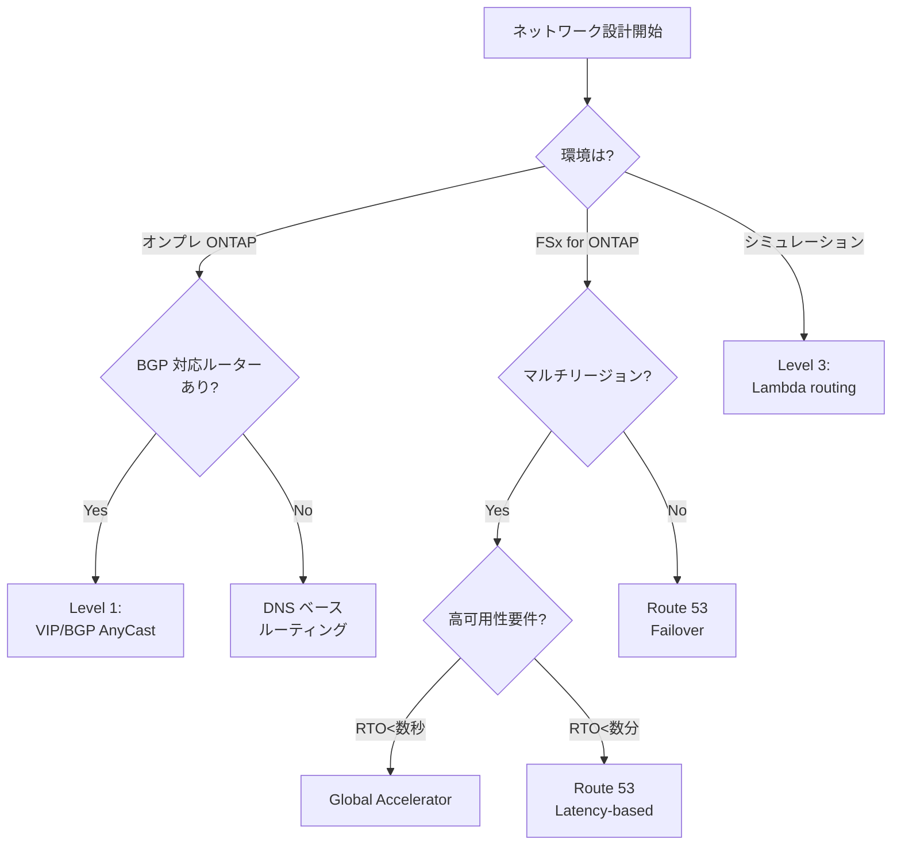

# FlexCache AnyCast / DR — ネットワーク設計 (BGP/VIP/DNS)

## 概要

FlexCache AnyCast のネットワーク設計は、実装環境によって大きく異なる。本ドキュメントでは以下の 3 つの実装レベルを区別する。

| レベル | 環境 | 方式 |
|--------|------|------|
| Level 1 | オンプレ ONTAP | ネイティブ VIP/BGP AnyCast |
| Level 2 | FSx for ONTAP | DNS/Route 53 ベース代替 |
| Level 3 | シミュレーション | Lambda ルーティングロジック |

## Level 1: ネイティブ VIP/BGP AnyCast（オンプレ ONTAP）

### Virtual IP (VIP) LIF の概念

```
┌─────────────────────────────────────────────────────────┐
│ ONTAP Cluster                                           │
│                                                         │
│  Node A                    Node B                       │
│  ┌──────────┐             ┌──────────┐                 │
│  │ VIP LIF  │             │ VIP LIF  │                 │
│  │ 10.0.1.1 │             │ 10.0.1.1 │  ← 同一 IP     │
│  └────┬─────┘             └────┬─────┘                 │
│       │                        │                        │
│  ┌────┴─────┐             ┌────┴─────┐                 │
│  │ BGP Peer │             │ BGP Peer │                 │
│  │ /32 route│             │ /32 route│                 │
│  └────┬─────┘             └────┬─────┘                 │
└───────┼────────────────────────┼────────────────────────┘
        │                        │
   ┌────┴────────────────────────┴────┐
   │         L3 Network / Router       │
   │    BGP: shortest path routing     │
   └──────────────────────────────────┘
```

### VIP/BGP 設定例（ONTAP CLI）

```bash
# VIP LIF 作成
network interface create -vserver svm1 \
  -lif vip_lif1 \
  -role data \
  -data-protocol nfs,cifs \
  -address 10.0.1.1 \
  -netmask 255.255.255.255 \
  -home-node node-01 \
  -service-policy default-data-files \
  -is-vip true

# BGP peer 設定
network bgp peer-group create -peer-group pg1 \
  -ipspace Default \
  -bgp-lif bgp_lif1 \
  -peer-address 10.0.0.1 \
  -peer-asn 65001 \
  -local-asn 65000

# BGP MED 設定（優先度制御）
network bgp peer-group modify -peer-group pg1 \
  -med 100
```

### AnyCast 動作原理

1. 複数ノードが同一 VIP (/32) を BGP で広告
2. ルーターは BGP best path selection で最適ノードを選択
3. MED 値で優先度を制御（低い値 = 高優先度）
4. ノード障害時は BGP withdraw → 自動的に次善ノードへ

### 設計考慮事項

- **Namespace**: 全 FlexCache で同一 namespace/junction path を使用
- **File Handle**: FlexCache 間で file handle は異なる → NFS クライアントの再マウント不要（VIP 経由）
- **BGP MED**: 近傍キャッシュに低 MED を設定
- **IPspace/VRF**: データ LIF とは別の IPspace で VIP を管理
- **SVM 設計**: Origin SVM と Cache SVM の分離を推奨

## Level 2: DNS/Route 53 ベース代替（FSx for ONTAP）

### Route 53 Failover Routing



### Route 53 設定例

```json
{
  "Comment": "FlexCache Failover",
  "Changes": [
    {
      "Action": "CREATE",
      "ResourceRecordSet": {
        "Name": "data.example.com",
        "Type": "A",
        "SetIdentifier": "primary",
        "Failover": "PRIMARY",
        "TTL": 60,
        "ResourceRecords": [{"Value": "10.0.1.100"}],
        "HealthCheckId": "health-check-primary"
      }
    },
    {
      "Action": "CREATE",
      "ResourceRecordSet": {
        "Name": "data.example.com",
        "Type": "A",
        "SetIdentifier": "secondary",
        "Failover": "SECONDARY",
        "TTL": 60,
        "ResourceRecords": [{"Value": "10.1.1.100"}],
        "HealthCheckId": "health-check-secondary"
      }
    }
  ]
}
```

### Route 53 Latency-based Routing（マルチリージョン）

```json
{
  "Name": "data.example.com",
  "Type": "A",
  "SetIdentifier": "tokyo",
  "Region": "ap-northeast-1",
  "TTL": 60,
  "ResourceRecords": [{"Value": "10.0.1.100"}]
}
```

### Global Accelerator（高可用性要件）



## Level 3: Lambda ルーティングロジック（シミュレーション）

### ルーティング判定 Lambda

```python
"""Route Decision Lambda — FlexCache AnyCast シミュレーション"""

import os
import random
import boto3

dynamodb = boto3.resource("dynamodb")
table = dynamodb.Table(os.environ["ROUTING_TABLE_NAME"])


def handler(event, context):
    strategy = event.get("strategy", "latency_based")
    client_region = event.get("client_region", "ap-northeast-1")

    # ルーティングテーブルから全キャッシュ情報を取得
    response = table.scan(
        FilterExpression="health = :h",
        ExpressionAttributeValues={":h": "healthy"},
    )
    caches = response.get("Items", [])

    if not caches:
        return {"error": "No healthy caches available"}

    if strategy == "latency_based":
        # レイテンシが最小のキャッシュを選択
        selected = min(caches, key=lambda c: int(c.get("latency_ms", 9999)))
    elif strategy == "weighted":
        # 重み付きランダム選択
        weights = [int(c.get("weight", 1)) for c in caches]
        selected = random.choices(caches, weights=weights, k=1)[0]
    elif strategy == "region_affinity":
        # 同一リージョン優先
        same_region = [c for c in caches if c.get("region") == client_region]
        selected = same_region[0] if same_region else caches[0]
    else:
        selected = caches[0]

    return {
        "selected_cache": selected["cache_id"],
        "endpoint": selected["endpoint"],
        "s3ap_alias": selected.get("s3ap_alias", ""),
        "strategy": strategy,
        "candidates": len(caches),
    }
```

## 設計判断フローチャート



## セキュリティ考慮

| 項目 | Level 1 (BGP) | Level 2 (DNS) | Level 3 (Lambda) |
|------|:---:|:---:|:---:|
| 通信暗号化 | IPsec (optional) | TLS (NFS over TLS) | HTTPS |
| 認証 | Kerberos / NTLM | Kerberos / NTLM | IAM |
| ルーティング改ざん防止 | BGP MD5 auth | DNSSEC | IAM policy |
| 監査ログ | ONTAP audit | CloudTrail | CloudTrail |
