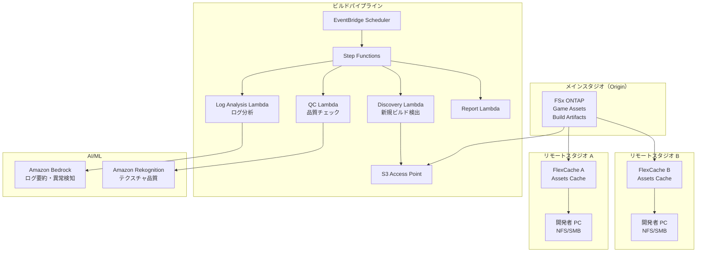

# Gaming Build Pipeline — ゲームアセット共有・ビルドパイプライン

🌐 **Language / 言語**: [日本語](README.md)

## 概要

ゲーム開発スタジオのファイルサーバー（FSx for ONTAP）上のゲームアセット（テクスチャ、モデル、シェーダー、ビルド成果物）を FlexCache でグローバルスタジオ間共有し、S3 Access Points 経由でビルドパイプラインの品質チェック・ログ分析を自動化するパターン。

## 解決する課題

| 課題 | 本パターンによる解決 |
|------|-------------------|
| グローバルスタジオ間のアセット同期遅延 | FlexCache で拠点間キャッシュ |
| ビルド成果物の品質チェック手動化 | S3 AP + Lambda で自動 QC |
| シェーダーコンパイルログの分析 | Athena + Bedrock で自動分析 |
| CI/CD パイプラインのストレージボトルネック | FlexCache で読み取り高速化 |
| アセットバージョン管理の複雑化 | メタデータ自動抽出・カタログ化 |

## アーキテクチャ



## ゲームアセット分類

| アセット種別 | アクセスパターン | FlexCache 適用 | S3 AP 利用 |
|------------|---------------|:---:|:---:|
| テクスチャ (.png, .tga, .dds) | 読み取り中心 | ✅ | ✅ 品質チェック |
| 3D モデル (.fbx, .obj, .usd) | 読み取り中心 | ✅ | ⚠️ バイナリ |
| シェーダー (.hlsl, .glsl) | 読み取り中心 | ✅ | ✅ コンパイルログ |
| ビルド成果物 (.exe, .pak) | 書き込み → 配布 | ❌ | ✅ メタデータ |
| CI ログ (.log, .json) | 書き込み → 分析 | ❌ | ✅ 分析 |
| アニメーション (.anim, .fbx) | 読み取り中心 | ✅ | ⚠️ バイナリ |

## FlexCache の役割

- メインスタジオのアセットをリモートスタジオにキャッシュ
- ビルドサーバーからの大量読み取りを高速化
- アーティストの作業環境を改善（低レイテンシ）
- S3 AP 経由でビルドパイプラインの自動化に提供

## 期待される効果

| KPI | FlexCache なし | FlexCache あり | 改善率 |
|-----|--------------|---------------|--------|
| アセット同期時間 | 30-60分 | 3-5分 | 90% |
| ビルド時間 | 45分 | 25分 | 44% |
| アーティスト待ち時間 | 5-10分/ファイル | <1分 | 80% |
| WAN 転送量/日 | 200GB | 20GB | 90% |

## ディレクトリ構成

```
gaming-build-pipeline/
├── README.md
├── template.yaml
├── functions/
│   ├── discovery/handler.py
│   ├── quality_check/handler.py
│   ├── log_analysis/handler.py
│   └── report/handler.py
├── tests/
├── events/
│   └── sample-input.json
└── docs/
    ├── architecture.md
    ├── demo-guide.md
    └── poc-checklist.md
```

## 対象ゲームエンジン

- Unreal Engine 5
- Unity
- Godot
- カスタムエンジン

## 関連リンク

- [media-vfx/](../media-vfx/README.md) — レンダリングパイプライン
- [Dynamic FlexCache Render Workflow](../dynamic-flexcache-render-workflow/README.md)
- [FlexCache AnyCast / DR](../flexcache-anycast-dr/README.md)
- [業界・ワークロード マッピング](../docs/industry-workload-mapping.md)


## Success Metrics

### Outcome
ゲームアセット品質チェック・ログ分析の自動化により、ビルドパイプラインの品質管理を効率化する。

### Metrics
| メトリクス | 目標値（例） |
|-----------|------------|
| QC 処理アセット数 / 実行 | > 500 assets |
| 品質チェック通過率 | > 95% |
| ログ分析処理時間 | < 5 分 |
| ビルド品質問題の早期検出率 | > 80% |
| Human Review 対象率 | < 10%（品質不合格アセット） |

### Measurement Method
Step Functions 実行履歴、QC 結果メタデータ、ログ分析レポート、CloudWatch Metrics。


---

## 出力サンプル (Output Sample)

ゲームビルドパイプライン品質チェックの出力例:

```json
{
  "discovery": {
    "status": "completed",
    "object_count": 30,
    "categories": {"texture": 15, "model": 8, "build_log": 7}
  },
  "texture_qc": [
    {
      "key": "builds/v2.1/textures/character_hero.dds",
      "resolution": "4096x4096",
      "format": "BC7",
      "mip_levels": 12,
      "quality_score": 0.95,
      "issues": []
    }
  ],
  "build_log_analysis": {
    "total_warnings": 23,
    "total_errors": 0,
    "critical_issues": [],
    "build_time_sec": 1847,
    "asset_count": 1234
  },
  "report": {
    "build_version": "v2.1",
    "overall_quality": "PASS",
    "textures_passed": 14,
    "textures_failed": 1,
    "recommendation": "1 texture below minimum resolution - review before release"
  }
}
```

> **注記**: 上記はサンプル出力であり、実際の値は環境・入力データにより異なります。ベンチマーク数値は sizing reference であり、service limit ではありません。

---

## Performance Considerations

- FSx for ONTAP のスループットキャパシティは NFS/SMB/S3AP で共有されます
- S3 Access Point 経由のレイテンシは数十ミリ秒のオーバーヘッドが発生します
- 大量ファイル処理時は Step Functions Map state の MaxConcurrency で並列度を制御してください
- Lambda メモリサイズの増加はネットワーク帯域幅の向上にも寄与します

> **注記**: 本パターンのパフォーマンス数値は sizing reference であり、service limit ではありません。実環境での性能は FSx ONTAP スループットキャパシティ、ネットワーク構成、同時実行ワークロードにより異なります。

---

## Governance Note

> 本パターンは技術アーキテクチャガイダンスを提供します。法的・コンプライアンス・規制上の助言ではありません。組織は適格な専門家に相談してください。
