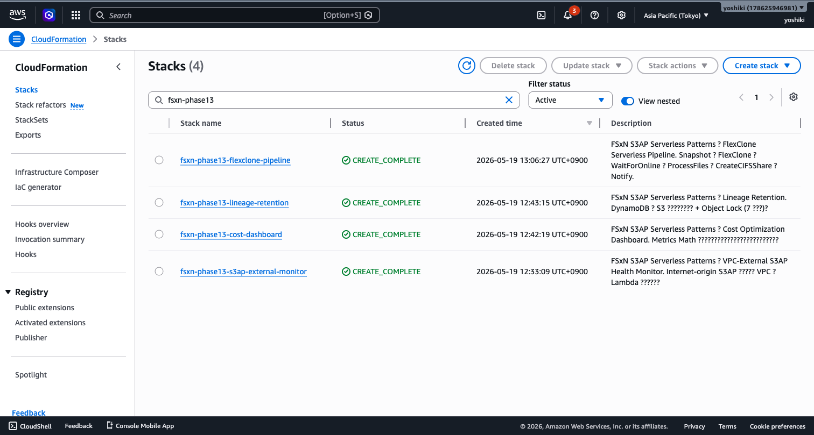
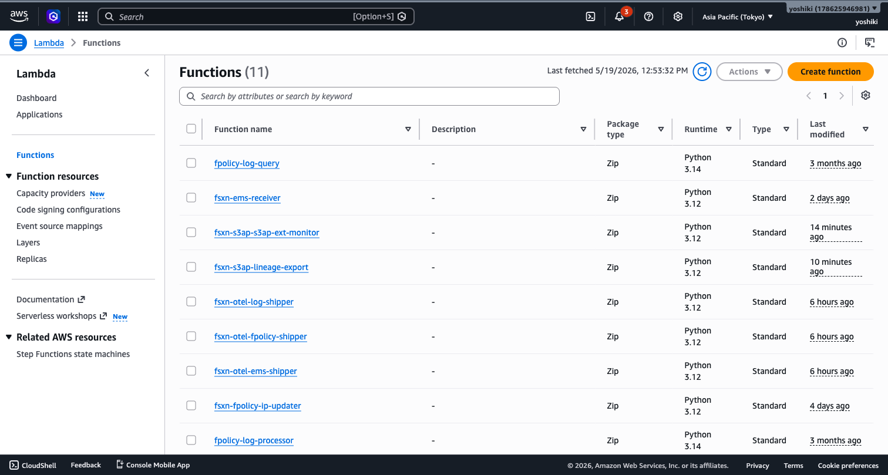

# FC6: Gaming Build Pipeline — デモガイド

## Executive Summary

ゲームビルドパイプラインのアセット品質チェック・ビルドログ分析を実演する。

**デモの核心メッセージ**: ビルド品質の自動検証で、リリース前の品質問題を早期発見。

**想定時間**: 3〜5 分

---

## Demo Scenario

1. **アセット検出**: FSx ONTAP 上のビルド成果物を S3 AP 経由で検出
2. **テクスチャ品質チェック**: Rekognition でテクスチャ品質を評価
3. **ビルドログ分析**: Bedrock でビルドログのエラーパターンを分析
4. **レポート**: 品質サマリーと推奨アクションの生成

---

## 出力サンプル

```json
{
  "build_id": "game-alpha-build-2026.05.20-001",
  "platform": "Windows",
  "engine": "Unreal Engine 5.4",
  "quality_check": {
    "textures_checked": 1247,
    "textures_passed": 1231,
    "textures_failed": 16,
    "issues": [
      {
        "asset": "Characters/Hero/T_Hero_Diffuse.uasset",
        "issue": "resolution_exceeds_budget",
        "detail": "4096x4096 (budget: 2048x2048)",
        "severity": "warning"
      }
    ]
  },
  "build_log_analysis": {
    "total_warnings": 42,
    "total_errors": 3,
    "top_issues": [
      "Shader compilation timeout (3 occurrences)",
      "Missing LOD level 2 for 12 meshes"
    ]
  }
}
```


## スクリーンショット



