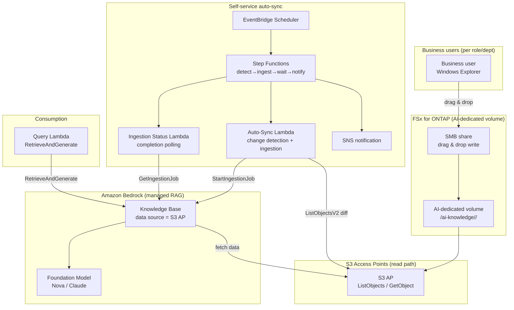

# Self-Service Knowledge Base Curation

🌐 **Language / 言語**: [日本語](README.md) | [English](README.en.md) | [한국어](README.ko.md) | [简体中文](README.zh-CN.md) | [繁體中文](README.zh-TW.md) | [Français](README.fr.md) | [Deutsch](README.de.md) | [Español](README.es.md)

## Overview

A pattern that lets business users maintain an Amazon Bedrock Knowledge Base data source **using nothing but familiar Windows Explorer drag & drop**.

An **AI-dedicated volume / folder** on FSx for ONTAP is shared over SMB to each role/department. The same data is connected to an Amazon Bedrock Knowledge Base as a data source **via S3 Access Points (read path)**, and file changes are detected to **trigger ingestion automatically**.

This shifts operations from "IT does manual ETL/copy/ingestion per request" to a **democratized model where the business owns and maintains its own knowledge**.

## Before / After

> **Note**: The following is a generalized operational story with customer, individual, and team names masked.

### Before — Dependent on the IT team

A typical request:

> "We launched a new product. Please put the files in our Windows Team Folder into the AI Knowledge Base. Sales wants to test it interactively in a demo."

For each request, the IT team had to:
1. Manually copy files from a Windows Server on EC2
2. Upload to an S3 bucket
3. Manually run ingestion into the Bedrock Knowledge Base
4. Notify the business unit

→ Bottleneck per request, duplicated data, and tribal knowledge.

### After — Business-led self-service

The IT team simply tells the business:

> "Put the data you want the AI to use into this Windows folder and maintain it yourself. The AI relies on this data."

From then on, business users just drag & drop into the AI folder as usual. S3 Access Points let the Bedrock Knowledge Base sync automatically, making it searchable right away.

## Problems Solved

| Problem | How this pattern solves it |
|------|-------------------|
| Knowledge updates wait on IT manual work | Business maintains it via Windows ops; auto-ingestion |
| Duplicated data from S3 copies | The FSx ONTAP master is the data source directly via S3 AP |
| Missed ingestion / stale data | File changes detected and ingested automatically |
| Requires ETL/S3/Bedrock skills | Windows Explorer drag & drop only |
| Unclear data ownership | Folder layout split per role/department |

## Architecture



## Two demo scenarios

The same foundation supports two operational stages (see [demo guide](docs/demo-guide.md)):

| Scenario | Summary | Ingestion trigger |
|---------|------|----------------|
| **A: Manual hands-on** | Maintain AI data with Windows file ops (add/update/delete); ingestion triggered manually (console "Sync" / CLI) | Manual |
| **B: Automation** | Automate A's manual sync with Lambda + Step Functions + EventBridge (detect→ingest→wait→notify) | Automatic |

> The business user's action (drag & drop) is identical in both. Only the post-ingestion steps differ — done by a person, or by serverless.

## Roles & folders (aligned with Amazon Quick)

Roles match those Amazon Quick targets. The Quick FAQ lists sales, marketing, IT, operations, finance, and legal; developers has its own page. Sample seed data for each role ships in [`sample-data/ai-knowledge/`](sample-data/).

```
/ai-knowledge/                  ← AI-dedicated volume (SMB share)
├── sales/                      ← account plans, product info, playbooks
├── marketing/                  ← brand, campaigns, content
├── finance/                    ← budgets, expense policy, forecasts
├── information-technology/     ← runbooks, IT FAQ, security
├── operations/                 ← SOPs, processes
├── legal/                      ← contracts, NDA, compliance
└── developers/                 ← standards, onboarding, service catalog
```

Each folder uses NTFS ACLs to grant write access per role/department. This UC shares its role layout and test data with the upcoming Amazon Quick UC. (Prices/capabilities are time-sensitive; see the official pages.)

## Managed KB vs Custom RAG

| Aspect | This UC: Managed KB (Pattern C) | FC3: Custom RAG (Pattern A) |
|------|------------------------------|------------------------------|
| Primary goal | Democratize data ops, minimize overhead | File-level permission filtering at query time |
| RAG impl | Bedrock Knowledge Bases (managed) | OpenSearch + custom retrieval + ACL extraction |
| Access control | Folder/share level (SMB ACL) + KB data source boundary | Per-chunk AD SID metadata filter |
| Ops overhead | Low (managed) | Medium–high (self-built pipeline) |
| Best for | Shared dept knowledge, internal FAQ, product info | Regulated industries, confidential docs, per-user visibility |

> **Deployment prerequisite**: Create the Knowledge Base and its S3 AP data source with [`scripts/create_bedrock_kb.py`](../scripts/create_bedrock_kb.py) or the Bedrock console, then pass their `KnowledgeBaseId` / `DataSourceId` to this template. OpenSearch Serverless vector index creation is not CloudFormation-native, hence this split.

## Security

- **No data movement**: files stay on FSx ONTAP; S3 AP is read-only access
- **Writes via SMB/NFS only**: the AI ingestion path (S3 AP) is read access
- **Folder-level separation**: NTFS ACLs split write permission per department
- **Least privilege**: Lambda only allowed List/Get on the target S3 AP and Ingestion/Retrieve on the KB
- **Audit**: CloudTrail (API) + ONTAP audit logs (file ops) + ingestion job history

> **Note**: The S3 AP data source boundary is at the volume/prefix level. For per-user visibility control, use a custom permission-aware RAG instead.

## Success Metrics

| Metric | Target (example) |
|-----------|------------|
| Update lead time (drop → searchable) | < 15 min (depends on schedule) |
| IT manual ingestion requests | 0 / month (after migration) |
| Auto-ingestion success rate | > 98% |
| Change-detection miss rate | 0% (full list scan) |
| Business user action | Windows drag & drop only |

## Cost Estimate

> **Note**: Approximate for ap-northeast-1; actual costs vary by usage. Check the [AWS Pricing Calculator](https://calculator.aws/). Prices and benchmarks are time-sensitive.

Serverless components (Lambda, S3 API, EventBridge Scheduler, Bedrock ingestion/generation, SNS, CloudWatch Logs) plus the KB vector store (OpenSearch Serverless) and the shared FSx ONTAP volume. See the Japanese README for the detailed table.

> **Governance Caveat**: Cost estimates are approximate, not guaranteed.

## Related

| Related | Point |
|---------|------------|
| [FC3 genai-rag-enterprise-files](../genai-rag-enterprise-files/) | Custom RAG when strict permission filtering is required (Pattern A) |
| [Extension pattern: Bedrock KB](../docs/extension-patterns.md) | Generic managed KB + S3 AP pattern |
| [KB creation script](../scripts/create_bedrock_kb.py) | KB / data source creation (deployment prerequisite) |

## Governance Note

> This pattern provides technical architecture guidance, not legal, compliance, or regulatory advice. Consult qualified professionals. The S3 AP data source boundary is volume/prefix level; per-user visibility control is out of scope for this UC.
