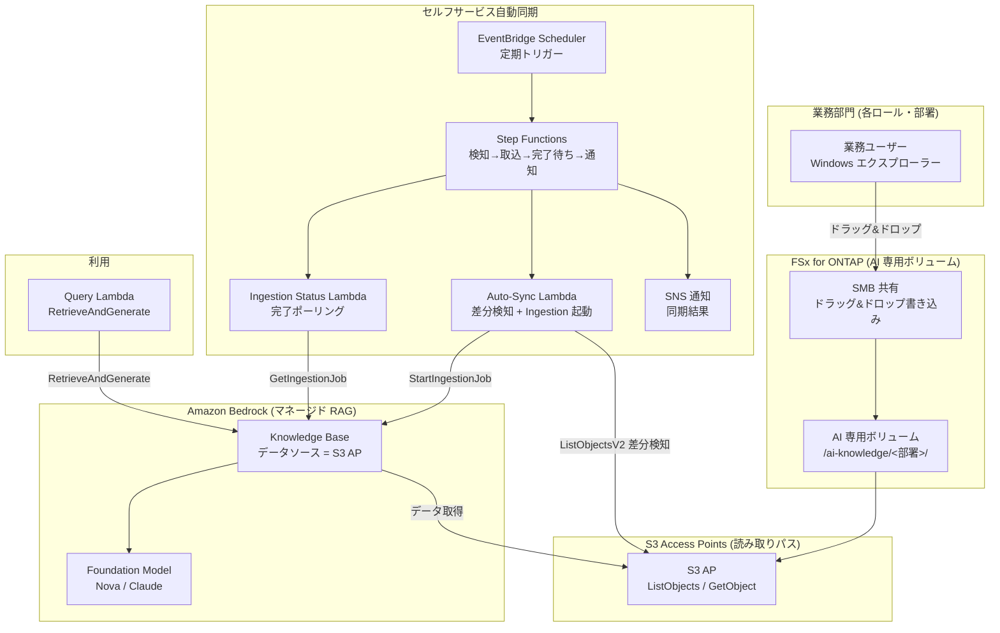

# Self-Service Knowledge Base Curation (民主化された AI ナレッジ運用)

🌐 **Language / 言語**: [日本語](README.md) | [English](README.en.md) | [한국어](README.ko.md) | [简体中文](README.zh-CN.md) | [繁體中文](README.zh-TW.md) | [Français](README.fr.md) | [Deutsch](README.de.md) | [Español](README.es.md)

## 概要

業務部門のメンバーが **使い慣れた Windows エクスプローラーのドラッグ&ドロップ操作だけ** で、Amazon Bedrock Knowledge Base のデータソースを維持できるようにするパターン。

FSx for ONTAP 上に **AI 専用ボリューム / フォルダー** を用意し、SMB（Windows 共有）で各ロール・部署に公開する。同じデータを **S3 Access Points 経由（読み取りパス）** で Amazon Bedrock Knowledge Base のデータソースに接続し、ファイル投入を検知して **自動で取り込み（Ingestion）** を実行する。

これにより、IT 部門が依頼ベースで手作業の ETL / コピー / 取り込みを行う運用から、**現場が自分でナレッジを維持する民主化された運用** へ移行する。

## Before / After（運用変革）

> **注記**: 以下は特定顧客名・担当者名をマスクした、一般化した運用ストーリーです。

### Before — IT 部門の手作業に依存

```
業務部門「新製品が出たので、この Windows チームフォルダーの資料を
          AI ナレッジに入れてください（営業がデモで使うので）」
   ↓ 依頼チケット
IT 部門 → EC2 上の Windows Server から手動でファイルをコピー
        → S3 バケットへアップロード
        → Bedrock Knowledge Base へ手動で取り込み実行
        → 完了連絡
```

- 依頼ごとに IT 部門が介在 → ボトルネック・タイムラグ
- コピー作業による**データの二重管理**と更新漏れ
- 「誰が・いつ・何を入れたか」が属人化

### After — 現場主導のセルフサービス

```
IT 部門「このWindowsフォルダーに AI に使わせたいデータを置いて、
         自分たちでメンテナンスしてください。AI はこのデータを参照します」
   ↓
業務部門 → 普段どおり Windows エクスプローラーで
          AI 専用フォルダーへドラッグ&ドロップ（追加・更新・削除）
   ↓ （自動）
S3 Access Point 経由で Bedrock Knowledge Base が同期 → 即座に検索対象に
```

- IT 部門の依頼対応が不要 → リードタイム短縮
- ファイルは FSx ONTAP 上の **正本のまま**（S3 へのコピー不要）
- データのオーナーシップが各ロール・部署に分散（民主化）

## 解決する課題

| 課題 | 本パターンによる解決 |
|------|-------------------|
| ナレッジ更新が IT 部門の手作業待ち | 現場が Windows 操作で直接維持、自動取り込み |
| S3 へのコピーによるデータ二重管理 | S3 AP 経由で FSx ONTAP の正本を直接データソース化 |
| 取り込み忘れ・更新漏れ | ファイル投入を検知し自動 Ingestion |
| 専門スキル（ETL/S3/Bedrock）が必要 | Windows エクスプローラーのドラッグ&ドロップのみ |
| データオーナーが不明確 | フォルダー構成をロール・部署単位に分割し責任分界 |

## アーキテクチャ



## 2 つの運用シナリオ（デモ）

同じ基盤上で、運用成熟度に応じた 2 段階を体験できる。詳細は [デモガイド](docs/demo-guide.md) を参照。

| シナリオ | 概要 | 取り込みトリガー |
|---------|------|----------------|
| **A: 手動メンテナンス体験** | Windows のファイル操作（追加/更新/削除）で AI データを維持。取り込みは人が手動（コンソール「同期」/ CLI） | 手動 |
| **B: 自動化** | A の手動同期を Lambda + Step Functions + EventBridge で自動化（検知→取込→完了待ち→通知） | 自動 |

> 業務ユーザーの操作（ドラッグ&ドロップ）は両シナリオで不変。変わるのは取り込み以降を人がやるか、サーバーレスがやるかだけ。

## セルフサービス運用モデル（民主化）

### AI 専用ボリュームのフォルダー設計（Amazon Quick 想定ロールに準拠）

業務ロール（部門）は **Amazon Quick** が対象とするロールに合わせて広く用意する。
Quick FAQ は「sales, marketing, IT, operations, finance, legal」を対象として明記し、
developers には専用ページがある。

```
/ai-knowledge/                     ← AI 専用ボリューム（SMB 共有）
├── sales/                         ← 営業（アカウントプラン・製品情報・プレイブック）
├── marketing/                     ← マーケティング（ブランド・キャンペーン・コンテンツ）
├── finance/                       ← 財務・経理（予算・経費・フォーキャスト）
├── information-technology/        ← 情報システム（ランブック・IT FAQ・セキュリティ）
├── operations/                    ← オペレーション（SOP・業務プロセス）
├── legal/                         ← 法務（契約・NDA・コンプライアンス）
└── developers/                    ← 開発（規約・オンボーディング・サービスカタログ）
```

| フォルダー | ロール | Amazon Quick での想定（参考・time-sensitive） |
|-----------|--------|--------------------------------|
| `sales/` | 営業 | Lead scoring / Sales forecasting / CRM（[/quick/sales/](https://aws.amazon.com/quick/sales/)） |
| `marketing/` | マーケティング | キャンペーン・ブランド・コンテンツ（Quick FAQ） |
| `finance/` | 財務・経理 | 予算・経費・フォーキャスト（Quick FAQ） |
| `information-technology/` | 情報システム | インシデント対応・IT FAQ・セキュリティ（[/quick/information-technology/](https://aws.amazon.com/quick/information-technology/)） |
| `operations/` | オペレーション | SOP・業務プロセス（Quick FAQ） |
| `legal/` | 法務 | 契約・コンプライアンス（Quick FAQ） |
| `developers/` | 開発 | コーディング規約・オンボーディング（[/quick/developers/](https://aws.amazon.com/quick/developers/)） |

- 各フォルダーは **NTFS ACL** で担当ロール・部署に書き込み権限を付与
- 業務ユーザーは自部署フォルダーへ**ドラッグ&ドロップ**で追加・更新・削除
- IT 部門はフォルダー構成と取り込み自動化の維持のみを担当
- 各ロールの**サンプルデータ**は [`sample-data/ai-knowledge/`](sample-data/) に同梱（デモ投入用）

> 本UCはこの後に作成予定の **Amazon Quick UC** とロール構成を揃えており、同じ AI 専用ボリュームの
> フォルダー/テストデータを共有・流用できる。

### 自動取り込みフロー（シナリオ B）

1. **EventBridge Scheduler** が定期的に Step Functions を起動（例: `rate(15 minutes)`）
2. **Auto-Sync Lambda** が S3 AP の `ListObjectsV2` で**差分（新規・更新）を検知**
3. 差分があれば Bedrock Knowledge Base の `StartIngestionJob` を起動（なければ即終了）
4. **Ingestion Status Lambda** が `GetIngestionJob` で完了をポーリング
5. 取り込み結果を **SNS で通知**（投入件数・失敗件数）

> シナリオ A（手動）ではこの 2〜5 を人がコンソール/CLI で行う。シナリオ B はそれを Step Functions に置き換える。

> **設計判断**: 本パターンは**マネージドな Bedrock Knowledge Base**（Pattern C）を採用し、運用負荷を最小化する。ファイルレベルの厳密な検索時 ACL 制御が必要な場合は、カスタム Permission-aware RAG（[FC3 genai-rag-enterprise-files](../genai-rag-enterprise-files/)、Pattern A）を選択すること。

### 権限・ロール絞り込み（メタデータフィルタ オプション）

マネージド KB のままでも、**メタデータフィルタリング**で「ロール/部署/機密区分」による検索時の絞り込みが可能。
各ファイルに `<file>.metadata.json` を併置し、Query 時に `role` や任意の `filter` を渡す。

```jsonc
// 例: product-x-spec.md.metadata.json
{ "metadataAttributes": { "role": "sales", "classification": "internal" } }
```

```bash
# 営業ロールに絞って検索
aws lambda invoke --function-name <QueryFn> \
  --payload '{"query":"製品Xの仕様は？","role":"sales"}' \
  --cli-binary-format raw-in-base64-out out.json
```

> **重要な制約（S3 Vectors をベクトルストアに使う KB）**:
> - **フィルタ可能メタデータは 1 ドキュメントあたり 2048 バイト以内**（超過すると ingestion が失敗）。`metadataAttributes` は小さく保つ
> - メタデータファイルは 1 ファイルあたり最大 10 KB
> - フィルタが過度に選択的だと近似最近傍検索の recall が低下し得る（フィルタ粒度は評価して決める）
> - これは AWS 側のアクセス制御ではなく**検索絞り込み**。利用者個人ごとの厳密なアクセス制御が必要なら、
>   Amazon Quick の S3 ナレッジベース文書レベル ACL（[UC30](../genai-quick-agentic-workspace/) 参照）や
>   カスタム Permission-aware RAG（FC3）を検討する

## マネージド KB vs カスタム RAG の選択

| 観点 | 本UC: マネージド KB (Pattern C) | FC3: カスタム RAG (Pattern A) |
|------|------------------------------|------------------------------|
| 主目的 | データ運用の民主化・運用負荷削減 | 検索時のファイルレベル権限フィルタ |
| RAG 実装 | Bedrock Knowledge Bases（マネージド） | OpenSearch + 独自検索 + ACL 抽出 |
| アクセス制御 | フォルダー/共有レベル（SMB ACL）+ KB データソース境界 | チャンク単位の AD SID メタデータフィルタ |
| 運用負荷 | 低（マネージド） | 中〜高（自前パイプライン） |
| 適するケース | 部署内共有ナレッジ、社内 FAQ、製品情報 | 規制業種、機密文書、利用者ごとに見える範囲が異なる |

## ディレクトリ構成

```
genai-kb-selfservice-curation/
├── README.md / README.en.md
├── template.yaml                 # SAM: セルフサービス自動同期レイヤ
├── samconfig.toml.example
├── functions/
│   ├── auto_sync/handler.py      # 差分検知 + Ingestion 起動
│   ├── ingestion_status/handler.py  # Ingestion 完了ポーリング（シナリオ B）
│   └── query/handler.py          # RetrieveAndGenerate（デモ用 Q&A）
├── sample-data/                  # ロール別シードデータ（デモ投入用）
│   └── ai-knowledge/<role>/...   # sales / marketing / finance / it / operations / legal / developers
├── tests/
│   └── test_handlers.py
└── docs/
    ├── architecture.md
    └── demo-guide.md             # シナリオ A（手動）/ B（自動化）（マスク済み）
```

> **デプロイ前提**: Knowledge Base 本体とデータソース（S3 AP）は、検証済みスクリプト [`scripts/create_bedrock_kb.py`](../scripts/create_bedrock_kb.py) または Bedrock コンソールで作成し、その `KnowledgeBaseId` / `DataSourceId` を本テンプレートのパラメータに渡す。OpenSearch Serverless のベクトルインデックス作成は CloudFormation ネイティブではないため、この分離構成を採用している。

## セキュリティ設計

- **データ移動なし**: ファイルは FSx ONTAP 上の正本のまま、S3 AP 経由で読み取りのみ
- **書き込みは SMB/NFS のみ**: AI 取り込みパス（S3 AP）は読み取り利用。書き込みは Windows 共有経由
- **フォルダー単位の責任分界**: NTFS ACL で部署ごとに書き込み権限を分離
- **最小権限**: Lambda は対象 S3 AP の List/Get と当該 KB の Ingestion のみ許可
- **監査**: CloudTrail（API 操作）+ ONTAP 監査ログ（ファイル操作）+ Ingestion ジョブ履歴
- **暗号化**: SSE-FSX（ストレージ）、TLS（転送中）、KMS（SNS / ログ）

> **注記**: S3 AP のデータソース境界はボリューム/プレフィックス単位。利用者ごとに見える範囲を変えたい場合は、本UCではなくカスタム Permission-aware RAG を検討すること。

## 対象業界・ユースケース

- 製造・エンジニアリング（製品情報・仕様書の社内共有ナレッジ）
- 営業・カスタマーサポート（提案資料・FAQ・トラブルシュート）
- バックオフィス（社内規程・手順書）
- 部署内で完結する社内ナレッジ全般

## Success Metrics

### Outcome
IT 部門の手作業を介さず、業務部門が自らナレッジを維持できる民主化された AI データ運用を実現する。

### Metrics

| メトリクス | 目標値（例） |
|-----------|------------|
| ナレッジ更新リードタイム（投入→検索可能） | < 15 分（スケジュール間隔依存） |
| IT 部門の手動取り込み依頼件数 | 0 件 / 月（移行後） |
| 自動 Ingestion 成功率 | > 98% |
| 差分検知の取りこぼし率 | 0%（全 List 走査） |
| 業務ユーザーの操作 | Windows ドラッグ&ドロップのみ |

### Measurement Method
EventBridge Scheduler 実行履歴、Bedrock Ingestion ジョブ統計（scanned / indexed / failed）、CloudWatch Metrics、SNS 通知ログ。

---

## AWS ドキュメントリンク

| サービス | ドキュメント |
|---------|------------|
| FSx for ONTAP | [ユーザーガイド](https://docs.aws.amazon.com/fsx/latest/ONTAPGuide/what-is-fsx-ontap.html) |
| S3 Access Points for FSx ONTAP | [S3 AP ガイド](https://docs.aws.amazon.com/fsx/latest/ONTAPGuide/s3-access-points.html) |
| FSx ONTAP + Bedrock RAG チュートリアル | [Build RAG with Bedrock](https://docs.aws.amazon.com/fsx/latest/ONTAPGuide/tutorial-build-rag-with-bedrock.html) |
| Amazon Bedrock Knowledge Bases | [ナレッジベース](https://docs.aws.amazon.com/bedrock/latest/userguide/knowledge-base.html) |
| Bedrock KB データ取り込み | [Ingest your data](https://docs.aws.amazon.com/bedrock/latest/userguide/kb-data-source.html) |
| RetrieveAndGenerate API | [API リファレンス](https://docs.aws.amazon.com/bedrock/latest/APIReference/API_agent-runtime_RetrieveAndGenerate.html) |
| EventBridge Scheduler | [ユーザーガイド](https://docs.aws.amazon.com/scheduler/latest/UserGuide/what-is-scheduler.html) |

### Well-Architected Framework 対応

| 柱 | 対応 |
|----|------|
| 運用上の優秀性 | セルフサービス運用、自動 Ingestion、SNS 通知、構造化ログ |
| セキュリティ | フォルダー単位 ACL、IAM 最小権限、データ移動なし、監査ログ |
| 信頼性 | 全 List 走査による差分検知、Ingestion ジョブステータス監視 |
| パフォーマンス効率 | 差分時のみ Ingestion 起動、マネージド KB のスケーリング |
| コスト最適化 | サーバーレス、差分同期、マネージドサービス活用 |
| 持続可能性 | オンデマンド実行、不要な再取り込みの回避 |

---

## コスト見積もり（月額概算）

> **注記**: 以下は ap-northeast-1 リージョンの概算であり、実際のコストは使用量により異なります。最新の料金は [AWS Pricing Calculator](https://calculator.aws/) で確認してください。ベンチマーク・料金は time-sensitive です。

### サーバーレスコンポーネント（従量課金）

| サービス | 単価 | 想定使用量 | 月額概算 |
|---------|------|-----------|---------|
| Lambda（Auto-Sync） | $0.0000166667/GB-sec | 15 分間隔 × 512MB | ~$1-3 |
| S3 API (ListObjects/GetObject) | $0.0047/10K requests | ~30K requests/日 | ~$4 |
| EventBridge Scheduler | $1.00/100万 invocations | ~3K invocations/月 | ~$0.01 |
| Bedrock Ingestion（Embeddings） | モデル従量 | 差分ファイル分のみ | ~$2-10 |
| Bedrock 回答生成（Nova/Claude） | モデル従量 | クエリ数依存 | ~$3-20 |
| SNS | $0.50/100K notifications | ~3K/月 | ~$0.02 |
| CloudWatch Logs | $0.76/GB ingested | ~1 GB/月 | ~$0.76 |
| OpenSearch Serverless（KB ベクトルストア） | $0.24/OCU-hour | 最小 2 OCU 〜 | 別途（KB 構成依存） |

### 固定コスト（既存環境前提）

| コンポーネント | 月額 |
|--------------|------|
| FSx ONTAP（既存の AI 専用ボリュームを共有） | 既存環境を共有 |
| S3 Access Point | 追加料金なし（S3 API 料金のみ） |

> **Governance Caveat**: コスト見積もりは概算であり、保証値ではありません。実際の請求額は使用パターン、データ量、リージョン、KB のベクトルストア構成により異なります。

---

## ローカルテスト

### Prerequisites チェック

```bash
aws --version          # AWS CLI v2
sam --version          # SAM CLI
python3 --version      # Python 3.12+
aws sts get-caller-identity  # AWS 認証情報
```

### ユニットテスト

```bash
python3 -m pytest tests/ -v
```

### sam local invoke

```bash
sam build
sam local invoke AutoSyncFunction --event events/auto-sync-event.json
```

---

## 出力サンプル (Output Sample)

### Auto-Sync Lambda（差分検知 + Ingestion 起動）

```json
{
  "status": "ingestion_started",
  "changed_files_detected": 4,
  "knowledge_base_id": "XXXXXXXXXX",
  "data_source_id": "YYYYYYYYYY",
  "ingestion_job_id": "ZZZZZZZZZZ",
  "scanned_prefix": "sales/product-catalog/",
  "timestamp": 1760000000
}
```

### Query Lambda（RetrieveAndGenerate）

```json
{
  "query": "新製品Xの主な仕様を教えて",
  "answer": "新製品Xの主な仕様は、計量範囲...（取り込み済みドキュメントに基づく）",
  "citations": [
    {"source": "sales/product-catalog/product-x-spec.pdf", "score": 0.93}
  ]
}
```

> **注記**: 上記はサンプル出力であり、実際の値は環境・入力データにより異なります。数値は sizing reference であり service limit ではありません。

---

## Performance Considerations

- FSx for ONTAP のスループットキャパシティは NFS/SMB/S3AP で共有されます。業務ユーザーの SMB 書き込みと AI 取り込みの読み取りが同一キャパシティを共有する点に注意してください
- S3 Access Point 経由のレイテンシは数十ミリ秒のオーバーヘッドが発生します
- 大量ファイル投入時は Ingestion ジョブの完了に時間がかかります。スケジュール間隔は取り込み所要時間より長く設定してください
- 差分検知は全 List 走査のため、ファイル数が非常に多い場合はプレフィックス分割を検討してください

> **注記**: 本パターンのパフォーマンス数値は sizing reference であり、service limit ではありません。実環境での性能は FSx ONTAP スループットキャパシティ、ファイル数、同時実行ワークロードにより異なります。

---

## 関連 UC・リンク

| 関連 | 関連ポイント |
|---------|------------|
| [PoC 前提条件チェックリスト](docs/poc-checklist.md) | デプロイ前の確認事項（S3 Vectors 制約・推論プロファイル等） |
| [クリーンアップ runbook](../docs/uc29-uc30-cleanup-runbook.md) | 手動成果物を含む撤去手順（2UC 共通） |
| [FC3 genai-rag-enterprise-files](../genai-rag-enterprise-files/) | 厳密な権限フィルタが必要な場合のカスタム RAG（Pattern A） |
| [拡張パターン: Bedrock KB 統合](../docs/extension-patterns.md) | マネージド KB + S3 AP の汎用パターン |
| [KB 作成スクリプト](../scripts/create_bedrock_kb.py) | KB / データソース作成（本UCのデプロイ前提） |
| [業界・ワークロード マッピング](../docs/industry-workload-mapping.md) | UC 選択ガイド |

## 運用堅牢化（実装済み）

- **多重起動防止**: Auto-Sync は進行中の Ingestion ジョブがあれば新規起動をスキップ（`ingestion_in_progress`）
- **Step Functions の Retry/Catch**: Lambda タスクにリトライ（指数バックオフ）と失敗時の `NotifyFailure` 分岐
- **メタデータフィルタ**: Query は `role`/任意 `filter` でロール・部署絞り込みが可能

---

## Governance Note

> 本パターンは技術アーキテクチャガイダンスを提供します。法的・コンプライアンス・規制上の助言ではありません。組織は適格な専門家に相談してください。S3 AP のデータソース境界はボリューム/プレフィックス単位であり、利用者個人ごとの可視範囲制御が必要な場合は本UCの適用範囲外です。
>
> **アクセス制御の3層（用途に応じて選択）**: ①検索絞り込み=Bedrock KB メタデータフィルタ（本UC、AWS 認可ではない） / ②文書レベル ACL=Amazon Quick S3 ナレッジベース（[UC30](../genai-quick-agentic-workspace/)、利用者・グループ単位） / ③チャンク単位の権限フィルタ=カスタム Permission-aware RAG（[FC3](../genai-rag-enterprise-files/)、AD SID/NTFS ACL、規制業種向け）
