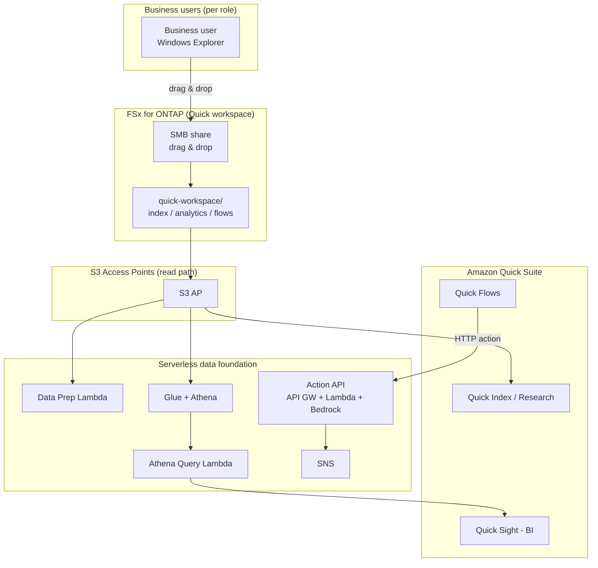

# Amazon Quick Agentic Workspace over FSx for ONTAP

🌐 **Language / 言語**: [日本語](README.md) | [English](README.en.md) | [한국어](README.ko.md) | [简体中文](README.zh-CN.md) | [繁體中文](README.zh-TW.md) | [Français](README.fr.md) | [Deutsch](README.de.md) | [Español](README.es.md)

## Overview

A pattern that uses Amazon FSx for NetApp ONTAP **via S3 Access Points** as the data foundation for **Amazon Quick Suite** (the agentic AI workspace). Data that business teams maintain through Windows file operations is used across Quick's capabilities (Index / Sight / Flows / Research).

While UC29 ([genai-kb-selfservice-curation](../genai-kb-selfservice-curation/)) focuses on self-service ingestion into a managed Bedrock Knowledge Base, this UC30 focuses on **an agentic workspace fronted by Amazon Quick Suite** that unifies unstructured search, BI, and action automation.

> **Amazon Quick Suite**: launched October 2025, the evolution of Amazon Q Business — an agentic teammate that answers questions grounded in your business data and takes action (dashboards, scheduling, deliverables). Capabilities/pricing/regions are time-sensitive; see [aws.amazon.com/quick](https://aws.amazon.com/quick/).

## Quick capabilities mapped to FSx for ONTAP S3 AP

| Quick capability | Role | Data type (on S3 AP) | This UC |
|-----------|------|---------------------|-----------|
| **Quick Index** | Cross-file search/QA | `index/<role>/` (md/pdf/docx) | S3 AP as a read-only data source |
| **Quick Research** | Deep research reports | `index/<role>/` | same |
| **Quick Sight** | BI over structured data | `analytics/<role>/` (csv) | Glue/Athena (Athena Query Lambda) |
| **Quick Flows** | Action automation | `flows/<role>/` (json) | Action API (API Gateway + Lambda + Bedrock) |

## Architecture



## Two demo scenarios

Like UC29, two stages by operational maturity (see [demo guide](docs/demo-guide.md)):

| Scenario | Summary | Trigger |
|---------|------|----------------|
| **A: Manual workspace** | Drop data via Windows; connect Quick Index, build Quick Sight datasets, run Quick Flows manually in the console | Quick UI |
| **B: Automation** | Automate data prep, BI queries, and actions with serverless (Data Prep / Athena Query / Action API), driven by Quick Flows / Scheduler | Lambda / API / Scheduler |

## Roles × services (aligned with Amazon Quick)

Roles match Amazon Quick's targets — sales, marketing, IT, operations, finance, legal (FAQ) plus developers. Data is organized by capability:

```
quick-workspace/
├── index/<role>/        … Quick Index / Research (unstructured md)
├── analytics/<role>/    … Quick Sight (structured csv via Athena)
└── flows/<role>/        … Quick Flows (action json)
```

Sample seed data ships in [`sample-data/quick-workspace/`](sample-data/). This UC shares its role layout with UC29.

## Security

- **No data movement**: files stay on FSx for ONTAP; S3 AP is read-only
- **Action API uses IAM auth (SigV4)** — not an unauthenticated public endpoint; configure credentials in the Quick connection
- **Least privilege**: Lambdas limited to the target S3 AP / Athena WorkGroup / Glue DB / Bedrock model
- **Quick data source role**: trust principal is parameterized (defaults to account root; restrict to the Quick connection)
- **Encryption**: SSE-FSX (storage), SSE-S3/KMS (Athena results), TLS (transit)

> **Note**: The S3 AP data source boundary is volume/prefix level. For per-user visibility, use a custom permission-aware RAG ([FC3](../genai-rag-enterprise-files/)).

> **Deployment prerequisite**: Amazon Quick Suite data source connections (Quick Index → S3 AP, Quick Sight datasets) are configured in the Quick console. This template provides the serverless data foundation (Action API / Athena / Data Prep / Quick IAM role).

## Governance Note

> Technical architecture guidance, not legal/compliance advice. Amazon Quick capabilities/pricing/regions change; verify against official sources. The S3 AP data source boundary is volume/prefix level; per-user visibility control is out of scope.
