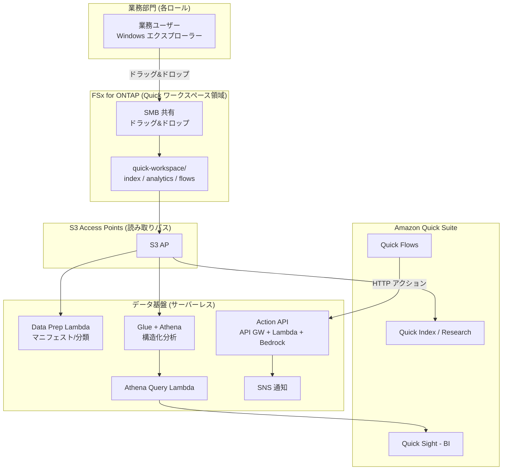

# Amazon Quick Agentic Workspace over FSx for ONTAP

🌐 **Language / 言語**: [日本語](README.md) | [English](README.en.md) | [한국어](README.ko.md) | [简体中文](README.zh-CN.md) | [繁體中文](README.zh-TW.md) | [Français](README.fr.md) | [Deutsch](README.de.md) | [Español](README.es.md)

## 概要

**Amazon Quick Suite**（エージェント型 AI ワークスペース）のデータ基盤として、Amazon FSx for
NetApp ONTAP を **S3 Access Points 経由** で活用するパターン。業務部門が Windows のファイル操作で
維持するデータを、Quick の各機能（Index / Sight / Flows / Research）から横断的に活用する。

UC29（[genai-kb-selfservice-curation](../genai-kb-selfservice-curation/)）が「マネージド Bedrock
Knowledge Base へのセルフサービス投入」に焦点を当てるのに対し、本 UC30 は **Amazon Quick Suite を
入口とした、非構造化検索・BI・アクション自動化を束ねたエージェント型ワークスペース** に焦点を当てる。

> **Amazon Quick Suite**: 2025年10月公開。Amazon Q Business の進化系で、社内データに根ざして質問へ
> 回答し、ダッシュボード生成・スケジューリング・成果物作成などの「行動」まで行うエージェント型アシスタント。
> 情報・料金・対応サービスは time-sensitive。最新は [aws.amazon.com/quick](https://aws.amazon.com/quick/) を参照。

## Quick の各機能と FSx ONTAP S3 AP の対応

| Quick 機能 | 役割 | データ種別（S3 AP 上） | 本UCの実装 |
|-----------|------|---------------------|-----------|
| **Quick Index** | 非構造化ファイルの横断検索・QA | `index/<role>/`（md/pdf/docx） | S3 AP をデータソースに接続（読み取り） |
| **Quick Research** | 深い調査レポート生成 | `index/<role>/` | 同上 |
| **Quick Sight** | 構造化データの BI・可視化 | `analytics/<role>/`（csv） | Glue/Athena 経由で分析（Athena Query Lambda） |
| **Quick Flows** | アクション自動化 | `flows/<role>/`（json） | Action API（API Gateway + Lambda + Bedrock） |

## 解決する課題

| 課題 | 本パターンによる解決 |
|------|-------------------|
| 業務データが S3 にコピーされ二重管理 | S3 AP で FSx ONTAP の正本を直接データソース化 |
| 非構造化と構造化が分断され横断活用できない | Quick Index（ファイル）と Quick Sight（Athena）を同一ワークスペースで統合 |
| 「答え」が出ても行動につながらない | Quick Flows → Action API で要約生成・タスク起票まで自動化 |
| ロールごとに必要な情報・分析が異なる | ロール×サービスでフォルダーとデータソースを整理 |
| 専門スキル依存のデータ準備 | Windows ファイル操作 + サーバーレスなデータ準備（Data Prep Lambda） |

## アーキテクチャ



## 2 つの運用シナリオ（デモ）

UC29 と同様、運用成熟度に応じた2段階を体験できる。詳細は [デモガイド](docs/demo-guide.md) を参照。

| シナリオ | 概要 | 中心となる操作 |
|---------|------|---------------|
| **A: 手動ワークスペース体験** | Windows でデータを置き、Quick コンソールで Index 接続・Quick Sight データセット作成・Quick Flows 実行を手動で体験 | 人が Quick UI で操作 |
| **B: 自動化** | データ準備（Data Prep）、BI クエリ（Athena Query）、アクション（Action API）をサーバーレスで自動化し、Quick Flows / Scheduler から駆動 | Lambda / API / Scheduler |

## ロール × サービス構成（Amazon Quick 想定ロールに準拠）

ロールは Amazon Quick が対象とする **sales / marketing / IT / operations / finance / legal**（FAQ）に、
専用ページのある **developers** を加えた7ロール。データは利用サービス（Index / Sight / Flows）で整理する。

```
quick-workspace/                       ← AI 専用ボリューム（SMB 共有）
├── index/<role>/        … Quick Index / Research（非構造化 md）
├── analytics/<role>/    … Quick Sight（構造化 csv、Athena 経由）
└── flows/<role>/        … Quick Flows（アクション json）
```

| ロール | Quick 想定（参考・time-sensitive） | サンプル分析データ |
|--------|--------------------------------|------------------|
| sales | Lead scoring / 予測 / CRM（[/quick/sales/](https://aws.amazon.com/quick/sales/)） | パイプライン（stage 別金額） |
| marketing | キャンペーン・コンテンツ | キャンペーン指標（CPL） |
| finance | 予算・経費・予測 | 予算 vs 実績 |
| information-technology | インシデント・IT FAQ・セキュリティ（[/quick/information-technology/](https://aws.amazon.com/quick/information-technology/)） | インシデント（MTTR） |
| operations | SOP・プロセス | スループット・SLA |
| legal | 契約・コンプライアンス | 契約レジスター |
| developers | 規約・オンボーディング（[/quick/developers/](https://aws.amazon.com/quick/developers/)） | DORA メトリクス |

各ロールの**サンプルデータ**は [`sample-data/quick-workspace/`](sample-data/) に同梱。
本UCはロール構成を **UC29** と揃えており、同じ AI 専用ボリュームを共有・流用できる。

## ディレクトリ構成

```
genai-quick-agentic-workspace/
├── README.md / README.en.md ほか7言語
├── template.yaml                 # SAM: Action API / Athena / Data Prep / Quick データソースロール
├── samconfig.toml.example
├── functions/
│   ├── quick_action/handler.py   # Quick Flows アクション（要約生成・タスク起票、Bedrock）
│   ├── athena_query/handler.py   # Quick Sight BI 基盤（Glue/Athena）
│   └── data_prep/handler.py      # データソース準備マニフェスト
├── sample-data/quick-workspace/  # ロール×サービスのシードデータ
│   ├── index/<role>/*.md
│   ├── analytics/<role>/*.csv
│   └── flows/<role>/*.json
├── tests/test_handlers.py
└── docs/
    ├── architecture.md
    └── demo-guide.md
```

> **デプロイ前提**: Amazon Quick Suite 本体のデータソース接続（Quick Index への S3 AP 接続、
> Quick Sight データセット作成）は **Quick コンソールで構成**する。本テンプレートは、それを支える
> サーバーレスのデータ基盤（Action API / Athena 分析 / Data Prep / Quick 用 IAM ロール）を提供する。

## セキュリティ設計

- **データ移動なし**: ファイルは FSx ONTAP 上の正本のまま、S3 AP 経由で読み取り
- **Action API は IAM 認証（SigV4）**: 認証なしの公開エンドポイントにしない。Quick 側接続で資格情報を構成
- **最小権限**: Lambda は対象 S3 AP / Athena WorkGroup / 当該 Glue DB / Bedrock モデルのみ許可
- **Quick データソースロール**: 信頼プリンシパルをパラメータ化（既定はアカウント root、Quick 接続用に限定推奨）
- **暗号化**: SSE-FSX（ストレージ）、SSE-S3/KMS（Athena 結果）、TLS（転送中）
- **監査**: CloudTrail + ONTAP 監査ログ + Athena クエリ履歴

> **注記**: S3 AP のデータソース境界はボリューム/プレフィックス単位。利用者個人ごとの可視範囲制御が
> 必要な場合はカスタム Permission-aware RAG（[FC3](../genai-rag-enterprise-files/)）を検討。

### 文書レベル ACL（Amazon Quick S3 ナレッジベース）

Amazon Quick の **S3 ナレッジベースは文書/フォルダーレベルの ACL** をサポートする。
機密文書を「閲覧してよいユーザー/グループ」に限定でき、ロール別フォルダー（`index/<role>/`）と
組み合わせることで、本UC30 でも**利用者ごとの可視範囲制御**を Quick 側で実現できる。

- Quick Suite の権限は **account / role / user の3階層**（user > role > account の優先順位）で管理
- カスタム権限プロファイルで機能単位（ダッシュボード編集等）の制御も可能
- 詳細は Quick コンソールで構成（本テンプレート対象外）

> 出典は AWS 公式ブログ/ドキュメント（time-sensitive）。最新の対応状況は [aws.amazon.com/quick](https://aws.amazon.com/quick/) を参照。

## Success Metrics

### Outcome
Windows で維持する業務データを、Amazon Quick の検索・BI・アクションへ横断的に接続し、
「質問」から「行動」までを一つのワークスペースで完結させる。

| メトリクス | 目標値（例） |
|-----------|------------|
| Quick Index 接続データソース数 | 7ロール分 |
| Quick Sight 分析対象データセット数 | ロール別 構造化データ |
| Quick Flows アクション成功率 | > 98% |
| データ準備マニフェスト更新 | スケジュール実行（例 rate(1 hour)） |
| 業務ユーザーの操作 | Windows ファイル操作 + Quick UI |

### Measurement Method
Data Prep マニフェスト、Athena クエリ履歴、Action API（API Gateway / Lambda）メトリクス、SNS 通知。

---

## AWS ドキュメントリンク

| サービス | ドキュメント |
|---------|------------|
| Amazon Quick Suite | [製品ページ](https://aws.amazon.com/quick/) / [ユーザーガイド](https://docs.aws.amazon.com/quick/latest/userguide/) |
| Amazon Quick ユーザータイプ | [user-types](https://docs.aws.amazon.com/quick/latest/userguide/user-types.html) |
| FSx for ONTAP S3 Access Points | [S3 AP ガイド](https://docs.aws.amazon.com/fsx/latest/ONTAPGuide/s3-access-points.html) |
| Amazon Athena | [ユーザーガイド](https://docs.aws.amazon.com/athena/latest/ug/what-is.html) |
| AWS Glue Data Catalog | [開発者ガイド](https://docs.aws.amazon.com/glue/latest/dg/catalog-and-crawler.html) |
| Amazon Bedrock | [ユーザーガイド](https://docs.aws.amazon.com/bedrock/latest/userguide/what-is-bedrock.html) |
| API Gateway IAM 認証 | [IAM 認可](https://docs.aws.amazon.com/apigateway/latest/developerguide/permissions.html) |

### Well-Architected Framework 対応

| 柱 | 対応 |
|----|------|
| 運用上の優秀性 | データ準備の自動マニフェスト、構造化ログ、通知 |
| セキュリティ | Action API は IAM 認証、最小権限、データ移動なし、暗号化 |
| 信頼性 | Athena ステート監視、サーバーレス冗長性 |
| パフォーマンス効率 | Athena による構造化分析、Index のマネージド検索 |
| コスト最適化 | サーバーレス従量課金、必要時のみクエリ/アクション |
| 持続可能性 | オンデマンド実行、マネージドサービス活用 |

---

## コスト見積もり（月額概算）

> **注記**: ap-northeast-1 の概算。実費は使用量で変動。[AWS Pricing Calculator](https://calculator.aws/) と
> [Amazon Quick 料金](https://aws.amazon.com/quick/) を参照（time-sensitive）。

| サービス | 概算 |
|---------|------|
| Amazon Quick Suite | ユーザー/プラン課金（別途、Quick 料金参照） |
| Lambda（3関数） | ~$1-5 |
| API Gateway | ~$1（リクエスト従量） |
| Athena | $5/TB scanned（小規模データなら ~$0.5-2） |
| Glue Data Catalog | 無料枠内が多い |
| S3（Athena 結果） | ~$0.5 |
| Bedrock（要約生成） | 呼び出し従量 ~$1-10 |
| SNS / CloudWatch Logs | ~$1 |
| FSx ONTAP / S3 AP | 既存環境を共有（S3 AP 追加料金なし） |

> **Governance Caveat**: コストは概算であり保証値ではありません。Amazon Quick 本体の料金は別途。

---

## ローカルテスト

```bash
python3 -m pytest tests/ -v
sam build
sam local invoke DataPrepFunction --event events/data-prep-event.json
```

---

## 出力サンプル

### Quick Flows アクション（タスク起票）
```json
{
  "status": "completed",
  "action": "create_action_item",
  "item": {"id": "AI-1760000000", "title": "Acme Corp 向けPoC日程を調整する", "assignee": "sales-a", "status": "open"}
}
```

### Athena Query（Quick Sight BI 基盤）
```json
{
  "status": "completed",
  "columns": ["stage", "deals", "total_jpy"],
  "rows": [["Negotiation", "2", "3360000"], ["ClosedWon", "1", "1920000"]],
  "row_count": 2
}
```

### Data Prep マニフェスト
```json
{
  "status": "completed",
  "total_objects": 21,
  "by_service": {"index": 7, "analytics": 7, "flows": 7, "other": 0},
  "by_role": {"sales": 3, "marketing": 3, "finance": 3, "information-technology": 3, "operations": 3, "legal": 3, "developers": 3}
}
```

> **注記**: サンプル出力。数値・料金は sizing reference / time-sensitive であり service limit ではありません。

---

## Performance Considerations

- FSx ONTAP のスループットは NFS/SMB/S3AP で共有。SMB 書き込みと Quick の読み取りが同一キャパシティを共有
- S3 AP 経由のレイテンシは数十ミリ秒のオーバーヘッド
- Athena は scanned データ量に課金。大規模時はパーティション/圧縮（Parquet）を検討
- Action API は IAM 認証必須。Quick 接続のスロットリング設計を行う

---

## 関連 UC・リンク

| 関連 | ポイント |
|------|---------|
| [PoC 前提条件チェックリスト](docs/poc-checklist.md) | Quick 有効化・Glue/LF・推論プロファイル等 |
| [Amazon Quick コンソール設定手順](docs/quick-console-setup.md) | Index/Sight/Flows 接続（スクショ取得指針つき） |
| [Lake Formation TBAC ノート](docs/lake-formation-tbac.md) | ロール別データ可視性（LF-TBAC + Quick RLS） |
| [Glue テーブル作成スクリプト](scripts/create_glue_tables.sh) | Quick Sight/Athena 用 DDL（Parquet 化推奨） |
| [クリーンアップ runbook](../docs/uc29-uc30-cleanup-runbook.md) | 手動成果物を含む撤去手順（2UC 共通） |
| [UC29 genai-kb-selfservice-curation](../genai-kb-selfservice-curation/) | マネージド Bedrock KB へのセルフサービス投入（同じロール構成） |
| [FC3 genai-rag-enterprise-files](../genai-rag-enterprise-files/) | 厳密な権限フィルタが必要なカスタム RAG |
| [業界・ワークロード マッピング](../docs/industry-workload-mapping.md) | UC 選択ガイド |

## 運用堅牢化（実装済み）

- **Quick Flows 高リスク操作の human-in-the-loop**: `request_approval` は即時実行せず承認待ち（`pending_approval`）＋SNS 通知
- **Action API は IAM 認証（SigV4）**: 未認証公開エンドポイントにしない
- **BI 最適化**: 大規模時は analytics を Parquet + パーティション化（Athena scanned 削減）

---

## Governance Note

> 本パターンは技術アーキテクチャガイダンスを提供します。法的・コンプライアンス・規制上の助言ではありません。
> Amazon Quick の機能・料金・対応リージョンは変更されるため、最新は公式情報を確認してください。
> S3 AP のデータソース境界はボリューム/プレフィックス単位であり、利用者個人ごとの可視範囲制御は本UCの対象外です。
