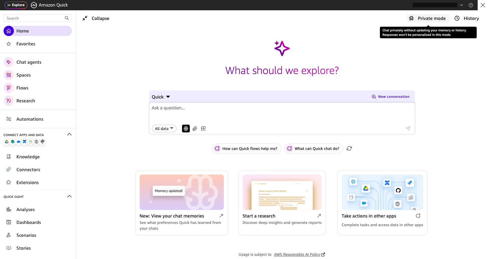
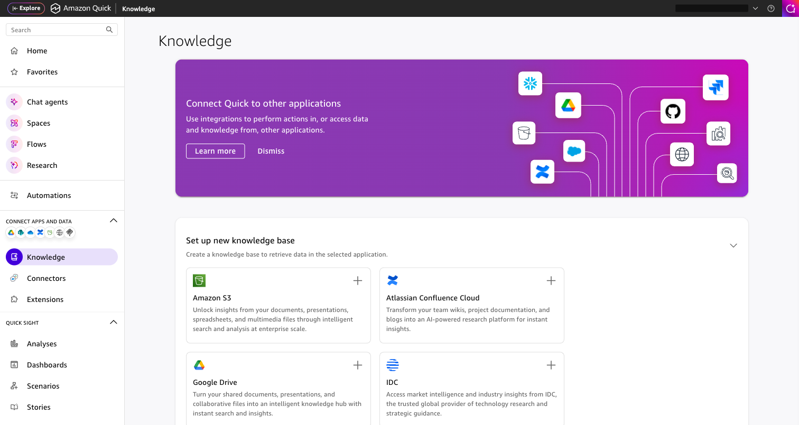
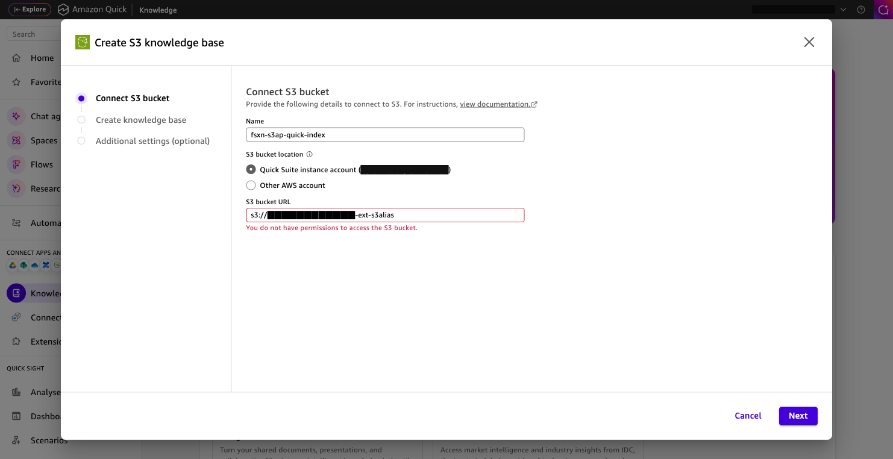
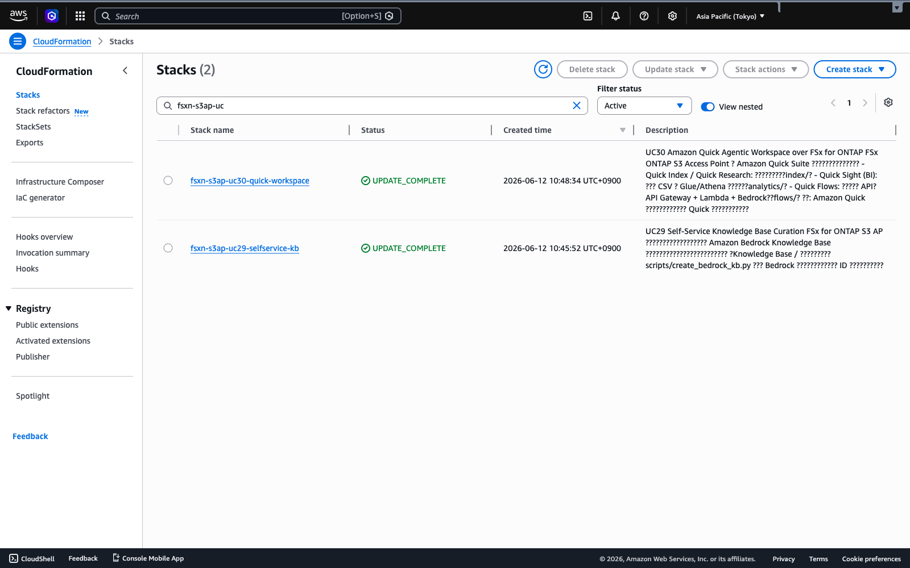
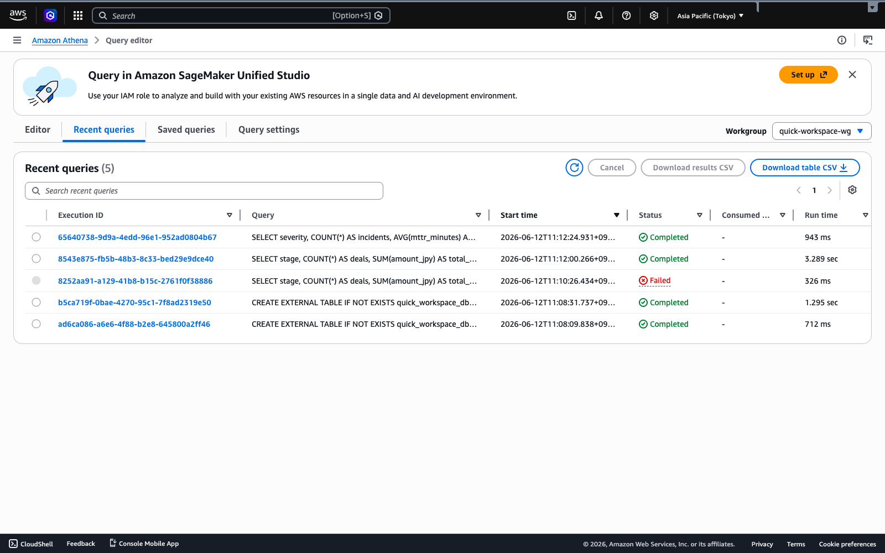

# UC30: Amazon Quick Agentic Workspace — デモガイド

## Executive Summary

業務部門が Windows のファイル操作で維持するデータを、**Amazon Quick Suite** の
Index（検索）・Sight（BI）・Flows（アクション）から横断的に活用できることを実演する。
UC29 と同様、**手動体験（A）→ 自動化（B）** の2シナリオで構成する。

**核心メッセージ**: Windows に置いたデータが、Quick で「検索でき・分析でき・行動につながる」。

**想定時間**: 10〜12 分

---

## Target Audience

| 項目 | 詳細 |
|------|------|
| 役職 | 業務部門リーダー / DX 推進 / データ活用担当 / IT |
| 課題 | 非構造化と構造化の分断、答えが行動につながらない、データ準備の属人化 |
| 期待成果 | 1つのワークスペースで検索・BI・アクションを完結 |

---

## 事前準備（両シナリオ共通）

> 📸 Amazon Quick Suite ホーム画面（Index / Sight / Flows）:
>
> 
>
> 📸 Quick Knowledge 統合パネル（S3 ソース接続画面）:
>
> 

| 項目 | 内容 |
|------|------|
| Quick ワークスペース領域 | FSx for ONTAP に `quick-workspace/` を作成し SMB 公開 |
| フォルダー構成 | `index/<role>/` `analytics/<role>/` `flows/<role>/`（7ロール） |
| シードデータ | [`sample-data/quick-workspace/`](../sample-data/) をコピー（ロール×サービス） |
| S3 Access Point | quick-workspace ボリュームに作成（読み取りパス） |
| Amazon Quick Suite | アカウントで有効化し、Quick コンソールでデータソース接続 |
| SAM スタック | 本UCの `template.yaml` をデプロイ（Action API / Athena / Data Prep） |

> ロール構成は Amazon Quick に準拠（sales / marketing / IT / operations / finance / legal / developers）。UC29 とデータを共有できる。

---

## シナリオ A: 手動ワークスペース体験

**ねらい**: Windows でデータを置き、Quick の各機能を「人が UI で」体験する。

### A-1. データ投入（Windows）
`quick-workspace/index/sales/`、`analytics/finance/`、`flows/marketing/` などへドラッグ&ドロップ。

### A-2. Quick Index（非構造化検索）
Quick コンソールで S3 AP を Quick Index のデータソースに接続 → 同期 → 自然言語で質問:
- 「製品Xの勝ち筋は？」→ `index/sales/account-strategy-notes.md` を引用

> 📸 Quick Knowledge データソース接続画面:
>
> 

### A-3. Quick Sight（BI）
`analytics/` の CSV を Glue テーブル化（DDL は下記）→ Quick Sight データセット作成 → 可視化:
- 「ステージ別パイプライン金額」「重大度別の平均 MTTR」

### A-4. Quick Flows（アクション）
Quick Flows から Action API を呼び、要約生成やタスク起票を実行:
- `flows/sales/create-followup-task.json` を入力 → アクションアイテム生成

---

## シナリオ B: 自動化（サーバーレス）

**ねらい**: A の手作業を、サーバーレス基盤で自動化する。

### B-1. データ準備の自動化（Data Prep Lambda）

> 📸 UC30 CloudFormation スタック（全リソースデプロイ済み）:
>
> 

EventBridge Scheduler が Data Prep Lambda を定期実行し、`index/analytics/flows × role` の
マニフェスト（件数）を生成。Quick データソースの準備状況を可視化。

```bash
aws lambda invoke --function-name <DataPrepFunctionName> \
  --payload '{"prefix": "quick-workspace/"}' \
  --cli-binary-format raw-in-base64-out out.json && cat out.json
```

### B-2. BI クエリの自動化（Athena Query Lambda）
構造化データを Athena で問い合わせ、Quick Sight / エージェント回答の裏付けに使う。

> 📸 Athena クエリ実行履歴:
>
> 

```bash
aws lambda invoke --function-name <AthenaQueryFunctionName> \
  --payload '{"query_name": "sales_pipeline_total"}' \
  --cli-binary-format raw-in-base64-out out.json && cat out.json
```

### B-3. アクションの自動化（Action API）
Quick Flows が Action API（IAM 認証）を呼び、要約生成・タスク起票を実行。

```bash
# IAM 認証（awscurl 等で SigV4 署名）。例は概念用。
awscurl --service execute-api -X POST \
  "https://<api-id>.execute-api.<region>.amazonaws.com/prod/action" \
  -d '{"action":"generate_brief","params":{"title":"案件サマリ","context":"..."}}'
```

---

## Athena テーブル定義（DDL 例）

> S3 AP エイリアスを `s3://<alias>/...` として LOCATION に指定。Quick Sight はこのテーブルを参照。

```sql
CREATE EXTERNAL TABLE IF NOT EXISTS quick_workspace_db.sales_pipeline (
  deal_id string, stage string, amount_jpy bigint, owner string
)
ROW FORMAT DELIMITED FIELDS TERMINATED BY ','
LOCATION 's3://<S3AP_ALIAS>/quick-workspace/analytics/sales/'
TBLPROPERTIES ('skip.header.line.count'='1');

CREATE EXTERNAL TABLE IF NOT EXISTS quick_workspace_db.it_incidents (
  incident_id string, severity string, mttr_minutes int, opened_at string
)
ROW FORMAT DELIMITED FIELDS TERMINATED BY ','
LOCATION 's3://<S3AP_ALIAS>/quick-workspace/analytics/information-technology/'
TBLPROPERTIES ('skip.header.line.count'='1');
```

定義済みクエリ: `sales_pipeline_total`（ステージ別合計）、`it_incident_summary`（重大度別 平均 MTTR）。

---

## ロール別デモ（サービス別の見せどころ）

| ロール | Quick Index（質問例） | Quick Sight（分析） | Quick Flows（アクション） |
|--------|---------------------|--------------------|------------------------|
| sales | 製品Xの勝ち筋は？ | ステージ別パイプライン金額 | フォローアップタスク起票 |
| marketing | メッセージ規約は？ | キャンペーン別 CPL | キャンペーンブリーフ生成 |
| finance | フォーキャスト前提は？ | 予算 vs 実績 | 予算超過のレビュー起票 |
| information-technology | Sev1 初動目標は？ | 重大度別 平均 MTTR | 恒久対応タスク起票 |
| operations | 標準納期は？ | 日次スループット/SLA | 遅延エスカレーション |
| legal | NDA 存続期間は？ | 契約レジスター（期限） | 契約レビュー依頼 |
| developers | utcnow は使える？ | 週次 DORA メトリクス | 障害調査タスク起票 |

---

## Storyboard

| 時間 | セクション | 内容 |
|------|-----------|------|
| 0:00–1:30 | Problem | データの分断、答えが行動につながらない課題 |
| 1:30–3:00 | Index | Windows 投入 → Quick Index で横断検索 |
| 3:00–5:00 | Sight | analytics CSV → Athena/Quick Sight で BI |
| 5:00–7:00 | Flows | Quick Flows → Action API で要約/タスク化 |
| 7:00–9:00 | 自動化 | Data Prep / Athena Query / Action API のサーバーレス自動化 |
| 9:00–10:00 | まとめ | 1ワークスペースで検索・BI・アクションが完結 |

---

## Governance Note

> 本パターンは技術アーキテクチャガイダンスを提供します。法的・コンプライアンス・規制上の助言ではありません。
> Amazon Quick の機能・料金・対応リージョンは変更されます。最新は公式情報を確認してください。
> S3 AP のデータソース境界はボリューム/プレフィックス単位であり、利用者個人ごとの可視範囲制御は対象外です。
