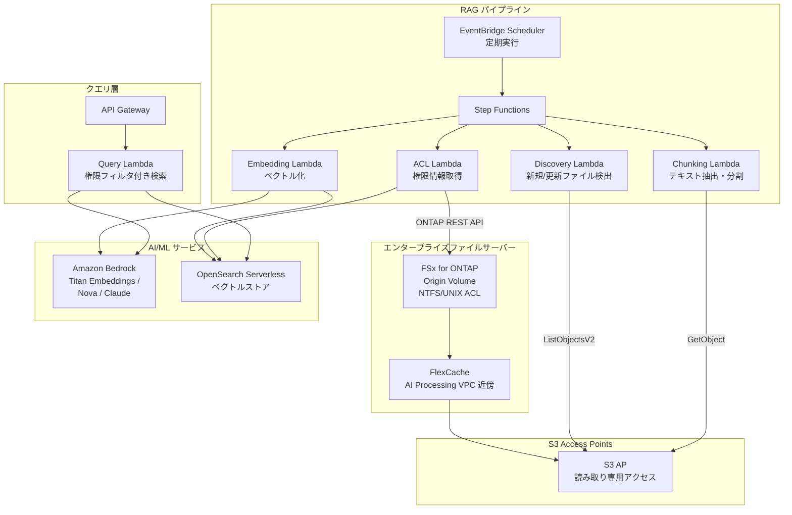

# GenAI RAG over Enterprise Files

🌐 **Language / 言語**: [日本語](README.md) | [English](README.en.md)

## 概要

エンタープライズファイルサーバー（FSx for NetApp ONTAP）上の機密ドキュメントを **S3 にコピーせず**、S3 Access Points 経由で Amazon Bedrock / RAG パイプラインに安全に提供するパターン。ファイル権限（ACL/NTFS）を維持したまま、権限ベースの RAG（Permission-aware RAG）を実現する。

## 解決する課題

| 課題 | 本パターンによる解決 |
|------|-------------------|
| 機密ファイルの S3 コピーによるデータ拡散 | S3 AP 経由で直接読み取り、コピー不要 |
| ファイル権限の喪失 | ONTAP REST API で ACL を取得し、RAG 応答時にフィルタ |
| データ鮮度の問題 | FlexCache + S3 AP で最新データを提供 |
| 大規模ファイルサーバーの全量処理 | EventBridge Scheduler + 差分検出で効率化 |
| AI 処理環境とデータの距離 | FlexCache で AI 処理 VPC 近傍にデータ配置 |

## アーキテクチャ



## Permission-aware RAG の考え方

1. **インデックス時**: 各ドキュメントの ACL/権限情報を ONTAP REST API で取得し、ベクトルストアにメタデータとして保存
2. **クエリ時**: ユーザーの AD SID / グループ情報に基づいて、アクセス可能なドキュメントのみを検索対象にフィルタ
3. **応答時**: フィルタされたドキュメントのみを Bedrock に渡して回答生成

```
ユーザークエリ → 権限フィルタ → ベクトル検索 → Bedrock 回答生成
                    ↓
            ユーザーの AD SID で
            アクセス可能な文書のみ検索
```

## FlexCache の役割

- AI 処理環境（Lambda VPC）の近傍にデータを配置
- Embedding 処理時の大量読み取りを高速化
- Origin への WAN 転送を削減
- S3 AP 経由でサーバーレス処理に提供

## 既存ユースケースとの関連

| 関連 UC | 関連ポイント |
|---------|------------|
| [legal-compliance/](../legal-compliance/) | ACL 取得パターンの共有 |
| [financial-idp/](../financial-idp/) | 文書処理パイプラインの共有 |
| [healthcare-dicom/](../healthcare-dicom/) | 権限ベースアクセス制御 |
| [FlexCache AnyCast/DR](../flexcache-anycast-dr/) | FlexCache 配置パターン |

## ディレクトリ構成

```
genai-rag-enterprise-files/
├── README.md
├── template.yaml
├── functions/
│   ├── discovery/handler.py
│   ├── chunking/handler.py
│   ├── embedding/handler.py
│   ├── acl_extraction/handler.py
│   └── query/handler.py
├── tests/
│   └── test_handlers.py
├── events/
│   └── sample-input.json
└── docs/
    ├── architecture.md
    ├── demo-guide.md
    ├── poc-checklist.md
    └── use-case-mapping.md
```

## セキュリティ設計

- **データ移動なし**: ファイルは FSx ONTAP 上に留まり、S3 AP 経由で読み取りのみ
- **権限維持**: ONTAP REST API で ACL を取得し、RAG 応答時にフィルタ
- **暗号化**: SSE-FSX（ストレージ）、TLS（転送中）、KMS（出力）
- **最小権限**: Lambda は必要な S3 AP 操作のみ許可
- **監査**: CloudTrail + ONTAP 監査ログ

## 対象業界

- 金融（契約書、規制文書）
- 法務（判例、契約書、コンプライアンス文書）
- 医療（研究論文、臨床データ）
- 製造（設計文書、品質管理文書）
- 政府（公文書、政策文書）

## 関連リンク

- [Dynamic FlexCache Render Workflow](../dynamic-flexcache-render-workflow/README.md)
- [FlexCache AnyCast / DR](../flexcache-anycast-dr/README.md)
- [業界・ワークロード マッピング](../docs/industry-workload-mapping.md)


## Success Metrics

### Outcome
権限ベースの RAG 前処理により、データコピーなしでエンタープライズファイルを AI/ML に接続する。

### Metrics
| メトリクス | 目標値（例） |
|-----------|------------|
| チャンキング処理ファイル数 / 実行 | > 200 files |
| ACL 抽出成功率 | > 95% |
| Embedding 生成時間 | < 5 分 / 100 files |
| Permission-aware フィルタリング精度 | > 99% |
| Human Review 対象率 | < 10%（低信頼度チャンク） |

### Measurement Method
Step Functions 実行履歴、Bedrock Embedding レスポンス、ACL 抽出ログ、CloudWatch Metrics。


---

## 出力サンプル (Output Sample)

Permission-aware RAG パイプラインの出力例:

```json
{
  "embedding_pipeline": {
    "files_processed": 50,
    "chunks_generated": 320,
    "embeddings_stored": 320,
    "vector_db": "opensearch_serverless"
  },
  "query_result": {
    "query": "2026年度の予算計画について教えてください",
    "user_id": "user-001",
    "permitted_files": 35,
    "filtered_files": 15,
    "relevant_chunks": 5,
    "answer": "2026年度の予算計画では、IT投資として前年比15%増の...",
    "sources": [
      {"file": "budget/2026-plan.pdf", "chunk_id": 12, "score": 0.94},
      {"file": "budget/2026-summary.docx", "chunk_id": 3, "score": 0.89}
    ],
    "confidence": 0.91
  }
}
```

> **注記**: 上記はサンプル出力であり、実際の値は環境・入力データにより異なります。ベンチマーク数値は sizing reference であり、service limit ではありません。

---

## Performance Considerations

- FSx for ONTAP のスループットキャパシティは NFS/SMB/S3AP で共有されます
- S3 Access Point 経由のレイテンシは数十ミリ秒のオーバーヘッドが発生します
- 大量ファイル処理時は Step Functions Map state の MaxConcurrency で並列度を制御してください
- Lambda メモリサイズの増加はネットワーク帯域幅の向上にも寄与します

> **注記**: 本パターンのパフォーマンス数値は sizing reference であり、service limit ではありません。実環境での性能は FSx ONTAP スループットキャパシティ、ネットワーク構成、同時実行ワークロードにより異なります。

---

## Governance Note

> 本パターンは技術アーキテクチャガイダンスを提供します。法的・コンプライアンス・規制上の助言ではありません。組織は適格な専門家に相談してください。
