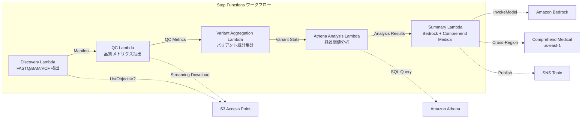

# UC7: Genomik / Bioinformatik — Qualitätskontrolle und Variantenaufrufaggregation

🌐 **Language / 言語**: [日本語](README.md) | [English](README.en.md) | [한국어](README.ko.md) | [简体中文](README.zh-CN.md) | [繁體中文](README.zh-TW.md) | [Français](README.fr.md) | Deutsch | [Español](README.es.md)

## Übersicht
FSx for NetApp ONTAP nutzt S3 Access Points, um serverlose Workflows zur Automatisierung der Qualitätskontrolle von FASTQ/BAM/VCF-Genomdaten, der Aggregation von Variantenaufrufsstatistiken und der Erstellung von Forschungszusammenfassungen zu implementieren.
### Fälle, in denen dieses Muster geeignet ist
- Die Ausgabedaten des nächsten Generation Sequenzers (FASTQ/BAM/VCF) werden auf FSx ONTAP gespeichert.
- Die Qualitätsmetriken der Sequenzdaten (Anzahl der Reads, Qualitätsscores, GC-Gehalt) sollen regelmäßig überwacht werden.
- Die statistische Zusammenfassung der Variantenaufrufergebnisse (SNP/InDel Verhältnis, Ti/Tv Verhältnis) soll automatisiert werden.
- Es ist eine automatische Extraktion biomedizinischer Entitäten (Gennamen, Krankheiten, Medikamente) mittels Comprehend Medical erforderlich.
- Forschungszusammenfassungsberichte sollen automatisch generiert werden.
### Fälle, für die dieses Muster nicht geeignet ist
- Ausführung einer Echtzeit-Variant-Calling-Pipeline (BWA/GATK etc.) erforderlich
- Großflächige Genom-Alignment-Verarbeitung (EC2/HPC-Cluster geeignet)
- Unter GxP-Vorschriften vollständig validierte Pipeline erforderlich
- Umgebung, in der keine Netzwerkerreichbarkeit für die ONTAP REST API gewährleistet werden kann
### Hauptfunktionen
- Automatische Erkennung von FASTQ/BAM/VCF-Dateien über S3 AP
- Extraktion von FASTQ-Qualitätsmetriken durch Streaming-Download
- Sammeln von VCF-Variantenstatistiken (total_variants, snp_count, indel_count, ti_tv_ratio)
- Identifizierung von Proben unter Qualitätsschwellenwerten mittels Athena SQL
- Extraktion biomedizinischer Entitäten mit Comprehend Medical (Cross-Region)
- Generierung von Forschungszusammenfassungen mit Amazon Bedrock
## Architektur



### Workflow-Schritte
1. **Discovery**: .fastq-,.fastq.gz-,.bam-,.vcf- und.vcf.gz-Dateien von S3 AP erkennen
2. **QC**: FASTQ-Header im Streaming-Download erhalten und Qualitätsmetriken extrahieren
3. **Variant Aggregation**: Aggregieren der Variantenstatistiken der VCF-Dateien
4. **Athena Analysis**: SQL-Abfrage zur Identifizierung von Proben unter Qualitätsschwelle
5. **Summary**: Generierung der Forschungszusammenfassung mit Bedrock, Extraktion von Entitäten mit Comprehend Medical
## Voraussetzungen
- AWS-Konto und geeignete IAM-Berechtigungen
- FSx for NetApp ONTAP-Dateisystem (ONTAP 9.17.1P4D3 oder höher)
- S3 Access Point aktivierte Volumes (zur Speicherung von Genomdaten)
- VPC, private Subnetz
- Amazon Bedrock-Modellzugriff aktiviert (Claude / Nova)
- **Cross-Region**: Comprehend Medical wird in ap-northeast-1 nicht unterstützt, daher ist ein Cross-Region-Aufruf nach us-east-1 erforderlich
## Bereitstellungsschritte

### 1. Überprüfung der cros-Region-Parameter
Comprehend Medical wird in der Tokyo-Region nicht unterstützt, daher wird der Cross-Region-Aufruf mit dem Parameter `CrossRegionServices` festgelegt.
### 2. CloudFormation-Bereitstellung

```bash
aws cloudformation deploy \
  --template-file genomics-pipeline/template.yaml \
  --stack-name fsxn-genomics-pipeline \
  --parameter-overrides \
    S3AccessPointAlias=<your-volume-ext-s3alias> \
    S3AccessPointName=<your-s3ap-name> \
    VpcId=<your-vpc-id> \
    PrivateSubnetIds=<subnet-1>,<subnet-2> \
    ScheduleExpression="rate(1 hour)" \
    NotificationEmail=<your-email@example.com> \
    CrossRegionTarget=us-east-1 \
    EnableVpcEndpoints=false \
    EnableCloudWatchAlarms=false \
  --capabilities CAPABILITY_IAM CAPABILITY_AUTO_EXPAND \
  --region ap-northeast-1
```

### 3. Überprüfung der Konfiguration zwischen Regionen
Nach dem Bereitstellen stellen Sie sicher, dass die Lambda-Umgebungsvariable `CROSS_REGION_TARGET` auf `us-east-1` gesetzt ist.
## Liste der Konfigurationsparameter

| パラメータ | 説明 | デフォルト | 必須 |
|-----------|------|----------|------|
| `S3AccessPointAlias` | FSx ONTAP S3 AP Alias（入力用） | — | ✅ |
| `S3AccessPointName` | S3 AP 名（ARN ベースの IAM 権限付与用。省略時は Alias ベースのみ） | `""` | ⚠️ 推奨 |
| `ScheduleExpression` | EventBridge Scheduler のスケジュール式 | `rate(1 hour)` | |
| `VpcId` | VPC ID | — | ✅ |
| `PrivateSubnetIds` | プライベートサブネット ID リスト | — | ✅ |
| `NotificationEmail` | SNS 通知先メールアドレス | — | ✅ |
| `CrossRegionTarget` | Comprehend Medical のターゲットリージョン | `us-east-1` | |
| `MapConcurrency` | Map ステートの並列実行数 | `10` | |
| `LambdaMemorySize` | Lambda メモリサイズ (MB) | `1024` | |
| `LambdaTimeout` | Lambda タイムアウト (秒) | `300` | |
| `EnableVpcEndpoints` | Interface VPC Endpoints の有効化 | `false` | |
| `EnableCloudWatchAlarms` | CloudWatch Alarms の有効化 | `false` | |

## Bereinigung

```bash
# S3 バケットを空にする
aws s3 rm s3://fsxn-genomics-pipeline-output-${AWS_ACCOUNT_ID} --recursive

# CloudFormation スタックの削除
aws cloudformation delete-stack \
  --stack-name fsxn-genomics-pipeline \
  --region ap-northeast-1

aws cloudformation wait stack-delete-complete \
  --stack-name fsxn-genomics-pipeline \
  --region ap-northeast-1
```

## Unterstützte Regionen
UC7 verwendet die folgenden Dienste:
| サービス | リージョン制約 |
|---------|-------------|
| Amazon Athena | ほぼ全リージョンで利用可能 |
| Amazon Bedrock | 対応リージョンを確認（[Bedrock 対応リージョン](https://docs.aws.amazon.com/general/latest/gr/bedrock.html)） |
| Amazon Comprehend Medical | 限定リージョンのみ対応。`COMPREHEND_MEDICAL_REGION` パラメータで対応リージョン（us-east-1 等）を指定 |
| AWS X-Ray | ほぼ全リージョンで利用可能 |
| CloudWatch EMF | ほぼ全リージョンで利用可能 |
> Rufen Sie die Comprehend Medical API über den Cross-Region Client auf. Überprüfen Sie die Datenresidenzanforderungen. Weitere Informationen finden Sie in der [Regionskompatibilitätsmatrix](../docs/region-compatibility.md).
## Referenzlinks
- [FSx ONTAP S3 Access Points 概要](https://docs.aws.amazon.com/fsx/latest/ONTAPGuide/accessing-data-via-s3-access-points.html)
- [Amazon Comprehend Medical](https://docs.aws.amazon.com/comprehend-medical/latest/dev/what-is.html)
- [FASTQ-Formatspezifikation](https://en.wikipedia.org/wiki/FASTQ_format)
- [VCF-Formatspezifikation](https://samtools.github.io/hts-specs/VCFv4.3.pdf)