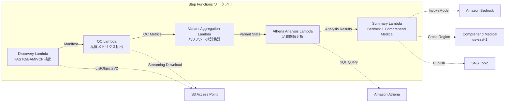

# UC7: Genomics / Bioinformatics — Quality Check and Variant Calling Summary

🌐 **Language / 言語**: [日本語](README.md) | English | [한국어](README.ko.md) | [简体中文](README.zh-CN.md) | [繁體中文](README.zh-TW.md) | [Français](README.fr.md) | [Deutsch](README.de.md) | [Español](README.es.md)

📚 **Documentation**: [Architecture Diagram](docs/architecture.en.md) | [Demo Guide](docs/demo-guide.en.md)

## Overview
It is a serverless workflow that utilizes S3 Access Points of FSx for NetApp ONTAP to automate quality checks of FASTQ/BAM/VCF genome data, variant calling statistics aggregation, and research summary generation.
### Cases where this pattern is suitable
- The output data (FASTQ/BAM/VCF) from the next-generation sequencer is being stored on FSx ONTAP
- We want to regularly monitor the quality metrics (read count, quality score, GC content) of the sequencing data
- We want to automate the statistical aggregation of variant calling results (SNP/InDel ratio, Ti/Tv ratio)
- Automated extraction of biomedical entities (gene names, diseases, drugs) using Comprehend Medical is required
- We want to automatically generate research summary reports
### Cases where this pattern is not suitable
- Real-time variant calling pipeline execution is required (BWA/GATK, etc.)
- Large-scale genome alignment processing (EC2/HPC clusters are suitable)
- Fully validated pipelines are required under GxP regulations
- Environments that cannot ensure network reachability to the ONTAP REST API
### Main Features
- Automatic detection of FASTQ/BAM/VCF files via S3 AP
- Extraction of FASTQ quality metrics through streaming download
- Aggregation of VCF variant statistics (total_variants, snp_count, indel_count, ti_tv_ratio)
- Identification of samples below quality thresholds using Athena SQL
- Extraction of biomedical entities using Comprehend Medical (cross-region)
- Research summary generation with Amazon Bedrock
## Architecture



### Workflow Step
1. **Discovery**: Detect.fastq,.fastq.gz,.bam,.vcf, .vcf.gz files from S3 AP
2. **QC**: Obtain FASTQ headers with streaming download and extract quality metrics
3. **Variant Aggregation**: Aggregate variant statistics from VCF files
4. **Athena Analysis**: Identify samples below quality threshold with SQL
5. **Summary**: Generate study summaries with Bedrock, extract entities with Comprehend Medical
## Prerequisites
- AWS account and appropriate IAM permissions
- FSx for NetApp ONTAP file system (ONTAP 9.17.1P4D3 or later)
- S3 Access Point enabled volume (to store genomic data)
- VPC, private subnets
- Amazon Bedrock model access enabled (Claude / Nova)
- **Cross-region**: Comprehend Medical is not supported in ap-northeast-1, so a cross-region call to us-east-1 is necessary
## Deployment Steps

### 1. Verifying Cross-Region Parameters
Comprehend Medical is not available in the Tokyo region, so configure cross-region calls with the `CrossRegionServices` parameter.
### 2. CloudFormation Deployment

```bash
aws cloudformation deploy \
  --template-file genomics-pipeline/template.yaml \
  --stack-name fsxn-genomics-pipeline \
  --parameter-overrides \
    S3AccessPointAlias=<your-volume-ext-s3alias> \
    S3AccessPointName=<your-s3ap-name> \
    VpcId=<your-vpc-id> \
    PrivateSubnetIds=<subnet-1>,<subnet-2> \
    ScheduleExpression="rate(1 hour)" \
    NotificationEmail=<your-email@example.com> \
    CrossRegionTarget=us-east-1 \
    EnableVpcEndpoints=false \
    EnableCloudWatchAlarms=false \
  --capabilities CAPABILITY_IAM CAPABILITY_AUTO_EXPAND \
  --region ap-northeast-1
```

### 3. Verifying Cross-Region Configuration
After deployment, ensure that the Lambda environment variable `CROSS_REGION_TARGET` is set to `us-east-1`.
## List of Configuration Parameters

| パラメータ | 説明 | デフォルト | 必須 |
|-----------|------|----------|------|
| `S3AccessPointAlias` | FSx ONTAP S3 AP Alias（入力用） | — | ✅ |
| `S3AccessPointName` | S3 AP 名（ARN ベースの IAM 権限付与用。省略時は Alias ベースのみ） | `""` | ⚠️ 推奨 |
| `ScheduleExpression` | EventBridge Scheduler のスケジュール式 | `rate(1 hour)` | |
| `VpcId` | VPC ID | — | ✅ |
| `PrivateSubnetIds` | プライベートサブネット ID リスト | — | ✅ |
| `NotificationEmail` | SNS 通知先メールアドレス | — | ✅ |
| `CrossRegionTarget` | Comprehend Medical のターゲットリージョン | `us-east-1` | |
| `MapConcurrency` | Map ステートの並列実行数 | `10` | |
| `LambdaMemorySize` | Lambda メモリサイズ (MB) | `1024` | |
| `LambdaTimeout` | Lambda タイムアウト (秒) | `300` | |
| `EnableVpcEndpoints` | Interface VPC Endpoints の有効化 | `false` | |
| `EnableCloudWatchAlarms` | CloudWatch Alarms の有効化 | `false` | |

## Cleanup

```bash
# S3 バケットを空にする
aws s3 rm s3://fsxn-genomics-pipeline-output-${AWS_ACCOUNT_ID} --recursive

# CloudFormation スタックの削除
aws cloudformation delete-stack \
  --stack-name fsxn-genomics-pipeline \
  --region ap-northeast-1

aws cloudformation wait stack-delete-complete \
  --stack-name fsxn-genomics-pipeline \
  --region ap-northeast-1
```

## Supported Regions
UC7 uses the following services:
| サービス | リージョン制約 |
|---------|-------------|
| Amazon Athena | ほぼ全リージョンで利用可能 |
| Amazon Bedrock | 対応リージョンを確認（[Bedrock 対応リージョン](https://docs.aws.amazon.com/general/latest/gr/bedrock.html)） |
| Amazon Comprehend Medical | 限定リージョンのみ対応。`COMPREHEND_MEDICAL_REGION` パラメータで対応リージョン（us-east-1 等）を指定 |
| AWS X-Ray | ほぼ全リージョンで利用可能 |
| CloudWatch EMF | ほぼ全リージョンで利用可能 |
> Call the Comprehend Medical API via the Cross-Region Client. Please verify the data residency requirements. For more details, refer to the [Region Compatibility Matrix](../docs/region-compatibility.md).
## References
- [FSx for NetApp ONTAP S3 Access Points Overview](https://docs.aws.amazon.com/fsx/latest/ONTAPGuide/accessing-data-via-s3-access-points.html)
- [Amazon Comprehend Medical](https://docs.aws.amazon.com/comprehend-medical/latest/dev/what-is.html)
- [FASTQ Format Specification](https://en.wikipedia.org/wiki/FASTQ_format)
- [VCF Format Specification](https://samtools.github.io/hts-specs/VCFv4.3.pdf)