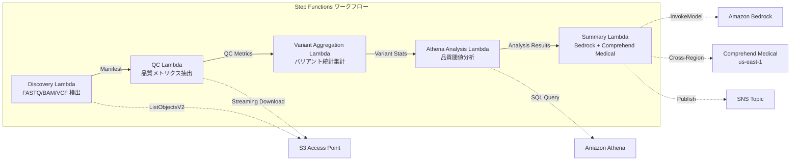

# UC7: Genómica / Bioinformática — Control de calidad y agregación de llamadas de variantes

🌐 **Language / 言語**: [日本語](README.md) | [English](README.en.md) | [한국어](README.ko.md) | [简体中文](README.zh-CN.md) | [繁體中文](README.zh-TW.md) | [Français](README.fr.md) | [Deutsch](README.de.md) | Español

## Resumen
Se trata de un flujo de trabajo sin servidor que aprovecha los Puntos de Acceso S3 de FSx for NetApp ONTAP para automatizar la verificación de calidad de datos genómicos FASTQ/BAM/VCF, la agregación de estadísticas de llamada de variantes y la generación de resúmenes de investigación.
### Casos en los que este patrón es apropiado
- Los datos de salida del secuenciador de próxima generación (FASTQ/BAM/VCF) están almacenados en FSx ONTAP
- Desea monitorear periódicamente las métricas de calidad de los datos de secuenciación (número de lecturas, puntuación de calidad, contenido de GC)
- Desea automatizar la agregación estadística de los resultados de llamada de variantes (proporción SNP/InDel, relación Ti/Tv)
- Se requiere la extracción automática de entidades biomédicas (nombres de genes, enfermedades, medicamentos) mediante Comprehend Medical
- Desea generar automáticamente informes de resumen de investigación
### Casos en los que este patrón no es adecuado
- Se requiere la ejecución de un pipeline de llamada de variantes en tiempo real (BWA/GATK, etc.)
- Procesamiento de alineación genómica a gran escala (se recomienda un clúster EC2/HPC)
- Se necesita un pipeline completamente validado bajo la regulación GxP
- El entorno no permite conectividad de red a la API REST de ONTAP
### Principales características
- Detección automática de archivos FASTQ/BAM/VCF a través de S3 AP
- Extracción de métricas de calidad de FASTQ mediante descargas en streaming
- Agregación de estadísticas de variantes VCF (total_variants, snp_count, indel_count, ti_tv_ratio)
- Identificación de muestras por debajo del umbral de calidad mediante Athena SQL
- Extracción de entidades biomédicas mediante Comprehend Medical (cross-region)
- Generación de resúmenes de investigación mediante Amazon Bedrock
## Arquitectura



### Paso de flujo de trabajo
1. **Discovery**: Detectar archivos.fastq,.fastq.gz,.bam,.vcf,.vcf.gz desde S3 AP
2. **QC**: Obtener encabezados FASTQ con descargas por streaming y extraer métricas de calidad
3. **Variant Aggregation**: Agregar estadísticas de variantes de archivos VCF
4. **Athena Analysis**: Identificar muestras por debajo del umbral de calidad con SQL
5. **Summary**: Generar resumen de investigación con Bedrock, extraer entidades con Comprehend Medical
## Requisitos previos
- Cuenta de AWS y permisos de IAM adecuados
- Sistema de archivos FSx for NetApp ONTAP (ONTAP 9.17.1P4D3 o superior)
- Punto de acceso S3 habilitado en volúmenes (almacenamiento de datos genómicos)
- VPC, subredes privadas
- Acceso a modelos de Amazon Bedrock habilitado (Claude / Nova)
- **Cross-region**: Comprehend Medical no es compatible con ap-northeast-1, por lo que se necesita una llamada cross-region a us-east-1
## Pasos de implementación

### 1. Verificación de parámetros entre regiones
Comprehend Medical no es compatible con la región de Tokio, por lo que debe configurar las llamadas entre regiones con el parámetro `CrossRegionServices`.
### 2. Despliegue de CloudFormation

```bash
aws cloudformation deploy \
  --template-file genomics-pipeline/template.yaml \
  --stack-name fsxn-genomics-pipeline \
  --parameter-overrides \
    S3AccessPointAlias=<your-volume-ext-s3alias> \
    S3AccessPointName=<your-s3ap-name> \
    VpcId=<your-vpc-id> \
    PrivateSubnetIds=<subnet-1>,<subnet-2> \
    ScheduleExpression="rate(1 hour)" \
    NotificationEmail=<your-email@example.com> \
    CrossRegionTarget=us-east-1 \
    EnableVpcEndpoints=false \
    EnableCloudWatchAlarms=false \
  --capabilities CAPABILITY_IAM CAPABILITY_AUTO_EXPAND \
  --region ap-northeast-1
```

### 3. Verificación de la configuración entre regiones
Después del despliegue, asegúrese de que la variable de entorno de Lambda `CROSS_REGION_TARGET` esté establecida en `us-east-1`.
## Lista de parámetros de configuración

| パラメータ | 説明 | デフォルト | 必須 |
|-----------|------|----------|------|
| `S3AccessPointAlias` | FSx ONTAP S3 AP Alias（入力用） | — | ✅ |
| `S3AccessPointName` | S3 AP 名（ARN ベースの IAM 権限付与用。省略時は Alias ベースのみ） | `""` | ⚠️ 推奨 |
| `ScheduleExpression` | EventBridge Scheduler のスケジュール式 | `rate(1 hour)` | |
| `VpcId` | VPC ID | — | ✅ |
| `PrivateSubnetIds` | プライベートサブネット ID リスト | — | ✅ |
| `NotificationEmail` | SNS 通知先メールアドレス | — | ✅ |
| `CrossRegionTarget` | Comprehend Medical のターゲットリージョン | `us-east-1` | |
| `MapConcurrency` | Map ステートの並列実行数 | `10` | |
| `LambdaMemorySize` | Lambda メモリサイズ (MB) | `1024` | |
| `LambdaTimeout` | Lambda タイムアウト (秒) | `300` | |
| `EnableVpcEndpoints` | Interface VPC Endpoints の有効化 | `false` | |
| `EnableCloudWatchAlarms` | CloudWatch Alarms の有効化 | `false` | |

## Limpieza

```bash
# S3 バケットを空にする
aws s3 rm s3://fsxn-genomics-pipeline-output-${AWS_ACCOUNT_ID} --recursive

# CloudFormation スタックの削除
aws cloudformation delete-stack \
  --stack-name fsxn-genomics-pipeline \
  --region ap-northeast-1

aws cloudformation wait stack-delete-complete \
  --stack-name fsxn-genomics-pipeline \
  --region ap-northeast-1
```

## Regiones compatibles
UC7 utiliza los siguientes servicios:
| サービス | リージョン制約 |
|---------|-------------|
| Amazon Athena | ほぼ全リージョンで利用可能 |
| Amazon Bedrock | 対応リージョンを確認（[Bedrock 対応リージョン](https://docs.aws.amazon.com/general/latest/gr/bedrock.html)） |
| Amazon Comprehend Medical | 限定リージョンのみ対応。`COMPREHEND_MEDICAL_REGION` パラメータで対応リージョン（us-east-1 等）を指定 |
| AWS X-Ray | ほぼ全リージョンで利用可能 |
| CloudWatch EMF | ほぼ全リージョンで利用可能 |
> Invoca la API de Comprehend Medical a través del Cliente de Región Cruzada. Verifica los requisitos de residencia de datos. Para más detalles, consulta la [Matriz de Compatibilidad de Regiones](../docs/region-compatibility.md).
## Enlaces de referencia
- [FSx ONTAP S3 Access Points 概要](https://docs.aws.amazon.com/fsx/latest/ONTAPGuide/accessing-data-via-s3-access-points.html)
- [Amazon Comprehend Medical](https://docs.aws.amazon.com/comprehend-medical/latest/dev/what-is.html)
- [FASTQ フォーマット仕様](https://en.wikipedia.org/wiki/FASTQ_format)
- [VCF フォーマット仕様](https://samtools.github.io/hts-specs/VCFv4.3.pdf)