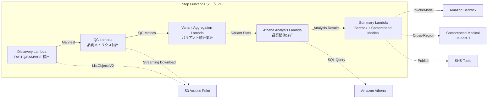

# UC7 : Génomique / Bioinformatique — Contrôle qualité, appel de variants, agrégation

🌐 **Language / 言語**: [日本語](README.md) | [English](README.en.md) | [한국어](README.ko.md) | [简体中文](README.zh-CN.md) | [繁體中文](README.zh-TW.md) | Français | [Deutsch](README.de.md) | [Español](README.es.md)

## Aperçu
Utilisation des points d'accès S3 de FSx for NetApp ONTAP pour automatiser les workflows sans serveur de contrôle qualité des données génomiques FASTQ/BAM/VCF, l'agrégation des statistiques d'appel de variantes et la génération de résumés de recherche.
### Cas où ce schéma est approprié
- Les données de sortie des séquenceurs de nouvelle génération (FASTQ/BAM/VCF) sont stockées sur FSx ONTAP
- Nous souhaitons surveiller périodiquement les métriques de qualité des données de séquençage (nombre de lectures, scores de qualité, teneur en GC)
- Nous voulons automatiser la compilation statistique des résultats des appels de variantes (ratio SNP/InDel, ratio Ti/Tv)
- Une extraction automatique des entités biomédicales (noms de gènes, maladies, médicaments) est nécessaire grâce à Comprehend Medical
- Nous souhaitons générer automatiquement les rapports de synthèse des recherches
### Cas où ce modèle ne convient pas
- Nécessité d'exécuter des pipelines de cri de variante en temps réel (BWA/GATK, etc.)
- Traitement d'alignement génomique à grande échelle (un cluster EC2/HPC est approprié)
- Besoin de pipelines entièrement validés dans un cadre réglementé GxP
- Environnements où la connectivité réseau à l'API REST ONTAP n'est pas garantie
### Principales fonctionnalités
- Détection automatique des fichiers FASTQ/BAM/VCF via S3 AP
- Extraction des métriques de qualité FASTQ par téléchargement en streaming
- Agrégation de statistiques de variants VCF (total_variants, snp_count, indel_count, ti_tv_ratio)
- Identification des échantillons sous le seuil de qualité avec Athena SQL
- Extraction d'entités biomédicales avec Comprehend Medical (inter-régions)
- Génération de résumés de recherche avec Amazon Bedrock
## Architecture



### Étapes du flux de travail
1. **Découverte** : Détection des fichiers.fastq,.fastq.gz,.bam,.vcf,.vcf.gz depuis S3 AP
2. **CQ** : Récupération des en-têtes FASTQ en streaming et extraction des métriques de qualité
3. **Agrégation de variantes** : Agrégation des statistiques de variantes des fichiers VCF
4. **Analyse Athena** : Identification des échantillons sous le seuil de qualité en SQL
5. **Résumé** : Génération du résumé de l'étude avec Bedrock, extraction des entités avec Comprehend Medical
## Conditions préalables
- Compte AWS et permissions IAM appropriées
- Système de fichiers FSx for NetApp ONTAP (ONTAP 9.17.1P4D3 ou supérieur)
- Point d'accès S3 activé pour le volume (stockage des données génomiques)
- VPC, sous-réseaux privés
- Accès au modèle Amazon Bedrock activé (Claude / Nova)
- **Inter-régions** : Comprehend Medical n'est pas pris en charge dans ap-northeast-1, un appel inter-régional vers us-east-1 est nécessaire
## Étapes de déploiement

### 1. Vérification des paramètres de régions croisées
Comprehend Medical n'est pas disponible dans la région Tokyo, donc configurez les appels inter-régions avec le paramètre `CrossRegionServices`.
### 2. Déploiement CloudFormation

```bash
aws cloudformation deploy \
  --template-file genomics-pipeline/template.yaml \
  --stack-name fsxn-genomics-pipeline \
  --parameter-overrides \
    S3AccessPointAlias=<your-volume-ext-s3alias> \
    S3AccessPointName=<your-s3ap-name> \
    VpcId=<your-vpc-id> \
    PrivateSubnetIds=<subnet-1>,<subnet-2> \
    ScheduleExpression="rate(1 hour)" \
    NotificationEmail=<your-email@example.com> \
    CrossRegionTarget=us-east-1 \
    EnableVpcEndpoints=false \
    EnableCloudWatchAlarms=false \
  --capabilities CAPABILITY_IAM CAPABILITY_AUTO_EXPAND \
  --region ap-northeast-1
```

### 3. Vérification de la configuration entre régions
Après le déploiement, assurez-vous que la variable d'environnement Lambda `CROSS_REGION_TARGET` est définie sur `us-east-1`.
## Liste des paramètres de configuration

| パラメータ | 説明 | デフォルト | 必須 |
|-----------|------|----------|------|
| `S3AccessPointAlias` | FSx ONTAP S3 AP Alias（入力用） | — | ✅ |
| `S3AccessPointName` | S3 AP 名（ARN ベースの IAM 権限付与用。省略時は Alias ベースのみ） | `""` | ⚠️ 推奨 |
| `ScheduleExpression` | EventBridge Scheduler のスケジュール式 | `rate(1 hour)` | |
| `VpcId` | VPC ID | — | ✅ |
| `PrivateSubnetIds` | プライベートサブネット ID リスト | — | ✅ |
| `NotificationEmail` | SNS 通知先メールアドレス | — | ✅ |
| `CrossRegionTarget` | Comprehend Medical のターゲットリージョン | `us-east-1` | |
| `MapConcurrency` | Map ステートの並列実行数 | `10` | |
| `LambdaMemorySize` | Lambda メモリサイズ (MB) | `1024` | |
| `LambdaTimeout` | Lambda タイムアウト (秒) | `300` | |
| `EnableVpcEndpoints` | Interface VPC Endpoints の有効化 | `false` | |
| `EnableCloudWatchAlarms` | CloudWatch Alarms の有効化 | `false` | |
| `EnableSnapStart` | Activer Lambda SnapStart (réduction du démarrage à froid) | `false` | |

## Nettoyage

```bash
# S3 バケットを空にする
aws s3 rm s3://fsxn-genomics-pipeline-output-${AWS_ACCOUNT_ID} --recursive

# CloudFormation スタックの削除
aws cloudformation delete-stack \
  --stack-name fsxn-genomics-pipeline \
  --region ap-northeast-1

aws cloudformation wait stack-delete-complete \
  --stack-name fsxn-genomics-pipeline \
  --region ap-northeast-1
```

## Régions prises en charge
UC7 utilise les services suivants :
| サービス | リージョン制約 |
|---------|-------------|
| Amazon Athena | ほぼ全リージョンで利用可能 |
| Amazon Bedrock | 対応リージョンを確認（[Bedrock 対応リージョン](https://docs.aws.amazon.com/general/latest/gr/bedrock.html)） |
| Amazon Comprehend Medical | 限定リージョンのみ対応。`COMPREHEND_MEDICAL_REGION` パラメータで対応リージョン（us-east-1 等）を指定 |
| AWS X-Ray | ほぼ全リージョンで利用可能 |
| CloudWatch EMF | ほぼ全リージョンで利用可能 |
> Appelez l'API Comprehend Medical via le client inter-régions. Vérifiez les exigences de résidence des données. Pour plus de détails, consultez la [Matrice de compatibilité des régions](../docs/region-compatibility.md).
## Liens de référence
- [FSx ONTAP S3 Access Points 概要](https://docs.aws.amazon.com/fsx/latest/ONTAPGuide/accessing-data-via-s3-access-points.html)
- [Amazon Comprehend Medical](https://docs.aws.amazon.com/comprehend-medical/latest/dev/what-is.html)
- [FASTQ フォーマット仕様](https://en.wikipedia.org/wiki/FASTQ_format)
- [VCF フォーマット仕様](https://samtools.github.io/hts-specs/VCFv4.3.pdf)