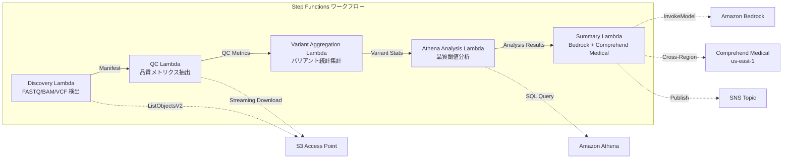

# UC7: 게놈학 / 생물정보학 — 품질 검사 및 변이체 호출 집계

🌐 **Language / 言語**: [日本語](README.md) | [English](README.en.md) | 한국어 | [简体中文](README.zh-CN.md) | [繁體中文](README.zh-TW.md) | [Français](README.fr.md) | [Deutsch](README.de.md) | [Español](README.es.md)

## 개요
FSx for NetApp ONTAP의 S3 액세스 포인트를 활용하여 FASTQ/BAM/VCF 게놈 데이터의 품질 검사, 변이체 호출 통계 수집, 연구 요약 생성을 자동화하는 서버리스 워크플로우입니다.
### 이 패턴이 적합한 경우
- 차세대 시퀀서의 출력 데이터(FASTQ/BAM/VCF)가 FSx ONTAP에 축적되어 있습니다
- 시퀀싱 데이터의 품질 메트릭(리드 수, 품질 점수, GC 함량)을 정기적으로 모니터링하고 싶습니다
- 변이체 호출 결과의 통계 수집(SNP/InDel 비율, Ti/Tv 비율)을 자동화하고 싶습니다
- Comprehend Medical을 통한 생물의학 엔터티(유전자 이름, 질병, 약물)의 자동 추출이 필요합니다
- 연구 요약 보고서를 자동 생성하고 싶습니다
### 이 패턴이 적합하지 않은 경우
- 실시간 변이체 호출 파이프라인(BWA/GATK 등)의 실행이 필요합니다.
- 대규모 게놈 정렬 처리(EC2/HPC 클러스터가 적합)
- GxP 규제 하에 완전한 검증된 파이프라인이 필요합니다.
- ONTAP REST API에 대한 네트워크 도달성이 불가능한 환경
### 주요 기능
- S3 AP를 통한 FASTQ/BAM/VCF 파일의 자동 감지
- 스트리밍 다운로드를 통한 FASTQ 품질 메트릭스 추출
- VCF 변이체 통계 집계(total_variants, snp_count, indel_count, ti_tv_ratio)
- Athena SQL을 사용한 품질 임계값 미만 샘플 식별
- Comprehend Medical(크로스 리전)을 통한 생물의학 엔티티 추출
- Amazon Bedrock을 사용한 연구 요약 생성
## 아키텍처



### 워크플로우 단계
1. **Discovery**: S3 AP에서.fastq,.fastq.gz,.bam,.vcf,.vcf.gz 파일 검색
2. **QC**: 스트리밍 다운로드로 FASTQ 헤더를 가져와 품질 메트릭스 추출
3. **Variant Aggregation**: VCF 파일의 변이 통계 집계
4. **Athena Analysis**: SQL로 품질 임계값 미만 샘플 식별
5. **Summary**: Bedrock에서 연구 요약 생성, Comprehend Medical로 엔티티 추출
## 사전 요구 사항
- AWS 계정 및 적절한 IAM 권한
- FSx for NetApp ONTAP 파일 시스템 (ONTAP 9.17.1P4D3 이상)
- S3 Access Point가 활성화된 볼륨 (게놈 데이터 저장)
- VPC, 프라이빗 서브넷
- Amazon Bedrock 모델 액세스 활성화 (Claude / Nova)
- **크로스 리전**: Comprehend Medical은 ap-northeast-1을 지원하지 않으므로 us-east-1로 크로스 리전 호출 필요
## 배포 절차

### 1. 크로스 리전 파라미터 확인
Comprehend Medical은 도쿄 리전을 지원하지 않기 때문에, `CrossRegionServices` 파라미터를 사용하여 크로스리전 호출을 설정합니다.
### 2. CloudFormation 배포

```bash
aws cloudformation deploy \
  --template-file genomics-pipeline/template.yaml \
  --stack-name fsxn-genomics-pipeline \
  --parameter-overrides \
    S3AccessPointAlias=<your-volume-ext-s3alias> \
    S3AccessPointName=<your-s3ap-name> \
    VpcId=<your-vpc-id> \
    PrivateSubnetIds=<subnet-1>,<subnet-2> \
    ScheduleExpression="rate(1 hour)" \
    NotificationEmail=<your-email@example.com> \
    CrossRegionTarget=us-east-1 \
    EnableVpcEndpoints=false \
    EnableCloudWatchAlarms=false \
  --capabilities CAPABILITY_IAM CAPABILITY_AUTO_EXPAND \
  --region ap-northeast-1
```

### 3. 크로스 리전 설정 확인
배포 후, Lambda 환경 변수 `CROSS_REGION_TARGET`이 `us-east-1`로 설정되어 있는지 확인하세요.
## 설정 매개변수 목록

| パラメータ | 説明 | デフォルト | 必須 |
|-----------|------|----------|------|
| `S3AccessPointAlias` | FSx ONTAP S3 AP Alias（入力用） | — | ✅ |
| `S3AccessPointName` | S3 AP 名（ARN ベースの IAM 権限付与用。省略時は Alias ベースのみ） | `""` | ⚠️ 推奨 |
| `ScheduleExpression` | EventBridge Scheduler のスケジュール式 | `rate(1 hour)` | |
| `VpcId` | VPC ID | — | ✅ |
| `PrivateSubnetIds` | プライベートサブネット ID リスト | — | ✅ |
| `NotificationEmail` | SNS 通知先メールアドレス | — | ✅ |
| `CrossRegionTarget` | Comprehend Medical のターゲットリージョン | `us-east-1` | |
| `MapConcurrency` | Map ステートの並列実行数 | `10` | |
| `LambdaMemorySize` | Lambda メモリサイズ (MB) | `1024` | |
| `LambdaTimeout` | Lambda タイムアウト (秒) | `300` | |
| `EnableVpcEndpoints` | Interface VPC Endpoints の有効化 | `false` | |
| `EnableCloudWatchAlarms` | CloudWatch Alarms の有効化 | `false` | |

## 정리

```bash
# S3 バケットを空にする
aws s3 rm s3://fsxn-genomics-pipeline-output-${AWS_ACCOUNT_ID} --recursive

# CloudFormation スタックの削除
aws cloudformation delete-stack \
  --stack-name fsxn-genomics-pipeline \
  --region ap-northeast-1

aws cloudformation wait stack-delete-complete \
  --stack-name fsxn-genomics-pipeline \
  --region ap-northeast-1
```

## 지원되는 리전
UC7은 다음 서비스를 사용합니다:
| サービス | リージョン制約 |
|---------|-------------|
| Amazon Athena | ほぼ全リージョンで利用可能 |
| Amazon Bedrock | 対応リージョンを確認（[Bedrock 対応リージョン](https://docs.aws.amazon.com/general/latest/gr/bedrock.html)） |
| Amazon Comprehend Medical | 限定リージョンのみ対応。`COMPREHEND_MEDICAL_REGION` パラメータで対応リージョン（us-east-1 等）を指定 |
| AWS X-Ray | ほぼ全リージョンで利用可能 |
| CloudWatch EMF | ほぼ全リージョンで利用可能 |
> Cross-Region Client를 통해 Comprehend Medical API를 호출합니다. 데이터 거주지 요구 사항을 확인하세요. 자세한 내용은 [리전 호환성 매트릭스](../docs/region-compatibility.md)를 참조하세요.
## 참고 링크
- [FSx ONTAP S3 Access Points 개요](https://docs.aws.amazon.com/fsx/latest/ONTAPGuide/accessing-data-via-s3-access-points.html)
- [Amazon Comprehend Medical](https://docs.aws.amazon.com/comprehend-medical/latest/dev/what-is.html)
- [FASTQ 형식 사양](https://en.wikipedia.org/wiki/FASTQ_format)
- [VCF 형식 사양](https://samtools.github.io/hts-specs/VCFv4.3.pdf)