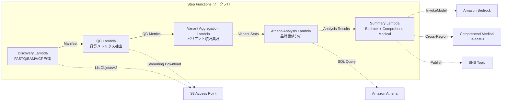

# UC7: ゲノミクス / バイオインフォマティクス — 品質チェック・バリアントコール集計

🌐 **Language / 言語**: 日本語 | [English](README.en.md) | [한국어](README.ko.md) | [简体中文](README.zh-CN.md) | [繁體中文](README.zh-TW.md) | [Français](README.fr.md) | [Deutsch](README.de.md) | [Español](README.es.md)

📚 **ドキュメント**: [アーキテクチャ図](docs/architecture.md) | [デモガイド](docs/demo-guide.md)

## 概要

FSx for NetApp ONTAP の S3 Access Points を活用し、FASTQ/BAM/VCF ゲノムデータの品質チェック、バリアントコール統計集計、研究サマリー生成を自動化するサーバーレスワークフローです。

### このパターンが適しているケース

- 次世代シーケンサーの出力データ（FASTQ/BAM/VCF）が FSx ONTAP 上に蓄積されている
- シーケンスデータの品質メトリクス（リード数、品質スコア、GC 含量）を定期的に監視したい
- バリアントコール結果の統計集計（SNP/InDel 比率、Ti/Tv 比）を自動化したい
- Comprehend Medical によるバイオメディカルエンティティ（遺伝子名、疾患、薬剤）の自動抽出が必要
- 研究サマリーレポートを自動生成したい

### このパターンが適さないケース

- リアルタイムのバリアントコーリングパイプライン（BWA/GATK 等）の実行が必要
- 大規模ゲノムアライメント処理（EC2/HPC クラスタが適切）
- GxP 規制下で完全なバリデーション済みパイプラインが必要
- ONTAP REST API へのネットワーク到達性が確保できない環境

### 主な機能

- S3 AP 経由で FASTQ/BAM/VCF ファイルを自動検出
- ストリーミングダウンロードによる FASTQ 品質メトリクス抽出
- VCF バリアント統計集計（total_variants, snp_count, indel_count, ti_tv_ratio）
- Athena SQL による品質閾値未満サンプルの特定
- Comprehend Medical（クロスリージョン）によるバイオメディカルエンティティ抽出
- Amazon Bedrock による研究サマリー生成


## Success Metrics

### Outcome
FASTQ/VCF 品質チェック・バリアントコール集計の自動化により、研究データ分析の迅速化を実現する。

### Metrics
| メトリクス | 目標値（例） |
|-----------|------------|
| 処理済みサンプル数 / 実行 | > 50 samples |
| 品質チェック通過率 | > 95% |
| バリアント検出精度 | 既知バリアント DB との一致率 > 90% |
| 処理時間 / サンプル | < 2 分 |
| コスト / 実行 | < $10 |
| Human Review 必須率 | 100%（臨床的意義のあるバリアント） |

> **100% Human Review の理由**: 臨床的意義のあるバリアント分類は医療判断に影響するため、研究者・臨床医による全件確認を必須とします。

### Measurement Method
Step Functions 実行履歴、Comprehend Medical entity count、Athena 集計結果、CloudWatch Metrics。

## アーキテクチャ



### ワークフローステップ

1. **Discovery**: S3 AP から .fastq, .fastq.gz, .bam, .vcf, .vcf.gz ファイルを検出
2. **QC**: ストリーミングダウンロードで FASTQ ヘッダーを取得し、品質メトリクスを抽出
3. **Variant Aggregation**: VCF ファイルのバリアント統計を集計
4. **Athena Analysis**: 品質閾値未満サンプルを SQL で特定
5. **Summary**: Bedrock で研究サマリー生成、Comprehend Medical でエンティティ抽出

## 前提条件

- AWS アカウントと適切な IAM 権限
- FSx for NetApp ONTAP ファイルシステム（ONTAP 9.17.1P4D3 以上）
- S3 Access Point が有効化されたボリューム（ゲノムデータを格納）
- VPC、プライベートサブネット
- Amazon Bedrock モデルアクセスが有効（Claude / Nova）
- **クロスリージョン**: Comprehend Medical は ap-northeast-1 非対応のため、us-east-1 へのクロスリージョン呼び出しが必要

## デプロイ手順

### 1. クロスリージョンパラメータの確認

Comprehend Medical は東京リージョン非対応のため、`CrossRegionServices` パラメータでクロスリージョン呼び出しを設定します。

### 2. CloudFormation デプロイ

```bash
aws cloudformation deploy \
  --template-file genomics-pipeline/template.yaml \
  --stack-name fsxn-genomics-pipeline \
  --parameter-overrides \
    S3AccessPointAlias=<your-volume-ext-s3alias> \
    S3AccessPointName=<your-s3ap-name> \
    VpcId=<your-vpc-id> \
    PrivateSubnetIds=<subnet-1>,<subnet-2> \
    ScheduleExpression="rate(1 hour)" \
    NotificationEmail=<your-email@example.com> \
    CrossRegionTarget=us-east-1 \
    EnableVpcEndpoints=false \
    EnableCloudWatchAlarms=false \
  --capabilities CAPABILITY_IAM CAPABILITY_AUTO_EXPAND \
  --region ap-northeast-1
```

### 3. クロスリージョン設定の確認

デプロイ後、Lambda 環境変数 `CROSS_REGION_TARGET` が `us-east-1` に設定されていることを確認してください。

## 設定パラメータ一覧

| パラメータ | 説明 | デフォルト | 必須 |
|-----------|------|----------|------|
| `S3AccessPointAlias` | FSx ONTAP S3 AP Alias（入力用） | — | ✅ |
| `S3AccessPointName` | S3 AP 名（ARN ベースの IAM 権限付与用。省略時は Alias ベースのみ） | `""` | ⚠️ 推奨 |
| `ScheduleExpression` | EventBridge Scheduler のスケジュール式 | `rate(1 hour)` | |
| `VpcId` | VPC ID | — | ✅ |
| `PrivateSubnetIds` | プライベートサブネット ID リスト | — | ✅ |
| `NotificationEmail` | SNS 通知先メールアドレス | — | ✅ |
| `CrossRegionTarget` | Comprehend Medical のターゲットリージョン | `us-east-1` | |
| `MapConcurrency` | Map ステートの並列実行数 | `10` | |
| `LambdaMemorySize` | Lambda メモリサイズ (MB) | `1024` | |
| `LambdaTimeout` | Lambda タイムアウト (秒) | `300` | |
| `EnableVpcEndpoints` | Interface VPC Endpoints の有効化 | `false` | |
| `EnableCloudWatchAlarms` | CloudWatch Alarms の有効化 | `false` | |

## クリーンアップ

```bash
# S3 バケットを空にする
aws s3 rm s3://fsxn-genomics-pipeline-output-${AWS_ACCOUNT_ID} --recursive

# CloudFormation スタックの削除
aws cloudformation delete-stack \
  --stack-name fsxn-genomics-pipeline \
  --region ap-northeast-1

aws cloudformation wait stack-delete-complete \
  --stack-name fsxn-genomics-pipeline \
  --region ap-northeast-1
```

## Supported Regions

UC7 は以下のサービスを使用します:

| サービス | リージョン制約 |
|---------|-------------|
| Amazon Athena | ほぼ全リージョンで利用可能 |
| Amazon Bedrock | 対応リージョンを確認（[Bedrock 対応リージョン](https://docs.aws.amazon.com/general/latest/gr/bedrock.html)） |
| Amazon Comprehend Medical | 限定リージョンのみ対応。`COMPREHEND_MEDICAL_REGION` パラメータで対応リージョン（us-east-1 等）を指定 |
| AWS X-Ray | ほぼ全リージョンで利用可能 |
| CloudWatch EMF | ほぼ全リージョンで利用可能 |

> Cross-Region Client 経由で Comprehend Medical API を呼び出します。データレジデンシー要件を確認してください。詳細は [リージョン互換性マトリックス](../docs/region-compatibility.md) を参照。

## 参考リンク

- [FSx ONTAP S3 Access Points 概要](https://docs.aws.amazon.com/fsx/latest/ONTAPGuide/accessing-data-via-s3-access-points.html)
- [Amazon Comprehend Medical](https://docs.aws.amazon.com/comprehend-medical/latest/dev/what-is.html)
- [FASTQ フォーマット仕様](https://en.wikipedia.org/wiki/FASTQ_format)
- [VCF フォーマット仕様](https://samtools.github.io/hts-specs/VCFv4.3.pdf)


---

## AWS ドキュメントリンク

| サービス | ドキュメント |
|---------|------------|
| FSx for NetApp ONTAP | [ユーザーガイド](https://docs.aws.amazon.com/fsx/latest/ONTAPGuide/what-is-fsx-ontap.html) |
| S3 Access Points | [S3 AP for FSx ONTAP](https://docs.aws.amazon.com/fsx/latest/ONTAPGuide/s3-access-points.html) |
| Step Functions | [開発者ガイド](https://docs.aws.amazon.com/step-functions/latest/dg/welcome.html) |
| Amazon Athena | [ユーザーガイド](https://docs.aws.amazon.com/athena/latest/ug/what-is.html) |
| Amazon Bedrock | [ユーザーガイド](https://docs.aws.amazon.com/bedrock/latest/userguide/what-is-bedrock.html) |
| AWS HealthOmics | [ユーザーガイド](https://docs.aws.amazon.com/omics/latest/dev/what-is-service.html) |

### Well-Architected Framework 対応

| 柱 | 対応 |
|----|------|
| 運用上の優秀性 | X-Ray トレーシング、EMF メトリクス、QC メトリクス監視 |
| セキュリティ | 最小権限 IAM、KMS 暗号化、ゲノムデータアクセス制御 |
| 信頼性 | Step Functions Retry/Catch、バリアント集計リトライ |
| パフォーマンス効率 | FASTQ ストリーミング処理、Athena パーティション |
| コスト最適化 | サーバーレス（使用時のみ課金）、Lambda メモリ最適化 |
| 持続可能性 | オンデマンド実行、差分処理 |


---

## 出力サンプル (Output Sample)

ゲノミクスバリアント解析パイプラインの出力例:

```json
{
  "discovery": {
    "status": "completed",
    "object_count": 8,
    "prefix": "genomics/samples/"
  },
  "qc_results": [
    {
      "key": "genomics/samples/sample-001.fastq.gz",
      "total_reads": 25000000,
      "q30_pct": 92.5,
      "gc_content_pct": 48.2,
      "pass_qc": true
    }
  ],
  "variant_aggregation": {
    "total_variants": 4523,
    "snps": 3891,
    "indels": 632,
    "novel_variants": 127
  },
  "athena_analysis": {
    "clinvar_matches": 15,
    "high_impact_variants": 3,
    "query_execution_id": "qe-xyz789..."
  }
}
```

> **注記**: 上記はサンプル出力であり、実際の値は環境・入力データにより異なります。ベンチマーク数値は sizing reference であり、service limit ではありません。

---

## Governance Note

> 本パターンは技術アーキテクチャガイダンスを提供します。法的・コンプライアンス・規制上の助言ではありません。組織は適格な専門家に相談してください。

---

## S3AP Compatibility

S3 Access Points for FSx for ONTAP の互換性制約、トラブルシューティング、トリガーパターンについては [S3AP Compatibility Notes](../docs/s3ap-compatibility-notes.md) を参照してください。