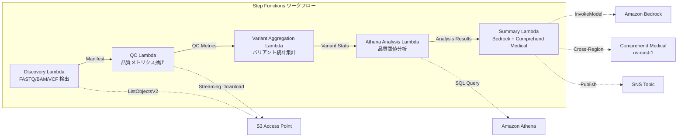

# UC7: 基因组学/生物信息学 — 质量检查和变异调用汇总

🌐 **Language / 言語**: [日本語](README.md) | [English](README.en.md) | [한국어](README.ko.md) | 简体中文 | [繁體中文](README.zh-TW.md) | [Français](README.fr.md) | [Deutsch](README.de.md) | [Español](README.es.md)

## 概述
利用 FSx for NetApp ONTAP 的 S3 Access Points，自动化无服务器工作流程，用于对 FASTQ/BAM/VCF 基因组数据进行质量检查、变异调用统计汇总和研究摘要生成。
### 适用场景

适用以下情况：
- 次世代测序仪输出的数据（FASTQ/BAM/VCF）存储在 FSx ONTAP 上
- 希望定期监控测序数据的质量指标（读数、质量评分、GC 含量）
- 希望自动化变异调用结果的统计汇总（SNP/InDel 比率、Ti/Tv 比）
- 需要通过 Comprehend Medical 自动提取生物医学实体（基因名、疾病、药物）
- 希望自动生成研究总结报告
### 不适用的情况

对于以下情况，此模式不适用：

- Amazon Bedrock
- AWS Step Functions
- Amazon Athena
- Amazon S3
- AWS Lambda
- Amazon FSx for NetApp ONTAP
- Amazon CloudWatch
- AWS CloudFormation

技术术语如GDSII、DRC、OASIS、GDS、Lambda、tapeout等保持不变。

内联代码（`...`）、文件路径和URL保持不变。
- 需要运行实时变体调用管道（如BWA/GATK 等）
- 需要大规模基因组比对处理（适合EC2/HPC 集群）
- 在GxP 法规下需要完全验证的管道
- 环境中无法确保对 ONTAP REST API 的网络访问
### 主要功能
- 通过 S3 AP 自动检测 FASTQ/BAM/VCF 文件
- 使用流式下载提取 FASTQ 质量指标
- VCF 变异统计汇总（total_variants, snp_count, indel_count, ti_tv_ratio）
- 使用 Athena SQL 确定质量阈值未达到的样本
- 使用 Comprehend Medical（跨区域）提取生物医学实体
- 使用 Amazon Bedrock 生成研究摘要
## 架构



### 工作流程步骤

在工作流程步骤中，您可以使用Amazon Bedrock、AWS Step Functions、Amazon Athena、Amazon S3、AWS Lambda、Amazon FSx for NetApp ONTAP、Amazon CloudWatch和AWS CloudFormation等服务。请确保保留GDSII、DRC、OASIS、GDS、Lambda、tapeout等技术术语不变。同时，请保持内联代码（`...`）、文件路径和URL不变。
1. **发现**：从 S3 AP 检测.fastq,.fastq.gz,.bam,.vcf,.vcf.gz 文件
2. **质量控制**：通过流式下载获取 FASTQ 头部，提取质量指标
3. **变体聚合**：汇总 VCF 文件的变体统计
4. **Athena 分析**：使用 SQL 确定低于质量阈值的样本
5. **摘要**：在 Bedrock 中生成研究摘要，使用 Comprehend Medical 提取实体
## 前提条件
- AWS 账户和适当的 IAM 权限
- FSx for NetApp ONTAP 文件系统（ONTAP 9.17.1P4D3 及以上版本）
- 启用了 S3 Access Point 的卷（存储基因数据）
- VPC、私有子网
- Amazon Bedrock 模型访问已启用（Claude / Nova）
- **跨区域**：由于 Comprehend Medical 不支持 ap-northeast-1，需要跨区域调用 us-east-1
## 部署步骤

### 1. 确认跨区域参数
由于 Comprehend Medical 不支持东京区域，请使用 `CrossRegionServices` 参数来配置跨区域调用。
### 2. CloudFormation 部署

```bash
aws cloudformation deploy \
  --template-file genomics-pipeline/template.yaml \
  --stack-name fsxn-genomics-pipeline \
  --parameter-overrides \
    S3AccessPointAlias=<your-volume-ext-s3alias> \
    S3AccessPointName=<your-s3ap-name> \
    VpcId=<your-vpc-id> \
    PrivateSubnetIds=<subnet-1>,<subnet-2> \
    ScheduleExpression="rate(1 hour)" \
    NotificationEmail=<your-email@example.com> \
    CrossRegionTarget=us-east-1 \
    EnableVpcEndpoints=false \
    EnableCloudWatchAlarms=false \
  --capabilities CAPABILITY_IAM CAPABILITY_AUTO_EXPAND \
  --region ap-northeast-1
```

### 3. 跨区域配置的确认
部署之后，请确保 Lambda 环境变量 `CROSS_REGION_TARGET` 设置为 `us-east-1`。
## 配置参数列表

| パラメータ | 説明 | デフォルト | 必須 |
|-----------|------|----------|------|
| `S3AccessPointAlias` | FSx ONTAP S3 AP Alias（入力用） | — | ✅ |
| `S3AccessPointName` | S3 AP 名（ARN ベースの IAM 権限付与用。省略時は Alias ベースのみ） | `""` | ⚠️ 推奨 |
| `ScheduleExpression` | EventBridge Scheduler のスケジュール式 | `rate(1 hour)` | |
| `VpcId` | VPC ID | — | ✅ |
| `PrivateSubnetIds` | プライベートサブネット ID リスト | — | ✅ |
| `NotificationEmail` | SNS 通知先メールアドレス | — | ✅ |
| `CrossRegionTarget` | Comprehend Medical のターゲットリージョン | `us-east-1` | |
| `MapConcurrency` | Map ステートの並列実行数 | `10` | |
| `LambdaMemorySize` | Lambda メモリサイズ (MB) | `1024` | |
| `LambdaTimeout` | Lambda タイムアウト (秒) | `300` | |
| `EnableVpcEndpoints` | Interface VPC Endpoints の有効化 | `false` | |
| `EnableCloudWatchAlarms` | CloudWatch Alarms の有効化 | `false` | |
| `EnableSnapStart` | 启用 Lambda SnapStart（冷启动缩短） | `false` | |

## 清理

```bash
# S3 バケットを空にする
aws s3 rm s3://fsxn-genomics-pipeline-output-${AWS_ACCOUNT_ID} --recursive

# CloudFormation スタックの削除
aws cloudformation delete-stack \
  --stack-name fsxn-genomics-pipeline \
  --region ap-northeast-1

aws cloudformation wait stack-delete-complete \
  --stack-name fsxn-genomics-pipeline \
  --region ap-northeast-1
```

## 支持的区域
UC7 使用以下服务：
| サービス | リージョン制約 |
|---------|-------------|
| Amazon Athena | ほぼ全リージョンで利用可能 |
| Amazon Bedrock | 対応リージョンを確認（[Bedrock 対応リージョン](https://docs.aws.amazon.com/general/latest/gr/bedrock.html)） |
| Amazon Comprehend Medical | 限定リージョンのみ対応。`COMPREHEND_MEDICAL_REGION` パラメータで対応リージョン（us-east-1 等）を指定 |
| AWS X-Ray | ほぼ全リージョンで利用可能 |
| CloudWatch EMF | ほぼ全リージョンで利用可能 |
> 通过跨区域客户端调用 Comprehend Medical API。请确认数据驻留要求。详情请参阅 [区域兼容性矩阵](../docs/region-compatibility.md)。
## 参考链接
- [FSx ONTAP S3 访问点概览](https://docs.aws.amazon.com/fsx/latest/ONTAPGuide/accessing-data-via-s3-access-points.html)
- [Amazon Comprehend Medical](https://docs.aws.amazon.com/comprehend-medical/latest/dev/what-is.html)
- [FASTQ 格式规范](https://en.wikipedia.org/wiki/FASTQ_format)
- [VCF 格式规范](https://samtools.github.io/hts-specs/VCFv4.3.pdf)