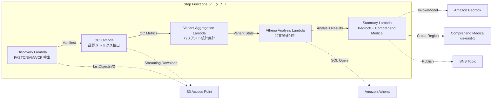

# UC7: 基因組學 / 生物資訊學 — 品質檢查與變異呼叫彙總

🌐 **Language / 言語**: [日本語](README.md) | [English](README.en.md) | [한국어](README.ko.md) | [简体中文](README.zh-CN.md) | 繁體中文 | [Français](README.fr.md) | [Deutsch](README.de.md) | [Español](README.es.md)

## 概述
利用 FSx for NetApp ONTAP 的 S3 Access Points，建立無伺服器工作流程，自動化 FASTQ/BAM/VCF 基因組數據的質量檢查、變體呼叫統計彙總及研究摘要生成。
### 適合此模式的情況
- 次世代測序儀的輸出數據（FASTQ/BAM/VCF）已儲存於 FSx ONTAP 上
- 希望定期監控測序數據的品質指標（讀數、品質分數、GC 含量）
- 希望自動化變異呼叫結果的統計彙總（SNP/InDel 比例、Ti/Tv 比）
- 需要 Comprehend Medical 自動提取生物醫學實體（基因名稱、疾病、藥物）
- 希望自動生成研究摘要報告
### 不適合的模式
- 需要執行實時變體呼叫管道（如BWA/GATK 等）
- 需要大規模基因組比對處理（EC2/HPC 集群適合）
- 在 GxP 規範下需要完全驗證的管道
- 環境中無法確保對 ONTAP REST API 的網路訪問
### 主要功能
- 通過 S3 AP 自動檢測 FASTQ/BAM/VCF 檔案
- 通過串流下載提取 FASTQ 品質指標
- VCF 變異統計彙總（total_variants, snp_count, indel_count, ti_tv_ratio）
- 使用 Athena SQL 確定不符合品質閾值的樣本
- 使用 Comprehend Medical（跨區域）提取生物醫學實體
- 使用 Amazon Bedrock 生成研究摘要
## 架構



### 工作流程步驟
1. **探尋**：從 S3 AP 中探尋.fastq,.fastq.gz,.bam,.vcf,.vcf.gz 檔案
2. **品質控制**：透過串流下載取得 FASTQ 標頭並提取品質測量
3. **變異彙總**：彙總 VCF 檔案的變異統計
4. **Athena 分析**：透過 SQL 確定低於品質閾值的樣本
5. **摘要**：使用 Bedrock 生成研究摘要，使用 Comprehend Medical 提取實體
## 先決條件
- AWS 帳戶和適當的 IAM 權限
- FSx for NetApp ONTAP 文件系統（ONTAP 9.17.1P4D3 以上）
- 已啟用 S3 Access Point 的卷（存儲基因數據）
- VPC、私有子網
- Amazon Bedrock 模型訪問已啟用（Claude / Nova）
- **跨區域**: 由於 Comprehend Medical 不支援 ap-northeast-1，需要進行 us-east-1 的跨區域調用
## 部署步驟

### 1. 確認跨區域參數
由於 Comprehend Medical 不支援東京區域，請使用 `CrossRegionServices` 參數設定跨區域呼叫。
### 2. CloudFormation 部署

```bash
aws cloudformation deploy \
  --template-file genomics-pipeline/template.yaml \
  --stack-name fsxn-genomics-pipeline \
  --parameter-overrides \
    S3AccessPointAlias=<your-volume-ext-s3alias> \
    S3AccessPointName=<your-s3ap-name> \
    VpcId=<your-vpc-id> \
    PrivateSubnetIds=<subnet-1>,<subnet-2> \
    ScheduleExpression="rate(1 hour)" \
    NotificationEmail=<your-email@example.com> \
    CrossRegionTarget=us-east-1 \
    EnableVpcEndpoints=false \
    EnableCloudWatchAlarms=false \
  --capabilities CAPABILITY_IAM CAPABILITY_AUTO_EXPAND \
  --region ap-northeast-1
```

### 3. 確認跨區域設定
部署後，請確認 Lambda 環境變數 `CROSS_REGION_TARGET` 已設定為 `us-east-1`。
## 設定參數列表

| パラメータ | 説明 | デフォルト | 必須 |
|-----------|------|----------|------|
| `S3AccessPointAlias` | FSx ONTAP S3 AP Alias（入力用） | — | ✅ |
| `S3AccessPointName` | S3 AP 名（ARN ベースの IAM 権限付与用。省略時は Alias ベースのみ） | `""` | ⚠️ 推奨 |
| `ScheduleExpression` | EventBridge Scheduler のスケジュール式 | `rate(1 hour)` | |
| `VpcId` | VPC ID | — | ✅ |
| `PrivateSubnetIds` | プライベートサブネット ID リスト | — | ✅ |
| `NotificationEmail` | SNS 通知先メールアドレス | — | ✅ |
| `CrossRegionTarget` | Comprehend Medical のターゲットリージョン | `us-east-1` | |
| `MapConcurrency` | Map ステートの並列実行数 | `10` | |
| `LambdaMemorySize` | Lambda メモリサイズ (MB) | `1024` | |
| `LambdaTimeout` | Lambda タイムアウト (秒) | `300` | |
| `EnableVpcEndpoints` | Interface VPC Endpoints の有効化 | `false` | |
| `EnableCloudWatchAlarms` | CloudWatch Alarms の有効化 | `false` | |

## 清理

```bash
# S3 バケットを空にする
aws s3 rm s3://fsxn-genomics-pipeline-output-${AWS_ACCOUNT_ID} --recursive

# CloudFormation スタックの削除
aws cloudformation delete-stack \
  --stack-name fsxn-genomics-pipeline \
  --region ap-northeast-1

aws cloudformation wait stack-delete-complete \
  --stack-name fsxn-genomics-pipeline \
  --region ap-northeast-1
```

## 支援的區域
UC7 使用以下服務：
| サービス | リージョン制約 |
|---------|-------------|
| Amazon Athena | ほぼ全リージョンで利用可能 |
| Amazon Bedrock | 対応リージョンを確認（[Bedrock 対応リージョン](https://docs.aws.amazon.com/general/latest/gr/bedrock.html)） |
| Amazon Comprehend Medical | 限定リージョンのみ対応。`COMPREHEND_MEDICAL_REGION` パラメータで対応リージョン（us-east-1 等）を指定 |
| AWS X-Ray | ほぼ全リージョンで利用可能 |
| CloudWatch EMF | ほぼ全リージョンで利用可能 |
> 透過跨區域用戶端呼叫 Comprehend Medical API。請確認資料駐留要求。詳細資訊請參閱 [區域相容性矩陣](../docs/region-compatibility.md)。
## 參考連結
- [FSx ONTAP S3 存取點概覽](https://docs.aws.amazon.com/fsx/latest/ONTAPGuide/accessing-data-via-s3-access-points.html)
- [Amazon Comprehend Medical](https://docs.aws.amazon.com/comprehend-medical/latest/dev/what-is.html)
- [FASTQ 格式規範](https://en.wikipedia.org/wiki/FASTQ_format)
- [VCF 格式規範](https://samtools.github.io/hts-specs/VCFv4.3.pdf)