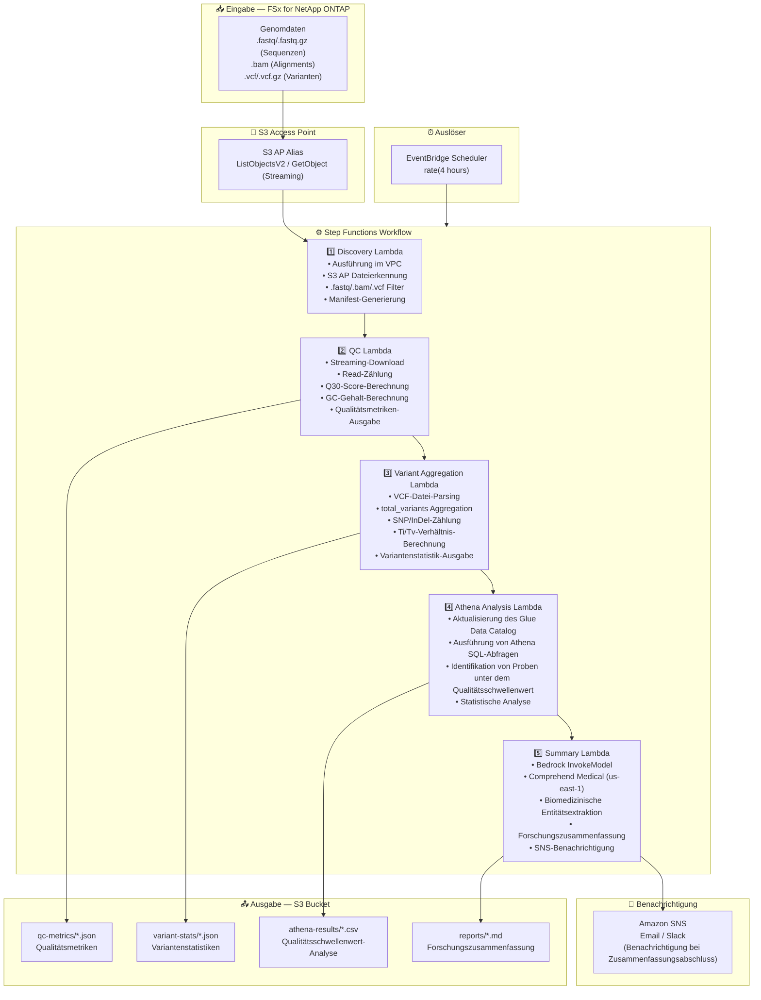

# UC7: Genomik — Qualitätsprüfung und Varianten-Aggregation

🌐 **Language / 言語**: [日本語](architecture.md) | [English](architecture.en.md) | [한국어](architecture.ko.md) | [简体中文](architecture.zh-CN.md) | [繁體中文](architecture.zh-TW.md) | [Français](architecture.fr.md) | Deutsch | [Español](architecture.es.md)

## End-to-End-Architektur (Eingabe → Ausgabe)

---

## Architekturdiagramm

---

## Datenfluss im Detail

### Eingabe
| Element | Beschreibung |
|---------|--------------|
| **Quelle** | FSx for NetApp ONTAP Volume |
| **Dateitypen** | .fastq/.fastq.gz (Sequenzen), .bam (Alignments), .vcf/.vcf.gz (Varianten) |
| **Zugriffsmethode** | S3 Access Point (ListObjectsV2 + GetObject) |
| **Lesestrategie** | FASTQ: Streaming-Download (speichereffizient), VCF: vollständiger Abruf |

### Verarbeitung
| Schritt | Service | Funktion |
|---------|---------|----------|
| Discovery | Lambda (VPC) | Erkennung von FASTQ/BAM/VCF-Dateien über S3 AP, Manifest-Generierung |
| QC | Lambda | Streaming-Extraktion von FASTQ-Qualitätsmetriken (Read-Zählung, Q30, GC-Gehalt) |
| Variant Aggregation | Lambda | VCF-Parsing für Variantenstatistiken (total_variants, snp_count, indel_count, ti_tv_ratio) |
| Athena Analysis | Lambda + Glue + Athena | SQL-basierte Identifikation von Proben unter dem Qualitätsschwellenwert, statistische Analyse |
| Summary | Lambda + Bedrock + Comprehend Medical | Erstellung der Forschungszusammenfassung, biomedizinische Entitätsextraktion |

### Ausgabe
| Artefakt | Format | Beschreibung |
|----------|--------|--------------|
| QC-Metriken | `qc-metrics/YYYY/MM/DD/{sample}_qc.json` | Qualitätsmetriken (Read-Zählung, Q30, GC-Gehalt, durchschnittlicher Qualitätsscore) |
| Variantenstatistiken | `variant-stats/YYYY/MM/DD/{sample}_variants.json` | Variantenstatistiken (total_variants, snp_count, indel_count, ti_tv_ratio) |
| Athena-Ergebnisse | `athena-results/{id}.csv` | Proben unter dem Qualitätsschwellenwert und statistische Analyse |
| Forschungszusammenfassung | `reports/YYYY/MM/DD/research_summary.md` | Von Bedrock generierter Forschungszusammenfassungsbericht |
| SNS-Benachrichtigung | Email | Benachrichtigung bei Zusammenfassungsabschluss und Qualitätswarnungen |

---

## Wichtige Designentscheidungen

1. **Streaming-Download** — FASTQ-Dateien können Dutzende GB erreichen; Streaming-Verarbeitung hält die Speichernutzung innerhalb des Lambda-Limits von 10 GB
2. **Leichtgewichtiges VCF-Parsing** — Extrahiert nur die für die statistische Aggregation minimal erforderlichen Felder, kein vollständiger VCF-Parser
3. **Comprehend Medical regionsübergreifend** — Nur in us-east-1 verfügbar, daher wird ein regionsübergreifender Aufruf verwendet
4. **Athena für Qualitätsschwellenwert-Analyse** — Parametrisierte Schwellenwerte (Q30 < 80 %, abnormaler GC-Gehalt usw.) mit flexibler SQL-Filterung
5. **Sequenzielle Pipeline** — Step Functions verwaltet Reihenfolgeabhängigkeiten: QC → Varianten-Aggregation → Analyse → Zusammenfassung
6. **Polling (nicht ereignisgesteuert)** — S3 AP unterstützt keine Ereignisbenachrichtigungen, daher wird eine periodische geplante Ausführung verwendet

---

## Verwendete AWS-Services

| Service | Rolle |
|---------|-------|
| FSx for NetApp ONTAP | Genomdatenspeicherung (FASTQ/BAM/VCF) |
| S3 Access Points | Serverloser Zugriff auf ONTAP-Volumes (Streaming-Unterstützung) |
| EventBridge Scheduler | Periodische Auslösung |
| Step Functions | Workflow-Orchestrierung (sequenziell) |
| Lambda | Berechnung (Discovery, QC, Variant Aggregation, Athena Analysis, Summary) |
| Glue Data Catalog | Schemaverwaltung für Qualitätsmetriken und Variantenstatistiken |
| Amazon Athena | SQL-basierte Qualitätsschwellenwert-Analyse und statistische Aggregation |
| Amazon Bedrock | Generierung des Forschungszusammenfassungsberichts (Claude / Nova) |
| Comprehend Medical | Biomedizinische Entitätsextraktion (us-east-1 regionsübergreifend) |
| SNS | Benachrichtigung bei Zusammenfassungsabschluss und Qualitätswarnungen |
| Secrets Manager | Verwaltung der ONTAP REST API-Anmeldedaten |
| CloudWatch + X-Ray | Observability |
