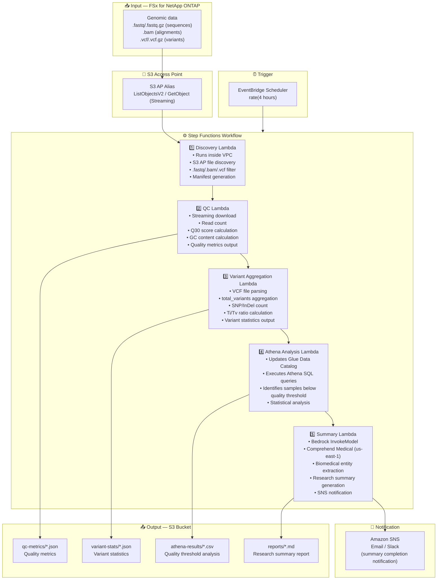

# UC7: Genomics / Bioinformatics — Quality Check & Variant Call Aggregation

🌐 **Language / 言語**: [日本語](architecture.md) | English | [한국어](architecture.ko.md) | [简体中文](architecture.zh-CN.md) | [繁體中文](architecture.zh-TW.md) | [Français](architecture.fr.md) | [Deutsch](architecture.de.md) | [Español](architecture.es.md)

## End-to-End Architecture (Input → Output)

---

## High-Level Flow

```
┌─────────────────────────────────────────────────────────────────────────────┐
│                         FSx for NetApp ONTAP                                 │
│                                                                              │
│  /vol/genomics_data/                                                         │
│  ├── fastq/sample_001/R1.fastq.gz          (FASTQ sequence data)            │
│  ├── fastq/sample_001/R2.fastq.gz          (FASTQ sequence data)            │
│  ├── bam/sample_001/aligned.bam            (BAM alignment data)             │
│  ├── vcf/sample_001/variants.vcf.gz        (VCF variant calls)              │
│  └── vcf/sample_002/variants.vcf           (VCF variant calls)              │
│                                                                              │
└──────────────────────────────────┬───────────────────────────────────────────┘
                                   │
                                   ▼
┌──────────────────────────────────────────────────────────────────────────────┐
│                      S3 Access Point (Data Path)                              │
│                                                                              │
│  Alias: fsxn-genomics-vol-ext-s3alias                                        │
│  • ListObjectsV2 (FASTQ/BAM/VCF file discovery)                             │
│  • GetObject (file retrieval — streaming download)                           │
│  • No NFS/SMB mount required from Lambda                                     │
│                                                                              │
└──────────────────────────────────┬───────────────────────────────────────────┘
                                   │
                                   ▼
┌──────────────────────────────────────────────────────────────────────────────┐
│                    EventBridge Scheduler (Trigger)                            │
│                                                                              │
│  Schedule: rate(4 hours) — configurable                                      │
│  Target: Step Functions State Machine                                        │
│                                                                              │
└──────────────────────────────────┬───────────────────────────────────────────┘
                                   │
                                   ▼
┌──────────────────────────────────────────────────────────────────────────────┐
│                    AWS Step Functions (Orchestration)                         │
│                                                                              │
│  ┌─────────────┐    ┌──────────────────────┐    ┌────────────────────────┐  │
│  │  Discovery   │───▶│  QC                  │───▶│  Variant Aggregation   │  │
│  │  Lambda      │    │  Lambda              │    │  Lambda                │  │
│  │             │    │                      │    │                       │  │
│  │  • VPC内     │    │  • Streaming         │    │  • VCF parsing         │  │
│  │  • S3 AP List│    │  • Q30 score         │    │  • SNP/InDel count     │  │
│  │  • FASTQ/VCF │    │  • GC content        │    │  • Ti/Tv ratio         │  │
│  └─────────────┘    └──────────────────────┘    └────────────────────────┘  │
│                                                         │                    │
│                                                         ▼                    │
│                      ┌──────────────────────┐    ┌────────────────────┐      │
│                      │  Summary             │◀───│  Athena Analysis   │      │
│                      │  Lambda              │    │  Lambda            │      │
│                      │                      │    │                   │      │
│                      │  • Bedrock           │    │  • Glue Catalog    │      │
│                      │  • Comprehend Medical│    │  • Athena SQL      │      │
│                      │  • Summary generation│    │  • Quality thresh  │      │
│                      └──────────────────────┘    └────────────────────┘      │
│                                                                              │
└──────────────────────────────────────────────────────────────────────────────┘
                                   │
                                   ▼
┌──────────────────────────────────────────────────────────────────────────────┐
│                         Output (S3 Bucket)                                    │
│                                                                              │
│  s3://{stack}-output-{account}/                                              │
│  ├── qc-metrics/YYYY/MM/DD/                                                  │
│  │   ├── sample_001_qc.json                ← Quality metrics                │
│  │   └── sample_002_qc.json                                                  │
│  ├── variant-stats/YYYY/MM/DD/                                               │
│  │   ├── sample_001_variants.json          ← Variant statistics             │
│  │   └── sample_002_variants.json                                            │
│  ├── athena-results/                                                         │
│  │   └── {query-execution-id}.csv          ← Quality threshold analysis     │
│  └── reports/YYYY/MM/DD/                                                     │
│      └── research_summary.md               ← Research summary report        │
│                                                                              │
└──────────────────────────────────────────────────────────────────────────────┘
```

---

## Mermaid Diagram



---

## Data Flow Detail

### Input
| Item | Description |
|------|-------------|
| **Source** | FSx for NetApp ONTAP volume |
| **File Types** | .fastq/.fastq.gz (sequences), .bam (alignments), .vcf/.vcf.gz (variants) |
| **Access Method** | S3 Access Point (ListObjectsV2 + GetObject) |
| **Read Strategy** | FASTQ: streaming download (memory efficient), VCF: full retrieval |

### Processing
| Step | Service | Function |
|------|---------|----------|
| Discovery | Lambda (VPC) | Discover FASTQ/BAM/VCF files via S3 AP, generate manifest |
| QC | Lambda | Streaming FASTQ quality metrics extraction (read count, Q30, GC content) |
| Variant Aggregation | Lambda | VCF parsing for variant statistics (total_variants, snp_count, indel_count, ti_tv_ratio) |
| Athena Analysis | Lambda + Glue + Athena | SQL-based identification of samples below quality threshold, statistical analysis |
| Summary | Lambda + Bedrock + Comprehend Medical | Research summary generation, biomedical entity extraction |

### Output
| Artifact | Format | Description |
|----------|--------|-------------|
| QC Metrics | `qc-metrics/YYYY/MM/DD/{sample}_qc.json` | Quality metrics (read count, Q30, GC content, avg quality score) |
| Variant Stats | `variant-stats/YYYY/MM/DD/{sample}_variants.json` | Variant statistics (total_variants, snp_count, indel_count, ti_tv_ratio) |
| Athena Results | `athena-results/{id}.csv` | Samples below quality threshold & statistical analysis |
| Research Summary | `reports/YYYY/MM/DD/research_summary.md` | Bedrock-generated research summary report |
| SNS Notification | Email | Summary completion notification & quality alerts |

---

## Key Design Decisions

1. **Streaming download** — FASTQ files can reach tens of GB; streaming processing keeps memory usage within Lambda 10GB limit
2. **Lightweight VCF parsing** — Extracts only minimum fields needed for statistical aggregation, not a full VCF parser
3. **Comprehend Medical cross-region** — Available only in us-east-1, so cross-region invocation is used
4. **Athena for quality threshold analysis** — Parameterized thresholds (Q30 < 80%, abnormal GC content, etc.) with flexible SQL filtering
5. **Sequential pipeline** — Step Functions manages order dependencies: QC → variant aggregation → analysis → summary
6. **Polling (not event-driven)** — S3 AP does not support event notifications, so periodic scheduled execution is used

---

## AWS Services Used

| Service | Role |
|---------|------|
| FSx for NetApp ONTAP | Genomic data storage (FASTQ/BAM/VCF) |
| S3 Access Points | Serverless access to ONTAP volumes (streaming support) |
| EventBridge Scheduler | Periodic trigger |
| Step Functions | Workflow orchestration (sequential) |
| Lambda | Compute (Discovery, QC, Variant Aggregation, Athena Analysis, Summary) |
| Glue Data Catalog | Schema management for quality metrics & variant statistics |
| Amazon Athena | SQL-based quality threshold analysis & statistical aggregation |
| Amazon Bedrock | Research summary report generation (Claude / Nova) |
| Comprehend Medical | Biomedical entity extraction (us-east-1 cross-region) |
| SNS | Summary completion notification & quality alerts |
| Secrets Manager | ONTAP REST API credential management |
| CloudWatch + X-Ray | Observability |
