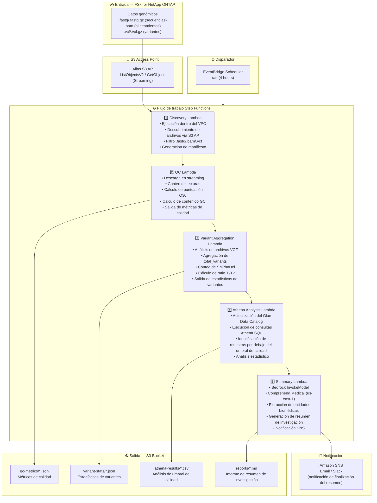

# UC7: Genómica — Control de calidad y agregación de llamadas de variantes

🌐 **Language / 言語**: [日本語](architecture.md) | [English](architecture.en.md) | [한국어](architecture.ko.md) | [简体中文](architecture.zh-CN.md) | [繁體中文](architecture.zh-TW.md) | [Français](architecture.fr.md) | [Deutsch](architecture.de.md) | Español

## Arquitectura de extremo a extremo (Entrada → Salida)

---

## Flujo de alto nivel

```
┌─────────────────────────────────────────────────────────────────────────────┐
│                         FSx for NetApp ONTAP                                 │
│                                                                              │
│  /vol/genomics_data/                                                         │
│  ├── fastq/sample_001/R1.fastq.gz          (FASTQ sequence data)            │
│  ├── fastq/sample_001/R2.fastq.gz          (FASTQ sequence data)            │
│  ├── bam/sample_001/aligned.bam            (BAM alignment data)             │
│  ├── vcf/sample_001/variants.vcf.gz        (VCF variant calls)              │
│  └── vcf/sample_002/variants.vcf           (VCF variant calls)              │
│                                                                              │
└──────────────────────────────────┬───────────────────────────────────────────┘
                                   │
                                   ▼
┌──────────────────────────────────────────────────────────────────────────────┐
│                      S3 Access Point (Data Path)                              │
│                                                                              │
│  Alias: fsxn-genomics-vol-ext-s3alias                                        │
│  • ListObjectsV2 (FASTQ/BAM/VCF file discovery)                             │
│  • GetObject (file retrieval — streaming download)                           │
│  • No NFS/SMB mount required from Lambda                                     │
│                                                                              │
└──────────────────────────────────┬───────────────────────────────────────────┘
                                   │
                                   ▼
┌──────────────────────────────────────────────────────────────────────────────┐
│                    EventBridge Scheduler (Trigger)                            │
│                                                                              │
│  Schedule: rate(4 hours) — configurable                                      │
│  Target: Step Functions State Machine                                        │
│                                                                              │
└──────────────────────────────────┬───────────────────────────────────────────┘
                                   │
                                   ▼
┌──────────────────────────────────────────────────────────────────────────────┐
│                    AWS Step Functions (Orchestration)                         │
│                                                                              │
│  ┌─────────────┐    ┌──────────────────────┐    ┌────────────────────────┐  │
│  │  Discovery   │───▶│  QC                  │───▶│  Variant Aggregation   │  │
│  │  Lambda      │    │  Lambda              │    │  Lambda                │  │
│  │             │    │                      │    │                       │  │
│  │  • VPC内     │    │  • Streaming         │    │  • VCF parsing         │  │
│  │  • S3 AP List│    │  • Q30 score         │    │  • SNP/InDel count     │  │
│  │  • FASTQ/VCF │    │  • GC content        │    │  • Ti/Tv ratio         │  │
│  └─────────────┘    └──────────────────────┘    └────────────────────────┘  │
│                                                         │                    │
│                                                         ▼                    │
│                      ┌──────────────────────┐    ┌────────────────────┐      │
│                      │  Summary             │◀───│  Athena Analysis   │      │
│                      │  Lambda              │    │  Lambda            │      │
│                      │                      │    │                   │      │
│                      │  • Bedrock           │    │  • Glue Catalog    │      │
│                      │  • Comprehend Medical│    │  • Athena SQL      │      │
│                      │  • Summary generation│    │  • Quality thresh  │      │
│                      └──────────────────────┘    └────────────────────┘      │
│                                                                              │
└──────────────────────────────────────────────────────────────────────────────┘
                                   │
                                   ▼
┌──────────────────────────────────────────────────────────────────────────────┐
│                         Output (S3 Bucket)                                    │
│                                                                              │
│  s3://{stack}-output-{account}/                                              │
│  ├── qc-metrics/YYYY/MM/DD/                                                  │
│  │   ├── sample_001_qc.json                ← Quality metrics                │
│  │   └── sample_002_qc.json                                                  │
│  ├── variant-stats/YYYY/MM/DD/                                               │
│  │   ├── sample_001_variants.json          ← Variant statistics             │
│  │   └── sample_002_variants.json                                            │
│  ├── athena-results/                                                         │
│  │   └── {query-execution-id}.csv          ← Quality threshold analysis     │
│  └── reports/YYYY/MM/DD/                                                     │
│      └── research_summary.md               ← Research summary report        │
│                                                                              │
└──────────────────────────────────────────────────────────────────────────────┘
```

---

## Diagrama Mermaid



---

## Detalle del flujo de datos

### Entrada
| Elemento | Descripción |
|----------|-------------|
| **Origen** | Volumen FSx for NetApp ONTAP |
| **Tipos de archivo** | .fastq/.fastq.gz (secuencias), .bam (alineamientos), .vcf/.vcf.gz (variantes) |
| **Método de acceso** | S3 Access Point (ListObjectsV2 + GetObject) |
| **Estrategia de lectura** | FASTQ: descarga en streaming (eficiente en memoria), VCF: recuperación completa |

### Procesamiento
| Paso | Servicio | Función |
|------|----------|---------|
| Discovery | Lambda (VPC) | Descubrimiento de archivos FASTQ/BAM/VCF vía S3 AP, generación de manifiesto |
| QC | Lambda | Extracción en streaming de métricas de calidad FASTQ (conteo de lecturas, Q30, contenido GC) |
| Variant Aggregation | Lambda | Análisis VCF para estadísticas de variantes (total_variants, snp_count, indel_count, ti_tv_ratio) |
| Athena Analysis | Lambda + Glue + Athena | Identificación por SQL de muestras por debajo del umbral de calidad, análisis estadístico |
| Summary | Lambda + Bedrock + Comprehend Medical | Generación de resumen de investigación, extracción de entidades biomédicas |

### Salida
| Artefacto | Formato | Descripción |
|-----------|---------|-------------|
| Métricas QC | `qc-metrics/YYYY/MM/DD/{sample}_qc.json` | Métricas de calidad (conteo de lecturas, Q30, contenido GC, puntuación de calidad promedio) |
| Estadísticas de variantes | `variant-stats/YYYY/MM/DD/{sample}_variants.json` | Estadísticas de variantes (total_variants, snp_count, indel_count, ti_tv_ratio) |
| Resultados Athena | `athena-results/{id}.csv` | Muestras por debajo del umbral de calidad y análisis estadístico |
| Resumen de investigación | `reports/YYYY/MM/DD/research_summary.md` | Informe de resumen de investigación generado por Bedrock |
| Notificación SNS | Email | Notificación de finalización del resumen y alertas de calidad |

---

## Decisiones de diseño clave

1. **Descarga en streaming** — Los archivos FASTQ pueden alcanzar decenas de GB; el procesamiento en streaming mantiene el uso de memoria dentro del límite de 10 GB de Lambda
2. **Análisis VCF ligero** — Extrae solo los campos mínimos necesarios para la agregación estadística, no es un analizador VCF completo
3. **Comprehend Medical entre regiones** — Disponible solo en us-east-1, por lo que se utiliza una invocación entre regiones
4. **Athena para análisis de umbral de calidad** — Umbrales parametrizados (Q30 < 80 %, contenido GC anormal, etc.) con filtrado SQL flexible
5. **Pipeline secuencial** — Step Functions gestiona las dependencias de orden: QC → agregación de variantes → análisis → resumen
6. **Sondeo (no basado en eventos)** — S3 AP no admite notificaciones de eventos, por lo que se utiliza una ejecución programada periódica

---

## Servicios AWS utilizados

| Servicio | Rol |
|----------|-----|
| FSx for NetApp ONTAP | Almacenamiento de datos genómicos (FASTQ/BAM/VCF) |
| S3 Access Points | Acceso serverless a volúmenes ONTAP (soporte de streaming) |
| EventBridge Scheduler | Activación periódica |
| Step Functions | Orquestación del flujo de trabajo (secuencial) |
| Lambda | Cómputo (Discovery, QC, Variant Aggregation, Athena Analysis, Summary) |
| Glue Data Catalog | Gestión de esquemas para métricas de calidad y estadísticas de variantes |
| Amazon Athena | Análisis de umbral de calidad basado en SQL y agregación estadística |
| Amazon Bedrock | Generación del informe de resumen de investigación (Claude / Nova) |
| Comprehend Medical | Extracción de entidades biomédicas (us-east-1 entre regiones) |
| SNS | Notificación de finalización del resumen y alertas de calidad |
| Secrets Manager | Gestión de credenciales de la API REST de ONTAP |
| CloudWatch + X-Ray | Observabilidad |
