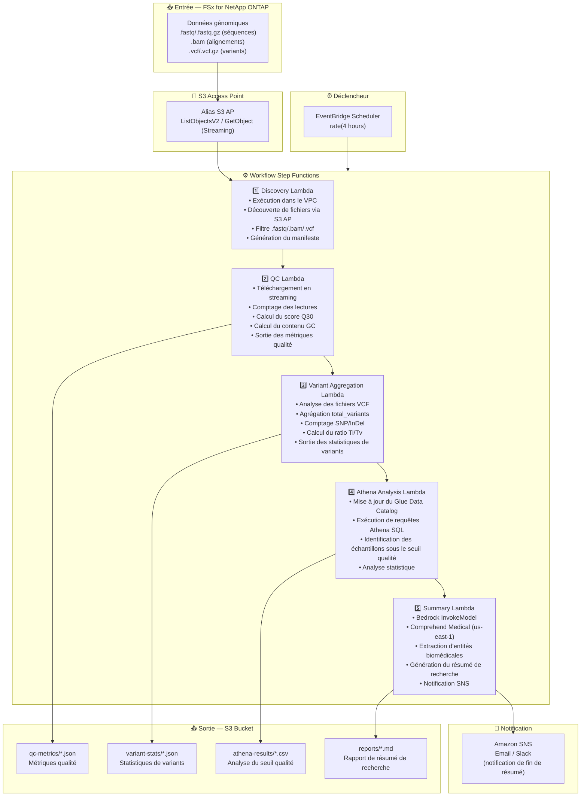

# UC7: Génomique — Contrôle qualité et agrégation d'appels de variants

🌐 **Language / 言語**: [日本語](architecture.md) | [English](architecture.en.md) | [한국어](architecture.ko.md) | [简体中文](architecture.zh-CN.md) | [繁體中文](architecture.zh-TW.md) | Français | [Deutsch](architecture.de.md) | [Español](architecture.es.md)

## Architecture de bout en bout (Entrée → Sortie)

---

## Diagramme d'architecture

---

## Détail du flux de données

### Entrée
| Élément | Description |
|---------|-------------|
| **Source** | Volume FSx for NetApp ONTAP |
| **Types de fichiers** | .fastq/.fastq.gz (séquences), .bam (alignements), .vcf/.vcf.gz (variants) |
| **Méthode d'accès** | S3 Access Point (ListObjectsV2 + GetObject) |
| **Stratégie de lecture** | FASTQ : téléchargement en streaming (efficace en mémoire), VCF : récupération complète |

### Traitement
| Étape | Service | Fonction |
|-------|---------|----------|
| Discovery | Lambda (VPC) | Découverte des fichiers FASTQ/BAM/VCF via S3 AP, génération du manifeste |
| QC | Lambda | Extraction des métriques qualité FASTQ en streaming (comptage lectures, Q30, contenu GC) |
| Variant Aggregation | Lambda | Analyse VCF pour statistiques de variants (total_variants, snp_count, indel_count, ti_tv_ratio) |
| Athena Analysis | Lambda + Glue + Athena | Identification par SQL des échantillons sous le seuil qualité, analyse statistique |
| Summary | Lambda + Bedrock + Comprehend Medical | Génération du résumé de recherche, extraction d'entités biomédicales |

### Sortie
| Artefact | Format | Description |
|----------|--------|-------------|
| Métriques QC | `qc-metrics/YYYY/MM/DD/{sample}_qc.json` | Métriques qualité (comptage lectures, Q30, contenu GC, score qualité moyen) |
| Statistiques de variants | `variant-stats/YYYY/MM/DD/{sample}_variants.json` | Statistiques de variants (total_variants, snp_count, indel_count, ti_tv_ratio) |
| Résultats Athena | `athena-results/{id}.csv` | Échantillons sous le seuil qualité et analyse statistique |
| Résumé de recherche | `reports/YYYY/MM/DD/research_summary.md` | Rapport de résumé de recherche généré par Bedrock |
| Notification SNS | Email | Notification de fin de résumé et alertes qualité |

---

## Décisions de conception clés

1. **Téléchargement en streaming** — Les fichiers FASTQ peuvent atteindre des dizaines de Go ; le traitement en streaming maintient l'utilisation mémoire dans la limite de 10 Go de Lambda
2. **Analyse VCF légère** — Extrait uniquement les champs minimaux nécessaires à l'agrégation statistique, pas un analyseur VCF complet
3. **Comprehend Medical inter-régions** — Disponible uniquement dans us-east-1, donc une invocation inter-régions est utilisée
4. **Athena pour l'analyse du seuil qualité** — Seuils paramétrés (Q30 < 80 %, contenu GC anormal, etc.) avec filtrage SQL flexible
5. **Pipeline séquentiel** — Step Functions gère les dépendances d'ordre : QC → agrégation de variants → analyse → résumé
6. **Interrogation périodique (non événementiel)** — S3 AP ne prend pas en charge les notifications d'événements, donc une exécution planifiée périodique est utilisée

---

## Services AWS utilisés

| Service | Rôle |
|---------|------|
| FSx for NetApp ONTAP | Stockage des données génomiques (FASTQ/BAM/VCF) |
| S3 Access Points | Accès serverless aux volumes ONTAP (support streaming) |
| EventBridge Scheduler | Déclenchement périodique |
| Step Functions | Orchestration du workflow (séquentiel) |
| Lambda | Calcul (Discovery, QC, Variant Aggregation, Athena Analysis, Summary) |
| Glue Data Catalog | Gestion des schémas pour métriques qualité et statistiques de variants |
| Amazon Athena | Analyse du seuil qualité par SQL et agrégation statistique |
| Amazon Bedrock | Génération du rapport de résumé de recherche (Claude / Nova) |
| Comprehend Medical | Extraction d'entités biomédicales (us-east-1 inter-régions) |
| SNS | Notification de fin de résumé et alertes qualité |
| Secrets Manager | Gestion des identifiants de l'API REST ONTAP |
| CloudWatch + X-Ray | Observabilité |
