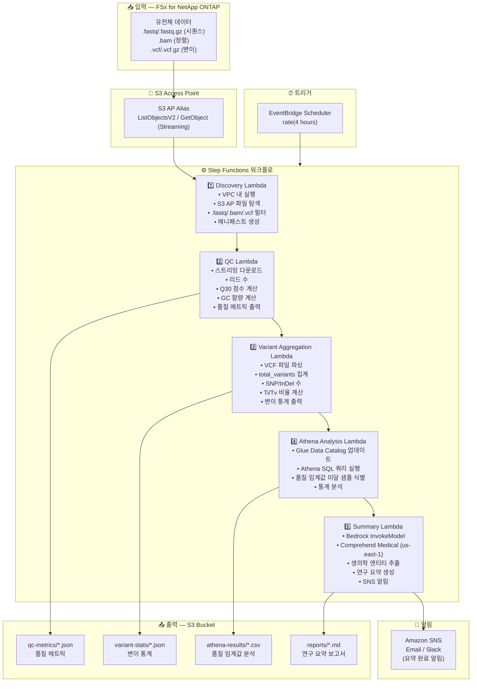

# UC7: 유전체학 — 품질 검사 및 변이 호출 집계

🌐 **Language / 言語**: [日本語](architecture.md) | [English](architecture.en.md) | 한국어 | [简体中文](architecture.zh-CN.md) | [繁體中文](architecture.zh-TW.md) | [Français](architecture.fr.md) | [Deutsch](architecture.de.md) | [Español](architecture.es.md)

## 엔드투엔드 아키텍처 (입력 → 출력)

---

## 상위 레벨 흐름

```
┌─────────────────────────────────────────────────────────────────────────────┐
│                         FSx for NetApp ONTAP                                 │
│                                                                              │
│  /vol/genomics_data/                                                         │
│  ├── fastq/sample_001/R1.fastq.gz          (FASTQ sequence data)            │
│  ├── fastq/sample_001/R2.fastq.gz          (FASTQ sequence data)            │
│  ├── bam/sample_001/aligned.bam            (BAM alignment data)             │
│  ├── vcf/sample_001/variants.vcf.gz        (VCF variant calls)              │
│  └── vcf/sample_002/variants.vcf           (VCF variant calls)              │
│                                                                              │
└──────────────────────────────────┬───────────────────────────────────────────┘
                                   │
                                   ▼
┌──────────────────────────────────────────────────────────────────────────────┐
│                      S3 Access Point (Data Path)                              │
│                                                                              │
│  Alias: fsxn-genomics-vol-ext-s3alias                                        │
│  • ListObjectsV2 (FASTQ/BAM/VCF file discovery)                             │
│  • GetObject (file retrieval — streaming download)                           │
│  • No NFS/SMB mount required from Lambda                                     │
│                                                                              │
└──────────────────────────────────┬───────────────────────────────────────────┘
                                   │
                                   ▼
┌──────────────────────────────────────────────────────────────────────────────┐
│                    EventBridge Scheduler (Trigger)                            │
│                                                                              │
│  Schedule: rate(4 hours) — configurable                                      │
│  Target: Step Functions State Machine                                        │
│                                                                              │
└──────────────────────────────────┬───────────────────────────────────────────┘
                                   │
                                   ▼
┌──────────────────────────────────────────────────────────────────────────────┐
│                    AWS Step Functions (Orchestration)                         │
│                                                                              │
│  ┌─────────────┐    ┌──────────────────────┐    ┌────────────────────────┐  │
│  │  Discovery   │───▶│  QC                  │───▶│  Variant Aggregation   │  │
│  │  Lambda      │    │  Lambda              │    │  Lambda                │  │
│  │             │    │                      │    │                       │  │
│  │  • VPC内     │    │  • Streaming         │    │  • VCF parsing         │  │
│  │  • S3 AP List│    │  • Q30 score         │    │  • SNP/InDel count     │  │
│  │  • FASTQ/VCF │    │  • GC content        │    │  • Ti/Tv ratio         │  │
│  └─────────────┘    └──────────────────────┘    └────────────────────────┘  │
│                                                         │                    │
│                                                         ▼                    │
│                      ┌──────────────────────┐    ┌────────────────────┐      │
│                      │  Summary             │◀───│  Athena Analysis   │      │
│                      │  Lambda              │    │  Lambda            │      │
│                      │                      │    │                   │      │
│                      │  • Bedrock           │    │  • Glue Catalog    │      │
│                      │  • Comprehend Medical│    │  • Athena SQL      │      │
│                      │  • Summary generation│    │  • Quality thresh  │      │
│                      └──────────────────────┘    └────────────────────┘      │
│                                                                              │
└──────────────────────────────────────────────────────────────────────────────┘
                                   │
                                   ▼
┌──────────────────────────────────────────────────────────────────────────────┐
│                         Output (S3 Bucket)                                    │
│                                                                              │
│  s3://{stack}-output-{account}/                                              │
│  ├── qc-metrics/YYYY/MM/DD/                                                  │
│  │   ├── sample_001_qc.json                ← Quality metrics                │
│  │   └── sample_002_qc.json                                                  │
│  ├── variant-stats/YYYY/MM/DD/                                               │
│  │   ├── sample_001_variants.json          ← Variant statistics             │
│  │   └── sample_002_variants.json                                            │
│  ├── athena-results/                                                         │
│  │   └── {query-execution-id}.csv          ← Quality threshold analysis     │
│  └── reports/YYYY/MM/DD/                                                     │
│      └── research_summary.md               ← Research summary report        │
│                                                                              │
└──────────────────────────────────────────────────────────────────────────────┘
```

---

## Mermaid 다이어그램



---

## 데이터 흐름 상세

### 입력
| 항목 | 설명 |
|------|------|
| **소스** | FSx for NetApp ONTAP 볼륨 |
| **파일 유형** | .fastq/.fastq.gz (시퀀스), .bam (정렬), .vcf/.vcf.gz (변이) |
| **접근 방식** | S3 Access Point (ListObjectsV2 + GetObject) |
| **읽기 전략** | FASTQ: 스트리밍 다운로드 (메모리 효율적), VCF: 전체 취득 |

### 처리
| 단계 | 서비스 | 기능 |
|------|--------|------|
| 탐색 | Lambda (VPC) | S3 AP를 통한 FASTQ/BAM/VCF 파일 탐색, 매니페스트 생성 |
| QC | Lambda | 스트리밍 FASTQ 품질 메트릭 추출 (리드 수, Q30, GC 함량) |
| 변이 집계 | Lambda | VCF 파싱을 통한 변이 통계 (total_variants, snp_count, indel_count, ti_tv_ratio) |
| Athena 분석 | Lambda + Glue + Athena | SQL 기반 품질 임계값 미달 샘플 식별, 통계 분석 |
| 요약 | Lambda + Bedrock + Comprehend Medical | 연구 요약 생성, 생의학 엔티티 추출 |

### 출력
| 산출물 | 형식 | 설명 |
|--------|------|------|
| QC 메트릭 | `qc-metrics/YYYY/MM/DD/{sample}_qc.json` | 품질 메트릭 (리드 수, Q30, GC 함량, 평균 품질 점수) |
| 변이 통계 | `variant-stats/YYYY/MM/DD/{sample}_variants.json` | 변이 통계 (total_variants, snp_count, indel_count, ti_tv_ratio) |
| Athena 결과 | `athena-results/{id}.csv` | 품질 임계값 미달 샘플 및 통계 분석 |
| 연구 요약 | `reports/YYYY/MM/DD/research_summary.md` | Bedrock 생성 연구 요약 보고서 |
| SNS 알림 | Email | 요약 완료 알림 및 품질 경보 |

---

## 주요 설계 결정

1. **스트리밍 다운로드** — FASTQ 파일은 수십 GB에 달할 수 있음; 스트리밍 처리로 Lambda 10GB 메모리 제한 내에서 유지
2. **경량 VCF 파싱** — 통계 집계에 필요한 최소 필드만 추출, 완전한 VCF 파서가 아님
3. **Comprehend Medical 크로스 리전** — us-east-1에서만 사용 가능하므로 크로스 리전 호출 사용
4. **Athena 품질 임계값 분석** — 파라미터화된 임계값 (Q30 < 80%, 비정상 GC 함량 등)으로 유연한 SQL 필터링
5. **순차 파이프라인** — Step Functions가 순서 의존성 관리: QC → 변이 집계 → 분석 → 요약
6. **폴링 (이벤트 기반 아님)** — S3 AP는 이벤트 알림을 지원하지 않으므로 정기적 스케줄 실행 사용

---

## 사용된 AWS 서비스

| 서비스 | 역할 |
|--------|------|
| FSx for NetApp ONTAP | 유전체 데이터 저장소 (FASTQ/BAM/VCF) |
| S3 Access Points | ONTAP 볼륨에 대한 서버리스 접근 (스트리밍 지원) |
| EventBridge Scheduler | 정기 트리거 |
| Step Functions | 워크플로 오케스트레이션 (순차) |
| Lambda | 컴퓨팅 (Discovery, QC, Variant Aggregation, Athena Analysis, Summary) |
| Glue Data Catalog | 품질 메트릭 및 변이 통계 스키마 관리 |
| Amazon Athena | SQL 기반 품질 임계값 분석 및 통계 집계 |
| Amazon Bedrock | 연구 요약 보고서 생성 (Claude / Nova) |
| Comprehend Medical | 생의학 엔티티 추출 (us-east-1 크로스 리전) |
| SNS | 요약 완료 알림 및 품질 경보 |
| Secrets Manager | ONTAP REST API 자격 증명 관리 |
| CloudWatch + X-Ray | 관측 가능성 |
