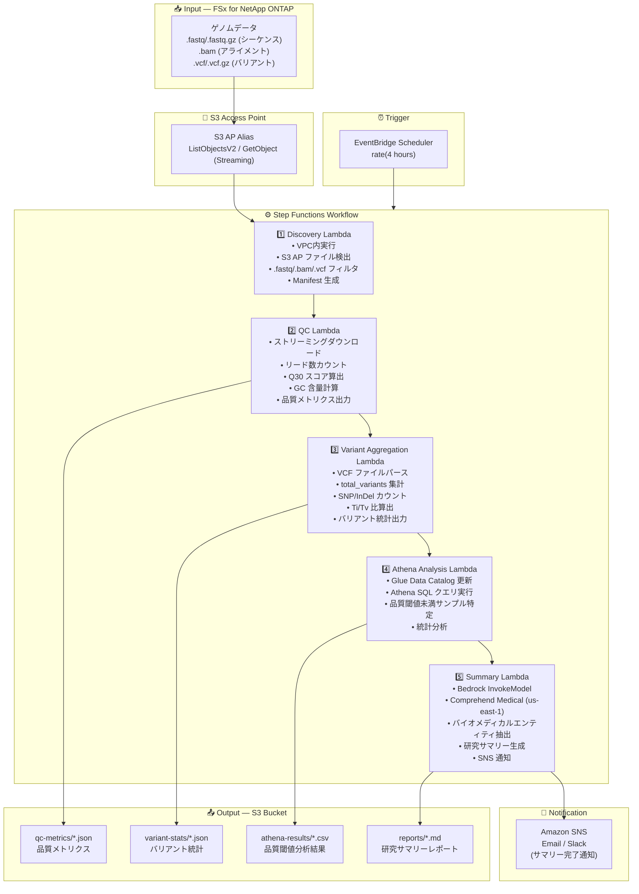

# UC7: ゲノミクス / バイオインフォマティクス — 品質チェック・バリアントコール集計

🌐 **Language / 言語**: 日本語 | [English](architecture.en.md) | [한국어](architecture.ko.md) | [简体中文](architecture.zh-CN.md) | [繁體中文](architecture.zh-TW.md) | [Français](architecture.fr.md) | [Deutsch](architecture.de.md) | [Español](architecture.es.md)

## End-to-End Architecture (Input → Output)

---

## Architecture Diagram

---

## Data Flow Detail

### Input
| Item | Description |
|------|-------------|
| **Source** | FSx for NetApp ONTAP volume |
| **File Types** | .fastq/.fastq.gz (シーケンス), .bam (アライメント), .vcf/.vcf.gz (バリアント) |
| **Access Method** | S3 Access Point (ListObjectsV2 + GetObject) |
| **Read Strategy** | FASTQ: ストリーミングダウンロード (メモリ効率), VCF: 全体取得 |

### Processing
| Step | Service | Function |
|------|---------|----------|
| Discovery | Lambda (VPC) | S3 AP で FASTQ/BAM/VCF ファイル検出、Manifest 生成 |
| QC | Lambda | ストリーミングで FASTQ 品質メトリクス抽出 (リード数, Q30, GC含量) |
| Variant Aggregation | Lambda | VCF パースによるバリアント統計集計 (total_variants, snp_count, indel_count, ti_tv_ratio) |
| Athena Analysis | Lambda + Glue + Athena | SQL で品質閾値未満サンプル特定、統計分析 |
| Summary | Lambda + Bedrock + Comprehend Medical | 研究サマリー生成、バイオメディカルエンティティ抽出 |

### Output
| Artifact | Format | Description |
|----------|--------|-------------|
| QC Metrics | `qc-metrics/YYYY/MM/DD/{sample}_qc.json` | 品質メトリクス (リード数, Q30, GC含量, 平均品質スコア) |
| Variant Stats | `variant-stats/YYYY/MM/DD/{sample}_variants.json` | バリアント統計 (total_variants, snp_count, indel_count, ti_tv_ratio) |
| Athena Results | `athena-results/{id}.csv` | 品質閾値未満サンプル一覧・統計分析結果 |
| Research Summary | `reports/YYYY/MM/DD/research_summary.md` | Bedrock 生成研究サマリーレポート |
| SNS Notification | Email | サマリー完了通知・品質アラート |

---

## Key Design Decisions

1. **ストリーミングダウンロード** — FASTQ ファイルは数十 GB に達するため、ストリーミング処理でメモリ使用量を抑制 (Lambda 10GB 制限内)
2. **VCF パースの軽量実装** — 完全な VCF パーサーではなく、統計集計に必要な最小限のフィールドのみ抽出
3. **Comprehend Medical クロスリージョン** — us-east-1 でのみ利用可能なため、クロスリージョン呼び出しで対応
4. **Athena による品質閾値分析** — Q30 < 80%, GC含量異常等の閾値をパラメータ化し、SQL で柔軟にフィルタリング
5. **シーケンシャルパイプライン** — QC → バリアント集計 → 分析 → サマリーの順序依存性を Step Functions で管理
6. **ポーリングベース** — S3 AP はイベント通知非対応のため、定期スケジュール実行

---

## AWS Services Used

| Service | Role |
|---------|------|
| FSx for NetApp ONTAP | ゲノムデータストレージ (FASTQ/BAM/VCF) |
| S3 Access Points | ONTAP ボリュームへのサーバーレスアクセス (ストリーミング対応) |
| EventBridge Scheduler | 定期トリガー |
| Step Functions | ワークフローオーケストレーション (シーケンシャル) |
| Lambda | コンピュート (Discovery, QC, Variant Aggregation, Athena Analysis, Summary) |
| Glue Data Catalog | 品質メトリクス・バリアント統計のスキーマ管理 |
| Amazon Athena | SQL ベースの品質閾値分析・統計集計 |
| Amazon Bedrock | 研究サマリーレポート生成 (Claude / Nova) |
| Comprehend Medical | バイオメディカルエンティティ抽出 (us-east-1 クロスリージョン) |
| SNS | サマリー完了通知・品質アラート |
| Secrets Manager | ONTAP REST API 認証情報管理 |
| CloudWatch + X-Ray | オブザーバビリティ |
