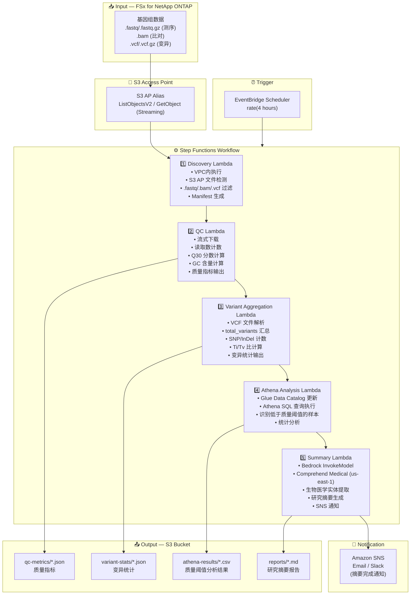

# UC7: 基因组学 / 生物信息学 — 质量检查·变异调用汇总

🌐 **Language / 언어 / 语言 / 語言 / Langue / Sprache / Idioma**: [日本語](architecture.md) | [English](architecture.en.md) | [한국어](architecture.ko.md) | 简体中文 | [繁體中文](architecture.zh-TW.md) | [Français](architecture.fr.md) | [Deutsch](architecture.de.md) | [Español](architecture.es.md)

> 注意：此翻译由 Amazon Bedrock Claude 生成。欢迎对翻译质量提出改进建议。

## End-to-End Architecture (Input → Output)

---

## Architecture Diagram

---

## Data Flow Detail

### Input
| Item | Description |
|------|-------------|
| **Source** | FSx for NetApp ONTAP volume |
| **File Types** | .fastq/.fastq.gz (测序), .bam (比对), .vcf/.vcf.gz (变异) |
| **Access Method** | S3 Access Point (ListObjectsV2 + GetObject) |
| **Read Strategy** | FASTQ: 流式下载 (内存高效), VCF: 完整获取 |

### Processing
| Step | Service | Function |
|------|---------|----------|
| Discovery | Lambda (VPC) | 通过 S3 AP 检测 FASTQ/BAM/VCF 文件，生成 Manifest |
| QC | Lambda | 流式提取 FASTQ 质量指标 (读取数, Q30, GC含量) |
| Variant Aggregation | Lambda | 通过 VCF 解析汇总变异统计 (total_variants, snp_count, indel_count, ti_tv_ratio) |
| Athena Analysis | Lambda + Glue + Athena | 使用 SQL 识别低于质量阈值的样本，统计分析 |
| Summary | Lambda + Bedrock + Comprehend Medical | 生成研究摘要，提取生物医学实体 |

### Output
| Artifact | Format | Description |
|----------|--------|-------------|
| QC Metrics | `qc-metrics/YYYY/MM/DD/{sample}_qc.json` | 质量指标 (读取数, Q30, GC含量, 平均质量分数) |
| Variant Stats | `variant-stats/YYYY/MM/DD/{sample}_variants.json` | 变异统计 (total_variants, snp_count, indel_count, ti_tv_ratio) |
| Athena Results | `athena-results/{id}.csv` | 低于质量阈值的样本列表·统计分析结果 |
| Research Summary | `reports/YYYY/MM/DD/research_summary.md` | Bedrock 生成的研究摘要报告 |
| SNS Notification | Email | 摘要完成通知·质量警报 |

---

## Key Design Decisions

1. **流式下载** — FASTQ 文件可达数十 GB，通过流式处理抑制内存使用量 (Lambda 10GB 限制内)
2. **VCF 解析的轻量实现** — 不使用完整的 VCF 解析器，仅提取统计汇总所需的最小字段
3. **Comprehend Medical 跨区域** — 仅在 us-east-1 可用，因此通过跨区域调用实现
4. **Athena 质量阈值分析** — 将 Q30 < 80%、GC含量异常等阈值参数化，使用 SQL 灵活过滤
5. **顺序流水线** — 通过 Step Functions 管理 QC → 变异汇总 → 分析 → 摘要的顺序依赖性
6. **基于轮询** — S3 AP 不支持事件通知，因此采用定期计划执行

---

## AWS Services Used

| Service | Role |
|---------|------|
| FSx for NetApp ONTAP | 基因组数据存储 (FASTQ/BAM/VCF) |
| S3 Access Points | 对 ONTAP 卷的无服务器访问 (支持流式传输) |
| EventBridge Scheduler | 定期触发器 |
| Step Functions | 工作流编排 (顺序) |
| Lambda | 计算 (Discovery, QC, Variant Aggregation, Athena Analysis, Summary) |
| Glue Data Catalog | 质量指标·变异统计的架构管理 |
| Amazon Athena | 基于 SQL 的质量阈值分析·统计汇总 |
| Amazon Bedrock | 研究摘要报告生成 (Claude / Nova) |
| Comprehend Medical | 生物医学实体提取 (us-east-1 跨区域) |
| SNS | 摘要完成通知·质量警报 |
| Secrets Manager | ONTAP REST API 凭证管理 |
| CloudWatch + X-Ray | 可观测性 |
