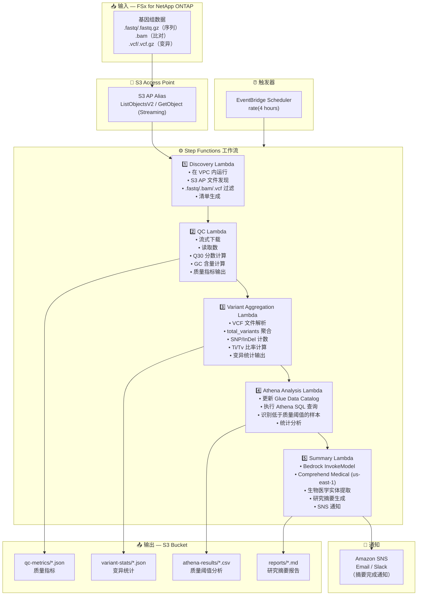

# UC7: 基因组学 — 质量检查与变异调用聚合

🌐 **Language / 言語**: [日本語](architecture.md) | [English](architecture.en.md) | [한국어](architecture.ko.md) | 简体中文 | [繁體中文](architecture.zh-TW.md) | [Français](architecture.fr.md) | [Deutsch](architecture.de.md) | [Español](architecture.es.md)

## 端到端架构（输入 → 输出）

---

## 高层级流程

```
┌─────────────────────────────────────────────────────────────────────────────┐
│                         FSx for NetApp ONTAP                                 │
│                                                                              │
│  /vol/genomics_data/                                                         │
│  ├── fastq/sample_001/R1.fastq.gz          (FASTQ sequence data)            │
│  ├── fastq/sample_001/R2.fastq.gz          (FASTQ sequence data)            │
│  ├── bam/sample_001/aligned.bam            (BAM alignment data)             │
│  ├── vcf/sample_001/variants.vcf.gz        (VCF variant calls)              │
│  └── vcf/sample_002/variants.vcf           (VCF variant calls)              │
│                                                                              │
└──────────────────────────────────┬───────────────────────────────────────────┘
                                   │
                                   ▼
┌──────────────────────────────────────────────────────────────────────────────┐
│                      S3 Access Point (Data Path)                              │
│                                                                              │
│  Alias: fsxn-genomics-vol-ext-s3alias                                        │
│  • ListObjectsV2 (FASTQ/BAM/VCF file discovery)                             │
│  • GetObject (file retrieval — streaming download)                           │
│  • No NFS/SMB mount required from Lambda                                     │
│                                                                              │
└──────────────────────────────────┬───────────────────────────────────────────┘
                                   │
                                   ▼
┌──────────────────────────────────────────────────────────────────────────────┐
│                    EventBridge Scheduler (Trigger)                            │
│                                                                              │
│  Schedule: rate(4 hours) — configurable                                      │
│  Target: Step Functions State Machine                                        │
│                                                                              │
└──────────────────────────────────┬───────────────────────────────────────────┘
                                   │
                                   ▼
┌──────────────────────────────────────────────────────────────────────────────┐
│                    AWS Step Functions (Orchestration)                         │
│                                                                              │
│  ┌─────────────┐    ┌──────────────────────┐    ┌────────────────────────┐  │
│  │  Discovery   │───▶│  QC                  │───▶│  Variant Aggregation   │  │
│  │  Lambda      │    │  Lambda              │    │  Lambda                │  │
│  │             │    │                      │    │                       │  │
│  │  • VPC内     │    │  • Streaming         │    │  • VCF parsing         │  │
│  │  • S3 AP List│    │  • Q30 score         │    │  • SNP/InDel count     │  │
│  │  • FASTQ/VCF │    │  • GC content        │    │  • Ti/Tv ratio         │  │
│  └─────────────┘    └──────────────────────┘    └────────────────────────┘  │
│                                                         │                    │
│                                                         ▼                    │
│                      ┌──────────────────────┐    ┌────────────────────┐      │
│                      │  Summary             │◀───│  Athena Analysis   │      │
│                      │  Lambda              │    │  Lambda            │      │
│                      │                      │    │                   │      │
│                      │  • Bedrock           │    │  • Glue Catalog    │      │
│                      │  • Comprehend Medical│    │  • Athena SQL      │      │
│                      │  • Summary generation│    │  • Quality thresh  │      │
│                      └──────────────────────┘    └────────────────────┘      │
│                                                                              │
└──────────────────────────────────────────────────────────────────────────────┘
                                   │
                                   ▼
┌──────────────────────────────────────────────────────────────────────────────┐
│                         Output (S3 Bucket)                                    │
│                                                                              │
│  s3://{stack}-output-{account}/                                              │
│  ├── qc-metrics/YYYY/MM/DD/                                                  │
│  │   ├── sample_001_qc.json                ← Quality metrics                │
│  │   └── sample_002_qc.json                                                  │
│  ├── variant-stats/YYYY/MM/DD/                                               │
│  │   ├── sample_001_variants.json          ← Variant statistics             │
│  │   └── sample_002_variants.json                                            │
│  ├── athena-results/                                                         │
│  │   └── {query-execution-id}.csv          ← Quality threshold analysis     │
│  └── reports/YYYY/MM/DD/                                                     │
│      └── research_summary.md               ← Research summary report        │
│                                                                              │
└──────────────────────────────────────────────────────────────────────────────┘
```

---

## Mermaid 图表



---

## 数据流详细说明

### 输入
| 项目 | 说明 |
|------|------|
| **来源** | FSx for NetApp ONTAP 卷 |
| **文件类型** | .fastq/.fastq.gz（序列）、.bam（比对）、.vcf/.vcf.gz（变异） |
| **访问方式** | S3 Access Point（ListObjectsV2 + GetObject） |
| **读取策略** | FASTQ：流式下载（内存高效），VCF：完整获取 |

### 处理
| 步骤 | 服务 | 功能 |
|------|------|------|
| 发现 | Lambda（VPC） | 通过 S3 AP 发现 FASTQ/BAM/VCF 文件，生成清单 |
| QC | Lambda | 流式 FASTQ 质量指标提取（读取数、Q30、GC 含量） |
| 变异聚合 | Lambda | VCF 解析获取变异统计（total_variants、snp_count、indel_count、ti_tv_ratio） |
| Athena 分析 | Lambda + Glue + Athena | 基于 SQL 识别低于质量阈值的样本，统计分析 |
| 摘要 | Lambda + Bedrock + Comprehend Medical | 研究摘要生成，生物医学实体提取 |

### 输出
| 产出物 | 格式 | 说明 |
|--------|------|------|
| QC 指标 | `qc-metrics/YYYY/MM/DD/{sample}_qc.json` | 质量指标（读取数、Q30、GC 含量、平均质量分数） |
| 变异统计 | `variant-stats/YYYY/MM/DD/{sample}_variants.json` | 变异统计（total_variants、snp_count、indel_count、ti_tv_ratio） |
| Athena 结果 | `athena-results/{id}.csv` | 低于质量阈值的样本及统计分析 |
| 研究摘要 | `reports/YYYY/MM/DD/research_summary.md` | Bedrock 生成的研究摘要报告 |
| SNS 通知 | Email | 摘要完成通知及质量警报 |

---

## 关键设计决策

1. **流式下载** — FASTQ 文件可达数十 GB；流式处理将内存使用保持在 Lambda 10GB 限制内
2. **轻量 VCF 解析** — 仅提取统计聚合所需的最少字段，非完整 VCF 解析器
3. **Comprehend Medical 跨区域** — 仅在 us-east-1 可用，因此使用跨区域调用
4. **Athena 质量阈值分析** — 参数化阈值（Q30 < 80%、异常 GC 含量等）的灵活 SQL 过滤
5. **顺序管道** — Step Functions 管理顺序依赖：QC → 变异聚合 → 分析 → 摘要
6. **轮询（非事件驱动）** — S3 AP 不支持事件通知，因此采用定期调度执行

---

## 使用的 AWS 服务

| 服务 | 角色 |
|------|------|
| FSx for NetApp ONTAP | 基因组数据存储（FASTQ/BAM/VCF） |
| S3 Access Points | 对 ONTAP 卷的无服务器访问（流式支持） |
| EventBridge Scheduler | 定期触发 |
| Step Functions | 工作流编排（顺序） |
| Lambda | 计算（Discovery、QC、Variant Aggregation、Athena Analysis、Summary） |
| Glue Data Catalog | 质量指标及变异统计模式管理 |
| Amazon Athena | 基于 SQL 的质量阈值分析及统计聚合 |
| Amazon Bedrock | 研究摘要报告生成（Claude / Nova） |
| Comprehend Medical | 生物医学实体提取（us-east-1 跨区域） |
| SNS | 摘要完成通知及质量警报 |
| Secrets Manager | ONTAP REST API 凭证管理 |
| CloudWatch + X-Ray | 可观测性 |
