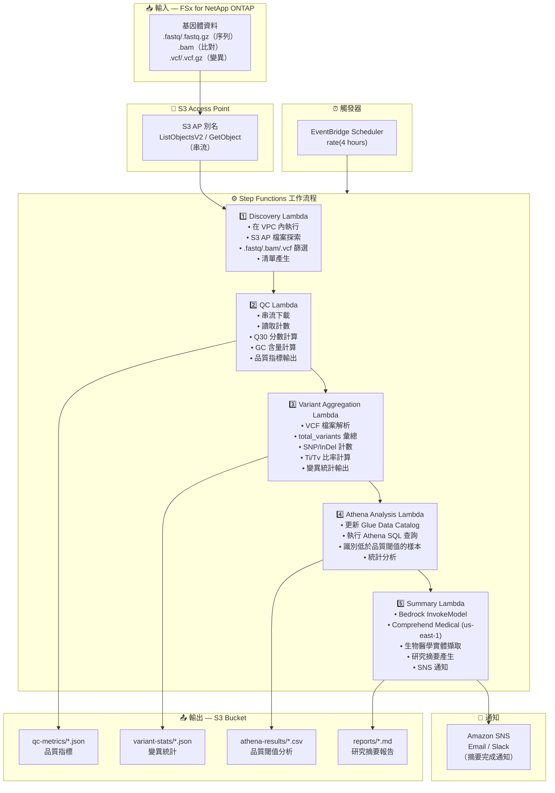

# UC7: 基因體學 — 品質檢查與變異調用彙總

🌐 **Language / 言語**: [日本語](architecture.md) | [English](architecture.en.md) | [한국어](architecture.ko.md) | [简体中文](architecture.zh-CN.md) | 繁體中文 | [Français](architecture.fr.md) | [Deutsch](architecture.de.md) | [Español](architecture.es.md)

## 端到端架構（輸入 → 輸出）

---

## 架構圖

---

## 資料流程詳細說明

### 輸入
| 項目 | 說明 |
|------|------|
| **來源** | FSx for NetApp ONTAP 磁碟區 |
| **檔案類型** | .fastq/.fastq.gz（序列）、.bam（比對）、.vcf/.vcf.gz（變異） |
| **存取方式** | S3 Access Point（ListObjectsV2 + GetObject） |
| **讀取策略** | FASTQ：串流下載（記憶體效率高）、VCF：完整擷取 |

### 處理
| 步驟 | 服務 | 功能 |
|------|------|------|
| Discovery | Lambda（VPC） | 透過 S3 AP 探索 FASTQ/BAM/VCF 檔案，產生清單 |
| QC | Lambda | 串流 FASTQ 品質指標擷取（讀取計數、Q30、GC 含量） |
| Variant Aggregation | Lambda | VCF 解析以取得變異統計（total_variants、snp_count、indel_count、ti_tv_ratio） |
| Athena Analysis | Lambda + Glue + Athena | 基於 SQL 識別低於品質閾值的樣本、統計分析 |
| Summary | Lambda + Bedrock + Comprehend Medical | 研究摘要產生、生物醫學實體擷取 |

### 輸出
| 產出物 | 格式 | 說明 |
|--------|------|------|
| QC 指標 | `qc-metrics/YYYY/MM/DD/{sample}_qc.json` | 品質指標（讀取計數、Q30、GC 含量、平均品質分數） |
| 變異統計 | `variant-stats/YYYY/MM/DD/{sample}_variants.json` | 變異統計（total_variants、snp_count、indel_count、ti_tv_ratio） |
| Athena 結果 | `athena-results/{id}.csv` | 低於品質閾值的樣本與統計分析 |
| 研究摘要 | `reports/YYYY/MM/DD/research_summary.md` | Bedrock 產生的研究摘要報告 |
| SNS 通知 | Email | 摘要完成通知與品質警報 |

---

## 關鍵設計決策

1. **串流下載** — FASTQ 檔案可達數十 GB；串流處理將記憶體使用量控制在 Lambda 10GB 限制內
2. **輕量級 VCF 解析** — 僅擷取統計彙總所需的最少欄位，非完整 VCF 解析器
3. **Comprehend Medical 跨區域** — 僅在 us-east-1 可用，因此使用跨區域調用
4. **Athena 品質閾值分析** — 參數化閾值（Q30 < 80%、異常 GC 含量等），搭配靈活的 SQL 篩選
5. **循序管線** — Step Functions 管理順序相依性：QC → 變異彙總 → 分析 → 摘要
6. **輪詢（非事件驅動）** — S3 AP 不支援事件通知，因此使用定期排程執行

---

## 使用的 AWS 服務

| 服務 | 角色 |
|------|------|
| FSx for NetApp ONTAP | 基因體資料儲存（FASTQ/BAM/VCF） |
| S3 Access Points | 無伺服器存取 ONTAP 磁碟區（支援串流） |
| EventBridge Scheduler | 定期觸發 |
| Step Functions | 工作流程編排（循序） |
| Lambda | 運算（Discovery、QC、Variant Aggregation、Athena Analysis、Summary） |
| Glue Data Catalog | 品質指標與變異統計的結構描述管理 |
| Amazon Athena | 基於 SQL 的品質閾值分析與統計彙總 |
| Amazon Bedrock | 研究摘要報告產生（Claude / Nova） |
| Comprehend Medical | 生物醫學實體擷取（us-east-1 跨區域） |
| SNS | 摘要完成通知與品質警報 |
| Secrets Manager | ONTAP REST API 憑證管理 |
| CloudWatch + X-Ray | 可觀測性 |
