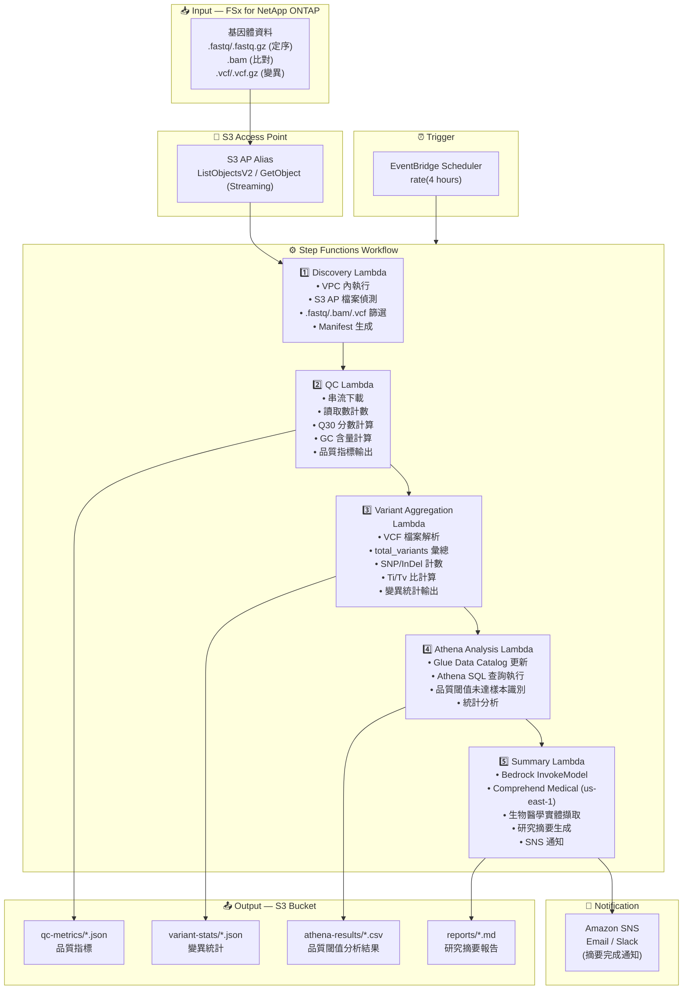

# UC7: 基因組學 / 生物資訊學 — 品質檢查・變異呼叫統計

🌐 **Language / 언어 / 语言 / 語言 / Langue / Sprache / Idioma**: [日本語](architecture.md) | [English](architecture.en.md) | [한국어](architecture.ko.md) | [简体中文](architecture.zh-CN.md) | 繁體中文 | [Français](architecture.fr.md) | [Deutsch](architecture.de.md) | [Español](architecture.es.md)

> 注意：此翻譯由 Amazon Bedrock Claude 產生。歡迎對翻譯品質提出改進建議。

## End-to-End Architecture (Input → Output)

---

## Architecture Diagram

---

## Data Flow Detail

### Input
| Item | Description |
|------|-------------|
| **Source** | FSx for NetApp ONTAP volume |
| **File Types** | .fastq/.fastq.gz (定序), .bam (比對), .vcf/.vcf.gz (變異) |
| **Access Method** | S3 Access Point (ListObjectsV2 + GetObject) |
| **Read Strategy** | FASTQ: 串流下載 (記憶體效率), VCF: 完整取得 |

### Processing
| Step | Service | Function |
|------|---------|----------|
| Discovery | Lambda (VPC) | 透過 S3 AP 偵測 FASTQ/BAM/VCF 檔案，生成 Manifest |
| QC | Lambda | 串流方式擷取 FASTQ 品質指標 (讀取數, Q30, GC含量) |
| Variant Aggregation | Lambda | 透過 VCF 解析彙總變異統計 (total_variants, snp_count, indel_count, ti_tv_ratio) |
| Athena Analysis | Lambda + Glue + Athena | 透過 SQL 識別品質閾值未達樣本，統計分析 |
| Summary | Lambda + Bedrock + Comprehend Medical | 生成研究摘要，擷取生物醫學實體 |

### Output
| Artifact | Format | Description |
|----------|--------|-------------|
| QC Metrics | `qc-metrics/YYYY/MM/DD/{sample}_qc.json` | 品質指標 (讀取數, Q30, GC含量, 平均品質分數) |
| Variant Stats | `variant-stats/YYYY/MM/DD/{sample}_variants.json` | 變異統計 (total_variants, snp_count, indel_count, ti_tv_ratio) |
| Athena Results | `athena-results/{id}.csv` | 品質閾值未達樣本清單・統計分析結果 |
| Research Summary | `reports/YYYY/MM/DD/research_summary.md` | Bedrock 生成研究摘要報告 |
| SNS Notification | Email | 摘要完成通知・品質警示 |

---

## Key Design Decisions

1. **串流下載** — FASTQ 檔案可達數十 GB，透過串流處理抑制記憶體使用量 (Lambda 10GB 限制內)
2. **VCF 解析的輕量實作** — 非完整 VCF 解析器，僅擷取統計彙總所需的最小欄位
3. **Comprehend Medical 跨區域** — 僅在 us-east-1 可用，因此透過跨區域呼叫對應
4. **Athena 品質閾值分析** — 將 Q30 < 80%、GC含量異常等閾值參數化，透過 SQL 靈活篩選
5. **循序管線** — 透過 Step Functions 管理 QC → 變異彙總 → 分析 → 摘要的順序相依性
6. **輪詢基礎** — S3 AP 不支援事件通知，因此採用定期排程執行

---

## AWS Services Used

| Service | Role |
|---------|------|
| FSx for NetApp ONTAP | 基因體資料儲存 (FASTQ/BAM/VCF) |
| S3 Access Points | 對 ONTAP 磁碟區的無伺服器存取 (支援串流) |
| EventBridge Scheduler | 定期觸發 |
| Step Functions | 工作流程編排 (循序) |
| Lambda | 運算 (Discovery, QC, Variant Aggregation, Athena Analysis, Summary) |
| Glue Data Catalog | 品質指標・變異統計的結構描述管理 |
| Amazon Athena | 基於 SQL 的品質閾值分析・統計彙總 |
| Amazon Bedrock | 研究摘要報告生成 (Claude / Nova) |
| Comprehend Medical | 生物醫學實體擷取 (us-east-1 跨區域) |
| SNS | 摘要完成通知・品質警示 |
| Secrets Manager | ONTAP REST API 認證資訊管理 |
| CloudWatch + X-Ray | 可觀測性 |
