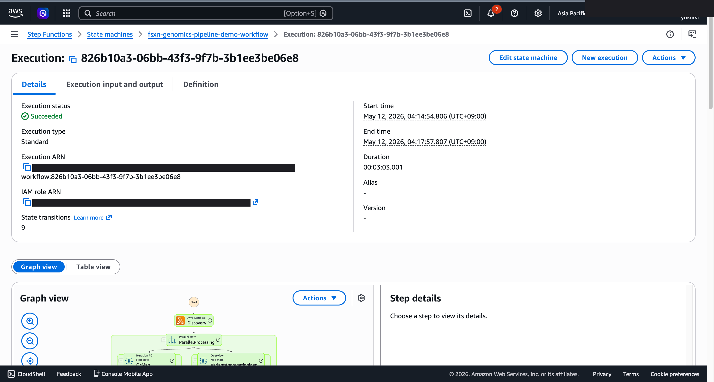
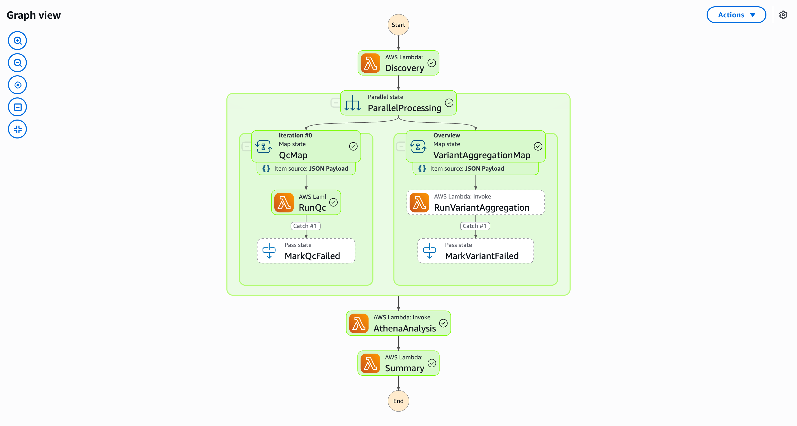

# QC de secuenciación y agregación de variantes -- Demo Guide

🌐 **Language / 言語**: [日本語](demo-guide.md) | [English](demo-guide.en.md) | [한국어](demo-guide.ko.md) | [简体中文](demo-guide.zh-CN.md) | [繁體中文](demo-guide.zh-TW.md) | [Français](demo-guide.fr.md) | [Deutsch](demo-guide.de.md) | Español

## Executive Summary

Esta demo presenta un pipeline de control de calidad (QC) y agregación de variantes para datos de secuenciación genómica.

**Mensaje clave**: Validar automáticamente la calidad de datos de secuenciación y agregar variantes para que los investigadores se concentren en el análisis.

**Duración prevista**: 3–5 min

---

## Workflow

```
Carga FASTQ → Validación QC → Llamada variantes → Agregación estadística → Reporte QC
```

---

## Storyboard (5 Sections / 3–5 min)

### Section 1 (0:00–0:45)
> Problema: El QC manual de grandes volúmenes de datos de secuenciación consume mucho tiempo

### Section 2 (0:45–1:30)
> Carga: Colocar archivos FASTQ inicia el pipeline

### Section 3 (1:30–2:30)
> QC y análisis de variantes: Validación automática de calidad y llamada de variantes

### Section 4 (2:30–3:45)
> Resultados: Métricas QC y estadísticas de variantes

### Section 5 (3:45–5:00)
> Reporte QC: Informe de calidad completo y recomendaciones para análisis posteriores

---

## Technical Notes

| Component | Role |
|-----------|------|
| Step Functions | Orquestación del flujo de trabajo |
| Lambda (QC Validator) | Validación de calidad de secuenciación |
| Lambda (Variant Caller) | Llamada de variantes |
| Lambda (Stats Aggregator) | Agregación de estadísticas de variantes |
| Amazon Athena | Análisis de métricas QC |

---

*Este documento sirve como guía de producción para videos de demostración técnica.*

---

## Capturas de pantalla UI/UX verificadas

Siguiendo el mismo enfoque que las demos de Phase 7 UC15/16/17 y UC6/11/14, dirigido a
**pantallas UI/UX que los usuarios finales realmente ven en sus operaciones diarias**.
Las vistas técnicas (gráfico de Step Functions, eventos de pila CloudFormation, etc.)
están consolidadas en `docs/verification-results-*.md`.

### Estado de verificación para este caso de uso

- ⚠️ **E2E**: Partial (additional verification recommended)
- 📸 **Captura UI/UX**: ✅ SUCCEEDED (Phase 8 Theme D, commit 2b958db — redesplegado tras corrección IAM S3AP, 3:03 todos los pasos exitosos)

### Capturas de pantalla existentes (de Phase 1-6)





### Pantallas UI/UX objetivo para re-verificación (lista de capturas recomendadas)

- Bucket S3 de salida (fastq-qc/, variant-summary/, entities/)
- Resultados de consulta Athena (agregación de frecuencia de variantes)
- Entidades Comprehend Medical (Genes, Enfermedades, Mutaciones)
- Informe de investigación generado por Bedrock

### Guía de captura

1. **Preparación**: Ejecutar `bash scripts/verify_phase7_prerequisites.sh` para verificar prerrequisitos
2. **Datos de ejemplo**: Subir archivos vía S3 AP Alias, luego iniciar el workflow de Step Functions
3. **Captura** (cerrar CloudShell/terminal, enmascarar nombre de usuario en la esquina superior derecha del navegador)
4. **Enmascaramiento**: Ejecutar `python3 scripts/mask_uc_demos.py <uc-dir>` para enmascaramiento OCR automático
5. **Limpieza**: Ejecutar `bash scripts/cleanup_generic_ucs.sh <UC>` para eliminar la pila
