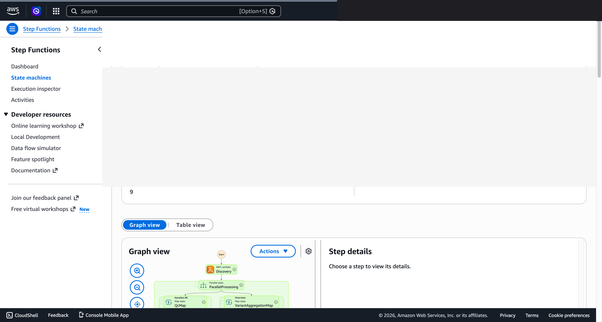
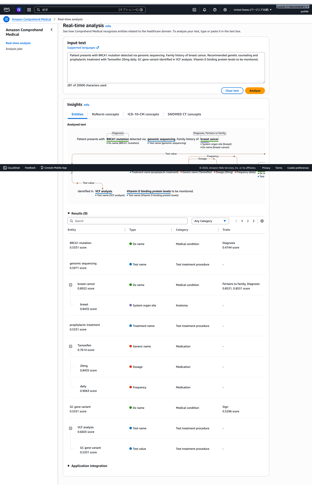

# 시퀀싱 QC・변이체 집계 — Demo Guide

🌐 **Language / 언어 / 语言 / 語言 / Langue / Sprache / Idioma**: [日本語](demo-guide.md) | [English](demo-guide.en.md) | 한국어 | [简体中文](demo-guide.zh-CN.md) | [繁體中文](demo-guide.zh-TW.md) | [Français](demo-guide.fr.md) | [Deutsch](demo-guide.de.md) | [Español](demo-guide.es.md)

> 참고: 이 번역은 Amazon Bedrock Claude로 생성되었습니다. 번역 품질 향상에 대한 기여를 환영합니다.

## Executive Summary

본 데모에서는 차세대 시퀀싱(NGS) 데이터의 품질 관리 및 변이 집계 파이프라인을 실연한다. 시퀀싱 품질을 자동 검증하고, 변이 콜 결과를 집계·보고서화한다.

**데모의 핵심 메시지**: 시퀀싱 데이터의 QC를 자동화하고, 변이 집계 보고서를 즉시 생성. 분석의 신뢰성을 담보한다.

**예상 시간**: 3~5분

---

## Target Audience & Persona

| 항목 | 세부사항 |
|------|------|
| **직책** | 바이오인포매티션 / 게놈 분석 연구자 |
| **일상 업무** | 시퀀싱 데이터 QC, 변이 콜, 결과 해석 |
| **과제** | 대량 샘플의 QC를 수동으로 확인하는 것은 시간이 많이 소요됨 |
| **기대하는 성과** | QC 자동화와 변이 집계의 효율화 |

### Persona: 가토 씨(바이오인포매티션)

- 주당 100+ 샘플의 시퀀싱 데이터를 처리
- QC 기준을 충족하지 못하는 샘플의 조기 검출이 필요
- "QC 통과한 샘플만 자동으로 다운스트림 분석에 보내고 싶다"

---

## Demo Scenario: 시퀀싱 배치 QC

### 워크플로우 전체 구조

```
FASTQ/BAM 파일    QC 분석        품질 판정         변이 집계
(100+ 샘플)  →   메트릭스  →   Pass/Fail   →   보고서 생성
                     산출            필터
```

---

## Storyboard（5 섹션 / 3~5분）

### Section 1: Problem Statement（0:00–0:45）

**내레이션 요지**:
> 주당 100 샘플 이상의 시퀀싱 데이터. 품질이 나쁜 샘플이 다운스트림 분석에 혼입되면, 결과 전체의 신뢰성이 저하된다.

**Key Visual**: 시퀀싱 데이터 파일 목록

### Section 2: Pipeline Trigger（0:45–1:30）

**내레이션 요지**:
> 시퀀싱 런 완료 후, QC 파이프라인이 자동 시작. 전체 샘플을 병렬 처리.

**Key Visual**: 워크플로우 시작, 샘플 목록

### Section 3: QC Metrics（1:30–2:30）

**내레이션 요지**:
> 각 샘플의 QC 메트릭스를 산출: 리드 수, Q30 비율, 매핑 비율, 커버리지 깊이, 중복률.

**Key Visual**: QC 메트릭스 산출 처리 중, 메트릭스 목록

### Section 4: Quality Filtering（2:30–3:45）

**내레이션 요지**:
> QC 기준에 따라 Pass/Fail을 판정. Fail 샘플의 원인을 분류(저품질 리드, 낮은 커버리지 등).

**Key Visual**: Pass/Fail 판정 결과, Fail 원인 분류

### Section 5: Variant Summary（3:45–5:00）

**내레이션 요지**:
> QC 통과 샘플의 변이 콜 결과를 집계. 샘플 간 비교, 변이 분포, AI 요약 보고서를 생성.

**Key Visual**: 변이 집계 보고서(통계 요약 + AI 해석)

---

## Screen Capture Plan

| # | 화면 | 섹션 |
|---|------|-----------|
| 1 | 시퀀싱 데이터 목록 | Section 1 |
| 2 | 파이프라인 시작 화면 | Section 2 |
| 3 | QC 메트릭스 결과 | Section 3 |
| 4 | Pass/Fail 판정 결과 | Section 4 |
| 5 | 변이 집계 보고서 | Section 5 |

---

## Narration Outline

| 섹션 | 시간 | 핵심 메시지 |
|-----------|------|--------------|
| Problem | 0:00–0:45 | "저품질 샘플의 혼입은 분석 전체의 신뢰성을 손상시킨다" |
| Trigger | 0:45–1:30 | "런 완료 시 자동으로 QC 시작" |
| Metrics | 1:30–2:30 | "주요 QC 메트릭스를 전체 샘플에서 산출" |
| Filtering | 2:30–3:45 | "기준에 따라 Pass/Fail을 자동 판정" |
| Summary | 3:45–5:00 | "변이 집계와 AI 요약을 즉시 생성" |

---

## Sample Data Requirements

| # | 데이터 | 용도 |
|---|--------|------|
| 1 | 고품질 FASTQ 메트릭스(20 샘플) | 베이스라인 |
| 2 | 저품질 샘플(Q30 < 80%, 3건) | Fail 검출 데모 |
| 3 | 낮은 커버리지 샘플(2건) | 분류 데모 |
| 4 | 변이 콜 결과(VCF 요약) | 집계 데모 |

---

## Timeline

### 1주일 이내에 달성 가능

| 작업 | 소요 시간 |
|--------|---------|
| 샘플 QC 데이터 준비 | 3시간 |
| 파이프라인 실행 확인 | 2시간 |
| 화면 캡처 취득 | 2시간 |
| 내레이션 원고 작성 | 2시간 |
| 동영상 편집 | 4시간 |

### Future Enhancements

- 실시간 시퀀싱 모니터링
- 임상 보고서 자동 생성
- 멀티오믹스 통합 분석

---

## Technical Notes

| 컴포넌트 | 역할 |
|--------------|------|
| Step Functions | 워크플로우 오케스트레이션 |
| Lambda (QC Calculator) | 시퀀싱 QC 메트릭스 산출 |
| Lambda (Quality Filter) | Pass/Fail 판정·분류 |
| Lambda (Variant Aggregator) | 변이 집계 |
| Lambda (Report Generator) | Bedrock에 의한 요약 보고서 생성 |

### 폴백

| 시나리오 | 대응 |
|---------|------|
| 대용량 데이터 처리 지연 | 서브셋으로 실행 |
| Bedrock 지연 | 사전 생성 보고서를 표시 |

---

*본 문서는 기술 프레젠테이션용 데모 동영상의 제작 가이드입니다.*

---

## 검증 완료된 UI/UX 스크린샷

Phase 7 UC15/16/17과 UC6/11/14의 데모와 동일한 방침으로, **최종 사용자가 일상 업무에서 실제로
보는 UI/UX 화면**을 대상으로 한다. 기술자용 뷰(Step Functions 그래프, CloudFormation
스택 이벤트 등)는 `docs/verification-results-*.md`에 집약.

### 이 유스케이스의 검증 상태

- ✅ **E2E 실행**: Phase 1-6에서 확인 완료(루트 README 참조)
- 📸 **UI/UX 재촬영**: ✅ 2026-05-10 재배포 검증에서 촬영 완료 (UC7 Step Functions 그래프, Lambda 실행 성공 확인)
- 📸 **UI/UX 촬영 (Phase 8 Theme D)**: ✅ SUCCEEDED 촬영 완료(commit 2b958db — IAM S3AP 수정 후 재배포, 3:03에 전체 단계 성공)
- 🔄 **재현 방법**: 본 문서 말미의 "촬영 가이드" 참조

### 2026-05-10 재배포 검증에서 촬영(UI/UX 중심)

#### UC7 Step Functions Graph view（SUCCEEDED）



Step Functions Graph view는 각 Lambda / Parallel / Map 상태의 실행 상황을
색으로 시각화하는 최종 사용자 최중요 화면.

#### UC7 Step Functions Graph（SUCCEEDED — Phase 8 Theme D 재촬영）


IAM S3AP 수정 후 재배포. 전체 단계 SUCCEEDED(3:03).

#### UC7 Step Functions Graph（확대 표시 — 각 단계 상세）


### 기존 스크린샷(Phase 1-6에서 해당 분)

#### UC7 Comprehend Medical 게놈 분석 결과（Cross-Region us-east-1）




### 재검증 시 UI/UX 대상 화면(권장 촬영 목록)

- S3 출력 버킷(fastq-qc/, variant-summary/, entities/)
- Athena 쿼리 결과(변이 빈도 집계)
- Comprehend Medical 의학 엔티티(Genes, Diseases, Mutations)
- Bedrock 생성 연구 보고서

### 촬영 가이드

1. **사전 준비**:
   - `bash scripts/verify_phase7_prerequisites.sh`로 전제 확인(공통 VPC/S3 AP 유무)
   - `UC=genomics-pipeline bash scripts/package_generic_uc.sh`로 Lambda 패키지
   - `bash scripts/deploy_generic_ucs.sh UC7`로 배포

2. **샘플 데이터 배치**:
   - S3 AP Alias 경유로 `fastq/` 프리픽스에 샘플 파일을 업로드
   - Step Functions `fsxn-genomics-pipeline-demo-workflow`를 시작(입력 `{}`)

3. **촬영**(CloudShell·터미널은 닫기, 브라우저 우측 상단의 사용자 이름은 검은색 처리):
   - S3 출력 버킷 `fsxn-genomics-pipeline-demo-output-<account>`의 전체 보기
   - AI/ML 출력 JSON의 미리보기(`build/preview_*.html` 형식 참고)
   - SNS 이메일 알림(해당하는 경우)

4. **마스크 처리**:
   - `python3 scripts/mask_uc_demos.py genomics-pipeline-demo`로 자동 마스크
   - `docs/screenshots/MASK_GUIDE.md`에 따라 추가 마스크(필요 시)

5. **정리**:
   - `bash scripts/cleanup_generic_ucs.sh UC7`로 삭제
   - VPC Lambda ENI 해제에 15-30분(AWS 사양)
