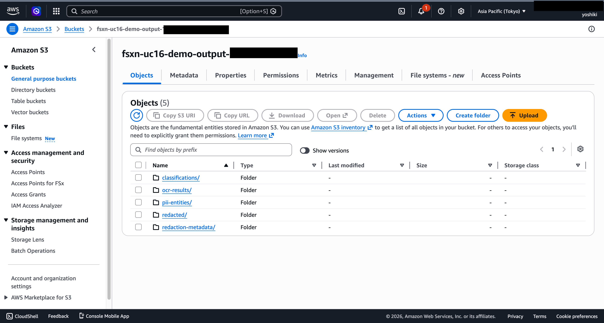
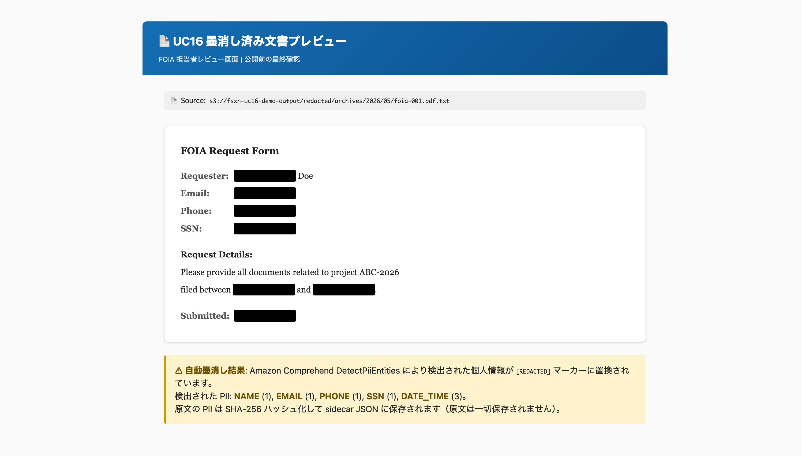
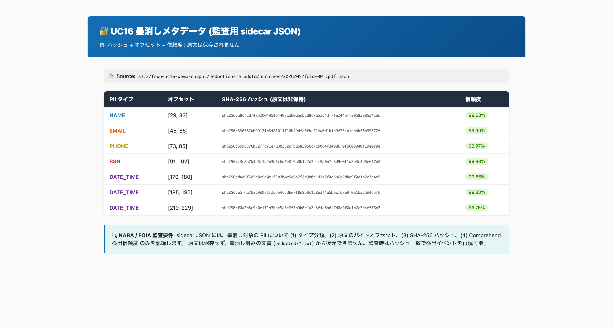
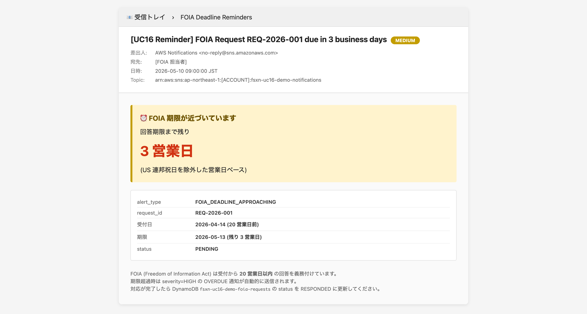
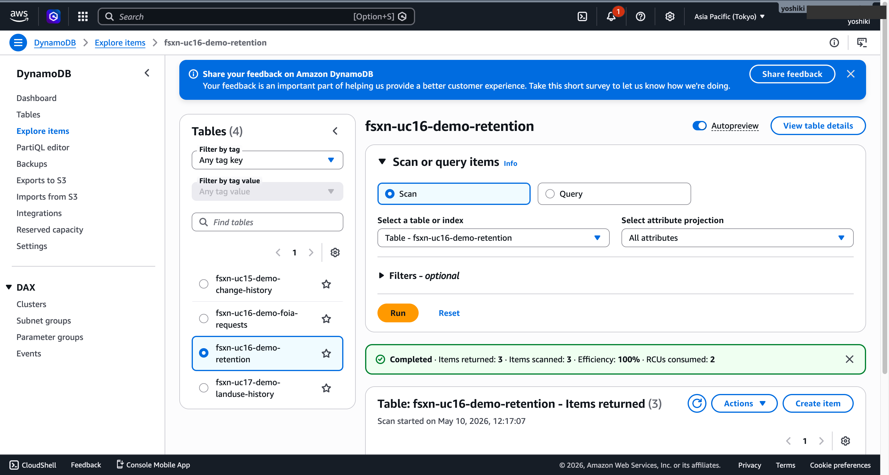

# UC16: Government — Public Records Digital Archive / FOIA

🌐 **Language / 言語**: [日本語](README.md) | English | [한국어](README.ko.md) | [简体中文](README.zh-CN.md) | [繁體中文](README.zh-TW.md) | [Français](README.fr.md) | [Deutsch](README.de.md) | [Español](README.es.md)
📚 **Documentation**: [Architecture](docs/uc16-architecture.md) | [Demo Script](docs/uc16-demo-script.md)

> **注意**: 本翻譯為自動產生草稿。歡迎基於原文進行審閱和完善。

## Overview

Serverless pipeline for government public records (PDF / TIFF / EML / DOCX) automating OCR, classification, PII detection and redaction, full-text indexing, NARA retention scheduling, and FOIA deadline tracking.

### When this pattern is suitable
- Department records are stored on FSx ONTAP with NTFS ACL governance
- Need OCR + PII automatic redaction for FOIA response
- Need 20 business-day deadline tracking with reminder notifications
- Need NARA General Records Schedule (GRS) compliance

### When this pattern is NOT suitable
- Real-time document editing (SharePoint / Box-style collaboration)
- Hand-written calligraphy OCR (specialized model needed)
- Digital signing / timestamp workflows (specialized product recommended)

### Key features
- **Discovery**: List PDF / TIFF / EML / DOCX via S3 AP
- **OCR**: Route to Textract sync (<= 10 pages) or async (>10 pages)
- **Classification**: Comprehend (Custom Classifier or keyword fallback) for public / sensitive / confidential levels
- **Entity Extraction**: Detect PII with Comprehend DetectPiiEntities + regex fallback
- **Redaction**: Replace PII with `[REDACTED]` marker, emit sidecar JSON (SHA-256 hash, offsets)
- **Index Generation**: OpenSearch Serverless or Managed (optional, disabled by default)
- **Compliance Check**: NARA GRS schedule persistence in DynamoDB
- **FOIA Deadline**: US federal holidays aware 20 business-day calculation + SNS reminders

### Public Sector compliance
- NARA Electronic Records Management
- FOIA Section 552
- Section 508 accessibility
- FedRAMP High in GovCloud


### 已驗證的 UI/UX 螢幕截圖

> 本節展示**一般職員在日常工作中實際使用的 UI/UX 介面**。Step Functions 圖形等技術視圖另見 `docs/verification-results-phase7.md`。

#### 1. 公文檔案放置（透過 S3 AP）

<!-- SCREENSHOT: phase7-uc16-s3-archives-uploaded.png -->


#### 2. 已編輯文件預覽

<!-- SCREENSHOT: phase7-uc16-redacted-text-preview.png -->


#### 3. 編輯中繼資料（Sidecar JSON）

<!-- SCREENSHOT: phase7-uc16-redaction-metadata-json.png -->


#### 4. FOIA 期限提醒（SNS 電子郵件）

<!-- SCREENSHOT: phase7-uc16-foia-reminder-email.png -->


#### 5. NARA GRS 保存排程（DynamoDB）

<!-- SCREENSHOT: phase7-uc16-dynamodb-retention.png -->


## Deploy

```bash
aws cloudformation deploy \
  --template-file government-archives/template-deploy.yaml \
  --stack-name fsxn-gov-archives \
  --parameter-overrides \
    DeployBucket=<deploy-bucket> \
    S3AccessPointAlias=<ap-ext-s3alias> \
    VpcId=<vpc-id> \
    PrivateSubnetIds=<subnet-ids> \
    NotificationEmail=ops@example.com \
    OpenSearchMode=none \
  --capabilities CAPABILITY_NAMED_IAM \
  --region ap-northeast-1
```

Set `OpenSearchMode=serverless` or `managed` to enable full-text search (incurs additional cost).

## Directory layout

```
government-archives/
├── template.yaml
├── template-deploy.yaml
├── functions/
│   ├── discovery/handler.py
│   ├── ocr/handler.py
│   ├── classification/handler.py
│   ├── entity_extraction/handler.py
│   ├── redaction/handler.py
│   ├── index_generation/handler.py
│   ├── compliance_check/handler.py
│   └── foia_deadline_reminder/handler.py
├── tests/
└── docs/
```