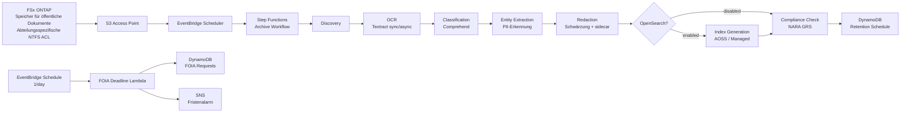

# UC16: Regierungsbehörde — Digitales Archiv für öffentliche Dokumente / FOIA-Compliance-Architektur

🌐 **Language / 언어 / 语言 / 語言 / Langue / Sprache / Idioma**: [日本語](architecture.md) | [English](architecture.en.md) | [한국어](architecture.ko.md) | [简体中文](architecture.zh-CN.md) | [繁體中文](architecture.zh-TW.md) | [Français](architecture.fr.md) | Deutsch | [Español](architecture.es.md)

> Hinweis: Diese Übersetzung wurde von Amazon Bedrock Claude erstellt. Beiträge zur Verbesserung der Übersetzungsqualität sind willkommen.

## Überblick

Ein serverloses Pipeline-System zur Automatisierung von OCR, Klassifizierung, PII-Erkennung, Schwärzung, Volltextsuche und FOIA-Fristenverfolgung für öffentliche Dokumente (PDF / TIFF / EML / DOCX) unter Verwendung von FSx for NetApp ONTAP S3 Access Points.

## Architekturdiagramm

## OpenSearch-Modus-Vergleich

| Modus | Verwendungszweck | Monatliche Kosten (geschätzt) |
|--------|------|-------------------|
| `none` | Validierung, kostengünstiger Betrieb | $0 (keine Indexierungsfunktion) |
| `serverless` | Variable Workloads, nutzungsbasierte Abrechnung | $350 - $700 (mindestens 2 OCU) |
| `managed` | Feste Workloads, kostengünstig | $35 - $100 (t3.small.search × 1) |

Umschaltung über den `OpenSearchMode`-Parameter in `template-deploy.yaml`. Das Vorhandensein von IndexGeneration wird dynamisch über den Choice-State im Step Functions-Workflow gesteuert.

## NARA / FOIA-Konformität

### NARA General Records Schedule (GRS) Aufbewahrungsfristen-Mapping

Implementierung in `GRS_RETENTION_MAP` in `compliance_check/handler.py`:

| Clearance Level | GRS Code | Aufbewahrungsjahre |
|-----------------|----------|---------|
| public | GRS 2.1 | 3 Jahre |
| sensitive | GRS 2.2 | 7 Jahre |
| confidential | GRS 1.1 | 30 Jahre |

### FOIA 20-Werktage-Regel

- `foia_deadline_reminder/handler.py` implementiert Werktageberechnung unter Ausschluss von US-Bundesfeiertagen
- SNS-Erinnerung N Tage vor Fristablauf (`REMINDER_DAYS_BEFORE`, Standard 3)
- Alarm mit severity=HIGH bei Fristüberschreitung

## IAM-Matrix

| Principal | Permission | Resource |
|-----------|------------|----------|
| Discovery Lambda | `s3:ListBucket`, `s3:GetObject`, `s3:PutObject` | S3 AP |
| Processing Lambdas | `textract:AnalyzeDocument`, `StartDocumentAnalysis`, `GetDocumentAnalysis` | `*` |
| Processing Lambdas | `comprehend:DetectPiiEntities`, `DetectDominantLanguage`, `ClassifyDocument` | `*` |
| Processing Lambdas | `dynamodb:*Item`, `Query`, `Scan` | RetentionTable, FoiaRequestTable |
| FOIA Deadline Lambda | `sns:Publish` | Notification Topic |

## Einhaltung von Public Sector-Vorschriften

### NARA Electronic Records Management (ERM)
- WORM-Unterstützung durch FSx ONTAP Snapshot + Backup möglich
- CloudTrail-Protokollierung für alle Verarbeitungsschritte
- DynamoDB Point-in-Time Recovery aktiviert

### FOIA Section 552
- Automatische Verfolgung der 20-Werktage-Antwortfrist
- Schwärzungsverarbeitung behält Audit-Trail in sidecar JSON bei
- Original-PII wird nur als Hash gespeichert (nicht wiederherstellbar, Datenschutz)

### Section 508 Barrierefreiheit
- Volltextkonvertierung durch OCR für Unterstützung assistiver Technologien
- Geschwärzte Bereiche mit `[REDACTED]`-Token-Einfügung für Vorlesefunktion

## Guard Hooks-Konformität

- ✅ `encryption-required`: S3 + DynamoDB + SNS + OpenSearch
- ✅ `iam-least-privilege`: Textract/Comprehend verwenden `*` aufgrund von API-Einschränkungen
- ✅ `logging-required`: LogGroup für alle Lambda-Funktionen konfiguriert
- ✅ `dynamodb-backup`: PITR aktiviert
- ✅ `pii-protection`: Nur Original-Hash gespeichert, redaction metadata getrennt

## Ausgabeziel (OutputDestination) — Pattern B

UC16 unterstützt seit dem Update vom 11.05.2026 den `OutputDestination`-Parameter.

| Modus | Ausgabeziel | Erstellte Ressourcen | Anwendungsfall |
|-------|-------|-------------------|------------|
| `STANDARD_S3` (Standard) | Neuer S3-Bucket | `AWS::S3::Bucket` | Wie bisher werden AI-Artefakte in einem separaten S3-Bucket gespeichert |
| `FSXN_S3AP` | FSxN S3 Access Point | Keine (Rückschreiben in bestehendes FSx-Volume) | Mitarbeiter für öffentliche Dokumente können OCR-Text, geschwärzte Dateien und Metadaten über SMB/NFS im selben Verzeichnis wie die Originaldokumente einsehen |

**Betroffene Lambda-Funktionen**: OCR, Classification, EntityExtraction, Redaction, IndexGeneration (5 Funktionen).  
**Rücklesen in der Verarbeitungskette**: Nachgelagerte Lambda-Funktionen führen symmetrisches Rücklesen zum Schreibziel über `get_*` in `shared/output_writer.py` durch. Im FSXN_S3AP-Modus erfolgt direktes Rücklesen vom S3AP, sodass die gesamte Kette mit einem konsistenten destination arbeitet.  
**Nicht betroffene Lambda-Funktionen**: Discovery (manifest wird direkt in S3AP geschrieben), ComplianceCheck (nur DynamoDB), FoiaDeadlineReminder (nur DynamoDB + SNS).  
**Beziehung zu OpenSearch**: Index wird unabhängig über den `OpenSearchMode`-Parameter verwaltet, nicht beeinflusst von `OutputDestination`.

Details siehe [`docs/output-destination-patterns.md`](../../docs/output-destination-patterns.md).
