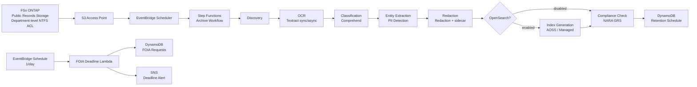

# UC16: Government Agency — Digital Archive of Official Documents / FOIA Response Architecture

🌐 **Language / 언어 / 语言 / 語言 / Langue / Sprache / Idioma**: [日本語](architecture.md) | English | [한국어](architecture.ko.md) | [简体中文](architecture.zh-CN.md) | [繁體中文](architecture.zh-TW.md) | [Français](architecture.fr.md) | [Deutsch](architecture.de.md) | [Español](architecture.es.md)

> Note: This translation is produced by Amazon Bedrock Claude. Contributions to improve translation quality are welcome.

## Overview

A serverless pipeline that automates OCR, classification, PII detection, redaction, full-text search, and FOIA deadline tracking for public records (PDF / TIFF / EML / DOCX) using FSx for NetApp ONTAP S3 Access Points.

## Architecture Diagram

## OpenSearch Mode Comparison

| Mode | Use Case | Estimated Monthly Cost |
|--------|------|-------------------|
| `none` | Testing / low-cost operation | $0 (no indexing) |
| `serverless` | Variable workload, pay-per-use | $350 - $700 (minimum 2 OCU) |
| `managed` | Fixed workload, lower cost | $35 - $100 (t3.small.search × 1) |

Switch via the `OpenSearchMode` parameter in `template-deploy.yaml`. The Step Functions workflow dynamically controls the presence of IndexGeneration via a Choice state.

## NARA / FOIA Compliance

### NARA General Records Schedule (GRS) Retention Period Mapping

Implementation in `compliance_check/handler.py` `GRS_RETENTION_MAP`:

| Clearance Level | GRS Code | Retention Years |
|-----------------|----------|---------|
| public | GRS 2.1 | 3 years |
| sensitive | GRS 2.2 | 7 years |
| confidential | GRS 1.1 | 30 years |

### FOIA 20 Business Day Rule

- `foia_deadline_reminder/handler.py` implements business day calculation excluding US federal holidays
- SNS reminder N days before deadline (`REMINDER_DAYS_BEFORE`, default 3)
- Alert with severity=HIGH when deadline is exceeded

## IAM Matrix

| Principal | Permission | Resource |
|-----------|------------|----------|
| Discovery Lambda | `s3:ListBucket`, `s3:GetObject`, `s3:PutObject` | S3 AP |
| Processing Lambdas | `textract:AnalyzeDocument`, `StartDocumentAnalysis`, `GetDocumentAnalysis` | `*` |
| Processing Lambdas | `comprehend:DetectPiiEntities`, `DetectDominantLanguage`, `ClassifyDocument` | `*` |
| Processing Lambdas | `dynamodb:*Item`, `Query`, `Scan` | RetentionTable, FoiaRequestTable |
| FOIA Deadline Lambda | `sns:Publish` | Notification Topic |

## Public Sector Regulatory Compliance

### NARA Electronic Records Management (ERM)
- WORM compliance available via FSx ONTAP Snapshot + Backup
- CloudTrail audit trail for all operations
- DynamoDB Point-in-Time Recovery enabled

### FOIA Section 552
- Automatic tracking of 20 business day response deadline
- Redaction processing maintains audit trail via sidecar JSON
- Original PII stored as hash only (non-reversible, privacy protection)

### Section 508 Accessibility
- Full-text OCR enables assistive technology support
- Redacted regions include `[REDACTED]` token for screen reader compatibility

## Guard Hooks Compliance

- ✅ `encryption-required`: S3 + DynamoDB + SNS + OpenSearch
- ✅ `iam-least-privilege`: Textract/Comprehend use `*` due to API constraints
- ✅ `logging-required`: LogGroup configured for all Lambdas
- ✅ `dynamodb-backup`: PITR enabled
- ✅ `pii-protection`: Only hash of original stored, redaction metadata separated

## OutputDestination — Pattern B

UC16 supports the `OutputDestination` parameter as of the 2026-05-11 update.

| Mode | Output Destination | Resources Created | Use Case |
|-------|-------|-------------------|------------|
| `STANDARD_S3` (default) | New S3 bucket | `AWS::S3::Bucket` | Accumulate AI artifacts in a separate S3 bucket as before |
| `FSXN_S3AP` | FSxN S3 Access Point | None (write back to existing FSx volume) | Public records staff can view OCR text, redacted files, and metadata in the same directory as original documents via SMB/NFS |

**Affected Lambdas**: OCR, Classification, EntityExtraction, Redaction, IndexGeneration (5 functions).  
**Chain read-back**: Downstream Lambdas perform symmetric read-back via `get_*` in `shared/output_writer.py`. In FSXN_S3AP mode, direct read-back from S3AP ensures the entire chain operates with a consistent destination.  
**Unaffected Lambdas**: Discovery (manifest written directly to S3AP), ComplianceCheck (DynamoDB only), FoiaDeadlineReminder (DynamoDB + SNS only).  
**Relationship with OpenSearch**: Index is independently managed by the `OpenSearchMode` parameter and is not affected by `OutputDestination`.

See [`docs/output-destination-patterns.md`](../../docs/output-destination-patterns.md) for details.
