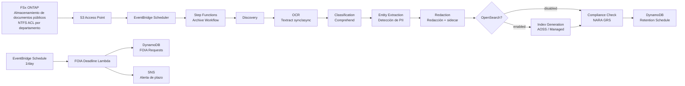

# UC16: Agencias gubernamentales — Archivo digital de documentos públicos / Arquitectura de cumplimiento FOIA

🌐 **Language / 언어 / 语言 / 語言 / Langue / Sprache / Idioma**: [日本語](architecture.md) | [English](architecture.en.md) | [한국어](architecture.ko.md) | [简体中文](architecture.zh-CN.md) | [繁體中文](architecture.zh-TW.md) | [Français](architecture.fr.md) | [Deutsch](architecture.de.md) | Español

> Nota: Esta traducción ha sido producida por Amazon Bedrock Claude. Las contribuciones para mejorar la calidad de la traducción son bienvenidas.

## Descripción general

Pipeline serverless que automatiza OCR, clasificación, detección de PII, redacción, búsqueda de texto completo y seguimiento de plazos FOIA para documentos públicos (PDF / TIFF / EML / DOCX) utilizando FSx for NetApp ONTAP S3 Access Points.

## Diagrama de arquitectura

## Comparación de modos OpenSearch

| Modo | Uso | Costo mensual (estimado) |
|--------|------|-------------------|
| `none` | Verificación / operación de bajo costo | $0 (sin función de índice) |
| `serverless` | Carga de trabajo variable, pago por uso | $350 - $700 (mínimo 2 OCU) |
| `managed` | Carga de trabajo fija, económico | $35 - $100 (t3.small.search × 1) |

Se cambia mediante el parámetro `OpenSearchMode` en `template-deploy.yaml`. El estado Choice del flujo de trabajo de Step Functions controla dinámicamente la presencia o ausencia de IndexGeneration.

## Cumplimiento NARA / FOIA

### Mapeo de períodos de retención NARA General Records Schedule (GRS)

La implementación se encuentra en `GRS_RETENTION_MAP` de `compliance_check/handler.py`:

| Clearance Level | GRS Code | Años de retención |
|-----------------|----------|---------|
| public | GRS 2.1 | 3 años |
| sensitive | GRS 2.2 | 7 años |
| confidential | GRS 1.1 | 30 años |

### Regla de 20 días hábiles FOIA

- `foia_deadline_reminder/handler.py` implementa cálculo de días hábiles excluyendo días festivos federales de EE.UU.
- Recordatorio SNS N días antes del plazo (`REMINDER_DAYS_BEFORE`, predeterminado 3)
- Alerta con severity=HIGH cuando se excede el plazo

## Matriz IAM

| Principal | Permission | Resource |
|-----------|------------|----------|
| Discovery Lambda | `s3:ListBucket`, `s3:GetObject`, `s3:PutObject` | S3 AP |
| Processing Lambdas | `textract:AnalyzeDocument`, `StartDocumentAnalysis`, `GetDocumentAnalysis` | `*` |
| Processing Lambdas | `comprehend:DetectPiiEntities`, `DetectDominantLanguage`, `ClassifyDocument` | `*` |
| Processing Lambdas | `dynamodb:*Item`, `Query`, `Scan` | RetentionTable, FoiaRequestTable |
| FOIA Deadline Lambda | `sns:Publish` | Notification Topic |

## Cumplimiento normativo del sector público

### NARA Electronic Records Management (ERM)
- Cumplimiento WORM posible con FSx ONTAP Snapshot + Backup
- Registro CloudTrail para todos los procesos
- Point-in-Time Recovery de DynamoDB habilitado

### FOIA Section 552
- Seguimiento automático del plazo de respuesta de 20 días hábiles
- El proceso de redacción mantiene pista de auditoría en JSON sidecar
- PII del texto original se almacena solo como hash (no recuperable, protección de privacidad)

### Section 508 Accesibilidad
- Conversión a texto completo mediante OCR para compatibilidad con tecnologías de asistencia
- Áreas redactadas también permiten lectura en voz alta mediante inserción de token `[REDACTED]`

## Cumplimiento Guard Hooks

- ✅ `encryption-required`: S3 + DynamoDB + SNS + OpenSearch
- ✅ `iam-least-privilege`: Textract/Comprehend usa `*` debido a restricciones de API
- ✅ `logging-required`: LogGroup configurado para todas las Lambda
- ✅ `dynamodb-backup`: PITR habilitado
- ✅ `pii-protection`: Solo se almacena hash del texto original, metadatos de redacción separados

## Destino de salida (OutputDestination) — Patrón B

UC16 soporta el parámetro `OutputDestination` desde la actualización del 2026-05-11.

| Modo | Destino de salida | Recursos creados | Caso de uso |
|-------|-------|-------------------|------------|
| `STANDARD_S3` (predeterminado) | Nuevo bucket S3 | `AWS::S3::Bucket` | Acumular resultados de IA en bucket S3 separado como tradicionalmente |
| `FSXN_S3AP` | FSxN S3 Access Point | Ninguno (escritura de vuelta al volumen FSx existente) | Los responsables de documentos públicos pueden ver texto OCR, archivos redactados y metadatos en el mismo directorio que los documentos originales a través de SMB/NFS |

**Lambdas afectadas**: OCR, Classification, EntityExtraction, Redaction, IndexGeneration (5 funciones).  
**Lectura de vuelta en estructura de cadena**: Las Lambdas posteriores realizan lectura de vuelta simétrica al destino de escritura mediante `get_*` de `shared/output_writer.py`. En modo FSXN_S3AP también se lee directamente desde S3AP, por lo que toda la cadena opera con un destination consistente.  
**Lambdas no afectadas**: Discovery (manifest se escribe directamente en S3AP), ComplianceCheck (solo DynamoDB), FoiaDeadlineReminder (solo DynamoDB + SNS).  
**Relación con OpenSearch**: El índice se gestiona independientemente mediante el parámetro `OpenSearchMode`, sin verse afectado por `OutputDestination`.

Para más detalles, consulte [`docs/output-destination-patterns.md`](../../docs/output-destination-patterns.md).
