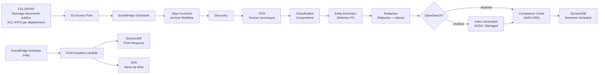

# UC16: Agences gouvernementales — Architecture d'archives numériques de documents publics / Conformité FOIA

🌐 **Language / 언어 / 语言 / 語言 / Langue / Sprache / Idioma**: [日本語](architecture.md) | [English](architecture.en.md) | [한국어](architecture.ko.md) | [简体中文](architecture.zh-CN.md) | [繁體中文](architecture.zh-TW.md) | Français | [Deutsch](architecture.de.md) | [Español](architecture.es.md)

> Note : Cette traduction est produite par Amazon Bedrock Claude. Les contributions pour améliorer la qualité de la traduction sont les bienvenues.

## Vue d'ensemble

Pipeline serverless automatisant l'OCR, la classification, la détection de PII, la rédaction, la recherche en texte intégral et le suivi des délais FOIA pour les documents publics (PDF / TIFF / EML / DOCX) en utilisant les S3 Access Points de FSx for NetApp ONTAP.

## Diagramme d'architecture

## Comparaison des modes OpenSearch

| Mode | Usage | Coût mensuel (estimation) |
|--------|------|-------------------|
| `none` | Validation, exploitation à faible coût | $0 (pas de fonction d'indexation) |
| `serverless` | Charge de travail variable, facturation à l'usage | $350 - $700 (minimum 2 OCU) |
| `managed` | Charge de travail fixe, économique | $35 - $100 (t3.small.search × 1) |

Basculement via le paramètre `OpenSearchMode` dans `template-deploy.yaml`. Le workflow Step Functions contrôle dynamiquement la présence ou l'absence d'IndexGeneration via un état Choice.

## Conformité NARA / FOIA

### Mappage des périodes de conservation NARA General Records Schedule (GRS)

Implémentation dans `GRS_RETENTION_MAP` de `compliance_check/handler.py` :

| Clearance Level | GRS Code | Années de conservation |
|-----------------|----------|---------|
| public | GRS 2.1 | 3 ans |
| sensitive | GRS 2.2 | 7 ans |
| confidential | GRS 1.1 | 30 ans |

### Règle FOIA des 20 jours ouvrables

- `foia_deadline_reminder/handler.py` implémente le calcul des jours ouvrables en excluant les jours fériés fédéraux américains
- Rappel SNS N jours avant l'échéance (`REMINDER_DAYS_BEFORE`, par défaut 3)
- Alerte avec severity=HIGH en cas de dépassement de délai

## Matrice IAM

| Principal | Permission | Resource |
|-----------|------------|----------|
| Discovery Lambda | `s3:ListBucket`, `s3:GetObject`, `s3:PutObject` | S3 AP |
| Processing Lambdas | `textract:AnalyzeDocument`, `StartDocumentAnalysis`, `GetDocumentAnalysis` | `*` |
| Processing Lambdas | `comprehend:DetectPiiEntities`, `DetectDominantLanguage`, `ClassifyDocument` | `*` |
| Processing Lambdas | `dynamodb:*Item`, `Query`, `Scan` | RetentionTable, FoiaRequestTable |
| FOIA Deadline Lambda | `sns:Publish` | Notification Topic |

## Conformité réglementaire du secteur public

### NARA Electronic Records Management (ERM)
- Conformité WORM possible avec FSx ONTAP Snapshot + Backup
- Piste CloudTrail pour tous les traitements
- Point-in-Time Recovery DynamoDB activé

### FOIA Section 552
- Suivi automatique du délai de réponse de 20 jours ouvrables
- Le traitement de rédaction conserve une piste d'audit via JSON sidecar
- Les PII du texte original sont stockées uniquement sous forme de hash (non réversible, protection de la vie privée)

### Section 508 Accessibilité
- Conversion en texte intégral par OCR pour compatibilité avec les technologies d'assistance
- Les zones rédigées incluent un token `[REDACTED]` pour permettre la lecture vocale

## Conformité Guard Hooks

- ✅ `encryption-required`: S3 + DynamoDB + SNS + OpenSearch
- ✅ `iam-least-privilege`: Textract/Comprehend utilisent `*` en raison des contraintes API
- ✅ `logging-required`: LogGroup configuré pour toutes les Lambda
- ✅ `dynamodb-backup`: PITR activé
- ✅ `pii-protection`: Stockage uniquement du hash du texte original, métadonnées de rédaction séparées

## Destination de sortie (OutputDestination) — Pattern B

UC16 prend en charge le paramètre `OutputDestination` depuis la mise à jour du 2026-05-11.

| Mode | Destination de sortie | Ressources créées | Cas d'usage |
|-------|-------|-------------------|------------|
| `STANDARD_S3` (par défaut) | Nouveau bucket S3 | `AWS::S3::Bucket` | Accumulation des résultats IA dans un bucket S3 séparé comme auparavant |
| `FSXN_S3AP` | FSxN S3 Access Point | Aucune (réécriture vers le volume FSx existant) | Les responsables des documents publics peuvent consulter le texte OCR, les fichiers rédigés et les métadonnées dans le même répertoire que les documents originaux via SMB/NFS |

**Lambda affectées** : OCR, Classification, EntityExtraction, Redaction, IndexGeneration (5 fonctions).  
**Relecture dans la structure en chaîne** : Les Lambda en aval effectuent une relecture symétrique à la destination d'écriture via `get_*` de `shared/output_writer.py`. En mode FSXN_S3AP, la relecture s'effectue également directement depuis S3AP, permettant à l'ensemble de la chaîne de fonctionner avec une destination cohérente.  
**Lambda non affectées** : Discovery (le manifest est écrit directement sur S3AP), ComplianceCheck (DynamoDB uniquement), FoiaDeadlineReminder (DynamoDB + SNS uniquement).  
**Relation avec OpenSearch** : L'index est géré indépendamment par le paramètre `OpenSearchMode`, non affecté par `OutputDestination`.

Voir [`docs/output-destination-patterns.md`](../../docs/output-destination-patterns.md) pour plus de détails.
