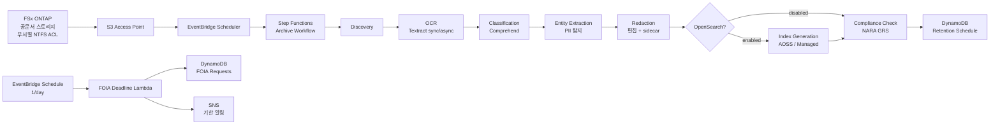

# UC16: 정부 기관 — 공문서 디지털 아카이브 / FOIA 대응 아키텍처

🌐 **Language / 언어 / 语言 / 語言 / Langue / Sprache / Idioma**: [日本語](architecture.md) | [English](architecture.en.md) | 한국어 | [简体中文](architecture.zh-CN.md) | [繁體中文](architecture.zh-TW.md) | [Français](architecture.fr.md) | [Deutsch](architecture.de.md) | [Español](architecture.es.md)

> 참고: 이 번역은 Amazon Bedrock Claude로 생성되었습니다. 번역 품질 향상에 대한 기여를 환영합니다.

## 개요

FSx for NetApp ONTAP S3 Access Points를 활용한 공문서(PDF / TIFF / EML / DOCX)의
OCR, 분류, PII 탐지, 편집, 전문 검색, FOIA 기한 추적을 자동화하는
서버리스 파이프라인.

## 아키텍처 다이어그램

## OpenSearch 모드 비교

| 모드 | 용도 | 월간 비용(추정) |
|--------|------|-------------------|
| `none` | 검증·저비용 운영 | $0(인덱스 기능 없음) |
| `serverless` | 가변 워크로드, 종량제 | $350 - $700(최소 2 OCU) |
| `managed` | 고정 워크로드, 저렴 | $35 - $100(t3.small.search × 1) |

`template-deploy.yaml`의 `OpenSearchMode` 파라미터로 전환. Step Functions
워크플로의 Choice 상태에서 IndexGeneration 유무를 동적으로 제어.

## NARA / FOIA 준수

### NARA General Records Schedule (GRS) 보존 기간 매핑

구현은 `compliance_check/handler.py`의 `GRS_RETENTION_MAP`:

| Clearance Level | GRS Code | 보존 연수 |
|-----------------|----------|---------|
| public | GRS 2.1 | 3년 |
| sensitive | GRS 2.2 | 7년 |
| confidential | GRS 1.1 | 30년 |

### FOIA 20 영업일 규칙

- `foia_deadline_reminder/handler.py`는 미국 연방 공휴일을 제외한 영업일 계산을 구현
- 기한 N일 전(`REMINDER_DAYS_BEFORE`, 기본값 3)에 SNS 리마인더
- 기한 초과 시 severity=HIGH 알림

## IAM 매트릭스

| Principal | Permission | Resource |
|-----------|------------|----------|
| Discovery Lambda | `s3:ListBucket`, `s3:GetObject`, `s3:PutObject` | S3 AP |
| Processing Lambdas | `textract:AnalyzeDocument`, `StartDocumentAnalysis`, `GetDocumentAnalysis` | `*` |
| Processing Lambdas | `comprehend:DetectPiiEntities`, `DetectDominantLanguage`, `ClassifyDocument` | `*` |
| Processing Lambdas | `dynamodb:*Item`, `Query`, `Scan` | RetentionTable, FoiaRequestTable |
| FOIA Deadline Lambda | `sns:Publish` | Notification Topic |

## Public Sector 규제 대응

### NARA Electronic Records Management (ERM)
- FSx ONTAP Snapshot + Backup으로 WORM 대응 가능
- 모든 처리에 CloudTrail 추적
- DynamoDB Point-in-Time Recovery 활성화

### FOIA Section 552
- 20 영업일 응답 기한을 자동 추적
- 편집 처리는 sidecar JSON으로 감사 추적 보존
- 원문 PII는 hash만 저장(복원 불가, 프라이버시 보호)

### Section 508 접근성
- OCR을 통한 전문 텍스트화로 보조 기술 대응
- 편집 영역도 `[REDACTED]` 토큰 삽입으로 읽기 가능

## Guard Hooks 준수

- ✅ `encryption-required`: S3 + DynamoDB + SNS + OpenSearch
- ✅ `iam-least-privilege`: Textract/Comprehend는 API 제약으로 `*`
- ✅ `logging-required`: 모든 Lambda에 LogGroup 설정
- ✅ `dynamodb-backup`: PITR 활성화
- ✅ `pii-protection`: 원문 hash만 저장, redaction metadata 분리

## 출력 대상 (OutputDestination) — Pattern B

UC16은 2026-05-11 업데이트에서 `OutputDestination` 파라미터를 지원합니다.

| 모드 | 출력 대상 | 생성되는 리소스 | 사용 사례 |
|-------|-------|-------------------|------------|
| `STANDARD_S3`(기본값) | 신규 S3 버킷 | `AWS::S3::Bucket` | 기존과 동일하게 분리된 S3 버킷에 AI 산출물 축적 |
| `FSXN_S3AP` | FSxN S3 Access Point | 없음(기존 FSx 볼륨에 쓰기) | 공문서 담당자가 SMB/NFS를 통해 원본 문서와 동일 디렉터리에서 OCR 텍스트, 편집 완료 파일, 메타데이터 열람 |

**영향을 받는 Lambda**: OCR, Classification, EntityExtraction, Redaction, IndexGeneration(5개 함수).  
**체인 구조의 읽기**: 후속 Lambda는 `shared/output_writer.py`의 `get_*`로 쓰기 대상과 대칭적인 읽기를 수행. FSXN_S3AP 모드에서도 S3AP에서 직접 읽기 때문에 체인 전체가 일관된 destination으로 동작.  
**영향을 받지 않는 Lambda**: Discovery(manifest는 S3AP 직접 쓰기), ComplianceCheck(DynamoDB만), FoiaDeadlineReminder(DynamoDB + SNS만).  
**OpenSearch와의 관계**: 인덱스는 `OpenSearchMode` 파라미터로 독립 관리, `OutputDestination`의 영향을 받지 않음.

자세한 내용은 [`docs/output-destination-patterns.md`](../../docs/output-destination-patterns.md) 참조.
