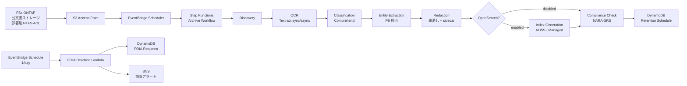

# UC16: 政府機関 — 公文書デジタルアーカイブ / FOIA 対応アーキテクチャ

🌐 **Language / 言語**: 日本語 | [English](architecture.en.md) | [한국어](architecture.ko.md) | [简体中文](architecture.zh-CN.md) | [繁體中文](architecture.zh-TW.md) | [Français](architecture.fr.md) | [Deutsch](architecture.de.md) | [Español](architecture.es.md)

## 概要

FSx for NetApp ONTAP S3 Access Points を活用した公文書（PDF / TIFF / EML / DOCX）の
OCR、分類、PII 検出、墨消し、全文検索、FOIA 期限トラッキングを自動化する
サーバーレスパイプライン。

## アーキテクチャ図

## OpenSearch モード比較

| モード | 用途 | 月次コスト（試算） |
|--------|------|-------------------|
| `none` | 検証・低コスト運用 | $0（インデックス機能なし） |
| `serverless` | 可変ワークロード、従量課金 | $350 - $700（最低 2 OCU） |
| `managed` | 固定ワークロード、安価 | $35 - $100（t3.small.search × 1） |

`template-deploy.yaml` の `OpenSearchMode` パラメータで切替。Step Functions
ワークフローの Choice ステートで IndexGeneration の有無を動的に制御。

## NARA / FOIA 準拠

### NARA General Records Schedule (GRS) 保存期間マッピング

実装は `compliance_check/handler.py` の `GRS_RETENTION_MAP`：

| Clearance Level | GRS Code | 保存年数 |
|-----------------|----------|---------|
| public | GRS 2.1 | 3 年 |
| sensitive | GRS 2.2 | 7 年 |
| confidential | GRS 1.1 | 30 年 |

### FOIA 20 営業日規則

- `foia_deadline_reminder/handler.py` は US 連邦祝日を除外した営業日計算を実装
- 期限 N 日前（`REMINDER_DAYS_BEFORE`、デフォルト 3）に SNS リマインダー
- 期限超過で severity=HIGH のアラート

## IAM マトリクス

| Principal | Permission | Resource |
|-----------|------------|----------|
| Discovery Lambda | `s3:ListBucket`, `s3:GetObject`, `s3:PutObject` | S3 AP |
| Processing Lambdas | `textract:AnalyzeDocument`, `StartDocumentAnalysis`, `GetDocumentAnalysis` | `*` |
| Processing Lambdas | `comprehend:DetectPiiEntities`, `DetectDominantLanguage`, `ClassifyDocument` | `*` |
| Processing Lambdas | `dynamodb:*Item`, `Query`, `Scan` | RetentionTable, FoiaRequestTable |
| FOIA Deadline Lambda | `sns:Publish` | Notification Topic |

## Public Sector 規制対応

### NARA Electronic Records Management (ERM)
- FSx ONTAP Snapshot + Backup で WORM 対応可
- すべての処理に CloudTrail 証跡
- DynamoDB Point-in-Time Recovery 有効化

### FOIA Section 552
- 20 営業日回答期限を自動トラッキング
- 墨消し処理は sidecar JSON で監査証跡を保持
- 原文 PII は hash のみ保存（復元不可、プライバシー保護）

### Section 508 アクセシビリティ
- OCR による全文テキスト化で支援技術対応
- 墨消し領域も `[REDACTED]` トークン挿入で読み上げ可能

## Guard Hooks 準拠

- ✅ `encryption-required`: S3 + DynamoDB + SNS + OpenSearch
- ✅ `iam-least-privilege`: Textract/Comprehend は API 制約により `*`
- ✅ `logging-required`: 全 Lambda に LogGroup 設定
- ✅ `dynamodb-backup`: PITR 有効化
- ✅ `pii-protection`: 原文 hash のみ保存、redaction metadata 分離

## 出力先 (OutputDestination) — Pattern B

UC16 は 2026-05-11 のアップデートで `OutputDestination` パラメータをサポートしました。

| モード | 出力先 | 作成されるリソース | ユースケース |
|-------|-------|-------------------|------------|
| `STANDARD_S3`（デフォルト） | 新規 S3 バケット | `AWS::S3::Bucket` | 従来どおり分離された S3 バケットに AI 成果物を蓄積 |
| `FSXN_S3AP` | FSxN S3 Access Point | なし（既存 FSx ボリュームへ書き戻し） | 公文書担当者が SMB/NFS 経由でオリジナル文書と同一ディレクトリに OCR テキスト、墨消し済みファイル、メタデータを閲覧 |

**影響を受ける Lambda**: OCR、Classification、EntityExtraction、Redaction、IndexGeneration（5 関数）。  
**チェーン構造の読み戻し**: 後段 Lambda は `shared/output_writer.py` の `get_*` で書き込み先と対称な読み戻しを行う。FSXN_S3AP モード時も S3AP から直接読み戻すため、チェーン全体が一貫した destination で動作。  
**影響を受けない Lambda**: Discovery（manifest は S3AP 直書き）、ComplianceCheck（DynamoDB のみ）、FoiaDeadlineReminder（DynamoDB + SNS のみ）。  
**OpenSearch との関係**: インデックスは `OpenSearchMode` パラメータで独立管理、`OutputDestination` の影響を受けない。

詳細は [`docs/output-destination-patterns.md`](../../docs/output-destination-patterns.md) 参照。
