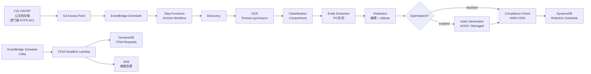

# UC16: 政府机关 — 公文书数字档案 / FOIA 对应架构

🌐 **Language / 언어 / 语言 / 語言 / Langue / Sprache / Idioma**: [日本語](architecture.md) | [English](architecture.en.md) | [한국어](architecture.ko.md) | 简体中文 | [繁體中文](architecture.zh-TW.md) | [Français](architecture.fr.md) | [Deutsch](architecture.de.md) | [Español](architecture.es.md)

> 注意：此翻译由 Amazon Bedrock Claude 生成。欢迎对翻译质量提出改进建议。

## 概述

利用 FSx for NetApp ONTAP S3 Access Points 实现公文档（PDF / TIFF / EML / DOCX）的
OCR、分类、PII 检测、编辑、全文检索、FOIA 期限跟踪自动化的
无服务器流水线。

## 架构图

## OpenSearch 模式比较

| 模式 | 用途 | 月度成本（估算） |
|--------|------|-------------------|
| `none` | 验证·低成本运营 | $0（无索引功能） |
| `serverless` | 可变工作负载、按量计费 | $350 - $700（最低 2 OCU） |
| `managed` | 固定工作负载、低价 | $35 - $100（t3.small.search × 1） |

通过 `template-deploy.yaml` 的 `OpenSearchMode` 参数切换。Step Functions
工作流的 Choice 状态动态控制 IndexGeneration 的有无。

## NARA / FOIA 合规

### NARA General Records Schedule (GRS) 保存期限映射

实现位于 `compliance_check/handler.py` 的 `GRS_RETENTION_MAP`：

| Clearance Level | GRS Code | 保存年限 |
|-----------------|----------|---------|
| public | GRS 2.1 | 3 年 |
| sensitive | GRS 2.2 | 7 年 |
| confidential | GRS 1.1 | 30 年 |

### FOIA 20 工作日规则

- `foia_deadline_reminder/handler.py` 实现了排除美国联邦假日的工作日计算
- 期限前 N 天（`REMINDER_DAYS_BEFORE`，默认 3）发送 SNS 提醒
- 超期时发送 severity=HIGH 的告警

## IAM 矩阵

| Principal | Permission | Resource |
|-----------|------------|----------|
| Discovery Lambda | `s3:ListBucket`, `s3:GetObject`, `s3:PutObject` | S3 AP |
| Processing Lambdas | `textract:AnalyzeDocument`, `StartDocumentAnalysis`, `GetDocumentAnalysis` | `*` |
| Processing Lambdas | `comprehend:DetectPiiEntities`, `DetectDominantLanguage`, `ClassifyDocument` | `*` |
| Processing Lambdas | `dynamodb:*Item`, `Query`, `Scan` | RetentionTable, FoiaRequestTable |
| FOIA Deadline Lambda | `sns:Publish` | Notification Topic |

## 公共部门法规合规

### NARA Electronic Records Management (ERM)
- 通过 FSx ONTAP Snapshot + Backup 支持 WORM
- 所有处理均有 CloudTrail 审计跟踪
- 启用 DynamoDB Point-in-Time Recovery

### FOIA Section 552
- 自动跟踪 20 工作日响应期限
- 编辑处理通过 sidecar JSON 保留审计跟踪
- 原文 PII 仅保存 hash（不可恢复，隐私保护）

### Section 508 无障碍访问
- 通过 OCR 全文文本化支持辅助技术
- 编辑区域也插入 `[REDACTED]` 标记以支持朗读

## Guard Hooks 合规

- ✅ `encryption-required`: S3 + DynamoDB + SNS + OpenSearch
- ✅ `iam-least-privilege`: Textract/Comprehend 因 API 限制使用 `*`
- ✅ `logging-required`: 所有 Lambda 配置 LogGroup
- ✅ `dynamodb-backup`: 启用 PITR
- ✅ `pii-protection`: 仅保存原文 hash，编辑元数据分离

## 输出目标 (OutputDestination) — Pattern B

UC16 在 2026-05-11 的更新中支持了 `OutputDestination` 参数。

| 模式 | 输出目标 | 创建的资源 | 使用场景 |
|-------|-------|-------------------|------------|
| `STANDARD_S3`（默认） | 新建 S3 存储桶 | `AWS::S3::Bucket` | 按传统方式将 AI 成果物存储到独立的 S3 存储桶 |
| `FSXN_S3AP` | FSxN S3 Access Point | 无（写回现有 FSx 卷） | 公文档负责人通过 SMB/NFS 在与原始文档相同的目录中查看 OCR 文本、编辑后文件、元数据 |

**受影响的 Lambda**: OCR、Classification、EntityExtraction、Redaction、IndexGeneration（5 个函数）。  
**链式结构的读回**: 后续 Lambda 通过 `shared/output_writer.py` 的 `get_*` 进行与写入目标对称的读回。FSXN_S3AP 模式时也直接从 S3AP 读回，因此整个链以一致的 destination 运行。  
**不受影响的 Lambda**: Discovery（manifest 直接写入 S3AP）、ComplianceCheck（仅 DynamoDB）、FoiaDeadlineReminder（仅 DynamoDB + SNS）。  
**与 OpenSearch 的关系**: 索引由 `OpenSearchMode` 参数独立管理，不受 `OutputDestination` 影响。

详情请参阅 [`docs/output-destination-patterns.md`](../../docs/output-destination-patterns.md)。
