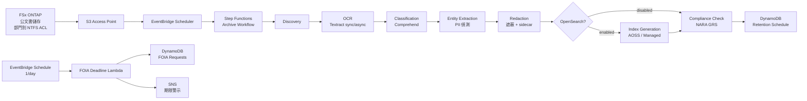

# UC16: 政府機關 — 公文書數位典藏 / FOIA 對應架構

🌐 **Language / 언어 / 语言 / 語言 / Langue / Sprache / Idioma**: [日本語](architecture.md) | [English](architecture.en.md) | [한국어](architecture.ko.md) | [简体中文](architecture.zh-CN.md) | 繁體中文 | [Français](architecture.fr.md) | [Deutsch](architecture.de.md) | [Español](architecture.es.md)

> 注意：此翻譯由 Amazon Bedrock Claude 產生。歡迎對翻譯品質提出改進建議。

## 概述

利用 FSx for NetApp ONTAP S3 Access Points 實現公文書（PDF / TIFF / EML / DOCX）的
OCR、分類、PII 偵測、遮蔽、全文檢索、FOIA 期限追蹤自動化的
無伺服器管線。

## 架構圖

## OpenSearch 模式比較

| 模式 | 用途 | 每月成本（估算） |
|--------|------|-------------------|
| `none` | 驗證・低成本運作 | $0（無索引功能） |
| `serverless` | 可變工作負載、按量計費 | $350 - $700（最低 2 OCU） |
| `managed` | 固定工作負載、低價 | $35 - $100（t3.small.search × 1） |

透過 `template-deploy.yaml` 的 `OpenSearchMode` 參數切換。Step Functions
工作流程的 Choice 狀態動態控制 IndexGeneration 的有無。

## NARA / FOIA 合規

### NARA General Records Schedule (GRS) 保存期限對應

實作位於 `compliance_check/handler.py` 的 `GRS_RETENTION_MAP`：

| Clearance Level | GRS Code | 保存年數 |
|-----------------|----------|---------|
| public | GRS 2.1 | 3 年 |
| sensitive | GRS 2.2 | 7 年 |
| confidential | GRS 1.1 | 30 年 |

### FOIA 20 營業日規則

- `foia_deadline_reminder/handler.py` 實作排除美國聯邦假日的營業日計算
- 期限前 N 天（`REMINDER_DAYS_BEFORE`，預設 3）發送 SNS 提醒
- 期限逾期時發出 severity=HIGH 的警示

## IAM 矩陣

| Principal | Permission | Resource |
|-----------|------------|----------|
| Discovery Lambda | `s3:ListBucket`, `s3:GetObject`, `s3:PutObject` | S3 AP |
| Processing Lambdas | `textract:AnalyzeDocument`, `StartDocumentAnalysis`, `GetDocumentAnalysis` | `*` |
| Processing Lambdas | `comprehend:DetectPiiEntities`, `DetectDominantLanguage`, `ClassifyDocument` | `*` |
| Processing Lambdas | `dynamodb:*Item`, `Query`, `Scan` | RetentionTable, FoiaRequestTable |
| FOIA Deadline Lambda | `sns:Publish` | Notification Topic |

## Public Sector 法規遵循

### NARA Electronic Records Management (ERM)
- FSx ONTAP Snapshot + Backup 可對應 WORM
- 所有處理皆有 CloudTrail 軌跡
- DynamoDB Point-in-Time Recovery 啟用

### FOIA Section 552
- 20 營業日回覆期限自動追蹤
- 遮蔽處理透過 sidecar JSON 保留稽核軌跡
- 原文 PII 僅儲存 hash（無法還原，保護隱私）

### Section 508 無障礙性
- 透過 OCR 全文文字化對應輔助技術
- 遮蔽區域也插入 `[REDACTED]` 標記以支援朗讀

## Guard Hooks 合規

- ✅ `encryption-required`: S3 + DynamoDB + SNS + OpenSearch
- ✅ `iam-least-privilege`: Textract/Comprehend 因 API 限制使用 `*`
- ✅ `logging-required`: 所有 Lambda 皆設定 LogGroup
- ✅ `dynamodb-backup`: PITR 啟用
- ✅ `pii-protection`: 僅儲存原文 hash，redaction metadata 分離

## 輸出目的地 (OutputDestination) — Pattern B

UC16 於 2026-05-11 的更新中支援 `OutputDestination` 參數。

| 模式 | 輸出目的地 | 建立的資源 | 使用案例 |
|-------|-------|-------------------|------------|
| `STANDARD_S3`（預設） | 新建 S3 儲存貯體 | `AWS::S3::Bucket` | 如同以往將 AI 成果物累積於獨立的 S3 儲存貯體 |
| `FSXN_S3AP` | FSxN S3 Access Point | 無（寫回既有 FSx 磁碟區） | 公文書負責人透過 SMB/NFS 在與原始文件相同目錄中瀏覽 OCR 文字、遮蔽後檔案、詮釋資料 |

**受影響的 Lambda**: OCR、Classification、EntityExtraction、Redaction、IndexGeneration（5 個函式）。  
**鏈結構的讀回**: 後段 Lambda 透過 `shared/output_writer.py` 的 `get_*` 進行與寫入目的地對稱的讀回。FSXN_S3AP 模式時也直接從 S3AP 讀回，因此整個鏈以一致的 destination 運作。  
**不受影響的 Lambda**: Discovery（manifest 直接寫入 S3AP）、ComplianceCheck（僅 DynamoDB）、FoiaDeadlineReminder（僅 DynamoDB + SNS）。  
**與 OpenSearch 的關係**: 索引由 `OpenSearchMode` 參數獨立管理，不受 `OutputDestination` 影響。

詳情請參閱 [`docs/output-destination-patterns.md`](../../docs/output-destination-patterns.md)。
