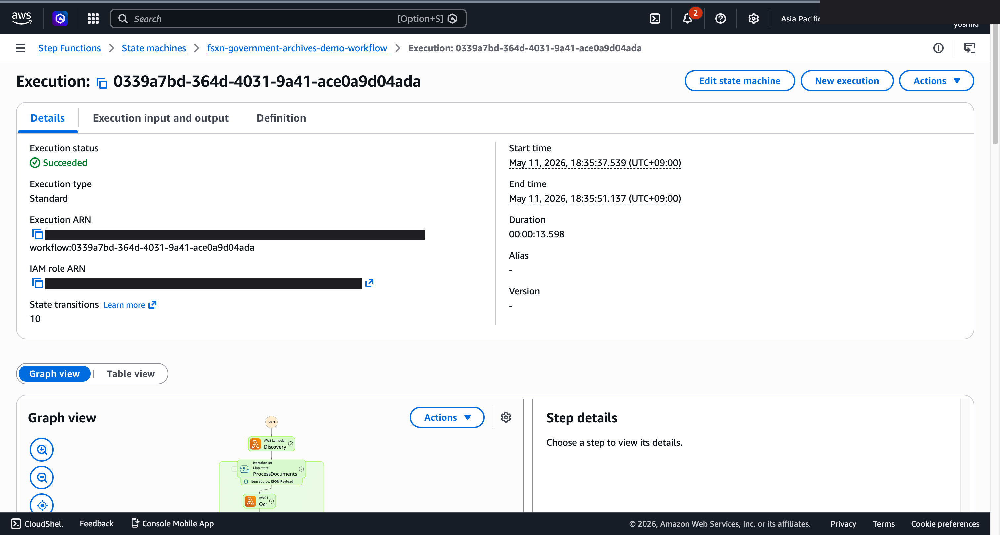
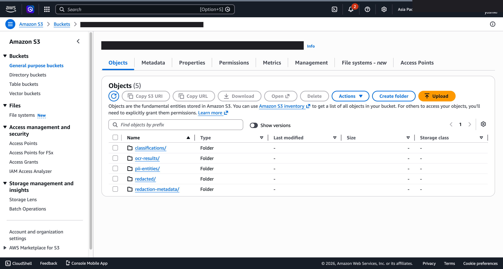
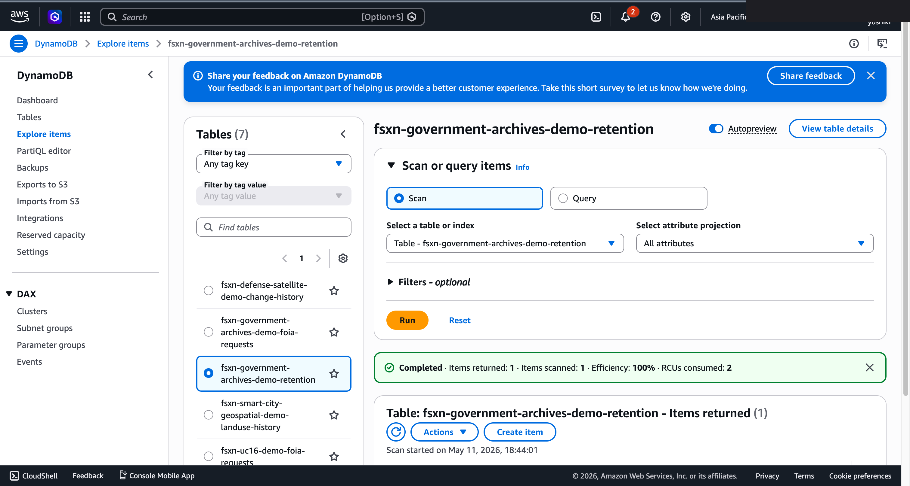

# UC16 Guión de demostración (sesión de 30 minutos)

🌐 **Language / 언어 / 语言 / 語言 / Langue / Sprache / Idioma**: [日本語](demo-guide.md) | [English](demo-guide.en.md) | [한국어](demo-guide.ko.md) | [简体中文](demo-guide.zh-CN.md) | [繁體中文](demo-guide.zh-TW.md) | [Français](demo-guide.fr.md) | [Deutsch](demo-guide.de.md) | Español

> Nota: Esta traducción ha sido producida por Amazon Bedrock Claude. Las contribuciones para mejorar la calidad de la traducción son bienvenidas.

## Requisitos previos

- Cuenta de AWS, ap-northeast-1
- FSx for NetApp ONTAP + S3 Access Point
- Desplegar `government-archives/template-deploy.yaml` (con `OpenSearchMode=none` para reducir costos)

## Cronograma

### 0:00 - 0:05 Introducción (5 minutos)

- Caso de uso: digitalización de la gestión de documentos públicos de gobiernos locales y administraciones
- Carga de los plazos legales (20 días hábiles) para solicitudes FOIA / divulgación de información
- Desafío: la detección de PII y redacción manual toma varias horas

### 0:05 - 0:10 Arquitectura (5 minutos)

- Combinación de Textract + Comprehend + Bedrock
- 3 modos de OpenSearch (none / serverless / managed)
- Gestión automática de períodos de retención NARA GRS

### 0:10 - 0:15 Despliegue (5 minutos)

```bash
aws cloudformation deploy \
  --template-file government-archives/template-deploy.yaml \
  --stack-name fsxn-uc16-demo \
  --parameter-overrides \
    DeployBucket=<your-deploy-bucket> \
    S3AccessPointAlias=<your-ap-ext-s3alias> \
    VpcId=<vpc-id> \
    PrivateSubnetIds=<subnet-ids> \
    NotificationEmail=ops@example.com \
    OpenSearchMode=none \
  --capabilities CAPABILITY_NAMED_IAM \
  --region ap-northeast-1
```

### 0:15 - 0:22 Ejecución del procesamiento (7 minutos)

```bash
# Cargar PDF de muestra (contiene información confidencial)
aws s3 cp sample-foia-request.pdf \
  s3://<s3-ap-arn>/archives/2026/05/req-001.pdf

# Ejecutar Step Functions
aws stepfunctions start-execution \
  --state-machine-arn <uc16-StateMachineArn> \
  --input '{"opensearch_enabled": "none"}'
```

Verificar resultados:
- `s3://<output-bucket>/ocr-results/archives/2026/05/req-001.pdf.txt` (texto sin procesar)
- `s3://<output-bucket>/classifications/archives/2026/05/req-001.pdf.json` (resultado de clasificación)
- `s3://<output-bucket>/pii-entities/archives/2026/05/req-001.pdf.json` (detección de PII)
- `s3://<output-bucket>/redacted/archives/2026/05/req-001.pdf.txt` (versión redactada)
- `s3://<output-bucket>/redaction-metadata/archives/2026/05/req-001.pdf.json` (sidecar)

### 0:22 - 0:27 Seguimiento de plazos FOIA (5 minutos)

```bash
# Registrar solicitud FOIA
aws dynamodb put-item \
  --table-name <fsxn-uc16-demo>-foia-requests \
  --item '{
    "request_id": {"S": "REQ-001"},
    "status": {"S": "PENDING"},
    "deadline": {"S": "2026-05-25"},
    "requester": {"S": "jane@example.com"}
  }'

# Ejecutar manualmente Lambda de FOIA Deadline
aws lambda invoke \
  --function-name <fsxn-uc16-demo>-foia-deadline \
  --payload '{}' \
  response.json && cat response.json
```

Verificar correo de notificación SNS.

### 0:27 - 0:30 Cierre (3 minutos)

- Ruta para habilitar OpenSearch (búsqueda completa con `serverless`)
- Migración a GovCloud (requisitos FedRAMP High)
- Próximos pasos: generación de respuestas FOIA interactivas con agentes de Bedrock

## Preguntas frecuentes y respuestas

**P. ¿Es posible adaptarlo a la Ley de Divulgación de Información de Japón (30 días)?**  
R. Sí, modificando `REMINDER_DAYS_BEFORE` y el hardcoding de 20 días hábiles (cambiar días festivos federales de EE.UU. → días festivos de Japón).

**P. ¿Dónde se almacena el PII del documento original?**  
R. No se almacena en ningún lugar. `pii-entities/*.json` solo contiene hash SHA-256, `redaction-metadata/*.json` también solo hash + offset. La restauración requiere re-ejecutar desde el documento original.

**P. ¿Cómo reducir costos de OpenSearch Serverless?**  
R. Mínimo 2 OCU = aproximadamente $350/mes. Se recomienda detener fuera de producción.
R. Omitir con `OpenSearchMode=none`, o reducir a ~$25/mes con `OpenSearchMode=managed` + `t3.small.search × 1`.

---

## Acerca del destino de salida: seleccionable con OutputDestination (Patrón B)

UC16 government-archives soporta el parámetro `OutputDestination` desde la actualización del 2026-05-11
(consulte `docs/output-destination-patterns.md`).

**Cargas de trabajo objetivo**: texto OCR / clasificación de documentos / detección de PII / redacción / documentos previos a OpenSearch

**2 modos**:

### STANDARD_S3 (predeterminado, comportamiento tradicional)
Crea un nuevo bucket S3 (`${AWS::StackName}-output-${AWS::AccountId}`) y
escribe los resultados de IA allí. Solo el manifest de Discovery Lambda se escribe
en el S3 Access Point (como antes).

```bash
aws cloudformation deploy \
  --template-file government-archives/template-deploy.yaml \
  --stack-name fsxn-government-archives-demo \
  --parameter-overrides \
    OutputDestination=STANDARD_S3 \
    ... (otros parámetros obligatorios)
```

### FSXN_S3AP (patrón "no data movement")
Escribe texto OCR, resultados de clasificación, resultados de detección de PII, documentos redactados y metadatos de redacción
de vuelta al **mismo volumen FSx ONTAP** que los documentos originales a través del FSxN S3 Access Point.
Los responsables de documentos públicos pueden consultar directamente los resultados de IA dentro de la estructura de directorios
SMB/NFS existente. No se crea bucket S3 estándar.

```bash
aws cloudformation deploy \
  --template-file government-archives/template-deploy.yaml \
  --stack-name fsxn-government-archives-demo \
  --parameter-overrides \
    OutputDestination=FSXN_S3AP \
    OutputS3APPrefix=ai-outputs/ \
    S3AccessPointName=eda-demo-s3ap \
    ... (otros parámetros obligatorios)
```

**Lectura en estructura de cadena**:

UC16 tiene una estructura de cadena donde las Lambdas posteriores leen los resultados de las anteriores (OCR → Classification →
EntityExtraction → Redaction → IndexGeneration), por lo que `get_bytes/get_text/get_json` en
`shared/output_writer.py` lee desde el mismo destination donde se escribió.
Esto permite que la lectura desde FSxN S3 Access Point funcione cuando `OutputDestination=FSXN_S3AP`,
y toda la cadena opera con un destination consistente.

**Notas importantes**:

- Se recomienda encarecidamente especificar `S3AccessPointName` (permitir IAM tanto en formato Alias como ARN)
- Objetos mayores de 5GB no son posibles con FSxN S3AP (especificación de AWS), se requiere carga multiparte
- ComplianceCheck Lambda solo usa DynamoDB, por lo que no se ve afectada por `OutputDestination`
- FoiaDeadlineReminder Lambda solo usa DynamoDB + SNS, por lo que no se ve afectada
- El índice de OpenSearch se gestiona por separado con el parámetro `OpenSearchMode` (independiente de `OutputDestination`)
- Para restricciones de especificación de AWS, consulte
  [la sección "Restricciones de especificación de AWS y soluciones" del README del proyecto](../../README.md#aws-仕様上の制約と回避策)
  y [`docs/output-destination-patterns.md`](../../docs/output-destination-patterns.md)

---

## Capturas de pantalla de UI/UX verificadas

Siguiendo la misma política que las demos de Phase 7 UC15/16/17 y UC6/11/14, se enfocan en **pantallas de UI/UX
que los usuarios finales ven realmente en sus operaciones diarias**. Las vistas para técnicos (gráfico de Step Functions, eventos
de stack de CloudFormation, etc.) se consolidan en `docs/verification-results-*.md`.

### Estado de verificación de este caso de uso

- ✅ **Verificación E2E**: SUCCEEDED (Phase 7 Extended Round, commit b77fc3b)
- 📸 **Captura UI/UX**: ✅ Completada (Phase 8 Theme D, commit d7ebabd)

### Capturas de pantalla existentes (verificación Phase 7)






### Pantallas UI/UX objetivo para re-verificación (lista de captura recomendada)

- Bucket de salida S3 (ocr-results/, classified/, redacted/, compliance/)
- Vista previa JSON de resultados OCR de Textract (Cross-Region us-east-1)
- Vista previa de documento redactado (Redaction)
- Tabla de retención DynamoDB (gestión de plazos FOIA)
- Notificación por correo SNS de recordatorio FOIA
- Índice de OpenSearch (resultado de IndexGeneration, cuando OpenSearchMode está habilitado)
- Resultados de IA en volumen FSx ONTAP (modo FSXN_S3AP)

### Guía de captura

1. **Preparación previa**:
   - Verificar requisitos previos con `bash scripts/verify_phase7_prerequisites.sh` (existencia de VPC/S3 AP común)
   - Empaquetar Lambda con `UC=government-archives bash scripts/package_generic_uc.sh`
   - Desplegar con `bash scripts/deploy_generic_ucs.sh UC16`

2. **Colocar datos de muestra**:
   - Cargar PDF/imágenes de muestra al prefijo `archives/` a través de S3 AP Alias
   - Iniciar Step Functions `fsxn-government-archives-demo-workflow` (entrada `{}`)

3. **Captura** (cerrar CloudShell/terminal, enmascarar nombre de usuario en la esquina superior derecha del navegador):
   - Vista general del bucket de salida S3 `fsxn-government-archives-demo-output-<account>`
   - Vista previa JSON de salida de cada etapa OCR / Classification / Redaction
   - Lista de ítems de tabla de retención DynamoDB
   - Correo de recordatorio FOIA de SNS

4. **Procesamiento de enmascaramiento**:
   - Enmascaramiento automático con `python3 scripts/mask_uc_demos.py government-archives-demo`
   - Enmascaramiento adicional según `docs/screenshots/MASK_GUIDE.md` (si es necesario)

5. **Limpieza**:
   - Eliminar con `bash scripts/cleanup_generic_ucs.sh UC16`
   - Liberación de ENI de Lambda VPC toma 15-30 minutos (especificación de AWS)
