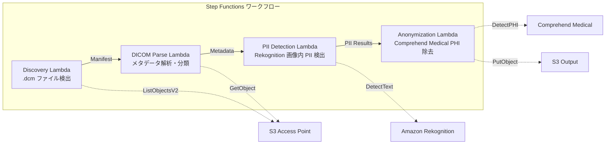

# UC5: Medizin – Automatische Klassifizierung und Anonymisierung von DICOM-Bildern

🌐 **Language / 言語**: [日本語](README.md) | [English](README.en.md) | [한국어](README.ko.md) | [简体中文](README.zh-CN.md) | [繁體中文](README.zh-TW.md) | [Français](README.fr.md) | Deutsch | [Español](README.es.md)

## Übersicht
Mithilfe der S3 Access Points von Amazon FSx for NetApp ONTAP wird ein serverloser Workflow für die automatische Klassifizierung und Anonymisierung von DICOM-Medizinbildern bereitgestellt. Dies gewährleistet den Schutz der Patientenprivatsphäre und eine effiziente Bildverwaltung.
### Fälle, für die dieses Muster geeignet ist
- DICOM-Dateien, die von PACS/VNA in FSx ONTAP gespeichert wurden, regelmäßig anonymisieren zu wollen
- PHI (Protected Health Information) für die Erstellung von Forschungsdatensätzen automatisch entfernen zu wollen
- Patienteninformationen (Burned-in Annotation), die in Bildern eingebrannt sind, erkennen zu wollen
- die Bildverwaltung durch automatische Klassifizierung nach Modalität und Region zu verbessern
- eine Anonymisierungspipeline zu erstellen, die HIPAA/personenbezogenen Datenschutzgesetzen entspricht
### Fälle, für die dieses Muster nicht geeignet ist
- Echtzeit-DICOM-Routing (DICOM MWL / MPPS-Integration erforderlich)
- Bilddiagnostik-KI zur Unterstützung (CAD) – Dieses Muster ist auf Klassifizierung und Anonymisierung spezialisiert
- Übertragene Daten in Regionen, in denen Comprehend Medical nicht verfügbar ist, sind aufgrund von Vorschriften nicht zulässig
- DICOM-Dateigröße überschreitet 5 GB (z. B. bei Multi-Frame MR/CT)
### Hauptfunktionen
- Automatische Erkennung von.dcm-Dateien über S3 AP
- Analyse von DICOM-Metadaten (Patientenname, Untersuchungsdatum, Modalität, Region) und Klassifizierung
- Erkennung von eingebrannten personenbezogenen Informationen (PII) in Bildern mit Amazon Rekognition
- Identifizierung und Entfernung von PHI (Protected Health Information) mit Amazon Comprehend Medical
- Ausgabe anonymisierter DICOM-Dateien mit Klassifizierungsmetadaten in S3
## Architektur



### Workflow-Schritte
1. **Discovery**: .dcm-Dateien von S3 AP erkennen und Manifest erzeugen
2. **DICOM-Analyse**: DICOM-Metadaten (Patientenname, Studiendatum, Modalität, Körperteil) analysieren und nach Modalität und Körperteil klassifizieren
3. **PII-Erkennung**: Mit Rekognition eingebrannte personenbezogene Informationen in Bildpixeln erkennen
4. **Anonymisierung**: Mit Comprehend Medical PHI identifizieren und entfernen, anonymisierte DICOM mit Klassifizierungsmetadaten in S3 ausgeben
## Voraussetzungen
- AWS-Konto und angemessene IAM-Berechtigungen
- FSx for NetApp ONTAP-Dateisysteme (ONTAP 9.17.1P4D3 oder höher)
- S3 Access Point aktivierte Volumes
- ONTAP REST API-Anmeldeinformationen, die im Secrets Manager registriert sind
- VPC, private Subnetz
- Amazon Rekognition, Amazon Comprehend Medical in verfügbaren Regionen
## Bereitstellungsschritte

### 1. Vorbereitung der Parameter
Vor dem Deploy die folgenden Werte überprüfen:

- FSx ONTAP S3 Access Point Alias
- ONTAP Verwaltungs-IP-Adresse
- Secrets Manager Geheimnisname
- VPC ID, privates Subnetz ID
### 2. CloudFormation-Bereitstellung

```bash
aws cloudformation deploy \
  --template-file healthcare-dicom/template.yaml \
  --stack-name fsxn-healthcare-dicom \
  --parameter-overrides \
    S3AccessPointAlias=<your-volume-ext-s3alias> \
    S3AccessPointName=<your-s3ap-name> \
    S3AccessPointOutputAlias=<your-output-volume-ext-s3alias> \
    OntapSecretName=<your-ontap-secret-name> \
    OntapManagementIp=<your-ontap-management-ip> \
    ScheduleExpression="rate(1 hour)" \
    VpcId=<your-vpc-id> \
    PrivateSubnetIds=<subnet-1>,<subnet-2> \
    NotificationEmail=<your-email@example.com> \
    EnableVpcEndpoints=false \
    EnableCloudWatchAlarms=false \
  --capabilities CAPABILITY_IAM CAPABILITY_AUTO_EXPAND \
  --region ap-northeast-1
```
> **Hinweis**: Ersetzen Sie die Platzhalter `<...>` durch die tatsächlichen Umgebungswerte.
### 3. Überprüfung der SNS-Abonnements
Nach der Bereitstellung erhalten Sie eine E-Mail zur Bestätigung des SNS-Abonnements an die angegebene E-Mail-Adresse.

> **Hinweis**: Wenn Sie `S3AccessPointName` weglassen, kann es in der IAM-Richtlinie zu einem Alias-basierten Fehler `AccessDenied` kommen. Es wird empfohlen, diesen in einer Produktionsumgebung anzugeben. Weitere Informationen finden Sie im [Fehlerbehebungsleitfaden](../docs/guides/troubleshooting-guide.md#1-accessdenied-fehler).
## Liste der Konfigurationsparameter

| パラメータ | 説明 | デフォルト | 必須 |
|-----------|------|----------|------|
| `S3AccessPointAlias` | FSx ONTAP S3 AP Alias（入力用） | — | ✅ |
| `S3AccessPointName` | S3 AP 名（ARN ベースの IAM 権限付与用。省略時は Alias ベースのみ） | `""` | ⚠️ 推奨 |
| `S3AccessPointOutputAlias` | FSx ONTAP S3 AP Alias（出力用） | — | ✅ |
| `OntapSecretName` | ONTAP 認証情報の Secrets Manager シークレット名 | — | ✅ |
| `OntapManagementIp` | ONTAP クラスタ管理 IP アドレス | — | ✅ |
| `ScheduleExpression` | EventBridge Scheduler のスケジュール式 | `rate(1 hour)` | |
| `VpcId` | VPC ID | — | ✅ |
| `PrivateSubnetIds` | プライベートサブネット ID リスト | — | ✅ |
| `NotificationEmail` | SNS 通知先メールアドレス | — | ✅ |
| `EnableVpcEndpoints` | Interface VPC Endpoints の有効化 | `false` | |
| `EnableCloudWatchAlarms` | CloudWatch Alarms の有効化 | `false` | |
| `EnableSnapStart` | Lambda SnapStart aktivieren (Kaltstart-Reduzierung) | `false` | |

## Kostenstruktur

### Request-basiert (nutzungsabhängige Gebühren)

| サービス | 課金単位 | 概算（100 DICOM ファイル/月） |
|---------|---------|---------------------------|
| Lambda | リクエスト数 + 実行時間 | ~$0.01 |
| Step Functions | ステート遷移数 | 無料枠内 |
| S3 API | リクエスト数 | ~$0.01 |
| Rekognition | 画像数 | ~$0.10 |
| Comprehend Medical | ユニット数 | ~$0.05 |

### Rund-um-die-Uhr-Betrieb (optional)

| サービス | パラメータ | 月額 |
|---------|-----------|------|
| Interface VPC Endpoints | `EnableVpcEndpoints=true` | ~$28.80 |
| CloudWatch Alarms | `EnableCloudWatchAlarms=true` | ~$0.20 |
> Im Demo-/PoC-Umfeld sind die Kosten variabel und beginnen bei **~0,17 €/Monat**.
## Sicherheit und Compliance
Dieses Workflow behandelt medizinische Daten und implementiert daher folgende Sicherheitsmaßnahmen:

- **Verschlüsselung**: Der S3-Ausgabe-Bucket wird mit SSE-KMS verschlüsselt
- **Ausführung innerhalb des VPC**: Die Lambda-Funktionen werden innerhalb des VPC ausgeführt (VPC Endpoints empfohlen)
- **Minimale IAM-Rechte**: Jede Lambda-Funktion erhält nur die minimal notwendigen IAM-Rechte
- **PHI-Entfernung**: Comprehend Medical erkennt und entfernt geschützte medizinische Informationen automatisch
- **Überwachungsprotokolle**: CloudWatch Logs protokolliert alle Vorgänge

> **Hinweis**: Dieses Muster ist eine Beispielimplementierung. Für die Nutzung in einer echten medizinischen Umgebung sind zusätzliche Sicherheitsmaßnahmen und Compliance-Prüfungen gemäß regulatorischen Anforderungen wie HIPAA erforderlich.
## Bereinigung

```bash
# CloudFormation スタックの削除
aws cloudformation delete-stack \
  --stack-name fsxn-healthcare-dicom \
  --region ap-northeast-1

# 削除完了を待機
aws cloudformation wait stack-delete-complete \
  --stack-name fsxn-healthcare-dicom \
  --region ap-northeast-1
```
> **Hinweis**: Das Löschen des Stapels kann fehlschlagen, wenn sich Objekte im S3-Bucket befinden. Bitte leeren Sie den Bucket zuvor.
## Unterstützte Regionen
UC5 verwendet die folgenden Dienste:
| サービス | リージョン制約 |
|---------|-------------|
| Amazon Rekognition | ほぼ全リージョンで利用可能 |
| Amazon Comprehend Medical | 限定リージョンのみ対応。`COMPREHEND_MEDICAL_REGION` パラメータで対応リージョン（us-east-1 等）を指定 |
| AWS X-Ray | ほぼ全リージョンで利用可能 |
| CloudWatch EMF | ほぼ全リージョンで利用可能 |
> Rufen Sie die Comprehend Medical API über den Cross-Region Client auf. Überprüfen Sie die Datenresidenzanforderungen. Weitere Informationen finden Sie in der [Regionskompatibilitätsmatrix](../docs/region-compatibility.md).
## Referenzlinks

### AWS-Dokumentation
- [FSx ONTAP S3 Access Points 概要](https://docs.aws.amazon.com/fsx/latest/ONTAPGuide/accessing-data-via-s3-access-points.html)
- [Lambda für serverlose Verarbeitung (offizielles Tutorial)](https://docs.aws.amazon.com/fsx/latest/ONTAPGuide/tutorial-process-files-with-lambda.html)
- [Comprehend Medical DetectPHI API](https://docs.aws.amazon.com/comprehend-medical/latest/dev/API_DetectPHI.html)
- [Rekognition DetectText API](https://docs.aws.amazon.com/rekognition/latest/dg/API_DetectText.html)
- [HIPAA on AWS Whitepaper](https://docs.aws.amazon.com/whitepapers/latest/architecting-hipaa-security-and-compliance-on-aws/welcome.html)
### AWS-Blogartikel
- [S3 AP 発表ブログ](https://aws.amazon.com/blogs/aws/amazon-fsx-for-netapp-ontap-now-integrates-with-amazon-s3-for-seamless-data-access/)
- [FSx ONTAP + Bedrock RAG](https://aws.amazon.com/blogs/machine-learning/build-rag-based-generative-ai-applications-in-aws-using-amazon-fsx-for-netapp-ontap-with-amazon-bedrock/)
### GitHub-Beispiel
- [aws-samples/amazon-rekognition-serverless-large-scale-image-and-video-processing](https://github.com/aws-samples/amazon-rekognition-serverless-large-scale-image-and-video-processing) — Rekognition Großflächige Verarbeitung
- [aws-samples/serverless-patterns](https://github.com/aws-samples/serverless-patterns) — Serverless-Muster
## Verifizierte Umgebung

| 項目 | 値 |
|------|-----|
| AWS リージョン | ap-northeast-1 (東京) |
| FSx ONTAP バージョン | ONTAP 9.17.1P4D3 |
| FSx 構成 | SINGLE_AZ_1 |
| Python | 3.12 |
| デプロイ方式 | CloudFormation (標準) |

## Lambda VPC-Konfigurationsarchitektur
Aufgrund der Erkenntnisse aus der Überprüfung sind die Lambda-Funktionen in VPC-intern/extern aufgeteilt.

**VPC-intern Lambda** (nur Funktionen, die ONTAP REST API-Zugriff benötigen):
- Discovery Lambda — S3 AP + ONTAP API

**VPC-extern Lambda** (nur AWS-verwaltete Dienste APIs):
- Alle anderen Lambda-Funktionen

> **Grund**: Für den Zugriff auf AWS-verwaltete Dienste APIs (Athena, Bedrock, Textract usw.) von internen VPC-Lambdas aus ist ein Interface VPC Endpoint erforderlich (jeweils $7,20/Monat). Externe VPC-Lambdas können direkt auf AWS APIs über das Internet zugreifen und ohne zusätzliche Kosten funktionieren.

> **Hinweis**: Bei UC (UC1 Recht und Compliance), die die ONTAP REST API verwenden, ist `EnableVpcEndpoints=true` erforderlich. Die ONTAP-Anmeldeinformationen werden über den Secrets Manager VPC Endpoint abgerufen.