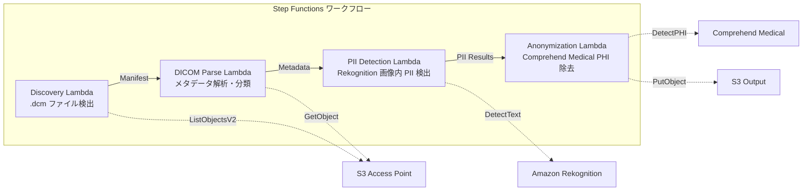

# UC5: Healthcare – Automatic Classification and Anonymization of DICOM Images

🌐 **Language / 言語**: [日本語](README.md) | English | [한국어](README.ko.md) | [简体中文](README.zh-CN.md) | [繁體中文](README.zh-TW.md) | [Français](README.fr.md) | [Deutsch](README.de.md) | [Español](README.es.md)

📚 **Documentation**: [Architecture Diagram](docs/architecture.en.md) | [Demo Guide](docs/demo-guide.en.md)

## Overview
Leveraging S3 Access Points in FSx for NetApp ONTAP, this serverless workflow automatically classifies and anonymizes DICOM medical images, ensuring patient privacy and efficient image management.
### When this pattern is appropriate
- I want to regularly anonymize DICOM files stored in FSx ONTAP from PACS / VNA
- I want to automatically remove PHI (Protected Health Information) for research dataset creation
- I want to detect patient information burned into the images (Burned-in Annotation)
- I want to streamline image management with automatic classification by modality and body part
- I want to build an anonymization pipeline that complies with HIPAA / personal information protection laws
### Cases where this pattern is not suitable
- Real-time DICOM routing (requires DICOM MWL / MPPS integration)
- AI for diagnostic assistance in imaging (CAD) — This pattern specializes in classification and anonymization
- Cross-region data transfer not allowed in regions not supported by Comprehend Medical due to regulatory restrictions
- DICOM file size exceeds 5 GB (e.g., multi-frame MR/CT)
### Main Features
- Automatic detection of.dcm files via S3 AP
- Analysis and classification of DICOM metadata (patient name, examination date, modality, region)
- Detection of personally identifiable information (PII) within images using Amazon Rekognition
- Identification and removal of PHI (protected health information) using Amazon Comprehend Medical
- S3 output with anonymized DICOM files and classification metadata
## Architecture



### Workflow Step
1. **Discovery**: Detect.dcm files from S3 AP and generate Manifest
2. **DICOM Parse**: Parse DICOM metadata (patient name, study date, modality, body part) and classify by modality and body part
3. **PII Detection**: Detect imprinted personal information in image pixels using Rekognition
4. **Anonymization**: Identify and remove PHI using Comprehend Medical, output anonymized DICOM with classified metadata to S3
## Prerequisites
- AWS account and appropriate IAM permissions
- FSx for NetApp ONTAP file system (ONTAP 9.17.1P4D3 or later)
- Volumes with S3 Access Point enabled
- ONTAP REST API credentials registered in Secrets Manager
- VPC, private subnets
- Regions where Amazon Rekognition and Amazon Comprehend Medical are available
## Deployment steps

### 1. Preparing the Parameters
Before deploying, please verify the following values:

- FSx ONTAP S3 Access Point Alias
- ONTAP Management IP Address
- Secrets Manager Secret Name
- VPC ID, Private Subnet ID
### 2. CloudFormation Deployment

```bash
aws cloudformation deploy \
  --template-file healthcare-dicom/template.yaml \
  --stack-name fsxn-healthcare-dicom \
  --parameter-overrides \
    S3AccessPointAlias=<your-volume-ext-s3alias> \
    S3AccessPointName=<your-s3ap-name> \
    S3AccessPointOutputAlias=<your-output-volume-ext-s3alias> \
    OntapSecretName=<your-ontap-secret-name> \
    OntapManagementIp=<your-ontap-management-ip> \
    ScheduleExpression="rate(1 hour)" \
    VpcId=<your-vpc-id> \
    PrivateSubnetIds=<subnet-1>,<subnet-2> \
    NotificationEmail=<your-email@example.com> \
    EnableVpcEndpoints=false \
    EnableCloudWatchAlarms=false \
  --capabilities CAPABILITY_IAM CAPABILITY_AUTO_EXPAND \
  --region ap-northeast-1
```
> **Note**: Replace the placeholder `<...>` with actual environment values.
### 3. Checking SNS Subscription
After deployment, you will receive an SNS subscription confirmation email at the specified email address.

> **Note**: If you omit `S3AccessPointName`, the IAM policy may only be based on Alias, which can result in an `AccessDenied` error. It is recommended to specify it in a production environment. For more details, refer to the [Troubleshooting Guide](../docs/guides/troubleshooting-guide.md#1-accessdenied-エラー).
## List of configuration parameters

| パラメータ | 説明 | デフォルト | 必須 |
|-----------|------|----------|------|
| `S3AccessPointAlias` | FSx ONTAP S3 AP Alias（入力用） | — | ✅ |
| `S3AccessPointName` | S3 AP 名（ARN ベースの IAM 権限付与用。省略時は Alias ベースのみ） | `""` | ⚠️ 推奨 |
| `S3AccessPointOutputAlias` | FSx ONTAP S3 AP Alias（出力用） | — | ✅ |
| `OntapSecretName` | ONTAP 認証情報の Secrets Manager シークレット名 | — | ✅ |
| `OntapManagementIp` | ONTAP クラスタ管理 IP アドレス | — | ✅ |
| `ScheduleExpression` | EventBridge Scheduler のスケジュール式 | `rate(1 hour)` | |
| `VpcId` | VPC ID | — | ✅ |
| `PrivateSubnetIds` | プライベートサブネット ID リスト | — | ✅ |
| `NotificationEmail` | SNS 通知先メールアドレス | — | ✅ |
| `EnableVpcEndpoints` | Interface VPC Endpoints の有効化 | `false` | |
| `EnableCloudWatchAlarms` | CloudWatch Alarms の有効化 | `false` | |

## Cost Structure

### Request-based (pay-per-use)

| サービス | 課金単位 | 概算（100 DICOM ファイル/月） |
|---------|---------|---------------------------|
| Lambda | リクエスト数 + 実行時間 | ~$0.01 |
| Step Functions | ステート遷移数 | 無料枠内 |
| S3 API | リクエスト数 | ~$0.01 |
| Rekognition | 画像数 | ~$0.10 |
| Comprehend Medical | ユニット数 | ~$0.05 |

### Always On (Optional)

| サービス | パラメータ | 月額 |
|---------|-----------|------|
| Interface VPC Endpoints | `EnableVpcEndpoints=true` | ~$28.80 |
| CloudWatch Alarms | `EnableCloudWatchAlarms=true` | ~$0.20 |
> In demo/PoC environments, it is available from just **~$0.17/month** in variable costs.
## Security and Compliance
This workflow handles medical data and therefore implements the following security measures:

- **Encryption**: S3 output buckets are encrypted with SSE-KMS
- **Execution within VPC**: Lambda functions are executed within a VPC (enabling VPC Endpoints is recommended)
- **Minimal permissions IAM**: Grant each Lambda function only the necessary IAM permissions
- **PHI removal**: Automatically detect and remove protected health information with Comprehend Medical
- **Audit logs**: Record all processing logs in CloudWatch Logs

> **Note**: This pattern is a sample implementation. Actual use in a medical environment requires additional security measures and compliance review in accordance with regulatory requirements such as HIPAA.
## Cleanup

```bash
# CloudFormation スタックの削除
aws cloudformation delete-stack \
  --stack-name fsxn-healthcare-dicom \
  --region ap-northeast-1

# 削除完了を待機
aws cloudformation wait stack-delete-complete \
  --stack-name fsxn-healthcare-dicom \
  --region ap-northeast-1
```
> **Note**: Deleting the stack may fail if there are objects remaining in the S3 bucket. Please empty the bucket beforehand.
## Supported Regions
UC5 uses the following services:
| サービス | リージョン制約 |
|---------|-------------|
| Amazon Rekognition | ほぼ全リージョンで利用可能 |
| Amazon Comprehend Medical | 限定リージョンのみ対応。`COMPREHEND_MEDICAL_REGION` パラメータで対応リージョン（us-east-1 等）を指定 |
| AWS X-Ray | ほぼ全リージョンで利用可能 |
| CloudWatch EMF | ほぼ全リージョンで利用可能 |
> Use the Comprehend Medical API through the Cross-Region Client. Please check the data residency requirements. For more details, refer to the [Region Compatibility Matrix](../docs/region-compatibility.md).
## References

### AWS Official Documentation
- [FSx for NetApp ONTAP S3 Access Points Overview](https://docs.aws.amazon.com/fsx/latest/ONTAPGuide/accessing-data-via-s3-access-points.html)
- [Serverless Processing with Lambda (Official Tutorial)](https://docs.aws.amazon.com/fsx/latest/ONTAPGuide/tutorial-process-files-with-lambda.html)
- [Comprehend Medical DetectPHI API](https://docs.aws.amazon.com/comprehend-medical/latest/dev/API_DetectPHI.html)
- [Rekognition DetectText API](https://docs.aws.amazon.com/rekognition/latest/dg/API_DetectText.html)
- [HIPAA on AWS Whitepaper](https://docs.aws.amazon.com/whitepapers/latest/architecting-hipaa-security-and-compliance-on-aws/welcome.html)
### AWS Blog Article
- [S3 AP Announcement Blog](https://aws.amazon.com/blogs/aws/amazon-fsx-for-netapp-ontap-now-integrates-with-amazon-s3-for-seamless-data-access/)
- [FSx ONTAP + Bedrock RAG](https://aws.amazon.com/blogs/machine-learning/build-rag-based-generative-ai-applications-in-aws-using-amazon-fsx-for-netapp-ontap-with-amazon-bedrock/)
### GitHub Samples
- [aws-samples/amazon-rekognition-serverless-large-scale-image-and-video-processing](https://github.com/aws-samples/amazon-rekognition-serverless-large-scale-image-and-video-processing) — Large-Scale Processing with Amazon Rekognition
- [aws-samples/serverless-patterns](https://github.com/aws-samples/serverless-patterns) — Collection of Serverless Patterns
## Validated Environment

| 項目 | 値 |
|------|-----|
| AWS リージョン | ap-northeast-1 (東京) |
| FSx ONTAP バージョン | ONTAP 9.17.1P4D3 |
| FSx 構成 | SINGLE_AZ_1 |
| Python | 3.12 |
| デプロイ方式 | CloudFormation (標準) |

## Lambda VPC Configuration Architecture
Based on the findings from the verification, the Lambda functions are deployed either inside or outside the VPC.

**Lambda inside VPC** (Only functions requiring ONTAP REST API access):
- Discovery Lambda — S3 AP + ONTAP API

**Lambda outside VPC** (Only uses AWS managed service APIs):
- All other Lambda functions

> **Reason**: Accessing AWS managed service APIs (Athena, Bedrock, Textract, etc.) from inside the VPC Lambda requires an Interface VPC Endpoint (each at $7.20/month). Lambda outside VPC can access AWS APIs directly over the internet and operate without additional cost.

> **Note**: For UC (UC1 Legal & Compliance) using ONTAP REST API, `EnableVpcEndpoints=true` is required. This is to obtain ONTAP credentials through Secrets Manager VPC Endpoint.