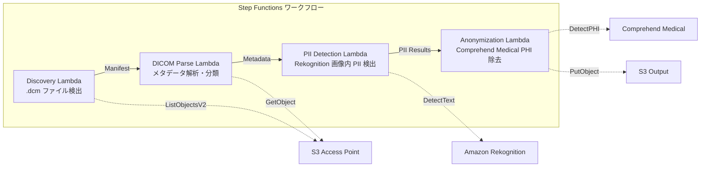

# UC5: Atención médica — Clasificación y anonimización automática de imágenes DICOM

🌐 **Language / 言語**: [日本語](README.md) | [English](README.en.md) | [한국어](README.ko.md) | [简体中文](README.zh-CN.md) | [繁體中文](README.zh-TW.md) | [Français](README.fr.md) | [Deutsch](README.de.md) | Español

## Descripción general
Se trata de un flujo de trabajo sin servidor que aprovecha los Puntos de Acceso S3 de FSx for NetApp ONTAP para la clasificación y anonimización automática de imágenes médicas DICOM. Esto garantiza la protección de la privacidad del paciente y una gestión eficiente de las imágenes.
### Casos en los que este patrón es adecuado
- Quisiera anonimizar periódicamente los archivos DICOM almacenados en FSx ONTAP desde PACS / VNA
- Deseo eliminar automáticamente la PHI (Información de Salud Protegida) para crear conjuntos de datos de investigación
- Quiero detectar información del paciente grabada en la imagen (Anotación grabada)
- Deseo mejorar la gestión de imágenes con la clasificación automática por modalidad y sitio
- Quiero construir un pipeline de anonimización que cumpla con HIPAA / leyes de protección de datos personales
### Casos donde este patrón no es adecuado
- Enrutamiento DICOM en tiempo real (requiere integración DICOM MWL / MPPS)
- AI para asistencia en diagnóstico de imágenes (CAD) — Este patrón se especializa en clasificación y anonimización
- Transferencia de datos entre regiones no permitida por regulaciones en regiones donde Comprehend Medical no está disponible
- Tamaño de archivo DICOM superior a 5 GB (MR/CT de múltiples fotogramas, etc.)
### Principales características
- Detección automática de archivos.dcm a través de S3 AP
- Análisis y clasificación de metadatos DICOM (nombre del paciente, fecha del examen, modalidad, sitio)
- Detección de información personal identificable (PII) grabada en imágenes con Amazon Rekognition
- Identificación y eliminación de PHI (Información Médica Protegida) con Amazon Comprehend Medical
- Salida a S3 de archivos DICOM anonimizados con metadatos de clasificación
## Arquitectura



### Paso del flujo de trabajo
1. **Discovery**: Detectar archivos.dcm desde S3 AP y generar Manifest
2. **DICOM Parse**: Analizar metadatos DICOM (nombre del paciente, fecha del estudio, modalidad, parte del cuerpo) y clasificar por modalidad y parte
3. **PII Detection**: Detectar información personal identificable en los píxeles de la imagen con Rekognition
4. **Anonymization**: Identificar y eliminar PHI con Comprehend Medical, y generar DICOM anónimo con metadatos de clasificación en S3
## Requisitos previos
- Cuenta de AWS y permisos IAM adecuados
- Sistema de archivos FSx for NetApp ONTAP (ONTAP 9.17.1P4D3 o superior)
- Volumen con Punto de Acceso S3 habilitado
- Credenciales de API REST de ONTAP registradas en Secrets Manager
- VPC, subredes privadas
- Regiones donde Amazon Rekognition y Amazon Comprehend Medical estén disponibles
## Pasos de implementación

### 1. Preparación de parámetros
Antes de implementar, verifique los siguientes valores:

- Alias del punto de acceso S3 de FSx ONTAP
- Dirección IP de administración de ONTAP
- Nombre del secreto de Secrets Manager
- ID de VPC, ID de subred privada
### 2. Despliegue de CloudFormation

```bash
aws cloudformation deploy \
  --template-file healthcare-dicom/template.yaml \
  --stack-name fsxn-healthcare-dicom \
  --parameter-overrides \
    S3AccessPointAlias=<your-volume-ext-s3alias> \
    S3AccessPointName=<your-s3ap-name> \
    S3AccessPointOutputAlias=<your-output-volume-ext-s3alias> \
    OntapSecretName=<your-ontap-secret-name> \
    OntapManagementIp=<your-ontap-management-ip> \
    ScheduleExpression="rate(1 hour)" \
    VpcId=<your-vpc-id> \
    PrivateSubnetIds=<subnet-1>,<subnet-2> \
    NotificationEmail=<your-email@example.com> \
    EnableVpcEndpoints=false \
    EnableCloudWatchAlarms=false \
  --capabilities CAPABILITY_IAM CAPABILITY_AUTO_EXPAND \
  --region ap-northeast-1
```
> **Advertencia**: Reemplace los marcadores de posición `<...>` con los valores de entorno reales.
### 3. Verificación de la suscripción de SNS
Después del despliegue, se enviará un correo electrónico de confirmación de suscripción de SNS a la dirección de correo electrónico especificada.

> **Nota**: Si omite `S3AccessPointName`, la política de IAM solo será basada en alias y puede que se produzca un error `AccessDenied`. Se recomienda especificarlo en un entorno de producción. Para obtener más detalles, consulte la [Guía de solución de problemas](../docs/guides/troubleshooting-guide.md#1-accessdenied-エラー).
## Lista de parámetros de configuración

| パラメータ | 説明 | デフォルト | 必須 |
|-----------|------|----------|------|
| `S3AccessPointAlias` | FSx ONTAP S3 AP Alias（入力用） | — | ✅ |
| `S3AccessPointName` | S3 AP 名（ARN ベースの IAM 権限付与用。省略時は Alias ベースのみ） | `""` | ⚠️ 推奨 |
| `S3AccessPointOutputAlias` | FSx ONTAP S3 AP Alias（出力用） | — | ✅ |
| `OntapSecretName` | ONTAP 認証情報の Secrets Manager シークレット名 | — | ✅ |
| `OntapManagementIp` | ONTAP クラスタ管理 IP アドレス | — | ✅ |
| `ScheduleExpression` | EventBridge Scheduler のスケジュール式 | `rate(1 hour)` | |
| `VpcId` | VPC ID | — | ✅ |
| `PrivateSubnetIds` | プライベートサブネット ID リスト | — | ✅ |
| `NotificationEmail` | SNS 通知先メールアドレス | — | ✅ |
| `EnableVpcEndpoints` | Interface VPC Endpoints の有効化 | `false` | |
| `EnableCloudWatchAlarms` | CloudWatch Alarms の有効化 | `false` | |

## Estructura de costos

### Tarifa por solicitud (pago por uso)

| サービス | 課金単位 | 概算（100 DICOM ファイル/月） |
|---------|---------|---------------------------|
| Lambda | リクエスト数 + 実行時間 | ~$0.01 |
| Step Functions | ステート遷移数 | 無料枠内 |
| S3 API | リクエスト数 | ~$0.01 |
| Rekognition | 画像数 | ~$0.10 |
| Comprehend Medical | ユニット数 | ~$0.05 |

### Operación continua (Opcional)

| サービス | パラメータ | 月額 |
|---------|-----------|------|
| Interface VPC Endpoints | `EnableVpcEndpoints=true` | ~$28.80 |
| CloudWatch Alarms | `EnableCloudWatchAlarms=true` | ~$0.20 |
> En entornos de demostración/PoC, está disponible a partir de aproximadamente **~$0.17/mes** solo con costos variables.
## Seguridad y cumplimiento normativo
Este flujo de trabajo maneja datos médicos, por lo que implementa las siguientes medidas de seguridad:

- **Encriptación**: El bucket de salida de S3 está encriptado con SSE-KMS
- **Ejecución dentro de VPC**: La función de Lambda se ejecuta dentro de una VPC (se recomienda habilitar VPC Endpoints)
- **IAM con mínimo privilegios**: Se asignan los privilegios IAM mínimos necesarios a cada función de Lambda
- **Eliminación de PHI**: Comprehend Medical detecta y elimina automáticamente la información médica protegida
- **Registro de auditoría**: CloudWatch Logs registra todos los procesos

> **Nota**: Este patrón es una implementación de ejemplo. Su uso en entornos médicos reales requiere medidas de seguridad adicionales y una revisión de cumplimiento basada en requisitos regulatorios como HIPAA.
## Limpieza

```bash
# CloudFormation スタックの削除
aws cloudformation delete-stack \
  --stack-name fsxn-healthcare-dicom \
  --region ap-northeast-1

# 削除完了を待機
aws cloudformation wait stack-delete-complete \
  --stack-name fsxn-healthcare-dicom \
  --region ap-northeast-1
```
> **Nota**: La eliminación del stack puede fallar si hay objetos restantes en el bucket de S3. Por favor, asegúrate de vaciar el bucket previamente.
## Regiones compatibles
UC5 utiliza los siguientes servicios:
| サービス | リージョン制約 |
|---------|-------------|
| Amazon Rekognition | ほぼ全リージョンで利用可能 |
| Amazon Comprehend Medical | 限定リージョンのみ対応。`COMPREHEND_MEDICAL_REGION` パラメータで対応リージョン（us-east-1 等）を指定 |
| AWS X-Ray | ほぼ全リージョンで利用可能 |
| CloudWatch EMF | ほぼ全リージョンで利用可能 |
> Llame a la API de Comprehend Medical a través del Cliente Inter-Región. Verifique los requisitos de residencia de datos. Para más detalles, consulte la [Matriz de Compatibilidad de Regiones](../docs/region-compatibility.md).
## Enlaces de referencia

### Documentación oficial de AWS
- [Puntos de acceso de S3 de FSx ONTAP 概要](https://docs.aws.amazon.com/fsx/latest/ONTAPGuide/accessing-data-via-s3-access-points.html)
- [Procesamiento sin servidor con Lambda (tutorial oficial)](https://docs.aws.amazon.com/fsx/latest/ONTAPGuide/tutorial-process-files-with-lambda.html)
- [API DetectPHI de Comprehend Medical](https://docs.aws.amazon.com/comprehend-medical/latest/dev/API_DetectPHI.html)
- [API DetectText de Rekognition](https://docs.aws.amazon.com/rekognition/latest/dg/API_DetectText.html)
- [Libro blanco de HIPAA en AWS](https://docs.aws.amazon.com/whitepapers/latest/architecting-hipaa-security-and-compliance-on-aws/welcome.html)
### Artículos de blog de AWS
- [Blog de anuncio de S3 AP](https://aws.amazon.com/blogs/aws/amazon-fsx-for-netapp-ontap-now-integrates-with-amazon-s3-for-seamless-data-access/)
- [FSx ONTAP + Bedrock RAG](https://aws.amazon.com/blogs/machine-learning/build-rag-based-generative-ai-applications-in-aws-using-amazon-fsx-for-netapp-ontap-with-amazon-bedrock/)
### Ejemplo de GitHub
- [aws-samples/amazon-rekognition-serverless-large-scale-image-and-video-processing](https://github.com/aws-samples/amazon-rekognition-serverless-large-scale-image-and-video-processing) — Rekognition de procesamiento de imagen y video a gran escala
- [aws-samples/serverless-patterns](https://github.com/aws-samples/serverless-patterns) — Patrones sin servidor
## Entornos verificados

| 項目 | 値 |
|------|-----|
| AWS リージョン | ap-northeast-1 (東京) |
| FSx ONTAP バージョン | ONTAP 9.17.1P4D3 |
| FSx 構成 | SINGLE_AZ_1 |
| Python | 3.12 |
| デプロイ方式 | CloudFormation (標準) |

## Arquitectura de configuración de VPC para Lambda
Basado en los hallazgos de la verificación, las funciones de Lambda se han configurado de forma separada dentro/fuera de VPC.

**Lambda dentro de VPC** (solo funciones que requieren acceso a ONTAP REST API):
- Lambda de Discovery — S3 AP + ONTAP API

**Lambda fuera de VPC** (solo uso de API de servicios gestionados de AWS):
- Todas las demás funciones de Lambda

> **Razón**: Para acceder a la API de servicios gestionados de AWS (Athena, Bedrock, Textract, etc.) desde Lambda dentro de VPC, se necesita Interface VPC Endpoint (cada uno $7.20/mes). Las funciones de Lambda fuera de VPC pueden acceder directamente a la API de AWS a través de Internet, sin costo adicional.

> **Nota**: Para las UC (UC1 Legal & Compliance) que utilizan ONTAP REST API, `EnableVpcEndpoints=true` es obligatorio. Esto se debe a que las credenciales de ONTAP se obtienen a través del endpoint de Secrets Manager VPC.