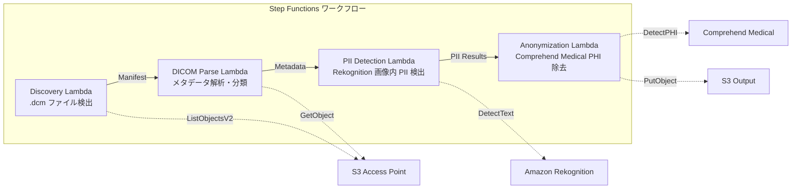

# UC5 : Santé - Classification et anonymisation automatiques des images DICOM

🌐 **Language / 言語**: [日本語](README.md) | [English](README.en.md) | [한국어](README.ko.md) | [简体中文](README.zh-CN.md) | [繁體中文](README.zh-TW.md) | Français | [Deutsch](README.de.md) | [Español](README.es.md)

## Aperçu
FSx for NetApp ONTAP utilise les points d'accès S3 pour mettre en place un workflow sans serveur d'indexation et d'anonymisation automatique des images médicales DICOM. Cela assure la protection de la confidentialité des patients et une gestion efficace des images.
### Cas où ce motif est approprié
- Je souhaite anonymiser périodiquement les fichiers DICOM stockés dans FSx ONTAP à partir de PACS / VNA
- Je souhaite supprimer automatiquement les IHP (informations de santé protégées) pour la création de jeux de données de recherche
- Je souhaite détecter les informations sur les patients gravées dans l'image (annotation brûlée)
- Je souhaite rationaliser la gestion des images par une classification automatique par modalité et par site
- Je souhaite construire un pipeline d'anonymisation conforme à HIPAA / à la protection des données personnelles
### Cas où ce modèle ne convient pas
- Routage DICOM en temps réel (nécessite une intégration DICOM MWL / MPPS)
- IA d'aide au diagnostic des images (CAD) — Ce modèle est spécialisé dans la classification et l'anonymisation
- Les régions non prises en charge par Comprehend Medical ne permettent pas la transmission de données inter-régions en raison de réglementations
- La taille des fichiers DICOM dépasse 5 Go (par exemple pour les images MR/CT multi-images)
### Principales fonctionnalités
- Détection automatique des fichiers .dcm via S3 AP
- Analyse des métadonnées DICOM (nom du patient, date de l'examen, modalité, site) et classification
- Détection des informations d'identification personnelles (PII) gravées dans les images par Amazon Rekognition
- Identification et suppression des IHP (informations médicales protégées) par Amazon Comprehend Medical
- Classification des fichiers DICOM anonymisés avec sortie S3 avec métadonnées
## Architecture



### Étapes du flux de travail
1. **Découverte** : Détecter les fichiers .dcm depuis S3 AP et générer un Manifest
2. **Analyse DICOM** : Analyser les métadonnées DICOM (nom du patient, date de l'étude, modalité, partie du corps) et classer par modalité et partie du corps
3. **Détection d'informations personnelles identifiables** : Détecter les informations personnelles identifiables gravées dans les pixels de l'image avec Rekognition
4. **Anonymisation** : Identifier et supprimer les PHI avec Comprehend Medical, et sortir les DICOM anonymisés avec les métadonnées de classification dans S3
## Prérequis
- Compte AWS et autorisations IAM appropriées
- Système de fichiers FSx for NetApp ONTAP (ONTAP 9.17.1P4D3 ou version ultérieure)
- Volumes avec Point d'accès S3 activé
- Informations d'identification de l'API REST ONTAP enregistrées dans Secrets Manager
- VPC, sous-réseaux privés
- Régions où Amazon Rekognition et Amazon Comprehend Medical sont disponibles
## Étapes de déploiement

### 1. Préparation des paramètres
Avant le déploiement, veuillez vérifier les valeurs suivantes :

- FSx ONTAP S3 Access Point Alias
- Adresse IP de gestion ONTAP
- Nom du secret Secrets Manager
- ID de VPC, ID de sous-réseau privé
### 2. Déploiement CloudFormation

```bash
aws cloudformation deploy \
  --template-file healthcare-dicom/template.yaml \
  --stack-name fsxn-healthcare-dicom \
  --parameter-overrides \
    S3AccessPointAlias=<your-volume-ext-s3alias> \
    S3AccessPointName=<your-s3ap-name> \
    S3AccessPointOutputAlias=<your-output-volume-ext-s3alias> \
    OntapSecretName=<your-ontap-secret-name> \
    OntapManagementIp=<your-ontap-management-ip> \
    ScheduleExpression="rate(1 hour)" \
    VpcId=<your-vpc-id> \
    PrivateSubnetIds=<subnet-1>,<subnet-2> \
    NotificationEmail=<your-email@example.com> \
    EnableVpcEndpoints=false \
    EnableCloudWatchAlarms=false \
  --capabilities CAPABILITY_IAM CAPABILITY_AUTO_EXPAND \
  --region ap-northeast-1
```
> **Remarque** : remplacez les espaces réservés `<...>` par les valeurs d'environnement appropriées.
### 3. Vérification des abonnements SNS
Après le déploiement, un e-mail de confirmation d'abonnement SNS sera envoyé à l'adresse e-mail spécifiée.

> **Remarque** : Si vous omettez `S3AccessPointName`, la politique IAM peut se limiter aux alias uniquement et entraîner une erreur `AccessDenied`. Il est recommandé de spécifier ce paramètre en environnement de production. Pour plus de détails, consultez le [guide de dépannage](../docs/guides/troubleshooting-guide.md#1-accessdenied-エラー).
## Liste des paramètres de configuration

| パラメータ | 説明 | デフォルト | 必須 |
|-----------|------|----------|------|
| `S3AccessPointAlias` | FSx ONTAP S3 AP Alias（入力用） | — | ✅ |
| `S3AccessPointName` | S3 AP 名（ARN ベースの IAM 権限付与用。省略時は Alias ベースのみ） | `""` | ⚠️ 推奨 |
| `S3AccessPointOutputAlias` | FSx ONTAP S3 AP Alias（出力用） | — | ✅ |
| `OntapSecretName` | ONTAP 認証情報の Secrets Manager シークレット名 | — | ✅ |
| `OntapManagementIp` | ONTAP クラスタ管理 IP アドレス | — | ✅ |
| `ScheduleExpression` | EventBridge Scheduler のスケジュール式 | `rate(1 hour)` | |
| `VpcId` | VPC ID | — | ✅ |
| `PrivateSubnetIds` | プライベートサブネット ID リスト | — | ✅ |
| `NotificationEmail` | SNS 通知先メールアドレス | — | ✅ |
| `EnableVpcEndpoints` | Interface VPC Endpoints の有効化 | `false` | |
| `EnableCloudWatchAlarms` | CloudWatch Alarms の有効化 | `false` | |
| `EnableSnapStart` | Activer Lambda SnapStart (réduction du démarrage à froid) | `false` | |

## Structure des coûts

### Basé sur la demande (facturation à l'utilisation)

| サービス | 課金単位 | 概算（100 DICOM ファイル/月） |
|---------|---------|---------------------------|
| Lambda | リクエスト数 + 実行時間 | ~$0.01 |
| Step Functions | ステート遷移数 | 無料枠内 |
| S3 API | リクエスト数 | ~$0.01 |
| Rekognition | 画像数 | ~$0.10 |
| Comprehend Medical | ユニット数 | ~$0.05 |

### Fonctionnement en continu (facultatif)

| サービス | パラメータ | 月額 |
|---------|-----------|------|
| Interface VPC Endpoints | `EnableVpcEndpoints=true` | ~$28.80 |
| CloudWatch Alarms | `EnableCloudWatchAlarms=true` | ~$0.20 |
> Dans un environnement de démonstration/PoC, il est disponible à partir de seulement **~0,17 $/mois** en frais variables.
## Sécurité et conformité
Ce workflow traite des données médicales, pour lesquelles les mesures de sécurité suivantes ont été mises en œuvre :

- **Chiffrement** : Le bucket de sortie S3 est chiffré avec SSE-KMS
- **Exécution dans VPC** : Les fonctions Lambda sont exécutées dans un VPC (activation des VPC Endpoints recommandée)
- **IAM minimale** : Accorder aux fonctions Lambda les permissions IAM minimales nécessaires
- **Élimination des PHI** : Comprehend Medical détecte et élimine automatiquement les informations médicales protégées
- **Journaux d'audit** : Tous les traitements sont enregistrés dans CloudWatch Logs

> **Remarque** : Ce modèle est une implémentation d'exemple. Pour une utilisation dans un environnement médical réel, des mesures de sécurité supplémentaires et une évaluation de conformité basées sur les exigences réglementaires telles que HIPAA sont nécessaires.
## Nettoyage

```bash
# CloudFormation スタックの削除
aws cloudformation delete-stack \
  --stack-name fsxn-healthcare-dicom \
  --region ap-northeast-1

# 削除完了を待機
aws cloudformation wait stack-delete-complete \
  --stack-name fsxn-healthcare-dicom \
  --region ap-northeast-1
```
> **Remarque** : La suppression de la pile peut échouer si des objets restent dans le compartiment S3. Assurez-vous de vider le compartiment au préalable.
## Régions prises en charge
UC5 utilise les services suivants :
| サービス | リージョン制約 |
|---------|-------------|
| Amazon Rekognition | ほぼ全リージョンで利用可能 |
| Amazon Comprehend Medical | 限定リージョンのみ対応。`COMPREHEND_MEDICAL_REGION` パラメータで対応リージョン（us-east-1 等）を指定 |
| AWS X-Ray | ほぼ全リージョンで利用可能 |
| CloudWatch EMF | ほぼ全リージョンで利用可能 |
> Appelez l'API Comprehend Medical via le client inter-régions. Vérifiez les exigences de résidence des données. Pour plus d'informations, consultez la [Matrice de compatibilité régionale](../docs/region-compatibility.md).
## Liens de référence

### Documentation officielle AWS
- [Points d'accès S3 FSx ONTAP 概要](https://docs.aws.amazon.com/fsx/latest/ONTAPGuide/accessing-data-via-s3-access-points.html)
- [Traitement serverless avec Lambda (Tutoriel officiel)](https://docs.aws.amazon.com/fsx/latest/ONTAPGuide/tutorial-process-files-with-lambda.html)
- [API DetectPHI de Comprehend Medical](https://docs.aws.amazon.com/comprehend-medical/latest/dev/API_DetectPHI.html)
- [API DetectText de Rekognition](https://docs.aws.amazon.com/rekognition/latest/dg/API_DetectText.html)
- [Livre blanc HIPAA sur AWS](https://docs.aws.amazon.com/whitepapers/latest/architecting-hipaa-security-and-compliance-on-aws/welcome.html)
### Article de blog AWS
- [Blog de lancement S3 AP](https://aws.amazon.com/blogs/aws/amazon-fsx-for-netapp-ontap-now-integrates-with-amazon-s3-for-seamless-data-access/)
- [FSx ONTAP + Bedrock RAG](https://aws.amazon.com/blogs/machine-learning/build-rag-based-generative-ai-applications-in-aws-using-amazon-fsx-for-netapp-ontap-with-amazon-bedrock/)
### Exemple GitHub
- [aws-samples/amazon-rekognition-serverless-large-scale-image-and-video-processing](https://github.com/aws-samples/amazon-rekognition-serverless-large-scale-image-and-video-processing) — Traitement d'images et de vidéos à grande échelle avec Amazon Rekognition
- [aws-samples/serverless-patterns](https://github.com/aws-samples/serverless-patterns) — Modèles sans serveur
## Environnements validés

| 項目 | 値 |
|------|-----|
| AWS リージョン | ap-northeast-1 (東京) |
| FSx ONTAP バージョン | ONTAP 9.17.1P4D3 |
| FSx 構成 | SINGLE_AZ_1 |
| Python | 3.12 |
| デプロイ方式 | CloudFormation (標準) |

## Architecture de configuration VPC pour Lambda
Selon les conclusions tirées de la vérification, les fonctions Lambda sont déployées à l'intérieur et à l'extérieur du VPC.

**Lambda à l'intérieur du VPC** (uniquement les fonctions nécessitant un accès à l'API REST ONTAP) :
- Lambda de découverte — S3 AP + API ONTAP

**Lambda en dehors du VPC** (utilisant uniquement les API des services gérés par AWS) :
- Toutes les autres fonctions Lambda

> **Raison** : L'accès aux API des services gérés par AWS (Athena, Bedrock, Textract, etc.) à partir d'une Lambda à l'intérieur du VPC nécessite un Interface VPC Endpoint (chacun à 7,20 $/mois). Les Lambda en dehors du VPC peuvent accéder directement aux API AWS via Internet, sans coût supplémentaire.

> **Remarque** : Pour les UC (UC1 Juridique et Conformité) utilisant l'API REST ONTAP, `EnableVpcEndpoints=true` est requis. Ceci est nécessaire pour obtenir les informations d'identification ONTAP via l'endpoint VPC de Secrets Manager.