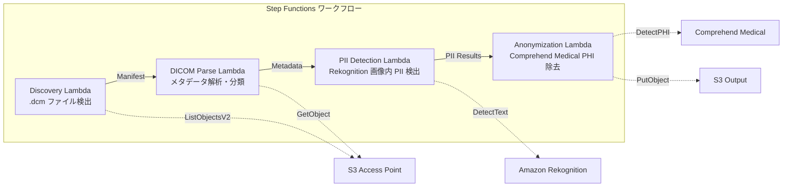

# UC5: 의료 — DICOM 이미지의 자동 분류 및 익명화

🌐 **Language / 言語**: [日本語](README.md) | [English](README.en.md) | 한국어 | [简体中文](README.zh-CN.md) | [繁體中文](README.zh-TW.md) | [Français](README.fr.md) | [Deutsch](README.de.md) | [Español](README.es.md)

## 개요
FSx for NetApp ONTAP의 S3 액세스 포인트를 활용하여 DICOM 의료 이미지의 자동 분류 및 익명화를 수행하는 서버리스 워크플로입니다. 이를 통해 환자 프라이버시를 보호하고 효율적인 이미지 관리가 가능합니다.
### 이 패턴이 적합한 경우
- PACS / VNA에서 저장된 DICOM 파일을 FSx ONTAP에 정기적으로 익명화하고 싶습니다
- 연구용 데이터 세트를 작성하기 위해 PHI(보호 대상 의료 정보)를 자동으로 제거하고 싶습니다
- 이미지에 내장된 환자 정보(Burned-in Annotation)를 감지하고 싶습니다
- 모달리티와 부위별 자동 분류로 이미지 관리를 효율화하고 싶습니다
- HIPAA / 개인 정보 보호법을 준수하는 익명화 파이프라인을 구축하고 싶습니다
### 이 패턴이 적합하지 않은 경우
- 실시간 DICOM 라우팅(DICOM MWL / MPPS 연동 필요)
- 이미지 진단 지원 AI(CAD) — 본 패턴은 분류 및 익명화에 특화
- Comprehend Medical이 지원되지 않는 리전에서 교차 리전 데이터 전송이 규제상 허용되지 않음
- DICOM 파일 크기가 5 GB를 초과(MR/CT의 멀티프레임 등)
### 주요 기능
- S3 AP를 통해.dcm 파일을 자동 검출
- DICOM 메타데이터 파싱(환자 이름, 검사일, 모달리티, 부위) 및 분류
- Amazon Rekognition을 사용한 이미지 내 기입된 개인 정보(PII) 검출
- Amazon Comprehend Medical을 사용한 PHI(보호 대상 의료 정보) 식별 및 제거
- 익명화된 DICOM 파일 분류 메타데이터 포함 S3 출력
## 아키텍처



### 워크플로우 단계
1. **검색**: S3 AP에서.dcm 파일을 검색하고 매니페스트 생성
2. **DICOM 파싱**: DICOM 메타데이터(환자 이름, 검사 날짜, 모달리티, 신체 부위)를 분석하여 모달리티 및 부위별로 분류
3. **PII 감지**: Rekognition으로 이미지 픽셀 내의 기록된 개인 정보 식별
4. **익명화**: Comprehend Medical로 PHI를 식별 및 제거하고, 익명화된 DICOM을 분류 메타데이터와 함께 S3에 출력
## 전제 조건
- AWS 계정과 적절한 IAM 권한
- NetApp ONTAP용 FSx 파일 시스템(ONTAP 9.17.1P4D3 이상)
- S3 Access Point가 활성화된 볼륨
- ONTAP REST API 인증 정보가 Secrets Manager에 등록됨
- VPC, 프라이빗 서브넷
- Amazon Rekognition, Amazon Comprehend Medical 사용 가능한 리전
## 배포 절차

### 1. 매개변수 준비
배포 전에 다음 값을 확인하세요:

- FSx ONTAP S3 액세스 포인트 별칭
- ONTAP 관리 IP 주소
- Secrets Manager 시크릿 이름
- VPC ID, 프라이빗 서브넷 ID
### 2. CloudFormation 배포

```bash
aws cloudformation deploy \
  --template-file healthcare-dicom/template.yaml \
  --stack-name fsxn-healthcare-dicom \
  --parameter-overrides \
    S3AccessPointAlias=<your-volume-ext-s3alias> \
    S3AccessPointName=<your-s3ap-name> \
    S3AccessPointOutputAlias=<your-output-volume-ext-s3alias> \
    OntapSecretName=<your-ontap-secret-name> \
    OntapManagementIp=<your-ontap-management-ip> \
    ScheduleExpression="rate(1 hour)" \
    VpcId=<your-vpc-id> \
    PrivateSubnetIds=<subnet-1>,<subnet-2> \
    NotificationEmail=<your-email@example.com> \
    EnableVpcEndpoints=false \
    EnableCloudWatchAlarms=false \
  --capabilities CAPABILITY_IAM CAPABILITY_AUTO_EXPAND \
  --region ap-northeast-1
```
> **주의**: `<...>` 의 플레이스홀더를 실제 환경 값으로 바꾸어 주세요.
### 3. SNS 구독 확인
배포 후, 지정한 이메일 주소로 SNS 구독 확인 이메일이 도착합니다.

> **주의**: `S3AccessPointName`을 생략하면 IAM 정책이 Alias 기반으로만 되어 `AccessDenied` 오류가 발생할 수 있습니다. 운영 환경에서는 지정을 권장합니다. 자세한 내용은 [문제 해결 가이드](../docs/guides/troubleshooting-guide.md#1-accessdenied-에러)를 참조하세요.
## 설정 매개변수 목록

| パラメータ | 説明 | デフォルト | 必須 |
|-----------|------|----------|------|
| `S3AccessPointAlias` | FSx ONTAP S3 AP Alias（入力用） | — | ✅ |
| `S3AccessPointName` | S3 AP 名（ARN ベースの IAM 権限付与用。省略時は Alias ベースのみ） | `""` | ⚠️ 推奨 |
| `S3AccessPointOutputAlias` | FSx ONTAP S3 AP Alias（出力用） | — | ✅ |
| `OntapSecretName` | ONTAP 認証情報の Secrets Manager シークレット名 | — | ✅ |
| `OntapManagementIp` | ONTAP クラスタ管理 IP アドレス | — | ✅ |
| `ScheduleExpression` | EventBridge Scheduler のスケジュール式 | `rate(1 hour)` | |
| `VpcId` | VPC ID | — | ✅ |
| `PrivateSubnetIds` | プライベートサブネット ID リスト | — | ✅ |
| `NotificationEmail` | SNS 通知先メールアドレス | — | ✅ |
| `EnableVpcEndpoints` | Interface VPC Endpoints の有効化 | `false` | |
| `EnableCloudWatchAlarms` | CloudWatch Alarms の有効化 | `false` | |
| `EnableSnapStart` | Lambda SnapStart 활성화 (콜드 스타트 단축) | `false` | |

## 비용 구조

### 요청 기반(사용량 기반)

| サービス | 課金単位 | 概算（100 DICOM ファイル/月） |
|---------|---------|---------------------------|
| Lambda | リクエスト数 + 実行時間 | ~$0.01 |
| Step Functions | ステート遷移数 | 無料枠内 |
| S3 API | リクエスト数 | ~$0.01 |
| Rekognition | 画像数 | ~$0.10 |
| Comprehend Medical | ユニット数 | ~$0.05 |

### 상시 운영(선택 사항)

| サービス | パラメータ | 月額 |
|---------|-----------|------|
| Interface VPC Endpoints | `EnableVpcEndpoints=true` | ~$28.80 |
| CloudWatch Alarms | `EnableCloudWatchAlarms=true` | ~$0.20 |
> 데모/PoC 환경에서는 가변 비용만으로 **월 ~0.17달러**부터 이용할 수 있습니다.
## 보안 및 규정 준수
이 워크플로는 의료 데이터를 처리하기 때문에 다음과 같은 보안 조치를 구현하고 있습니다:

- **암호화**: S3 출력 버킷은 SSE-KMS로 암호화
- **VPC 내 실행**: Lambda 함수는 VPC 내에서 실행(VPC Endpoints 사용 권장)
- **최소 권한 IAM**: 각 Lambda 함수에 필요한 최소 IAM 권한 부여
- **PHI 제거**: Comprehend Medical로 보호 대상 의료 정보 자동 감지 및 제거
- **감사 로그**: CloudWatch Logs로 모든 처리의 로그 기록

> **참고**: 이 패턴은 샘플 구현입니다. 실제 의료 환경에서 사용하려면 HIPAA 등의 규제 요건에 따른 추가 보안 조치 및 규정 준수 검토가 필요합니다.
## 정리

```bash
# CloudFormation スタックの削除
aws cloudformation delete-stack \
  --stack-name fsxn-healthcare-dicom \
  --region ap-northeast-1

# 削除完了を待機
aws cloudformation wait stack-delete-complete \
  --stack-name fsxn-healthcare-dicom \
  --region ap-northeast-1
```
> **주의**: S3 버킷에 객체가 남아있을 경우 스택 삭제가 실패할 수 있습니다. 사전에 버킷을 비워두세요.
## 지원되는 리전
UC5는 다음 서비스를 사용합니다: Amazon Bedrock, AWS Step Functions, Amazon Athena, Amazon S3, AWS Lambda, Amazon FSx for NetApp ONTAP, Amazon CloudWatch, AWS CloudFormation 등.
| サービス | リージョン制約 |
|---------|-------------|
| Amazon Rekognition | ほぼ全リージョンで利用可能 |
| Amazon Comprehend Medical | 限定リージョンのみ対応。`COMPREHEND_MEDICAL_REGION` パラメータで対応リージョン（us-east-1 等）を指定 |
| AWS X-Ray | ほぼ全リージョンで利用可能 |
| CloudWatch EMF | ほぼ全リージョンで利用可能 |
> Cross-Region Client을 통해 Comprehend Medical API를 호출합니다. 데이터 레지던시 요구 사항을 확인하세요. 자세한 내용은 [리전 호환성 매트릭스](../docs/region-compatibility.md)를 참조하세요.
## 참고 링크

### AWS 공식 문서
- [FSx ONTAP S3 액세스 포인트 개요](https://docs.aws.amazon.com/fsx/latest/ONTAPGuide/accessing-data-via-s3-access-points.html)
- [Lambda를 사용한 서버리스 처리(공식 튜토리얼)](https://docs.aws.amazon.com/fsx/latest/ONTAPGuide/tutorial-process-files-with-lambda.html)
- [Comprehend Medical DetectPHI API](https://docs.aws.amazon.com/comprehend-medical/latest/dev/API_DetectPHI.html)
- [Rekognition DetectText API](https://docs.aws.amazon.com/rekognition/latest/dg/API_DetectText.html)
- [AWS의 HIPAA 백서](https://docs.aws.amazon.com/whitepapers/latest/architecting-hipaa-security-and-compliance-on-aws/welcome.html)
### AWS 블로그 기사
- [S3 AP 발표 블로그](https://aws.amazon.com/blogs/aws/amazon-fsx-for-netapp-ontap-now-integrates-with-amazon-s3-for-seamless-data-access/)
- [FSx ONTAP + Bedrock RAG](https://aws.amazon.com/blogs/machine-learning/build-rag-based-generative-ai-applications-in-aws-using-amazon-fsx-for-netapp-ontap-with-amazon-bedrock/)
### GitHub 샘플
- [aws-samples/amazon-rekognition-serverless-large-scale-image-and-video-processing](https://github.com/aws-samples/amazon-rekognition-serverless-large-scale-image-and-video-processing) — Rekognition 대규모 처리
- [aws-samples/serverless-patterns](https://github.com/aws-samples/serverless-patterns) — 서버리스 패턴 모음
## 검증된 환경

| 項目 | 値 |
|------|-----|
| AWS リージョン | ap-northeast-1 (東京) |
| FSx ONTAP バージョン | ONTAP 9.17.1P4D3 |
| FSx 構成 | SINGLE_AZ_1 |
| Python | 3.12 |
| デプロイ方式 | CloudFormation (標準) |

## Lambda VPC 구성 아키텍처
검증 결과를 바탕으로, Lambda 함수는 VPC 내부 및 외부에 분리하여 배치되어 있습니다.

**VPC 내부 Lambda** (ONTAP REST API 액세스가 필요한 함수만):
- Discovery Lambda — S3 AP + ONTAP API

**VPC 외부 Lambda** (AWS 관리 서비스 API만 사용):
- 기타 모든 Lambda 함수

> **이유**: VPC 내부 Lambda에서 AWS 관리 서비스 API(Athena, Bedrock, Textract 등)에 액세스하려면 Interface VPC Endpoint가 필요합니다 (월 $7.20). VPC 외부 Lambda는 인터넷을 통해 AWS API에 직접 액세스할 수 있으며, 추가 비용 없이 작동합니다.

> **참고**: ONTAP REST API를 사용하는 UC(UC1 법무 및 컴플라이언스)에서는 `EnableVpcEndpoints=true`가 필수입니다. Secrets Manager VPC Endpoint를 통해 ONTAP 인증 정보를 가져오기 때문입니다.